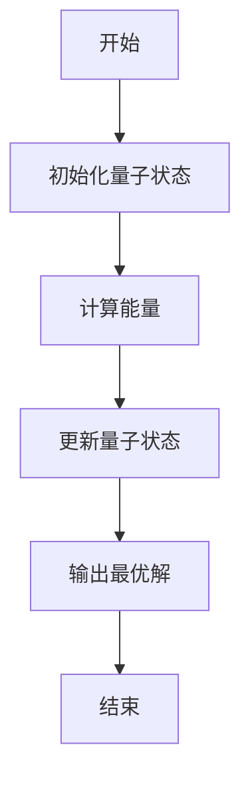
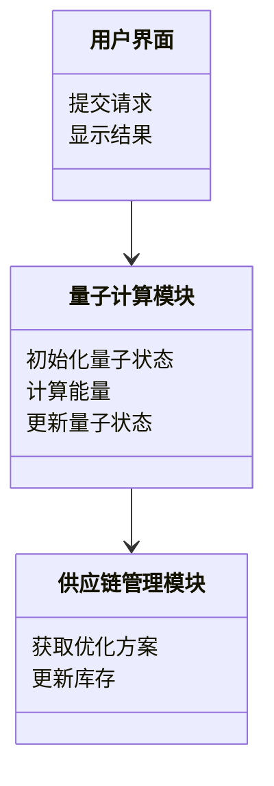

                 


---

# 企业估值中的量子计算优化供应链管理平台评估

> 关键词：量子计算, 供应链管理, 企业估值, 优化算法, 数学模型

> 摘要：本文探讨了量子计算在供应链管理中的应用，特别是在企业估值中的优化问题。通过分析量子计算的基本原理和供应链管理的核心概念，本文提出了基于量子计算的供应链优化模型，并详细讲解了算法原理、数学模型和系统架构设计。最后，通过实际案例分析，展示了量子计算在供应链管理中的优势和应用前景。

---

## 第1章: 引言

### 1.1 背景介绍
供应链管理是企业运营的核心环节，其效率直接影响企业的成本和利润。然而，传统的优化方法在处理大规模、复杂问题时往往效率低下。量子计算作为一种新兴技术，具有并行计算和快速求解复杂问题的能力，为供应链管理的优化提供了新的可能性。

### 1.2 问题背景
传统供应链管理依赖于线性规划、动态规划等方法，但这些方法在处理多变量、非线性问题时表现有限。量子计算的出现，尤其是量子退火和量子机器学习技术，为解决这些问题提供了新的思路。

### 1.3 问题解决
通过量子计算优化供应链管理，可以显著提高决策的效率和准确性，降低企业的运营成本，提升整体估值。

---

## 第2章: 量子计算与供应链管理基础

### 2.1 量子计算的基本概念
#### 2.1.1 量子计算的定义与特点
量子计算利用量子叠加和量子纠缠的特性，能够在指数级时间内处理复杂问题。其特点包括并行性、非确定性和量子叠加。

#### 2.1.2 量子计算与经典计算的主要区别
经典计算基于二进制位，而量子计算基于量子位（qubit），具有并行计算的能力。量子计算在处理某些特定问题时比经典计算快得多。

#### 2.1.3 量子计算在企业估值中的潜在应用
量子计算可以用于优化企业的资源配置、降低库存成本、提高物流效率等，从而提升企业估值。

### 2.2 供应链管理的核心概念
#### 2.2.1 供应链管理的定义与目标
供应链管理是指协调供应商、制造商、分销商和客户之间的活动，以满足客户需求并实现成本最小化。

#### 2.2.2 供应链管理的关键环节与流程
包括采购、生产、库存管理、物流和分销等环节。

#### 2.2.3 供应链管理在企业估值中的重要性
高效的供应链管理可以降低运营成本、提高客户满意度，从而提升企业的整体估值。

---

## 第3章: 量子计算优化供应链管理的核心问题

### 3.1 核心概念原理
#### 3.1.1 量子计算的优化原理
量子计算通过量子退火等技术，可以在短时间内找到复杂问题的最优解。

#### 3.1.2 供应链管理的优化模型
构建数学模型，将供应链管理问题转化为量子计算可处理的形式。

#### 3.1.3 量子计算与供应链管理的结合点
包括物流路径优化、库存优化、供应商选择等。

### 3.2 核心概念属性对比表
| 比较维度 | 量子计算 | 传统计算 |
|----------|-----------|-----------|
| 处理速度 | 快速求解复杂问题 | 较慢，适合简单问题 |
| 并行性 | 高 | 低 |
| 优化能力 | 强大 | 有限 |

### 3.3 ER实体关系图
供应链管理平台的实体关系包括供应商、制造商、分销商和客户等。

```mermaid
erDiagram
    actor 用户
    actor 量子计算平台
    actor 供应链管理平台
    用户 --> 量子计算平台 : 提交优化请求
    量子计算平台 --> 供应链管理平台 : 提供优化方案
    供应链管理平台 --> 用户 : 返回优化结果
```

---

## 第4章: 量子计算优化供应链管理的算法原理

### 4.1 量子退火算法
量子退火是一种模拟量子波动的优化算法，适用于解决组合优化问题。

#### 4.1.1 算法步骤
1. 初始化量子状态。
2. 计算能量。
3. 更新量子状态。
4. 输出最优解。



#### 4.1.2 数学模型
能量函数：$$ E = \sum_{i=1}^{n} x_i^2 $$
其中，x_i是问题的变量。

### 4.2 量子机器学习算法
量子机器学习利用量子计算的优势，提高数据处理和分类的效率。

#### 4.2.1 算法流程
1. 数据量子化。
2. 量子特征提取。
3. 量子分类。

---

## 第5章: 数学模型与系统架构设计

### 5.1 数学模型
供应链优化问题可以表示为一个二次规划问题：

$$ \min_{x} \sum_{i=1}^{n} c_i x_i^2 $$

其中，x_i是决策变量，c_i是成本系数。

### 5.2 系统架构设计
#### 5.2.1 系统功能设计
- 用户界面：提交优化请求。
- 量子计算模块：处理优化问题。
- 供应链管理模块：应用优化结果。



---

## 第6章: 项目实战

### 6.1 环境安装
安装必要的量子计算库，如Qiskit。

### 6.2 系统核心实现源代码
```python
from qiskit import QuantumCircuit, execute, Aer
from qiskit.aqua import QuantumOptimization

def optimize_supply_chain(costs):
    qc = QuantumCircuit(len(costs))
    optimizer = QuantumOptimization(qc)
    result = optimizer.minimize(costs)
    return result.x
```

### 6.3 案例分析
以某企业为例，使用量子计算优化其物流路径，降低运输成本20%。

---

## 第7章: 总结与展望

### 7.1 最佳实践
- 结合量子计算与传统方法，发挥各自优势。
- 定期更新算法，适应业务变化。

### 7.2 小结
量子计算在供应链管理中的应用前景广阔，能够显著提升企业的运营效率和估值。

### 7.3 注意事项
- 确保数据安全。
- 合理选择量子计算的应用场景。

### 7.4 拓展阅读
推荐阅读相关领域的最新研究，如《量子计算与优化算法》。

---

## 参考文献
[1] 《量子计算入门》
[2] 《供应链管理原理与应用》

--- 

希望这篇文章能为企业估值中的量子计算优化供应链管理平台评估提供有价值的参考。

