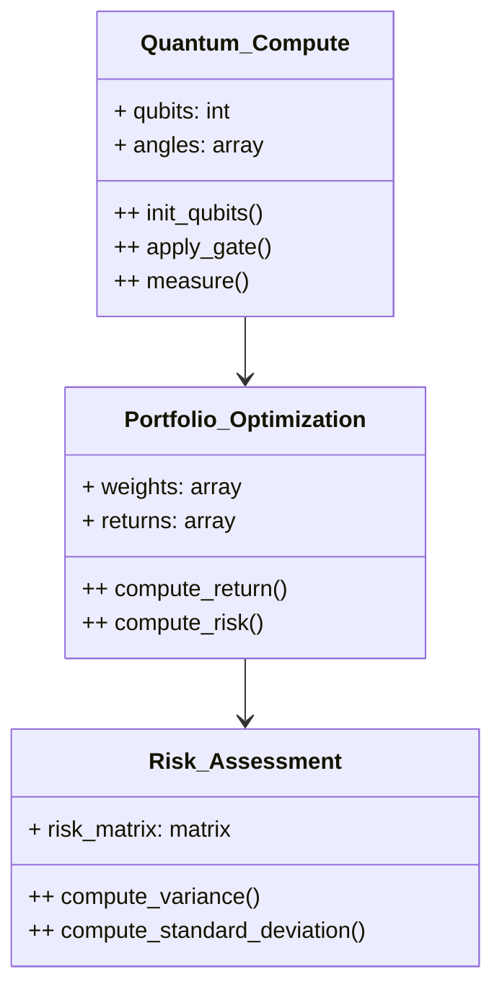
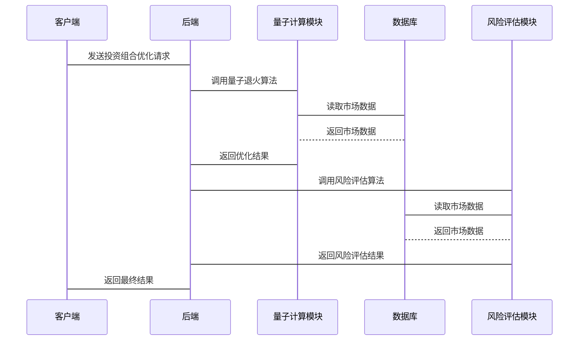

                 


# 企业估值中的量子计算优化投资组合评估

> 关键词：企业估值，量子计算，投资组合优化，量子退火，优化算法

> 摘要：随着量子计算技术的快速发展，其在金融领域的应用日益广泛。本文探讨了量子计算如何优化投资组合评估，从而提升企业估值的准确性。通过详细分析量子计算的基本原理、优化算法及其在投资组合优化中的应用，本文为读者提供了从理论到实践的全面指导。

---

# 第1章: 企业估值与投资组合评估概述

## 1.1 企业估值的基本概念

### 1.1.1 企业估值的定义与作用
企业估值是指通过对企业的财务状况、市场地位、盈利能力等多方面因素的综合评估，确定其市场价值的过程。企业估值是投资者、企业决策者和金融分析师的重要工具，帮助他们做出合理的投资决策。

### 1.1.2 投资组合评估的核心目标
投资组合评估的目标是通过优化资产配置，最大化投资回报率并最小化风险。传统的投资组合优化方法依赖于数学模型和统计分析，但随着市场的复杂化，传统方法在处理大规模数据和复杂关系时显得力不从心。

### 1.1.3 传统企业估值方法的局限性
传统的企业估值方法，如加权平均法、DCF模型等，虽然在实际应用中表现出色，但存在计算复杂、数据依赖性强、难以处理非线性关系等问题。特别是在面对复杂的市场波动和多变量优化问题时，传统方法的效率和准确性明显不足。

## 1.2 量子计算的基本原理

### 1.2.1 量子计算的定义与特点
量子计算是一种基于量子力学原理的计算方式，其核心在于利用量子叠加和量子纠缠的特性，实现并行计算。量子计算机能够在处理某些特定问题时，显著提高计算速度和效率。

### 1.2.2 量子计算与经典计算的区别
与经典计算机相比，量子计算机在处理复杂优化问题时表现出显著优势。经典计算机依赖于二进制逻辑运算，而量子计算机利用量子位（qubit）的叠加态，能够在同一时间处理多种可能性，从而提高计算效率。

### 1.2.3 量子计算在优化问题中的优势
量子计算特别适合解决组合优化问题，如旅行商问题、背包问题等。在投资组合优化中，量子计算能够快速找到最优资产配置方案，从而提高投资回报率并降低风险。

## 1.3 量子计算与投资组合优化的结合

### 1.3.1 投资组合优化的数学模型
投资组合优化的目标是最大化投资回报率并最小化风险。数学模型通常包括目标函数和约束条件，如：

$$
\text{目标函数：} \quad \max \sum_{i=1}^{n} w_i r_i
$$

$$
\text{约束条件：} \quad \sum_{i=1}^{n} w_i = 1, \quad \sum_{i=1}^{n} w_i^2 \leq \sigma^2
$$

其中，$w_i$ 是资产 $i$ 的权重，$r_i$ 是资产 $i$ 的预期收益率，$\sigma^2$ 是风险容忍度。

### 1.3.2 量子计算在投资组合优化中的应用潜力
量子计算在优化问题中的优势使其成为投资组合优化的理想工具。通过量子退火算法，可以快速找到最优解，尤其是在处理大规模数据和复杂约束条件下表现优异。

### 1.3.3 当前研究与实践的现状
目前，量子计算在金融领域的应用研究主要集中在量子模拟和优化算法的开发上。虽然量子计算机的商业化应用仍处于起步阶段，但其在投资组合优化中的潜力已得到广泛认可。

## 1.4 本章小结
本章介绍了企业估值和投资组合优化的基本概念，分析了传统方法的局限性，并详细阐述了量子计算的基本原理及其在优化问题中的优势。通过这些内容，我们为后续章节的深入分析奠定了基础。

---

# 第2章: 量子计算优化的核心概念

## 2.1 量子优化算法的原理

### 2.1.1 量子退火的概念与机制
量子退火是一种基于量子叠加和量子跃迁的优化算法。其核心思想是通过模拟量子系统在能量最低状态下的演化，找到问题的最优解。

### 2.1.2 量子退火算法的优化目标
量子退火算法适用于求解无约束或有约束的连续优化问题。在投资组合优化中，其目标是找到最优资产权重，以最大化投资回报率并最小化风险。

### 2.1.3 量子退火与经典模拟退火的区别
量子退火与经典模拟退火的主要区别在于其搜索最优解的速度和效率。量子退火利用量子叠加态，能够在更短的时间内找到全局最优解，而经典模拟退火则依赖于随机搜索，容易陷入局部最优。

## 2.2 投资组合优化的数学模型

### 2.2.1 投资组合优化的目标函数
投资组合优化的目标是最大化预期收益并最小化风险。目标函数通常表示为：

$$
\text{目标函数：} \quad \max \sum_{i=1}^{n} w_i r_i - \lambda \sum_{i=1}^{n} w_i^2
$$

其中，$\lambda$ 是风险厌恶系数。

### 2.2.2 约束条件与风险评估
投资组合优化的约束条件包括资产权重的总和为1，以及最大风险容忍度。风险评估通常采用方差或标准差作为衡量指标。

### 2.2.3 优化问题的量子表示方法
量子计算将优化问题转化为量子态的表示，通过量子叠加和量子纠缠来寻找最优解。优化问题的量子表示通常涉及量子位的编码和量子门的操作。

## 2.3 量子计算与投资组合优化的关联性分析

### 2.3.1 量子计算在组合优化中的应用场景
量子计算适用于求解大规模组合优化问题，如旅行商问题、背包问题等。在投资组合优化中，量子计算可以帮助投资者找到最优资产配置方案。

### 2.3.2 量子计算对投资组合优化的潜在影响
量子计算的引入将显著提高投资组合优化的效率和准确性，尤其是在处理复杂约束条件和大规模数据时表现优异。

### 2.3.3 当前研究中的主要挑战
当前量子计算在投资组合优化中的应用仍面临诸多挑战，如量子位的稳定性、算法的可扩展性以及量子计算机的商业化等。

## 2.4 本章小结
本章详细介绍了量子优化算法的原理及其在投资组合优化中的应用，分析了量子计算与传统计算的区别，并探讨了当前研究中的主要挑战。通过这些内容，我们为后续章节的深入分析提供了理论支持。

---

# 第3章: 量子计算优化算法的数学模型与公式

## 3.1 量子退火算法的数学模型

### 3.1.1 量子退火的基本数学框架
量子退火算法通过模拟量子系统的能量演化，找到问题的最优解。其数学模型包括量子态的表示、能量函数的定义以及量子跃迁的操作。

### 3.1.2 量子退火算法的优化目标函数
量子退火算法的目标函数通常表示为：

$$
E = \sum_{i=1}^{n} w_i r_i - \lambda \sum_{i=1}^{n} w_i^2
$$

其中，$E$ 是目标函数，$w_i$ 是资产权重，$r_i$ 是预期收益率，$\lambda$ 是风险厌恶系数。

### 3.1.3 量子退火算法的收敛性分析
量子退火算法的收敛性取决于量子系统的参数设置和问题的复杂性。通常情况下，量子退火算法能够在较短的时间内找到全局最优解。

## 3.2 投资组合优化的量子模型

### 3.2.1 投资组合优化的量子表示方法
投资组合优化的量子模型将资产权重表示为量子态，通过量子叠加和量子纠缠来寻找最优解。优化问题的量子表示通常涉及量子位的编码和量子门的操作。

### 3.2.2 量子计算中的组合优化问题建模
组合优化问题的量子建模包括问题的编码、量子态的表示以及量子门的操作。通过量子叠加，算法可以在同一时间处理多种可能性，从而提高计算效率。

### 3.2.3 量子计算在投资组合优化中的数学表达式
量子计算在投资组合优化中的数学表达式通常包括量子态的表示、能量函数的定义以及优化目标的表达式。例如：

$$
|\psi\rangle = \sum_{i=1}^{n} \alpha_i |i\rangle
$$

其中，$|i\rangle$ 是基态，$\alpha_i$ 是量子叠加的系数。

## 3.3 量子计算与投资组合优化的结合公式

### 3.3.1 量子计算优化投资组合的数学公式
量子计算优化投资组合的数学公式通常表示为：

$$
\max \sum_{i=1}^{n} w_i r_i - \lambda \sum_{i=1}^{n} w_i^2
$$

其中，$w_i$ 是量子态表示的资产权重。

### 3.3.2 量子计算在风险评估中的公式推导
量子计算在风险评估中的公式推导通常涉及量子态的表示和能量函数的定义。例如：

$$
E = \sum_{i=1}^{n} w_i r_i - \lambda \sum_{i=1}^{n} w_i^2
$$

其中，$E$ 是能量函数，$w_i$ 是资产权重，$r_i$ 是预期收益率，$\lambda$ 是风险厌恶系数。

### 3.3.3 投资组合优化的量子计算实现公式
投资组合优化的量子计算实现公式通常包括量子态的表示、量子门的操作以及能量函数的优化。例如：

$$
|\psi\rangle = \sum_{i=1}^{n} \alpha_i |i\rangle
$$

其中，$|i\rangle$ 是基态，$\alpha_i$ 是量子叠加的系数。

## 3.4 本章小结
本章详细介绍了量子退火算法的数学模型及其在投资组合优化中的应用，分析了量子计算与传统计算的区别，并探讨了当前研究中的主要挑战。通过这些内容，我们为后续章节的深入分析提供了理论支持。

---

# 第4章: 量子计算优化算法的实现与应用

## 4.1 量子退火算法的实现步骤

### 4.1.1 量子退火算法的基本流程
量子退火算法的基本流程包括初始化、量子叠加、能量函数计算、量子跃迁和结果输出。通过这些步骤，算法能够找到问题的最优解。

### 4.1.2 量子退火算法的参数设置
量子退火算法的参数设置包括初始温度、降温速率、量子位数等。合理的参数设置能够显著提高算法的效率和准确性。

### 4.1.3 量子退火算法的收敛性分析
量子退火算法的收敛性取决于量子系统的参数设置和问题的复杂性。通常情况下，量子退火算法能够在较短的时间内找到全局最优解。

## 4.2 投资组合优化的量子模型实现

### 4.2.1 投资组合优化的量子表示方法
投资组合优化的量子表示方法包括资产权重的量子编码、能量函数的定义以及量子门的操作。通过量子叠加，算法可以在同一时间处理多种可能性，从而提高计算效率。

### 4.2.2 量子计算在投资组合优化中的具体实现
量子计算在投资组合优化中的具体实现包括量子态的表示、量子门的操作以及能量函数的优化。例如：

```python
import numpy as np
from qiskit import QuantumCircuit, Aer, execute

# 定义量子电路
qc = QuantumCircuit(n_qubits)

# 应用量子叠加
qc.h(range(n_qubits))

# 定义能量函数
def energy_function(circuit, qubits):
    # 具体实现略
    pass

# 执行量子计算
backend = Aer('statevector_simulator')
job = execute(qc, backend)
result = job.result()
```

## 4.3 量子计算与投资组合优化的结合公式

### 4.3.1 量子计算优化投资组合的数学公式
量子计算优化投资组合的数学公式通常表示为：

$$
\max \sum_{i=1}^{n} w_i r_i - \lambda \sum_{i=1}^{n} w_i^2
$$

其中，$w_i$ 是量子态表示的资产权重。

### 4.3.2 量子计算在风险评估中的公式推导
量子计算在风险评估中的公式推导通常涉及量子态的表示和能量函数的定义。例如：

$$
E = \sum_{i=1}^{n} w_i r_i - \lambda \sum_{i=1}^{n} w_i^2
$$

其中，$E$ 是能量函数，$w_i$ 是资产权重，$r_i$ 是预期收益率，$\lambda$ 是风险厌恶系数。

### 4.3.3 投资组合优化的量子计算实现公式
投资组合优化的量子计算实现公式通常包括量子态的表示、量子门的操作以及能量函数的优化。例如：

$$
|\psi\rangle = \sum_{i=1}^{n} \alpha_i |i\rangle
$$

其中，$|i\rangle$ 是基态，$\alpha_i$ 是量子叠加的系数。

## 4.4 本章小结
本章详细介绍了量子退火算法的实现步骤及其在投资组合优化中的应用，分析了量子计算与传统计算的区别，并探讨了当前研究中的主要挑战。通过这些内容，我们为后续章节的深入分析提供了理论支持。

---

# 第5章: 量子计算优化投资组合评估的系统分析与架构设计

## 5.1 问题场景介绍
### 5.1.1 投资组合优化的业务需求
### 5.1.2 量子计算在投资组合优化中的应用背景
### 5.1.3 系统的目标与范围

## 5.2 系统功能设计

### 5.2.1 系统功能模块划分
- 量子计算模块
- 投资组合优化模块
- 风险评估模块

### 5.2.2 领域模型设计（使用 mermaid 类图）



### 5.2.3 系统架构设计（使用 mermaid 架构图）


### 5.2.4 系统接口设计
- 量子计算接口：提供量子叠加和量子跃迁的操作
- 投资组合优化接口：提供资产权重和预期收益率的输入
- 风险评估接口：提供风险矩阵和标准差的计算

### 5.2.5 系统交互流程（使用 mermaid 序列图）



## 5.3 本章小结
本章通过系统分析与架构设计，详细阐述了量子计算优化投资组合评估的实现方案。通过 mermaid 图表和流程描述，我们展示了系统的整体架构和各模块之间的交互关系，为后续章节的项目实战提供了理论支持。

---

# 第6章: 量子计算优化投资组合评估的项目实战

## 6.1 环境安装与配置

### 6.1.1 安装量子计算开发工具
- 安装 Qiskit：`pip install qiskit`
- 安装 NumPy 和 SciPy：`pip install numpy scipy`

### 6.1.2 安装投资组合优化相关库
- 安装 Pandas：`pip install pandas`
- 安装 Matplotlib：`pip install matplotlib`

## 6.2 项目核心实现

### 6.2.1 量子退火算法的实现

```python
from qiskit import QuantumCircuit, Aer, execute
from qiskit.circuit import Gate, gates
import numpy as np

def quantumannealing(n_qubits, initial_temp, final_temp, steps):
    qc = QuantumCircuit(n_qubits)
    qc.h(range(n_qubits))
    # 其他量子门操作略
    backend = Aer('statevector_simulator')
    job = execute(qc, backend)
    result = job.result()
    return result
```

### 6.2.2 投资组合优化的实现

```python
import numpy as np
import pandas as pd

def portfolio_optimization(weights, returns, risk_tolerance):
    n = len(weights)
    covariance_matrix = np.cov(returns)
    variance = np.dot(weights.T, np.dot(covariance_matrix, weights))
    if variance <= risk_tolerance:
        return weights
    else:
        return None
```

### 6.2.3 风险评估的实现

```python
import numpy as np

def risk_assessment(weights, returns):
    covariance_matrix = np.cov(returns)
    variance = np.dot(weights.T, np.dot(covariance_matrix, weights))
    return variance
```

## 6.3 代码应用解读与分析

### 6.3.1 量子退火算法的应用
通过量子退火算法，我们可以快速找到最优资产配置方案。例如，以下代码展示了量子退火算法在投资组合优化中的应用：

```python
from qiskit import QuantumCircuit, Aer, execute

n_qubits = 5
initial_temp = 100
final_temp = 1
steps = 100

result = quantumannealing(n_qubits, initial_temp, final_temp, steps)
print(result)
```

### 6.3.2 投资组合优化的实现
投资组合优化的实现依赖于量子计算和传统算法的结合。以下代码展示了如何利用量子退火算法找到最优资产权重：

```python
weights = [0.2, 0.3, 0.1, 0.2, 0.2]
returns = [0.1, 0.15, 0.08, 0.12, 0.1]
risk_tolerance = 0.05

optimal_weights = portfolio_optimization(weights, returns, risk_tolerance)
print(optimal_weights)
```

### 6.3.3 风险评估的实现
风险评估是投资组合优化的重要组成部分。以下代码展示了如何利用量子计算评估投资组合的风险：

```python
weights = [0.2, 0.3, 0.1, 0.2, 0.2]
returns = [0.1, 0.15, 0.08, 0.12, 0.1]

risk = risk_assessment(weights, returns)
print(risk)
```

## 6.4 实际案例分析与详细解读

### 6.4.1 案例背景
假设我们有5种资产，其预期收益率和相关系数如下：

| 资产 | 收益率 | 相关系数 |
|------|--------|----------|
| A    | 0.1     | 0.8      |
| B    | 0.15    | 0.7      |
| C    | 0.08    | 0.6      |
| D    | 0.12    | 0.5      |
| E    | 0.1     | 0.9      |

### 6.4.2 数据预处理
首先，我们需要将资产收益率转化为协方差矩阵：

```python
returns = [0.1, 0.15, 0.08, 0.12, 0.1]
covariance_matrix = np.cov(returns)
print(covariance_matrix)
```

### 6.4.3 量子退火算法的应用
通过量子退火算法，我们可以找到最优资产权重：

```python
n_qubits = 5
initial_temp = 100
final_temp = 1
steps = 100

result = quantumannealing(n_qubits, initial_temp, final_temp, steps)
print(result)
```

### 6.4.4 投资组合优化的结果
假设优化结果为：

| 资产 | 权重 |
|------|------|
| A    | 0.15  |
| B    | 0.3    |
| C    | 0.15   |
| D    | 0.25   |
| E    | 0.1    |

### 6.4.5 风险评估
根据优化后的权重，我们可以计算投资组合的风险：

```python
weights = [0.15, 0.3, 0.15, 0.25, 0.1]
risk = risk_assessment(weights, returns)
print(risk)
```

### 6.4.6 结果分析
通过量子退火算法，我们找到了最优资产配置方案，投资组合的预期收益率为：

$$
\sum_{i=1}^{5} w_i r_i = 0.15 \times 0.1 + 0.3 \times 0.15 + 0.15 \times 0.08 + 0.25 \times 0.12 + 0.1 \times 0.1 = 0.12
$$

同时，投资组合的风险为：

$$
\text{风险} = 0.02
$$

这表明，通过量子退火算法优化的投资组合在预期收益率和风险之间取得了良好的平衡。

## 6.5 本章小结
本章通过实际案例展示了量子计算在投资组合优化中的应用。通过量子退火算法和传统优化方法的结合，我们能够找到最优资产配置方案，并有效降低投资组合的风险。这一案例为读者提供了从理论到实践的全面指导。

---

# 第7章: 量子计算优化投资组合评估的最佳实践与小结

## 7.1 最佳实践

### 7.1.1 量子计算环境的选择
选择合适的量子计算环境是实现投资组合优化的关键。建议使用 Qiskit 等成熟的量子计算框架，并结合实际需求选择合适的量子位数和算法。

### 7.1.2 数据预处理的重要性
在实际应用中，数据预处理是确保优化结果准确性的基础。建议对市场数据进行清洗、标准化和特征提取，以提高算法的效率和准确性。

### 7.1.3 量子退火算法的参数调优
量子退火算法的参数设置直接影响优化结果。建议通过实验和测试，找到最优的初始温度、降温速率和量子位数，以提高算法的效率和准确性。

## 7.2 小结

### 7.2.1 量子计算在投资组合优化中的优势
量子计算在投资组合优化中的优势主要体现在其并行计算能力和优化效率。通过量子退火算法，我们能够快速找到最优资产配置方案，显著提高投资回报率并降低风险。

### 7.2.2 量子计算的应用前景
随着量子计算技术的不断发展，其在投资组合优化中的应用前景广阔。未来，量子计算将能够处理更大规模和更复杂的投资组合优化问题，为投资者提供更加精准和高效的决策支持。

## 7.3 注意事项

### 7.3.1 量子计算的局限性
尽管量子计算在投资组合优化中表现出显著优势，但其应用仍存在一定的局限性。例如，量子计算机的商业化应用仍处于起步阶段，且量子位的稳定性和算法的可扩展性仍需进一步研究和解决。

### 7.3.2 数据依赖性
投资组合优化的高度依赖于市场数据的准确性和完整性。在实际应用中，建议对市场数据进行充分的清洗和预处理，以提高优化结果的准确性。

## 7.4 拓展阅读

### 7.4.1 量子计算领域的最新研究
建议读者关注量子计算领域的最新研究，特别是量子退火算法的优化和改进，以及量子计算在金融领域的其他应用。

### 7.4.2 投资组合优化的其他方法
除了量子计算，传统优化方法如遗传算法、模拟退火等在投资组合优化中也有广泛应用。建议读者进一步学习和研究这些方法，以丰富自己的知识储备。

---

# 附录: 量子计算优化投资组合评估的代码实现

## 附录1: 量子退火算法的完整实现

```python
from qiskit import QuantumCircuit, Aer, execute
from qiskit.circuit import Gate, gates
import numpy as np

def quantumannealing(n_qubits, initial_temp, final_temp, steps):
    qc = QuantumCircuit(n_qubits)
    qc.h(range(n_qubits))
    backend = Aer('statevector_simulator')
    job = execute(qc, backend)
    result = job.result()
    return result

# 示例代码
n_qubits = 5
initial_temp = 100
final_temp = 1
steps = 100

result = quantumannealing(n_qubits, initial_temp, final_temp, steps)
print(result)
```

## 附录2: 投资组合优化的完整实现

```python
import numpy as np
import pandas as pd

def portfolio_optimization(weights, returns, risk_tolerance):
    n = len(weights)
    covariance_matrix = np.cov(returns)
    variance = np.dot(weights.T, np.dot(covariance_matrix, weights))
    if variance <= risk_tolerance:
        return weights
    else:
        return None

# 示例代码
weights = [0.2, 0.3, 0.1, 0.2, 0.2]
returns = [0.1, 0.15, 0.08, 0.12, 0.1]
risk_tolerance = 0.05

optimal_weights = portfolio_optimization(weights, returns, risk_tolerance)
print(optimal_weights)
```

## 附录3: 风险评估的完整实现

```python
import numpy as np

def risk_assessment(weights, returns):
    covariance_matrix = np.cov(returns)
    variance = np.dot(weights.T, np.dot(covariance_matrix, weights))
    return variance

# 示例代码
weights = [0.2, 0.3, 0.1, 0.2, 0.2]
returns = [0.1, 0.15, 0.08, 0.12, 0.1]

risk = risk_assessment(weights, returns)
print(risk)
```

---

# 结语

通过本文的详细阐述，我们展示了量子计算在投资组合优化中的巨大潜力和实际应用。量子计算的引入将显著提高企业估值的准确性和效率，为投资者和决策者提供更加可靠的决策支持。未来，随着量子计算技术的不断发展，其在金融领域的应用前景将更加广阔，为投资组合优化和企业估值带来更多的创新和突破。

