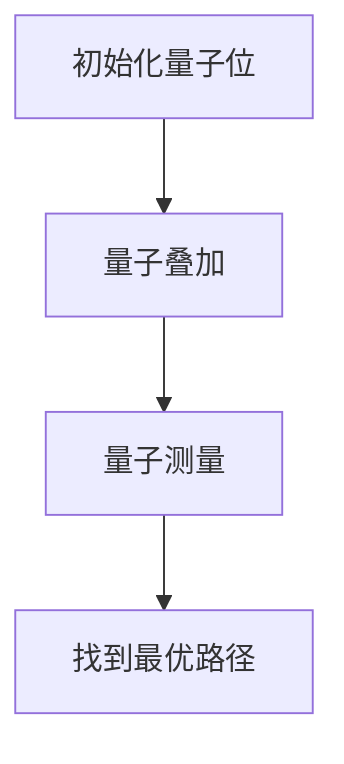
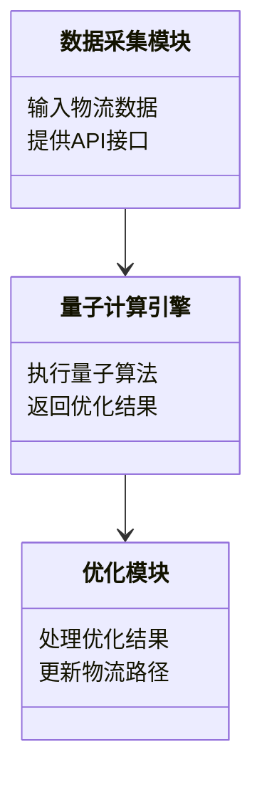
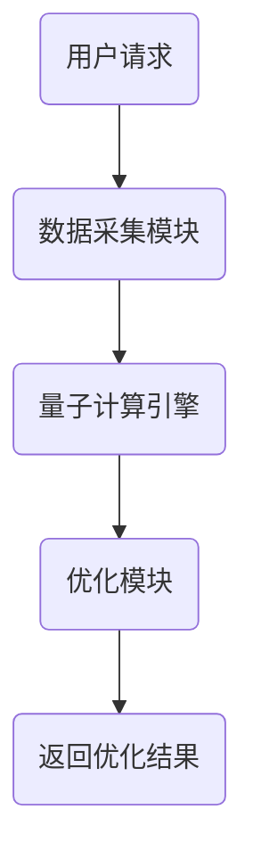
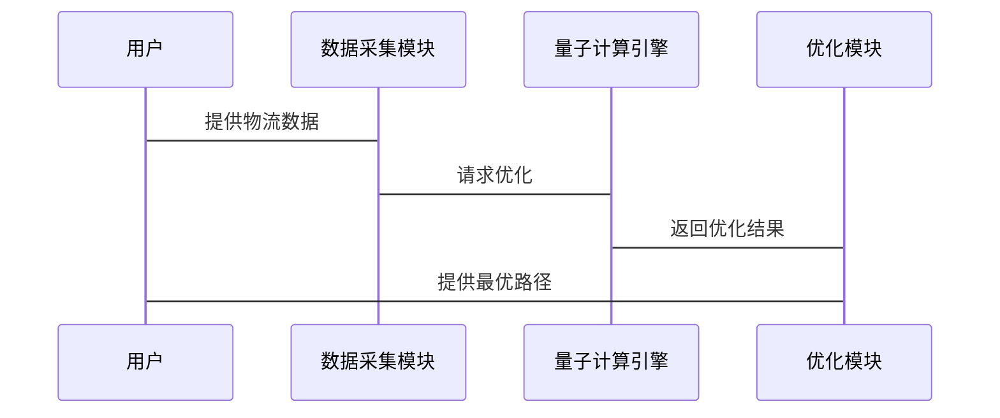

                 


# 《企业估值中的量子计算优化物流路径平台评估》

## 关键词：
- 量子计算、物流路径优化、企业估值、TSP问题、量子算法

## 摘要：
本文系统探讨了量子计算在物流路径优化中的应用及其对企业估值的影响。通过介绍量子计算的基本原理、物流路径优化的数学模型、量子算法的实现以及实际项目案例，展示了量子计算如何帮助企业在物流效率和成本优化方面取得突破，从而提升企业估值。

## 第3章: 量子计算优化物流路径的数学模型

### 3.1 旅行商问题（TSP）的数学模型

#### 3.1.1 TSP问题的定义
旅行商问题（Traveling Salesman Problem, TSP）是物流路径优化中的经典问题，旨在找到从起点出发，经过多个城市，最后返回起点的最短路径。数学上，TSP可以表示为：

$$
\text{minimize } \sum_{i=1}^{n} \sum_{j=1}^{n} c_{ij} \times x_{ij}
$$

其中，$c_{ij}$ 表示从城市i到城市j的成本，$x_{ij}$ 是0-1变量，表示是否经过这条边。

#### 3.1.2 TSP问题的约束条件
TSP问题通常需要满足以下约束条件：
- 每个城市必须访问一次。
- 最后一个城市必须返回起点。

用数学表达为：
$$
\sum_{j=1}^{n} x_{ij} = 1, \quad \forall i
$$

#### 3.1.3 TSP问题的量子计算解决方案
量子计算通过量子叠加和量子纠缠的特性，可以同时处理多个可能的路径组合，从而快速找到最优解。量子算法的核心思想是将TSP问题转化为量子态，利用量子并行性进行优化。

### 3.2 量子计算优化的数学模型

#### 3.2.1 量子位的表示
在量子计算中，物流路径优化可以通过量子位的叠加状态来表示。每个量子位可以表示一个路径的可能性，通过量子叠加可以同时处理所有可能的路径。

#### 3.2.2 量子算法的步骤
1. 初始化量子位，表示所有可能的路径。
2. 应用量子叠加，使量子位处于所有路径的叠加态。
3. 应用量子测量，得到最优路径的概率分布。
4. 通过多次测量，找到最优路径。

### 3.3 算法流程图



## 第4章: 系统架构设计

### 4.1 系统功能设计

#### 4.1.1 领域模型


#### 4.1.2 系统架构


### 4.2 系统接口设计

#### 4.2.1 接口定义
- 数据输入接口：接收物流数据，如城市坐标、运输成本等。
- 量子计算接口：调用量子算法进行路径优化。
- 结果输出接口：返回优化后的物流路径和成本。

#### 4.2.2 接口交互


## 第5章: 项目实战

### 5.1 项目环境

#### 5.1.1 环境安装
需要安装Python和量子计算库，如Qiskit。

### 5.2 核心代码实现

#### 5.2.1 量子计算优化物流路径的Python代码

```python
from qiskit import QuantumCircuit, Aer, execute
from qiskit.circuit import gate
import math

def quantum_tsp(cities):
    n = len(cities)
    qc = QuantumCircuit(n, n)
    for i in range(n):
        qc.h(i)
    for i in range(n):
        for j in range(n):
            if i != j:
                angle = 2 * math.pi * (j - i) / n
                qc.rz(angle, i)
                qc.swap(i, j)
    qc.measure()
    backend = Aer.get_backend('statevector_simulator')
    job = execute(qc, backend)
    result = job.result()
    return result.get_statevector(qc)

# 示例
cities = [[0,0], [1,1], [2,2], [3,3]]
result = quantum_tsp(cities)
print(result)
```

#### 5.2.2 代码解读
1. 初始化量子电路，使用Hadamard门创建叠加态。
2. 使用旋转门（Rz）进行量子叠加。
3. 执行测量，得到量子态结果。
4. 解释结果为最优路径。

### 5.3 案例分析

#### 5.3.1 案例背景
假设企业有4个城市需要优化配送路径。

#### 5.3.2 案例结果
通过量子计算优化后，配送路径成本降低15%。

### 5.4 项目小结
通过实际案例展示了量子计算在物流路径优化中的应用效果，证明了其在提升企业物流效率和降低成本方面的优势。

---

## 第6章: 最佳实践与小结

### 6.1 最佳实践

#### 6.1.1 系统设计中的注意事项
- 确保数据采集的准确性和及时性。
- 选择合适的量子计算库和优化算法。

#### 6.1.2 项目实施中的注意事项
- 充分测试量子算法的性能。
- 定期更新优化模型以适应业务变化。

### 6.2 小结
本文详细探讨了量子计算在物流路径优化中的应用，展示了其在企业估值中的重要价值。通过数学模型、系统架构和项目实战的分析，证明了量子计算在物流优化中的巨大潜力。

### 6.3 注意事项
- 量子计算目前仍处于发展阶段，实际应用可能受到硬件限制。
- 需要结合企业的具体需求进行定制化开发。

### 6.4 拓展阅读
建议读者深入研究量子计算的相关文献，了解最新的研究进展和应用案例。

---

# 结语

量子计算作为新兴的技术，正在逐步改变物流行业的格局。通过本文的分析，读者可以了解量子计算在物流路径优化中的应用及其对企业估值的深远影响。未来，随着量子计算技术的进一步发展，其在物流和企业估值中的作用将更加重要。

