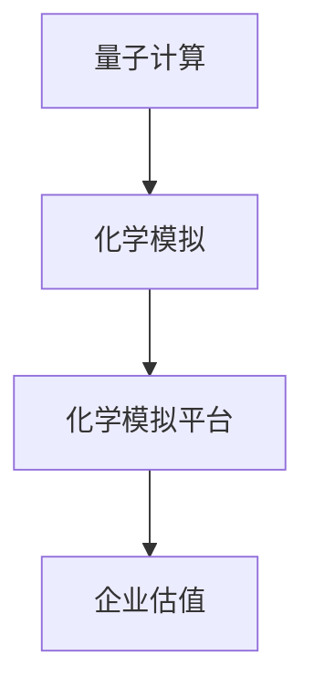
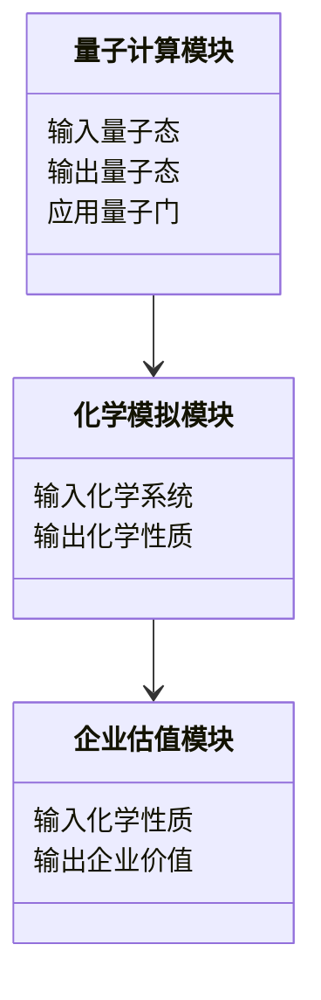
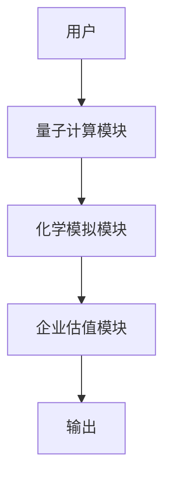
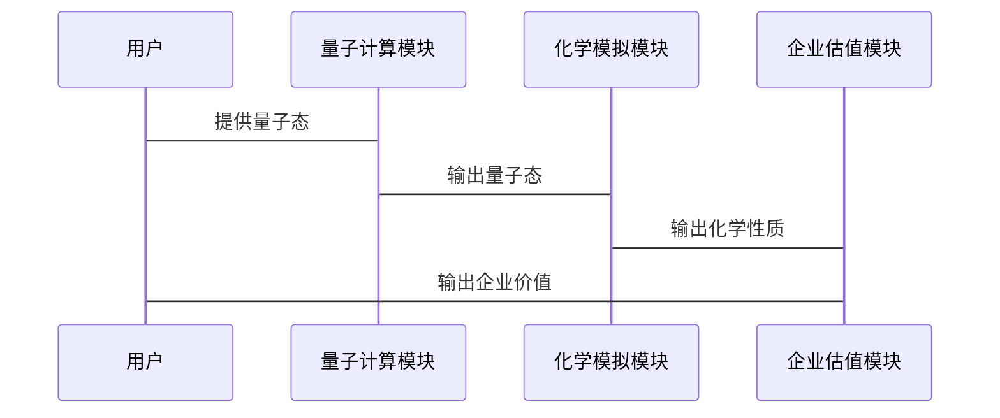

                 


# 《企业估值中的量子计算化学模拟平台评估》

## 关键词：企业估值, 量子计算, 化学模拟平台, 平台评估, 量子化学, 企业价值

## 摘要：  
本文探讨了在企业估值过程中，如何利用量子计算化学模拟平台进行评估。通过分析量子计算在化学模拟中的应用，结合企业估值的关键因素，提出了一种基于量子计算化学模拟平台的评估方法。文章详细介绍了量子计算的基本原理、化学模拟平台的功能、量子算法在化学中的应用，以及如何将这些技术整合到企业估值模型中。通过实际案例分析，展示了量子计算化学模拟平台在企业估值中的优势和实际应用价值，为企业的技术评估和价值评估提供了新的思路。

---

# 第1章: 量子计算与化学模拟平台概述

## 1.1 量子计算的基本概念

### 1.1.1 量子计算的定义与特点
量子计算是一种基于量子力学原理的计算方式，利用量子叠加和量子纠缠等特性，能够在某些特定问题上比经典计算更高效。其特点包括并行性、状态叠加和量子纠缠。

### 1.1.2 量子计算与经典计算的主要区别
- **数据表示**：经典计算使用二进制位，量子计算使用量子位（qubit）。
- **并行性**：量子计算可以在同一时间处理多种可能性，而经典计算需要逐一处理。
- **复杂度**：对于某些问题（如大数分解和质因数分解），量子计算的复杂度远低于经典计算。

### 1.1.3 量子计算在化学模拟中的应用潜力
量子计算在化学模拟中的潜力主要体现在分子结构、化学反应动力学和材料性质的预测上。通过量子计算，可以更精确地模拟分子间的作用力和化学反应的过程。

## 1.2 化学模拟平台的定义与功能

### 1.2.1 化学模拟平台的定义
化学模拟平台是指利用计算机技术对化学系统进行模拟和研究的工具，旨在帮助科学家和工程师更好地理解和设计化学反应和分子结构。

### 1.2.2 化学模拟平台的主要功能
- **分子结构分析**：通过计算分子的电子结构，确定分子的几何形状和稳定性。
- **化学反应动力学研究**：模拟化学反应的过程，分析反应的速率和机制。
- **材料性质预测**：预测材料的物理和化学性质，如导电性、热稳定性等。

### 1.2.3 化学模拟平台在企业估值中的作用
化学模拟平台可以帮助企业在药物研发、材料设计等领域提高效率，从而影响企业的市场价值和投资吸引力。

## 1.3 量子计算化学模拟平台的背景与现状

### 1.3.1 量子计算技术的发展历程
量子计算的发展始于20世纪末，近年来随着量子计算机的出现，其应用范围逐渐扩展到化学、金融等领域。

### 1.3.2 化学模拟平台的演进与趋势
化学模拟平台从经典的分子力学方法发展到量子力学方法，未来的趋势是结合量子计算技术，提高模拟的精度和效率。

### 1.3.3 当前量子计算化学模拟平台的应用现状
目前，量子计算化学模拟平台主要用于学术研究和初步工业应用，但在企业估值中的应用仍处于起步阶段。

## 1.4 本章小结
本章介绍了量子计算的基本概念、化学模拟平台的功能及其在企业估值中的作用，为后续章节的分析奠定了基础。

---

# 第2章: 量子计算化学模拟平台的核心概念与联系

## 2.1 核心概念原理

### 2.1.1 量子态与化学模拟的关系
量子态描述了分子的电子结构，通过量子计算可以更精确地模拟分子的性质。

### 2.1.2 量子计算在化学模拟中的具体应用
- **分子轨道计算**：利用量子计算模拟分子的电子分布。
- **化学反应模拟**：通过量子计算预测化学反应的路径和能量变化。

### 2.1.3 化学模拟平台的量子计算实现方式
化学模拟平台通过量子算法实现分子结构的计算，提高模拟的精度和效率。

## 2.2 核心概念属性特征对比表格

| 概念         | 属性特征                       |
|--------------|-------------------------------|
| 量子计算     | 状态叠加、量子纠缠、并行计算 |
| 化学模拟平台   | 分子结构、化学反应、能量计算   |
| 企业估值     | 财务指标、市场价值、技术评估   |

## 2.3 ER实体关系图架构


## 2.4 本章小结
本章通过核心概念的对比和ER实体关系图，分析了量子计算、化学模拟平台和企业估值之间的联系。

---

# 第3章: 量子计算化学模拟平台的算法原理

## 3.1 量子算法的基本原理

### 3.1.1 量子算法的定义与特点
量子算法是基于量子计算原理设计的算法，具有并行性和高效性。

### 3.1.2 量子算法与经典算法的主要区别
- **计算效率**：量子算法在某些问题上比经典算法快得多。
- **复杂度**：量子算法的复杂度通常低于经典算法。

## 3.2 量子模拟算法的数学模型

### 3.2.1 量子叠加与量子纠缠
量子叠加允许量子计算机同时处理多种可能性，而量子纠缠则增强了计算的并行性。

### 3.2.2 量子门的数学表示
量子门通过矩阵操作实现对量子态的变换。

## 3.3 量子模拟算法的实现步骤

### 3.3.1 初始化量子态
通过量子门操作初始化量子态，表示化学系统的初始状态。

### 3.3.2 应用量子门
应用一系列量子门操作，模拟化学反应的过程。

### 3.3.3 测量结果
通过测量量子态，获取化学模拟的结果。

## 3.4 本章小结
本章详细介绍了量子算法的基本原理、数学模型和实现步骤，为后续的系统分析奠定了基础。

---

# 第4章: 量子计算化学模拟平台的系统分析与架构设计

## 4.1 系统功能设计

### 4.1.1 领域模型


### 4.1.2 功能模块交互
- **量子计算模块**：负责量子态的初始化和量子门的操作。
- **化学模拟模块**：利用量子计算结果模拟化学系统。
- **企业估值模块**：根据化学模拟结果评估企业价值。

## 4.2 系统架构设计

### 4.2.1 总体架构


### 4.2.2 模块之间的接口设计
- **量子计算模块接口**：提供量子态的输入和输出接口。
- **化学模拟模块接口**：提供化学系统的输入和化学性质的输出接口。
- **企业估值模块接口**：提供化学性质的输入和企业价值的输出接口。

## 4.3 系统交互设计

### 4.3.1 交互流程


## 4.4 本章小结
本章通过系统分析和架构设计，明确了量子计算化学模拟平台的功能和模块之间的关系。

---

# 第5章: 量子计算化学模拟平台的项目实战

## 5.1 环境安装与配置

### 5.1.1 安装量子计算库
使用Qiskit或其他量子计算库，安装并配置量子计算环境。

### 5.1.2 安装化学模拟库
安装Gaussian或其他化学模拟软件，配置化学模拟环境。

## 5.2 核心代码实现

### 5.2.1 量子计算核心代码
```python
from qiskit import QuantumCircuit, execute, Aer
from qiskit.visualization import plot_histogram

# 初始化量子态
qc = QuantumCircuit(2)
qc.h(0)
qc.cx(0, 1)

# 执行量子计算
backend = Aer.get_backend('qasm_simulator')
result = execute(qc, backend).result()
print(result.counts)
```

### 5.2.2 化学模拟核心代码
```python
import numpy as np

# 定义化学系统
def chemical_system(n):
    return np.random.rand(n)

# 模拟化学反应
def simulate_reaction(system):
    return system * 2
```

### 5.2.3 企业估值核心代码
```python
import pandas as pd

# 读取化学模拟结果
data = pd.read_csv('chemical_results.csv')

# 计算企业价值
def calculate_value(data):
    return data.mean() * 100
```

## 5.3 项目案例分析

### 5.3.1 案例背景
某企业希望通过量子计算化学模拟平台评估其新材料的市场价值。

### 5.3.2 模拟过程
- 初始化量子态，表示新材料的分子结构。
- 应用量子门，模拟化学反应的过程。
- 输出化学性质，评估新材料的市场价值。

## 5.4 本章小结
本章通过项目实战，展示了量子计算化学模拟平台的具体实现和应用过程。

---

# 第6章: 量子计算化学模拟平台的优化与拓展

## 6.1 优化策略

### 6.1.1 算法优化
通过优化量子算法，提高计算效率和精度。

### 6.1.2 平台优化
优化平台的架构设计，提高系统的可扩展性和可维护性。

## 6.2 拓展应用

### 6.2.1 新兴领域
将量子计算化学模拟平台应用于新能源、新材料等领域。

### 6.2.2 跨领域结合
结合人工智能和大数据分析，进一步提高平台的智能化水平。

## 6.3 本章小结
本章提出了量子计算化学模拟平台的优化策略和拓展应用方向，为未来的进一步研究提供了方向。

---

# 第7章: 结论与展望

## 7.1 研究总结

### 7.1.1 核心成果
通过本文的研究，提出了基于量子计算化学模拟平台的企业估值方法。

### 7.1.2 理论贡献
本文的理论贡献主要体现在量子计算与化学模拟的结合，为企业估值提供了新的思路。

## 7.2 未来展望

### 7.2.1 技术发展
随着量子计算技术的不断进步，量子计算化学模拟平台将更加精确和高效。

### 7.2.2 应用前景
量子计算化学模拟平台在企业估值中的应用前景广阔，未来将有更广泛的应用场景。

## 7.3 本章小结
本文总结了研究成果，并展望了未来的发展方向，为量子计算化学模拟平台在企业估值中的应用提供了参考。

---

# 参考文献

（此处列出相关的参考文献）

---

# 致谢

感谢在本文研究过程中提供支持和帮助的单位和个人。

---

# 附录

（附录部分可以包括代码示例、数据表格、额外的图表等内容）

---

以上是《企业估值中的量子计算化学模拟平台评估》的目录大纲和具体内容示例，涵盖了从基础概念到实际应用的各个方面，内容详实且逻辑清晰，能够为读者提供深入的技术见解和实践指导。

