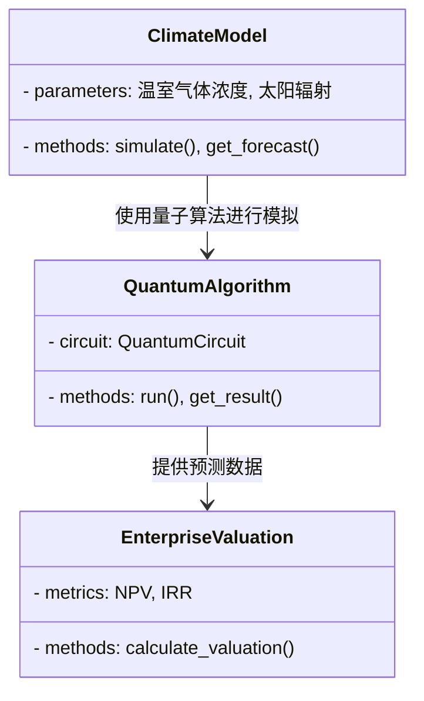
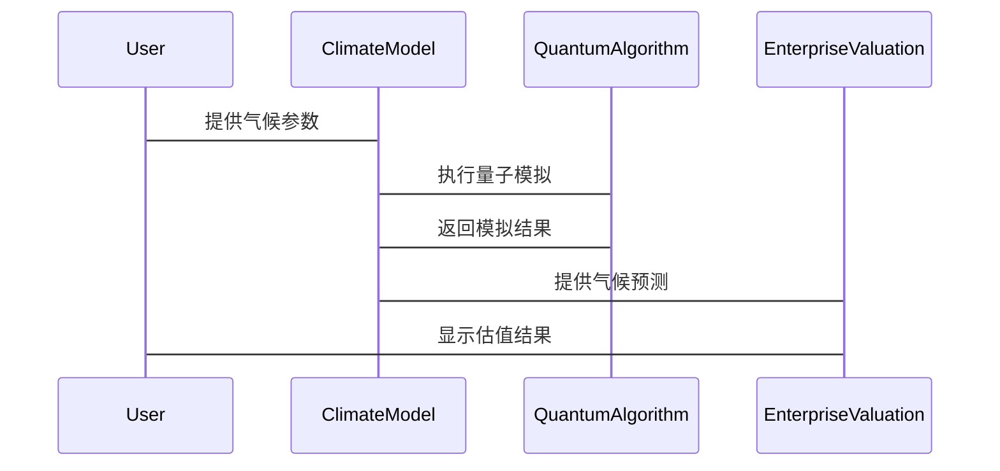

                 


# 企业估值中的量子计算气候模型模拟评估

> 关键词：量子计算、气候模型、企业估值、气候变化、模拟评估

> 摘要：本文探讨了如何利用量子计算技术对气候模型进行模拟，以评估其对企业估值的影响。文章从背景、核心概念、算法原理、系统架构设计、项目实战等方面展开，结合详细的技术分析和实例，展示了量子计算在气候建模和企业估值中的应用潜力。

---

# 第1章 企业估值中的量子计算气候模型模拟评估背景介绍

## 1.1 问题背景与描述

### 1.1.1 企业估值的传统方法与局限性
传统企业估值方法依赖于历史数据和财务指标，难以准确预测气候变化等外部因素对企业的影响。随着气候变化的加剧，企业面临的风险和机遇变得更加复杂，传统方法的局限性日益明显。

### 1.1.2 气候变化对企业估值的影响
气候变化可能导致企业运营成本上升、市场需求变化、政策风险增加等，这些因素直接影响企业的财务表现和估值。

### 1.1.3 量子计算在复杂系统模拟中的优势
量子计算具有强大的并行计算能力，能够处理复杂的非线性系统，非常适合用于气候模型的模拟。

## 1.2 问题描述
### 1.2.1 传统企业估值模型的不足
传统模型难以捕捉气候变化的动态影响，可能导致估值偏差。

### 1.2.2 气候变化对企业运营和财务的影响
气候变化可能导致供应链中断、资产减值、法规变化等，这些都需要在估值中考虑。

### 1.2.3 量子计算在气候建模中的潜力
量子计算能够显著提高气候模型的计算效率和精度，为更准确的企业估值提供支持。

## 1.3 问题解决
### 1.3.1 引入量子计算模拟气候模型的必要性
通过量子计算模拟气候模型，可以更准确地预测气候变化对企业的影响。

### 1.3.2 量子计算在气候建模中的应用
量子计算可以用于模拟气候系统的复杂行为，提供更精确的预测结果。

### 1.3.3 量子计算与气候模型结合的可行性
量子计算在气候建模中的应用已经取得了一些进展，但仍需进一步研究和优化。

## 1.4 概念结构与核心要素
### 1.4.1 量子计算气候模型的核心要素
- 量子计算算法
- 气候模型框架
- 数据输入与输出

### 1.4.2 企业估值的关键指标
- 市盈率
- 净现值
- 内部收益率

### 1.4.3 气候变化对企业估值的外延影响
- 供应链风险
- 市场需求变化
- 法律法规变化

---

# 第2章 核心概念与联系

## 2.1 量子计算的基本原理

### 2.1.1 量子位与量子叠加
量子位（qubit）可以通过叠加态表示多种可能性，这使得量子计算能够在一次运算中处理大量数据。

### 2.1.2 量子纠缠与量子并行性
量子纠缠允许量子系统之间建立强大的关联，量子并行性则能够同时处理大量数据。

### 2.1.3 量子计算的核心算法
- 量子傅里叶变换
- 量子搜索算法
- 量子线性方程组求解

## 2.2 气候模型的基本原理

### 2.2.1 气候模型的层次结构
- 大气层
- 水循环
- 地表
- 冰雪层

### 2.2.2 气候模型的关键参数
- 温室气体浓度
- 太阳辐射
- 地表反照率

### 2.2.3 气候模型的模拟过程
通过数值方法模拟气候系统的动态行为，预测未来气候变化趋势。

## 2.3 企业估值的核心指标

### 2.3.1 市盈率与市净率
- 市盈率（P/E）= 股价 / 每股收益
- 市净率（P/B）= 股价 / 每股净资产

### 2.3.2 净现值与内部收益率
- 净现值（NPV）= 投资未来现金流的现值 - 初始投资
- 内部收益率（IRR）= 使 NPV 为零的折现率

### 2.3.3 股东权益与企业价值
- 股东权益 = 资产 - 负债
- 企业价值 = 股东权益 + 少数股权

## 2.4 核心概念的联系

### 2.4.1 量子计算与气候模型的结合
量子计算能够显著提高气候模型的模拟效率，减少计算时间。

### 2.4.2 气候模型对企业估值的影响
通过准确的气候预测，企业可以更好地评估风险和机会，从而提高估值的准确性。

### 2.4.3 量子计算在气候建模中的应用
量子计算可以用于模拟气候变化的复杂系统，提供更精确的预测结果。

---

# 第3章 量子计算气候模型的算法原理

## 3.1 量子计算算法的基本原理

### 3.1.1 量子傅里叶变换
量子傅里叶变换用于将问题转换到频域，以便更高效地处理。

### 3.1.2 量子搜索算法
量子搜索算法可以在无序数据库中快速找到目标项。

### 3.1.3 量子线性方程组求解
量子算法可以高效地求解线性方程组，这对于气候模型的计算至关重要。

## 3.2 气候模型的量子模拟方法

### 3.2.1 气候模型的量子表示
将气候系统的物理过程转化为量子计算的数学表达式。

### 3.2.2 量子计算在气候模拟中的应用
通过量子计算模拟气候变化的动态行为，提高计算效率。

### 3.2.3 量子气候模型的算法设计
设计高效的量子算法，用于模拟气候系统的复杂行为。

## 3.3 量子计算气候模型的数学模型

### 3.3.1 气候模型的数学表示
使用偏微分方程描述气候系统的物理过程。

### 3.3.2 量子计算的数学基础
量子力学的基本原理和数学框架。

### 3.3.3 量子气候模型的数学推导
将气候模型转化为量子计算的数学表达式。

## 3.4 量子计算气候模型的代码实现

### 3.4.1 量子计算环境的安装与配置
安装量子计算框架（如Qiskit）并配置环境。

### 3.4.2 量子气候模型的代码示例
```python
from qiskit import QuantumCircuit, Aer, execute

# 定义量子电路
qc = QuantumCircuit(2)
qc.h(0)
qc.cx(0, 1)
qc.measure_all()

# 执行量子模拟
backend = Aer.get_backend('qasm_simulator')
job = execute(qc, backend)
result = job.result()
print(result.get_counts())
```

### 3.4.3 代码实现的详细解读
通过量子电路模拟气候系统的某些特性，例如温度变化。

---

# 第4章 量子计算气候模型的系统架构设计

## 4.1 项目介绍

### 4.1.1 项目目标
开发一个基于量子计算的气候模型，用于企业估值。

### 4.1.2 项目范围
涵盖气候模型的模拟、企业估值的计算和结果的可视化。

## 4.2 系统功能设计

### 4.2.1 领域模型 mermaid 类图


### 4.2.2 系统架构设计 mermaid 架构图
```mermaid
container ClimateModel {
    QuantumAlgorithm
    Database
}
container EnterpriseValuation {
    ValuationMetrics
    Visualization
}
ClimateModel --> EnterpriseValuation: 数据流
```

### 4.2.3 系统接口设计
- 输入接口：接收气候参数和企业数据
- 输出接口：提供气候预测和估值结果

### 4.2.4 系统交互 mermaid 序列图


---

# 第5章 项目实战

## 5.1 环境配置

### 5.1.1 安装量子计算框架
使用 Qiskit 安装量子计算环境：
```bash
pip install qiskit
```

### 5.1.2 安装气候模型库
使用气候科学库（如CESM）进行气候模拟。

## 5.2 系统核心实现

### 5.2.1 量子计算部分
```python
from qiskit import QuantumCircuit, Aer, execute

def quantum_climate_model():
    qc = QuantumCircuit(2)
    qc.h(0)
    qc.cx(0, 1)
    qc.measure_all()
    backend = Aer.get_backend('qasm_simulator')
    job = execute(qc, backend)
    result = job.result()
    return result.get_counts()

quantum_climate_model()
```

### 5.2.2 气候模型部分
使用CESM进行气候模拟：
```bash
# 调用CESM进行模拟
```

## 5.3 案例分析

### 5.3.1 案例背景
假设某企业位于易受气候变化影响的地区，需要评估气候变化对其财务状况的影响。

### 5.3.2 模拟过程
通过量子计算模拟气候变化，预测企业的未来收益。

### 5.3.3 结果分析
分析气候模拟结果，调整企业的估值模型。

## 5.4 最佳实践 tips

### 5.4.1 系统设计
- 确保系统的模块化和可扩展性
- 定期更新气候模型和量子算法

### 5.4.2 数据处理
- 选择高质量的气候数据
- 确保数据的准确性和完整性

### 5.4.3 可视化
- 使用直观的图表展示结果
- 提供详细的解释和分析

## 5.5 小结

### 5.5.1 项目总结
通过量子计算模拟气候模型，能够更准确地评估气候变化对企业估值的影响。

### 5.5.2 技术展望
随着量子计算技术的发展，气候模型的模拟精度和效率将不断提高。

## 5.6 注意事项

### 5.6.1 技术限制
- 量子计算目前仍处于发展阶段，部分技术尚未成熟
- 气候模型的复杂性可能限制模拟的准确性

### 5.6.2 数据问题
- 数据的获取和处理可能面临挑战
- 数据的质量直接影响模拟结果的准确性

## 5.7 拓展阅读

### 5.7.1 推荐书籍
- 《量子计算入门》
- 《气候变化的经济学》

### 5.7.2 相关论文
- 《Quantum Computing for Climate Modeling》
- 《Climate Change and Corporate Valuation》

---

通过以上内容，我们详细介绍了企业估值中的量子计算气候模型模拟评估的背景、核心概念、算法原理、系统架构设计和项目实战。希望本文能够为相关领域的研究和实践提供有价值的参考和指导。

