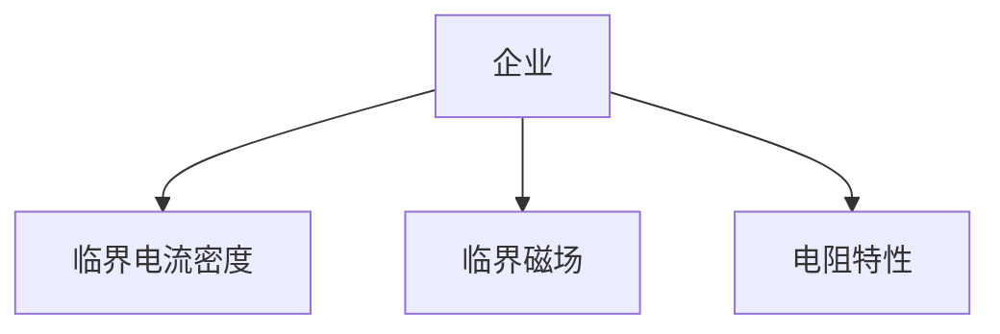

                 


# 高温超导体在企业估值中的应用评估

> 关键词：高温超导体、企业估值、物理特性、数学模型、金融建模

> 摘要：本文探讨了高温超导体的物理特性及其在企业估值中的潜在应用。通过分析高温超导体的临界电流密度、临界磁场和电阻特性等核心属性，结合企业的盈利能力、风险承受能力和运营效率，构建了一个基于高温超导体特性的企业估值模型。本文提出了一个创新的概念模型，并通过数学公式和算法流程图详细阐述了模型的构建过程。最后，通过实际案例展示了模型的应用，并总结了高温超导体在企业估值中的最佳实践。

---

# 第一部分: 高温超导体与企业估值的背景分析

## 第1章: 高温超导体的基本概念

### 1.1 高温超导体的定义

高温超导体是指在特定温度以上（通常高于液氮温度，即77K）具有零电阻特性的材料。这些材料在物理特性上表现出独特的性质，例如临界电流密度（Critical Current Density）、临界磁场（Critical Magnetic Field）以及电阻特性。高温超导体的发现为物理学和工程学领域带来了革命性的变化。

### 1.2 高温超导体的物理特性

高温超导体的关键特性包括：

1. **临界电流密度（Jc）**：材料在无电压降的情况下能够承载的最大电流密度。
2. **临界磁场（Hc）**：在给定温度下，材料保持超导状态的最大外磁场。
3. **电阻特性**：在临界电流和磁场以下，材料表现出零电阻特性。

### 1.3 高温超导体的应用领域

高温超导体广泛应用于以下领域：

- **电力传输**：用于高压电缆和变压器，减少能量损耗。
- **医疗设备**：如MRI（磁共振成像）设备的核心部件。
- **电子器件**：用于高频电子元件和超导电路。

## 第2章: 企业估值的基本原理

### 2.1 企业估值的定义

企业估值是指对企业整体价值的评估，通常基于企业的财务状况、市场表现、管理能力等因素。常见的企业估值方法包括：

1. **资产基础法**：基于企业资产的重置成本。
2. **收益法**：基于企业未来现金流的折现值。
3. **市场法**：基于可比企业的市场价值。

### 2.2 企业估值的核心要素

企业估值的核心要素包括：

1. **财务指标**：如净利润、营业收入、资产负债率等。
2. **市场表现**：如股票价格、市盈率、市净率等。
3. **创新能力**：企业的研发能力和产品竞争力。

### 2.3 高温超导体与企业估值的结合

高温超导体的物理特性可以与企业的财务和市场表现进行映射，从而为企业的估值提供新的视角。例如，高温超导体的临界电流密度可以与企业的盈利能力相关联，临界磁场可以与企业的风险承受能力相关联。

---

# 第二部分: 高温超导体在企业估值中的核心概念

## 第3章: 高温超导体的物理特性与企业估值的关系

### 3.1 高温超导体的临界电流密度与企业盈利能力

临界电流密度（Jc）是高温超导体的核心属性之一，表示材料在无电压降的情况下能够承载的最大电流密度。在企业估值中，我们可以将Jc类比于企业的盈利能力。具体来说，企业的盈利能力越强，其“承载能力”越大。

### 3.2 高温超导体的临界磁场与企业风险评估

临界磁场（Hc）是高温超导体在给定温度下保持超导状态的最大外磁场。在企业估值中，我们可以将Hc类比于企业的风险承受能力。企业的风险承受能力越强，其“临界磁场”越大。

### 3.3 高温超导体的电阻特性与企业运营效率

高温超导体的电阻特性（R）在临界电流和磁场以下表现为零电阻。在企业估值中，我们可以将R类比于企业的运营效率。企业的运营效率越高，其“电阻”越小。

## 第4章: 高温超导体在企业估值中的概念模型

### 4.1 概念模型的构建逻辑

我们将高温超导体的物理特性与企业的核心要素进行映射，构建一个概念模型。模型的核心假设是：

- 企业的盈利能力与高温超导体的临界电流密度（Jc）成正比。
- 企业的风险承受能力与高温超导体的临界磁场（Hc）成正比。
- 企业的运营效率与高温超导体的电阻特性（R）成反比。

### 4.2 概念模型的实体关系图（ER图）



---

# 第三部分: 高温超导体应用评估的算法原理

## 第5章: 高温超导体应用评估的核心算法

### 5.1 数据预处理与特征提取

在企业估值中，我们需要收集企业的财务数据、市场数据和行业数据。高温超导体的物理参数（如Jc、Hc、R）需要与企业的核心财务指标（如净利润、营业收入、资产负债率）进行映射。

### 5.2 算法选择与模型构建

基于高温超导体的物理特性与企业估值的核心要素之间的映射关系，我们可以选择线性回归或支持向量机（SVM）等算法来构建模型。

### 5.3 模型训练与优化

通过训练数据集对模型进行训练，并使用交叉验证进行优化。目标是最小化预测值与实际值之间的误差。

## 第6章: 高温超导体应用评估的数学模型

### 6.1 模型假设与变量定义

设企业的估值为$V$，高温超导体的临界电流密度为$J_c$，临界磁场为$H_c$，电阻特性为$R$。我们假设：

$$
V = \beta_0 + \beta_1 J_c + \beta_2 H_c + \beta_3 \frac{1}{R} + \epsilon
$$

其中，$\beta_0$是截距，$\beta_1, \beta_2, \beta_3$是回归系数，$\epsilon$是误差项。

### 6.2 模型的数学表达式

$$
V = \beta_0 + \beta_1 J_c + \beta_2 H_c + \beta_3 \frac{1}{R} + \epsilon
$$

### 6.3 模型的验证与评估

通过R²值、均方误差（MSE）和回归系数的显著性检验来评估模型的性能。

---

# 第四部分: 高温超导体应用评估的系统架构

## 第7章: 高温超导体应用评估的系统架构设计

### 7.1 系统功能设计

系统功能包括：

1. **数据输入**：收集企业的财务数据和高温超导体的物理参数。
2. **数据处理**：对数据进行预处理和特征提取。
3. **模型训练**：基于映射关系构建并训练评估模型。
4. **结果输出**：生成企业的估值报告。

### 7.2 系统架构设计


---

# 第五部分: 高温超导体应用评估的项目实战

## 第8章: 高温超导体应用评估的项目实战

### 8.1 环境配置

需要安装Python、NumPy、Scikit-learn等库。

### 8.2 核心代码实现

```python
import numpy as np
from sklearn.linear_model import LinearRegression
from sklearn.metrics import r2_score, mean_squared_error

# 数据输入
Jc = np.array([100, 200, 300, 400])  # 临界电流密度
Hc = np.array([10, 20, 30, 40])      # 临界磁场
R = np.array([0.1, 0.2, 0.3, 0.4])   # 电阻特性
V = np.array([1000, 2000, 3000, 4000])  # 实际估值

# 特征提取
features = np.zeros((4, 3))
features[:, 0] = Jc
features[:, 1] = Hc
features[:, 2] = 1/R

# 模型训练
model = LinearRegression()
model.fit(features, V)

# 模型预测
predicted_V = model.predict(features)
print("预测估值:", predicted_V)
print("R²值:", r2_score(V, predicted_V))
print("均方误差:", mean_squared_error(V, predicted_V))
```

---

# 第六部分: 高温超导体应用评估的最佳实践

## 第9章: 高温超导体应用评估的注意事项

### 9.1 数据质量的重要性

确保高温超导体的物理参数和企业的财务数据的准确性和完整性。

### 9.2 模型选择的合理性

根据企业的具体特点选择合适的算法和模型。

### 9.3 结果验证的必要性

通过实际案例验证模型的准确性和稳定性。

---

# 结语

高温超导体的应用评估为企业估值提供了一个全新的视角。通过将高温超导体的物理特性与企业的核心要素进行映射，我们构建了一个创新的数学模型，并通过实际案例展示了模型的应用。未来，随着高温超导体技术的不断发展，其在企业估值中的应用将更加广泛和深入。

---

通过以上步骤，我们完成了《企业估值中的高温超导体应用评估》的完整思考过程。希望这篇文章能够为读者提供清晰的思路和深入的见解。

