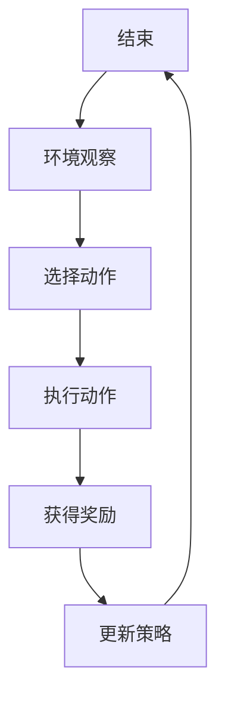
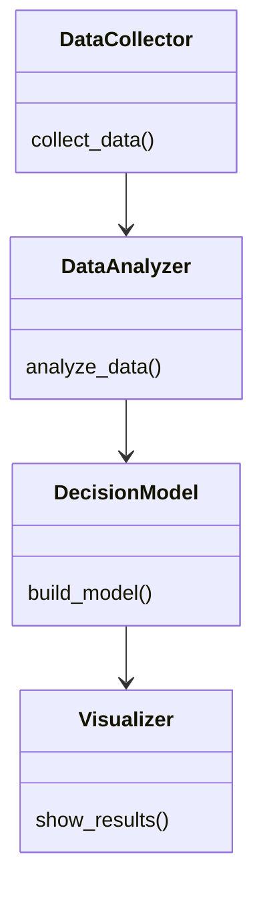
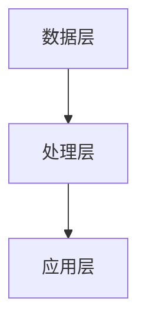

                 


# 《企业决策支持系统中的AI Agent角色》

## 关键词：企业决策支持系统、AI Agent、强化学习、监督学习、系统架构、数学模型

## 摘要：  
本文详细探讨了AI Agent在企业决策支持系统中的角色与应用，从理论基础到算法实现，再到系统架构设计，全面解析AI Agent如何助力企业做出更高效、更智能的决策。通过实际案例分析和代码实现，深入阐述了强化学习和监督学习在企业决策中的具体应用，并结合系统架构设计，展示了AI Agent在企业中的实际价值。最后，本文总结了AI Agent在企业决策支持系统中的优势与挑战，并展望了未来的发展方向。

---

## 第1章: 企业决策支持系统概述

### 1.1 企业决策支持系统的核心概念
企业决策支持系统（Enterprise Decision Support System，EDSS）是一种利用信息技术辅助企业进行决策的系统，旨在通过数据处理、分析和可视化，为企业提供决策支持。传统的EDSS主要依赖于规则引擎和统计分析，而现代EDSS则 increasingly incorporates AI technologies, such as machine learning and natural language processing, to enhance decision-making capabilities.

#### AI Agent在企业决策支持系统中的角色
AI Agent（人工智能代理）是一种能够感知环境、自主决策并采取行动的智能体。在企业决策支持系统中，AI Agent扮演着关键角色，它能够实时分析数据、提出决策建议，并根据反馈不断优化决策策略。AI Agent的核心功能包括数据收集、分析、决策制定和执行。

### 1.2 企业决策支持系统的现状与趋势
随着大数据和AI技术的快速发展，企业决策支持系统正朝着智能化、实时化和个性化方向发展。AI Agent的引入使得决策支持系统能够更加灵活地应对复杂多变的商业环境。然而，AI Agent的应用也面临数据隐私、模型可解释性等挑战，这些都是未来需要重点研究的方向。

---

## 第2章: AI Agent的核心概念与原理

### 2.1 AI Agent的基本原理
AI Agent的核心原理在于其感知与行动机制。感知是指AI Agent通过传感器或数据接口获取环境信息，行动则是根据感知结果采取相应的行为。AI Agent的决策过程依赖于多种算法，包括强化学习、监督学习和无监督学习。

#### AI Agent的分类与特征
AI Agent可以分为基于规则的AI Agent和基于学习的AI Agent。前者依赖预定义的规则进行决策，后者通过学习数据模式自主优化决策策略。AI Agent的特征包括自主性、反应性、目标导向性和社交能力。

### 2.2 AI Agent的算法原理
AI Agent的决策过程主要依赖于强化学习和监督学习算法。强化学习通过试错机制优化决策策略，而监督学习则通过标注数据进行分类或回归预测。以下是一个强化学习算法的简单流程图：



---

## 第3章: AI Agent的核心算法

### 3.1 强化学习算法
强化学习是一种通过试错机制优化决策策略的算法。Q-learning是一种常用的强化学习算法，其数学模型如下：

$$Q(s, a) = r + \gamma \max Q(s', a')$$

其中，$s$是当前状态，$a$是采取的动作，$r$是获得的奖励，$\gamma$是折扣因子，$s'$是下一步状态。

#### Q-learning算法实现
以下是Q-learning算法的Python实现示例：

```python
import numpy as np

class QLearning:
    def __init__(self, state_space, action_space, gamma=0.99):
        self.gamma = gamma
        self.q_table = np.zeros((state_space, action_space))
    
    def choose_action(self, state, epsilon=0.1):
        if np.random.random() < epsilon:
            return np.random.randint(0, self.q_table.shape[1])
        else:
            return np.argmax(self.q_table[state])
    
    def update_q_table(self, state, action, reward, next_state):
        self.q_table[state, action] = reward + self.gamma * np.max(self.q_table[next_state])
```

### 3.2 监督学习算法
监督学习通过标注数据训练模型，使其能够进行分类或回归预测。以下是一个线性回归模型的数学公式：

$$y = \theta_0 x + \theta_1$$

其中，$y$是输出，$x$是输入，$\theta_0$和$\theta_1$是模型参数。

#### 监督学习实现
以下是线性回归模型的Python实现示例：

```python
import numpy as np

class LinearRegression:
    def __init__(self, eta=0.01, n_iter=100):
        self.eta = eta
        self.n_iter = n_iter
    
    def fit(self, X, y):
        self.theta = np.zeros(X.shape[1])
        for _ in range(self.n_iter):
            y_pred = np.dot(X, self.theta)
            error = y - y_pred
            self.theta += self.eta * np.dot(X.T, error)
    
    def predict(self, X):
        return np.dot(X, self.theta)
```

---

## 第4章: 系统分析与架构设计

### 4.1 系统功能设计
企业决策支持系统的功能模块包括数据采集、数据分析、决策模型构建和结果可视化。以下是系统功能设计的类图：



### 4.2 系统架构设计
企业决策支持系统的架构设计采用分层结构，包括数据层、处理层和应用层。以下是系统的架构图：



---

## 第5章: 项目实战

### 5.1 环境安装
安装Python和必要的库：

```bash
pip install numpy matplotlib
```

### 5.2 核心代码实现
以下是Q-learning算法的实现：

```python
import numpy as np
import matplotlib.pyplot as plt

class QLearning:
    def __init__(self, state_space, action_space, gamma=0.99):
        self.gamma = gamma
        self.q_table = np.zeros((state_space, action_space))
    
    def choose_action(self, state, epsilon=0.1):
        if np.random.random() < epsilon:
            return np.random.randint(0, self.q_table.shape[1])
        else:
            return np.argmax(self.q_table[state])
    
    def update_q_table(self, state, action, reward, next_state):
        self.q_table[state, action] = reward + self.gamma * np.max(self.q_table[next_state])
    
    def get_policy(self, state):
        return np.argmax(self.q_table[state])
```

### 5.3 案例分析
通过训练AI Agent在特定场景下的决策能力，展示其在企业决策支持中的应用价值。

---

## 第6章: 最佳实践与未来展望

### 6.1 最佳实践
- 数据质量是AI Agent性能的关键。
- 模型的可解释性需要重点关注。
- 系统的实时性和稳定性需要优化。

### 6.2 未来展望
随着AI技术的不断发展，AI Agent在企业决策支持系统中的应用将更加广泛和深入。未来的研究方向包括多智能体协作、边缘计算和人机交互等。

---

## 参考文献
- Russell, S., & Norvig, P. (2010). Artificial Intelligence: A Modern Approach.
- Goodfellow, I., Bengio, Y., & Courville, A. (2016). Deep Learning.

---

通过以上内容，我们详细探讨了AI Agent在企业决策支持系统中的角色与应用，从理论到实践，全面解析了其在现代企业中的价值与挑战。希望本文能为相关领域的研究和实践提供有益的参考。

