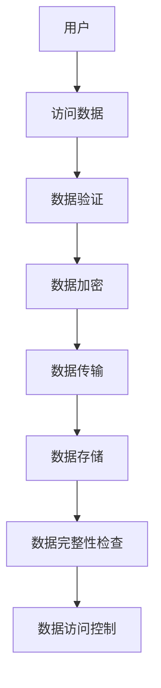
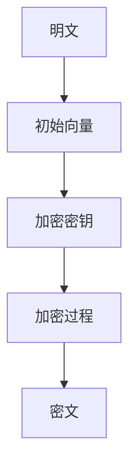
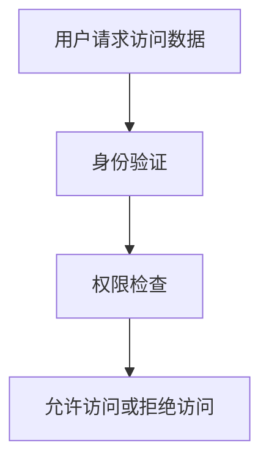
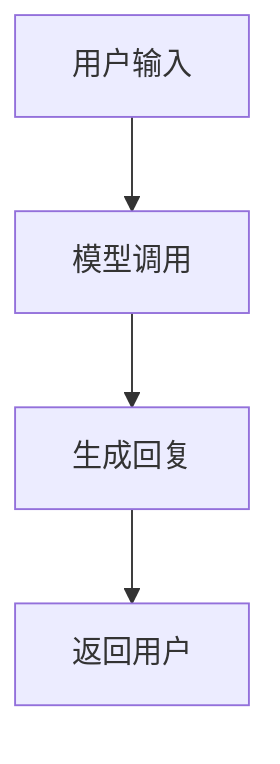
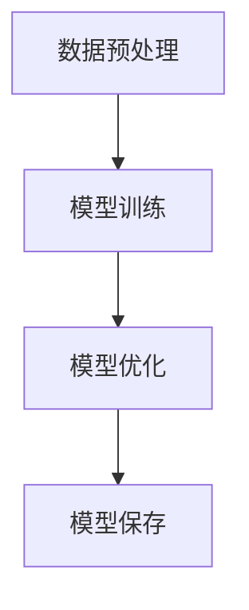
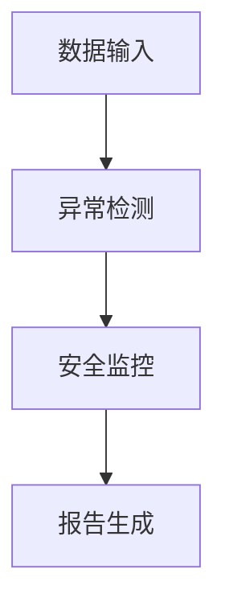
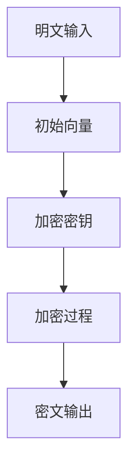
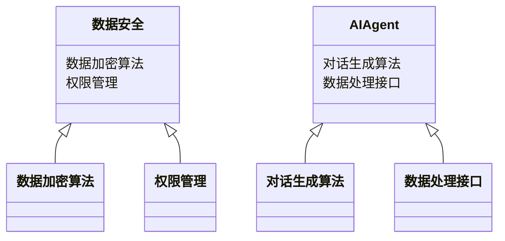
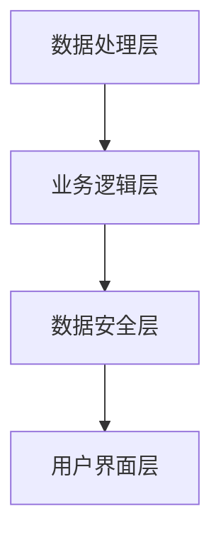
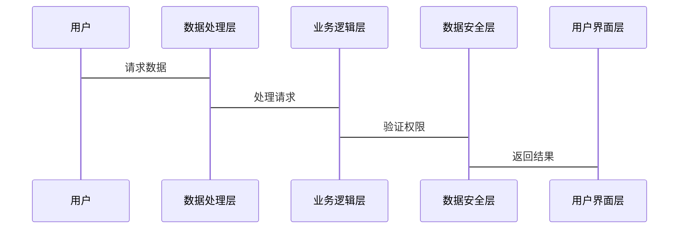

                 


# 企业数据安全与AI Agent开发：平衡创新与风险

## 关键词：
企业数据安全, AI Agent, 创新, 风险, 数据加密, 权限管理, 安全开发

## 摘要：
本文探讨在企业数据安全的前提下，如何进行AI Agent的开发，同时平衡创新与风险。文章从数据安全的核心原理、AI Agent的算法原理、系统架构设计、项目实战等方面展开，详细分析了数据加密、访问控制、AI算法实现、系统设计等内容，结合实际案例，总结了数据安全与AI Agent开发的最佳实践，为企业在AI Agent开发中提供参考。

---

## 正文

## 第1章：企业数据安全与AI Agent的背景概述

### 1.1 企业数据安全的重要性

#### 1.1.1 数据安全的核心概念
数据安全是指保护数据的机密性、完整性和可用性。机密性确保只有授权人员可以访问数据；完整性确保数据在存储和传输过程中不被篡改；可用性确保数据在需要时可被访问。

#### 1.1.2 数据安全的威胁与挑战
数据安全面临的主要威胁包括网络攻击、内部泄密、数据泄露等。例如，勒索软件攻击可能导致数据加密，要求支付赎金才能解锁；内部员工可能故意或无意中泄露敏感数据。此外，随着数据量的增加，数据保护的复杂性也在增加。

#### 1.1.3 数据安全的边界与外延
数据安全的边界包括企业的内部网络、云存储、数据库等。外延则涉及数据传输过程中的安全保护、第三方服务提供商的数据处理安全等。

### 1.2 AI Agent的基本概念与应用场景

#### 1.2.1 AI Agent的定义与特点
AI Agent是一种智能代理，能够感知环境并执行任务。它通常基于自然语言处理（NLP）技术，能够理解用户输入并生成相应的回应。AI Agent的特点包括自主性、反应性、社会性等。

#### 1.2.2 AI Agent在企业中的应用场景
AI Agent在企业中的应用包括智能客服、自动化运维、内部知识管理等。例如，智能客服可以通过自然语言处理技术帮助用户解决问题，自动化运维可以通过AI Agent监控系统状态并自动修复问题。

#### 1.2.3 AI Agent与企业数据安全的关系
AI Agent需要处理企业的敏感数据，因此数据安全是其开发和应用中的核心问题。如何在保证数据安全的前提下实现AI Agent的功能是本文的核心问题。

---

## 第2章：数据安全的核心原理

### 2.1 数据安全的威胁模型分析

#### 2.1.1 数据安全威胁的分类
数据安全威胁可以分为内部威胁和外部威胁。内部威胁包括员工误操作或故意泄密，外部威胁包括黑客攻击和病毒传播。

#### 2.1.2 数据安全威胁的ER实体关系图
以下是数据安全威胁的ER实体关系图：

```mermaid
erDiagram
    actor 用户 {
        string 用户名
        string 密码
    }
    actor 管理员 {
        string 管理员ID
        string 权限
    }
    actor 黑客 {
        string 黑客ID
        string 攻击工具
    }
    entity 数据 {
        string 数据ID
        string 数据内容
        string 数据分类
    }
    entity 威胁 {
        string 威胁ID
        string 威胁类型
        string 威胁描述
    }
    threat --
    用户
    threat --
    管理员
    threat --
    黑客
```

#### 2.1.3 数据安全威胁的Mermaid流程图
以下是数据安全威胁的流程图：



### 2.2 数据加密与访问控制

#### 2.2.1 数据加密算法的原理
数据加密是保护数据机密性的关键手段。AES（高级加密标准）是一种常用的加密算法，其加密过程如下：

1. 明文输入。
2. 初始向量生成。
3. 加密密钥生成。
4. 加密过程，将明文转换为密文。
5. 密文输出。

AES加密算法的流程图如下：



#### 2.2.2 数据访问控制的策略
数据访问控制通过权限管理实现。用户需要通过身份验证后才能访问数据。以下是数据访问控制的流程图：



#### 2.2.3 数据加密与访问控制的对比
以下是数据加密与访问控制的对比表格：

| 对比项 | 数据加密 | 数据访问控制 |
|--------|----------|--------------|
| 目标    | 保护数据机密性 | 控制数据访问权限 |
| 实现方式 | 加密算法 | 权限管理 |
| 使用场景 | 数据传输和存储 | 数据访问控制 |

---

## 第3章：AI Agent的核心原理

### 3.1 AI Agent的算法原理

#### 3.1.1 基于大模型的对话生成机制
AI Agent的对话生成基于大模型，如GPT-3。以下是对话生成的流程图：



#### 3.1.2 AI Agent的训练过程
AI Agent的训练过程包括数据预处理、模型训练和模型优化。以下是训练过程的流程图：



### 3.2 AI Agent与数据安全的结合

#### 3.2.1 数据安全对AI Agent的影响
数据安全是AI Agent开发的基础。AI Agent需要处理企业的敏感数据，因此需要确保数据的安全性。

#### 3.2.2 AI Agent在数据安全中的应用
AI Agent可以用于数据安全监控、异常行为检测等。以下是AI Agent在数据安全中的应用流程图：



---

## 第4章：数据加密算法的数学模型

### 4.1 AES加密算法的数学模型

#### 4.1.1 AES加密算法的流程图
以下是AES加密算法的流程图：



#### 4.1.2 AES加密算法的数学公式
AES加密算法基于模2加法运算，加密过程如下：

$$
\text{密文} = \text{明文} \oplus \text{密钥}
$$

其中，$\oplus$ 表示模2加法运算。

---

## 第5章：AI Agent算法的数学模型

### 5.1 基于大模型的对话生成机制

#### 5.1.1 对话生成的数学模型
对话生成基于概率模型，模型通过最大似然估计优化参数：

$$
P(y|x) = \prod_{i=1}^{n} P(y_i | y_{<i}, x)
$$

其中，$x$ 是输入，$y$ 是生成的回复。

---

## 第6章：系统分析与架构设计

### 6.1 项目背景与目标

#### 6.1.1 项目背景
本文旨在探讨在企业数据安全的前提下，如何开发AI Agent，并平衡创新与风险。

#### 6.1.2 项目目标
确保AI Agent的开发过程符合数据安全要求，同时实现AI Agent的功能。

### 6.2 系统功能设计

#### 6.2.1 领域模型
以下是系统功能的类图：



### 6.3 系统架构设计

#### 6.3.1 系统架构
以下是系统架构的架构图：



### 6.4 系统交互设计

#### 6.4.1 系统接口
以下是系统交互的序列图：



---

## 第7章：项目实战

### 7.1 环境配置

#### 7.1.1 工具安装
安装Python、TensorFlow、Keras等工具。

### 7.2 核心代码实现

#### 7.2.1 数据加密实现
以下是数据加密的代码示例：

```python
import hashlib

def encrypt(text):
    return hashlib.sha256(text.encode()).hexdigest()
```

#### 7.2.2 AI Agent实现
以下是AI Agent的代码示例：

```python
class AIAssistant:
    def generate_response(self, input_text):
        # 使用预训练模型生成回复
        pass
```

### 7.3 案例分析与总结

#### 7.3.1 案例分析
以智能客服系统为例，说明AI Agent的应用。

#### 7.3.2 项目总结
总结开发经验，强调数据安全的重要性。

---

## 第8章：总结与展望

### 8.1 内容总结

#### 8.1.1 核心内容
本文详细探讨了企业数据安全与AI Agent开发的关系，提出了平衡创新与风险的方法。

### 8.2 未来展望

#### 8.2.1 数据安全新技术
研究更先进的数据加密算法和访问控制技术。

#### 8.2.2 AI Agent的优化方向
优化AI Agent的算法，提高其性能和安全性。

---

## 最佳实践 Tips

- 在开发AI Agent时，始终优先考虑数据安全。
- 定期进行安全审计和漏洞扫描。
- 采用多层次的安全防护策略。

---

## 注意事项

- 数据加密算法的选择要根据实际需求。
- AI Agent的开发要遵循数据安全规范。
- 定期更新安全策略和算法。

---

## 拓展阅读

- 《数据安全与隐私保护》
- 《人工智能与机器学习实战》
- 《企业级AI系统的架构与设计》

