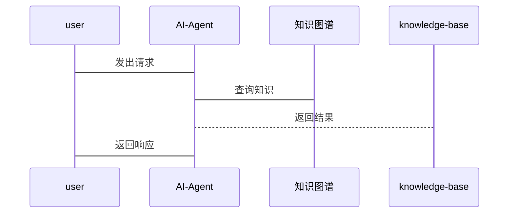

                 


# 企业知识图谱与AI Agent的深度融合应用

## 关键词：企业知识图谱、AI Agent、知识图谱构建、知识推理、智能系统

## 摘要：  
随着人工智能和大数据技术的快速发展，企业知识图谱与AI Agent的深度融合正在成为企业智能化转型的重要方向。知识图谱作为结构化知识的表示形式，能够帮助企业构建统一的知识体系；而AI Agent则通过智能化的决策和执行能力，为企业提供个性化的服务。本文将深入探讨企业知识图谱与AI Agent的结合方式，分析其技术原理、应用场景，并通过实际案例展示其在企业中的价值。

---

## 第一章：企业知识图谱与AI Agent概述

### 1.1 企业知识图谱的定义与特点  
企业知识图谱是一种通过图结构表示企业内外部知识的系统，包含实体（如人、组织、产品等）及其关系（如“属于”、“关联”、“影响”等）。它的特点包括：  
1. **语义丰富性**：能够表示复杂的语义关系。  
2. **动态更新**：能够实时更新以反映企业的最新信息。  
3. **可扩展性**：支持多种数据源的整合。  

### 1.2 AI Agent的基本概念  
AI Agent（智能代理）是一种能够感知环境、自主决策并执行任务的智能系统。它可以分为两类：  
1. **简单反射式Agent**：基于当前感知直接执行预定义动作。  
2. **基于模型的规划Agent**：结合内部状态和外部环境进行复杂决策。  

### 1.3 融合背景与价值  
企业知识图谱与AI Agent的结合，能够实现知识的智能化应用。例如，企业可以通过知识图谱提供上下文信息，AI Agent则利用这些信息做出更精准的决策。这种融合为企业带来了以下价值：  
1. **提升决策效率**：通过知识图谱快速获取相关信息，AI Agent快速做出决策。  
2. **增强个性化服务**：基于知识图谱的个性化推荐，AI Agent能够提供更精准的服务。  
3. **支持复杂场景**：在复杂业务场景中，AI Agent可以利用知识图谱进行推理和预测。  

---

## 第二章：知识图谱与AI Agent的核心概念

### 2.1 知识图谱的构建与管理  
知识图谱的构建过程包括数据抽取、实体识别、关系抽取和数据融合。  
- **数据抽取**：从结构化和非结构化数据中提取信息。  
- **实体识别**：通过NLP技术识别文本中的实体。  
- **关系抽取**：识别实体之间的关系。  
- **数据融合**：整合多源数据，消除冗余和冲突。  

知识图谱的存储与查询通常使用图数据库（如Neo4j）和SPARQL查询语言。动态更新则通过增量式方法实现，确保知识图谱的实时性。

### 2.2 AI Agent的行为模型  
AI Agent的行为模型包括目标设定、决策机制和执行流程：  
- **目标设定**：明确任务目标，例如“为用户提供产品推荐”。  
- **决策机制**：基于知识图谱中的信息进行推理，选择最优行动方案。  
- **执行流程**：通过API调用或其他方式执行决策结果。  

### 2.3 知识图谱与AI Agent的协同工作模式  
知识图谱为AI Agent提供知识基础，AI Agent则通过动态更新丰富知识图谱。这种协同模式使得企业能够更好地利用知识资源，同时提升AI Agent的智能化水平。  

---

## 第三章：知识图谱与AI Agent的融合算法原理

### 3.1 知识图谱表示学习  
知识图谱表示学习的目标是将实体和关系映射到低维向量空间。常用算法包括：  
- **图嵌入**：通过节点间的关系生成向量表示。  
- **知识图谱的向量表示**：使用Word2Vec或GraphSAGE等模型生成向量。  
- **相似性计算**：通过向量点积或余弦相似度度量实体的相似性。  

例如，计算实体A和实体B的相似性可以表示为：  
$$ \text{similarity}(A, B) = \frac{A \cdot B}{\|A\| \|B\|} $$  

### 3.2 AI Agent的知识推理  
知识推理是AI Agent基于知识图谱进行决策的核心过程。常用的推理方法包括：  
- **基于规则的推理**：通过预定义的规则进行推理。  
- **基于概率的推理**：利用概率论计算事件发生的可能性。  
- **路径分析**：通过知识图谱中的路径找到关联关系。  

例如，推理“员工A是公司CEO”可以通过知识图谱中的路径“A属于公司，且职位是CEO”实现。

---

## 第四章：系统分析与架构设计

### 4.1 系统功能设计  
系统功能包括知识图谱构建、AI Agent交互、知识推理和动态更新。  
- **知识图谱构建**：数据抽取、实体识别、关系抽取和数据融合。  
- **AI Agent交互**：用户与AI Agent的对话界面。  
- **知识推理**：基于知识图谱的推理服务。  
- **动态更新**：实时更新知识图谱以反映最新信息。  

### 4.2 系统架构设计  
系统架构采用分层设计，包括数据层、知识层、推理层和交互层。  

#### 数据层  
负责数据的存储和管理，使用图数据库存储实体和关系。  

#### 知识层  
负责知识图谱的构建、存储和查询，支持高效的图遍历和查询操作。  

#### 推理层  
基于知识图谱进行推理，提供决策支持。  

#### 交互层  
提供用户与AI Agent的交互界面，支持自然语言处理和对话生成。  

### 4.3 系统接口设计  
系统接口包括：  
1. 数据接口：与外部数据源对接。  
2. 查询接口：支持知识图谱的查询和推理。  
3. 交互接口：支持用户与AI Agent的对话。  

### 4.4 系统交互流程图  
使用Mermaid序列图描述系统交互流程：  


---

## 第五章：项目实战

### 5.1 环境安装与配置  
项目需要以下环境：  
- Python 3.8+  
- 图数据库（如Neo4j）  
- 自然语言处理库（如spaCy）  
- 机器学习库（如Scikit-learn）  

### 5.2 核心代码实现  
以下是一个简单的知识图谱构建和AI Agent交互的Python代码示例：  

```python
from neo4j import GraphDatabase
from spacy.lang.zh import Chinese

# 知识图谱构建
class KnowledgeGraph:
    def __init__(self, uri, user, password):
        self.driver = GraphDatabase.driver(uri, user, password)
    
    def create_entity(self, entity_type, entity_name):
        with self.driver.session() as session:
            session.run("CREATE (n:{entity_type} {{name: '{entity_name}'}})".format(entity_type=entity_type, entity_name=entity_name))

# AI Agent交互
class AI-Agent:
    def __init__(self, kg):
        self.kg = kg
    
    def query_knowledge(self, question):
        # 简单的基于关键词的查询
        entities = question.split()
        result = []
        for entity in entities:
            result.append(self.kg.get_entity(entity))
        return result

# 使用示例
kg = KnowledgeGraph("bolt://localhost:7687", "neo4j", "password")
agent = AI-Agent(kg)
response = agent.query_knowledge("员工A 公司CEO")
print(response)
```

### 5.3 案例分析与解读  
假设我们有一个公司知识图谱，包含员工、部门、职位等实体。AI Agent可以回答如下问题：  
- “谁是公司的CEO？”  
- “开发部有多少员工？”  
- “张三的职位是什么？”  

通过知识图谱的推理能力，AI Agent能够根据上下文提供更精准的答案。

---

## 第六章：最佳实践与总结

### 6.1 小结  
企业知识图谱与AI Agent的深度融合，不仅提升了企业的智能化水平，还为企业提供了更强大的数据分析和决策能力。

### 6.2 注意事项  
在实际应用中，需要注意以下问题：  
1. 数据隐私与安全：确保知识图谱中的数据不会泄露。  
2. 模型优化：定期更新和优化知识图谱和AI Agent的算法。  
3. 人机协作：AI Agent应当与人类员工协同工作，而非完全替代。  

### 6.3 拓展阅读  
- 《知识图谱入门与实践》  
- 《AI Agent的设计与实现》  
- 《企业智能化转型指南》  

---

通过本文的分析与实践，我们看到了企业知识图谱与AI Agent融合的巨大潜力。未来，随着技术的不断发展，这种融合将为企业带来更多的创新机会和竞争优势。

