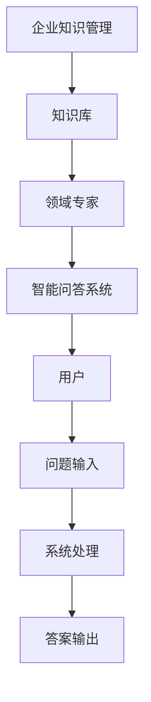
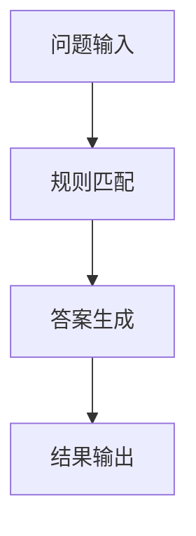
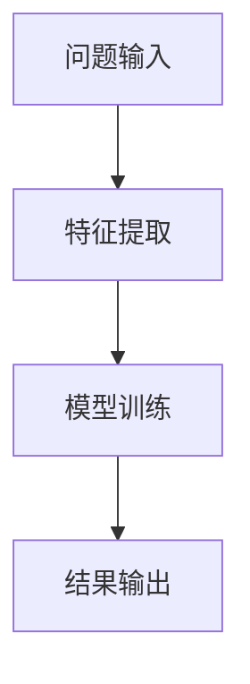
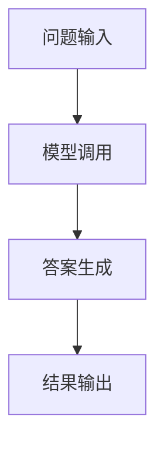
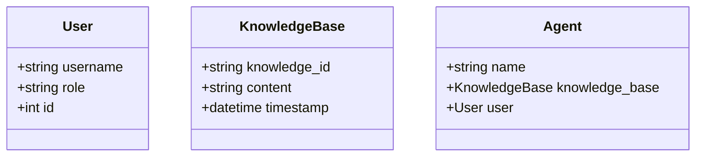
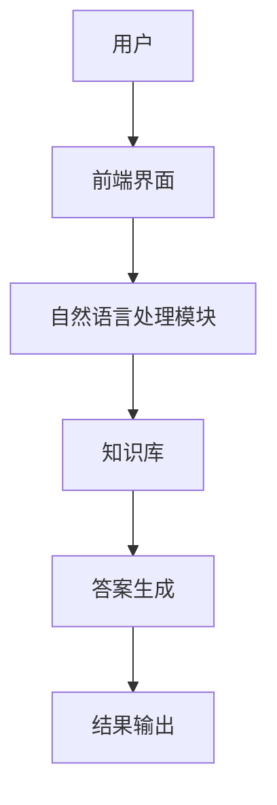
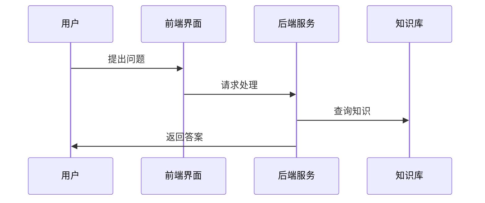

                 


# 企业知识管理：AI Agent的智能问答系统

> **关键词**: 企业知识管理, AI Agent, 智能问答系统, 知识表示, 问答系统算法, 系统架构设计

> **摘要**: 本文深入探讨了企业知识管理与AI Agent结合的智能问答系统，从背景介绍、核心概念到算法原理、系统架构，再到项目实战，全面分析了该系统的构建与应用。通过详细的流程图和代码示例，本文为读者提供了从理论到实践的完整指南。

---

## 第一部分: 企业知识管理与AI Agent概述

## 第1章: 企业知识管理与AI Agent的背景介绍

### 1.1 企业知识管理的核心概念

#### 1.1.1 问题背景与问题描述

企业知识管理（KM）是将企业内外部的知识进行收集、整理、存储、共享和应用的过程。传统的知识管理依赖于文档管理、专家经验积累等方式，但在数字化转型的今天，企业需要更高效的知识利用方式。AI Agent的引入为企业知识管理带来了新的可能性。

#### 1.1.2 问题解决的思路与方法

AI Agent（智能代理）是一种能够感知环境、自主决策并执行任务的智能系统。通过自然语言处理（NLP）、机器学习（ML）等技术，AI Agent可以理解和回答复杂的问题，从而提升企业的知识管理水平。

#### 1.1.3 问题的边界与外延

企业知识管理的边界包括内部知识库、文档管理系统、专家经验等，而外延则涉及外部知识源、实时数据等。AI Agent的引入扩大了知识管理的边界，使其能够处理非结构化数据和动态信息。

#### 1.1.4 核心概念结构与组成要素

企业知识管理的核心要素包括：
- 知识表示与存储
- 知识组织与关联
- 知识检索与应用

AI Agent的核心要素包括：
- 自然语言理解
- 知识推理
- 人机交互

### 1.2 AI Agent的基本概念与特点

#### 1.2.1 AI Agent的定义与分类

AI Agent可以根据智能水平分为：
- 基于规则的Agent
- 基于统计的Agent
- 基于深度学习的Agent

#### 1.2.2 AI Agent的核心属性特征对比

| 属性 | 基于规则的Agent | 基于统计的Agent | 基于深度学习的Agent |
|------|----------------|----------------|---------------------|
| 知识表示 | 规则库         | 统计模型       | 神经网络模型         |
| 学习能力 | 无             | 有             | 强                 |
| 稳定性 | 高             | 中             | 依赖数据质量         |

#### 1.2.3 AI Agent与传统知识管理系统的区别

| 特性 | 传统知识管理系统 | AI Agent智能问答系统 |
|------|------------------|---------------------|
| 智能性 | 低               | 高                 |
| 交互性 | 单向             | 双向               |
| 自适应性 | 无               | 有                 |

### 1.3 本章小结

本章介绍了企业知识管理的核心概念和AI Agent的基本特点，分析了它们的联系与区别，为后续章节奠定了基础。

---

## 第2章: 核心概念与原理

### 2.1 企业知识管理的原理

#### 2.1.1 知识表示与存储的原理

知识表示是将知识转化为计算机可理解的形式。常用的知识表示方法包括：
- 概念图
- 本体论（Ontology）
- 向量空间模型

知识存储通常使用数据库（如MongoDB）或知识图谱（如Neo4j）。

#### 2.1.2 知识组织与关联的机制

知识组织通过分类、聚类等方式将知识结构化。知识关联通过关系抽取技术（如实体识别、关系抽取）建立知识之间的联系。

#### 2.1.3 知识检索与应用的流程

知识检索过程包括：
1. 用户提出问题
2. 系统解析问题
3. 知识库匹配
4. 返回答案

### 2.2 AI Agent的智能问答系统原理

#### 2.2.1 智能问答系统的概念模型

智能问答系统包括以下组件：
- 自然语言理解模块
- 知识推理模块
- 生成模块

#### 2.2.2 AI Agent的核心算法原理

AI Agent的问答系统算法包括：
- 基于规则的算法
- 基于统计的算法
- 基于深度学习的算法

#### 2.2.3 系统的输入输出关系与流程

问答系统流程：
1. 用户输入问题
2. 系统解析问题
3. 知识库查询
4. 返回答案

### 2.3 实体关系图与系统架构



### 2.4 本章小结

本章详细介绍了企业知识管理与AI Agent智能问答系统的核心原理，为后续章节的实现提供了理论基础。

---

## 第三部分: 智能问答系统的算法原理

## 第3章: 智能问答系统的算法实现

### 3.1 基于规则的问答系统

#### 3.1.1 算法原理与流程

基于规则的问答系统通过预定义规则匹配问题并生成答案。

流程图：


#### 3.1.2 代码实现示例

```python
def rule_based_qa(question):
    rules = {
        'rule1': 'answer1',
        'rule2': 'answer2'
    }
    return rules.get(question, '未知问题')
```

### 3.2 基于统计模型的问答系统

#### 3.2.1 算法原理与流程

基于统计模型的问答系统通过机器学习模型匹配问题和答案。

流程图：


#### 3.2.2 代码实现示例

```python
from sklearn.feature_extraction.text import TfidfVectorizer
from sklearn.metrics.pairwise import cosine_similarity

vectorizer = TfidfVectorizer()
tfidf = vectorizer.fit_transform(["问题1", "问题2"])
similarity = cosine_similarity(tfidf[0], tfidf[1])
```

### 3.3 基于深度学习的问答系统

#### 3.3.1 算法原理与流程

基于深度学习的问答系统使用神经网络模型（如BERT）进行问答。

流程图：


#### 3.3.2 代码实现示例

```python
import transformers

model = transformers.AutoModelForQuestionAnswering.from_pretrained('bert-base-cased')
tokenizer = transformers.AutoTokenizer.from_pretrained('bert-base-cased')

inputs = tokenizer.encode_plus("问题", return_tensors="pt", add_special_tokens=True)
output = model(inputs.input_ids)
```

### 3.4 本章小结

本章详细介绍了基于规则、统计和深度学习的问答系统实现，展示了不同算法的特点和应用场景。

---

## 第四部分: 系统分析与架构设计

## 第4章: 系统分析与架构设计

### 4.1 问题场景介绍

企业知识管理中，员工常需要快速获取内部知识库的信息。传统问答系统效率低，难以处理复杂问题。引入AI Agent可以提升效率和准确性。

### 4.2 项目介绍

本项目旨在构建一个基于AI Agent的企业智能问答系统，实现自然语言问答功能。

### 4.3 系统功能设计

#### 4.3.1 领域模型设计



#### 4.3.2 系统架构设计



#### 4.3.3 系统接口设计

- 用户接口：HTTP API
- 知识库接口：RESTful API
- 代理接口：基于消息队列的异步通信

#### 4.3.4 系统交互设计



### 4.4 本章小结

本章详细分析了系统的功能需求和架构设计，为后续实现提供了指导。

---

## 第五部分: 项目实战

## 第5章: 项目实战

### 5.1 环境安装与配置

安装Python、TensorFlow、Hugging Face Transformers等库。

### 5.2 系统核心实现

#### 5.2.1 知识库的构建

使用MongoDB存储企业知识，建立索引优化查询。

#### 5.2.2 代理服务的实现

基于Flask框架，实现RESTful API接口。

#### 5.2.3 自然语言处理模块

使用Hugging Face Transformers进行文本处理和问答生成。

### 5.3 案例分析与实现

#### 5.3.1 实例1：简单问答

```python
from transformers import pipeline

qa_pipeline = pipeline("question-answering", model="bert-base-cased")
question = "什么是企业知识管理？"
context = "企业知识管理是指..."
answer = qa_pipeline(question=question, context=context)
print(answer['answer'])
```

#### 5.3.2 实例2：复杂问答

```python
question = "如何优化知识管理系统？"
context = "知识管理系统可以..."
answer = qa_pipeline(question=question, context=context)
print(answer['answer'])
```

### 5.4 系统测试与优化

测试指标包括响应时间、准确率和召回率。

### 5.5 本章小结

本章通过实际案例展示了系统的实现过程，验证了设计的可行性。

---

## 第六部分: 总结与展望

## 第6章: 总结与展望

### 6.1 最佳实践Tips

- 数据质量是关键
- 系统需要持续优化
- 与企业现有系统集成

### 6.2 本章小结

本文详细介绍了企业知识管理与AI Agent智能问答系统的构建过程，从理论到实践，为读者提供了完整的解决方案。

### 6.3 注意事项

- 数据隐私保护
- 系统性能优化
- 异常情况处理

### 6.4 拓展阅读

推荐学习的知识图谱、强化学习等技术，进一步提升问答系统的智能性。

---

## 附录

## 附录A: 代码示例汇总

```python
import transformers
from sklearn.feature_extraction.text import TfidfVectorizer
from sklearn.metrics.pairwise import cosine_similarity

# 基于规则的问答系统
def rule_based_qa(question):
    rules = {
        'rule1': 'answer1',
        'rule2': 'answer2'
    }
    return rules.get(question, '未知问题')

# 基于统计的问答系统
vectorizer = TfidfVectorizer()
tfidf = vectorizer.fit_transform(["问题1", "问题2"])
similarity = cosine_similarity(tfidf[0], tfidf[1])

# 基于深度学习的问答系统
model = transformers.AutoModelForQuestionAnswering.from_pretrained('bert-base-cased')
tokenizer = transformers.AutoTokenizer.from_pretrained('bert-base-cased')
inputs = tokenizer.encode_plus("问题", return_tensors="pt", add_special_tokens=True)
output = model(inputs.input_ids)
```

---

## 结语

企业知识管理与AI Agent的结合为企业提供了更高效的知识利用方式。通过智能问答系统，企业可以快速响应员工需求，提升工作效率。未来，随着AI技术的进步，企业知识管理将更加智能化和自动化。

