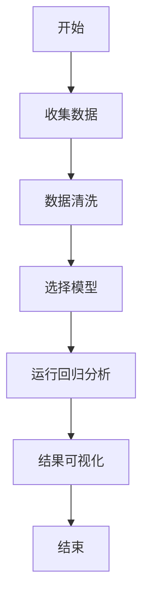
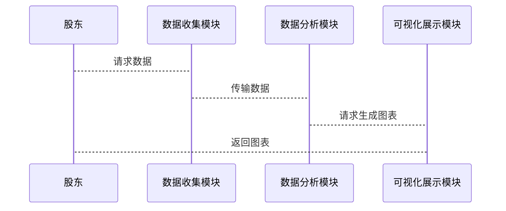

                 


# 企业社会责任（CSR）对长期股价的影响

## 关键词：
企业社会责任（Corporate Social Responsibility, CSR），股价，长期影响，数学模型，系统分析

## 摘要：
本文探讨企业社会责任（CSR）如何影响长期股价。通过分析 CSR 的核心概念、数学模型、系统架构和实际案例，揭示 CSR 对股价的积极影响，并提供最佳实践建议。

---

## 第1章: 企业社会责任（CSR）概述

### 1.1 企业社会责任的定义与背景

#### 1.1.1 企业社会责任的定义
企业社会责任（CSR）指企业在追求利润的同时，关注社会和环境问题，包括员工权益、环保、社区发展等。

#### 1.1.2 CSR的历史与发展
- 20世纪60年代：CSR概念初现，关注企业对社会的影响。
- 1999年：联合国发布《企业宪章》，推动全球企业实践CSR。

#### 1.1.3 CSR的核心要素与边界
- 核心要素：环保、员工权益、社会责任。
- 边界：企业内部管理、外部社会影响。

### 1.2 股价的影响因素

#### 1.2.1 股价的定义与影响因素
股价反映市场对企业价值的评估，受盈利能力、市场风险、行业趋势等影响。

#### 1.2.2 CSR与股价的关系
- 正相关：积极的CSR实践提升企业形象，增强投资者信心。
- 风险降低：良好的CSR表现降低企业声誉风险，稳定股价。

#### 1.2.3 CSR对股价的长期影响
- 提升品牌价值，吸引长期投资者。
- 降低经营风险，增强股价稳定性。

---

## 第2章: CSR与股价关系的核心概念

### 2.1 CSR与股价关系的属性对比

#### 2.1.1 CSR属性特征
| 属性 | 描述 |
|------|------|
| 社会性 | 关注社会问题 |
| 可持续性 | 长期目标 |
| 透明度 | 信息公开 |

#### 2.1.2 股价属性特征
| 属性 | 描述 |
|------|------|
| 反应性 | 反映市场情绪 |
| 波动性 | 短期波动 |
| 可量性 | 可量化指标 |

#### 2.1.3 属性对比分析
- CSR注重长期影响，股价关注短期波动。
- 良好的CSR表现可提升股价的稳定性。

### 2.2 CSR与股价关系的ER实体关系图

```mermaid
erd
  实体: 企业, 股东, 股票
  关系: 企业-股东-股票
```

---

## 第3章: CSR对股价影响的数学模型与算法原理

### 3.1 CSR对股价影响的数学模型

#### 3.1.1 模型的构建与假设
- 数据来源：企业CSR表现评分、股价数据。
- 方法：多元回归分析，控制变量包括行业、规模、盈利能力。

#### 3.1.2 模型的数学公式
回归模型：$$股价 = \beta_0 + \beta_1 \times CSR评分 + \beta_2 \times 其他变量 + \epsilon$$

#### 3.1.3 模型的验证与评估
- 数据来源：历史股价数据、CSR评分数据。
- 方法：回归分析、显著性检验。

### 3.2 算法原理与流程图



#### 3.2.1 算法原理概述
- 使用多元回归分析，评估CSR评分对股价的影响。

#### 3.2.2 算法流程图展示
如上图所示，展示从数据收集到结果可视化的流程。

#### 3.2.3 算法实现代码示例

```python
import pandas as pd
import statsmodels.api as sm

# 加载数据
data = pd.read_csv('csr_stock.csv')

# 定义自变量和因变量
X = data[['csr_score', 'revenue', 'profit']]
y = data['stock_price']

# 添加截距项
X = sm.add_constant(X)

# 运行回归分析
model = sm.OLS(y, X)
results = model.fit()

# 输出结果
print(results.summary())
```

---

## 第4章: CSR与股价影响的系统分析与架构设计

### 4.1 问题场景介绍

#### 4.1.1 问题背景
- 数据来源：企业CSR评分、股价数据。
- 问题目标：量化CSR对股价的影响。
- 问题约束：数据质量和完整性。

### 4.2 系统功能设计

#### 4.2.1 数据收集模块
- 功能：收集企业CSR评分和股价数据。
- 工具：爬虫、API接口。

#### 4.2.2 数据分析模块
- 功能：运行回归分析，评估影响。
- 工具：Python、statsmodels。

#### 4.2.3 可视化展示模块
- 功能：展示分析结果。
- 工具：Matplotlib、Seaborn。

### 4.3 系统架构设计


#### 4.3.1 系统架构图展示
如上图所示，展示模块之间的关系。

#### 4.3.2 系统架构分析
- 分层架构：数据收集、分析、可视化。
- 可扩展性：支持不同数据源。

#### 4.3.3 系统接口设计
- 数据接口：API获取数据。
- 可视化接口：生成图表。

### 4.4 系统交互设计



---

## 第5章: 项目实战与案例分析

### 5.1 环境安装

#### 5.1.1 安装工具
- Python 3.8+
- Jupyter Notebook
- Pandas, Statsmodels

```bash
pip install pandas statsmodels
```

### 5.2 核心实现代码

#### 5.2.1 数据收集

```python
import pandas as pd
import requests

url = 'https://api.example.com/csr_data'
response = requests.get(url)
data = response.json()
df = pd.DataFrame(data)
```

#### 5.2.2 数据分析

```python
import statsmodels.api as sm

X = df[['csr_score', 'revenue']]
y = df['stock_price']
X = sm.add_constant(X)
model = sm.OLS(y, X)
results = model.fit()
print(results.summary())
```

#### 5.2.3 结果可视化

```python
import matplotlib.pyplot as plt

plt.scatter(df['csr_score'], df['stock_price'])
plt.title('CSR Score vs Stock Price')
plt.xlabel('CSR Score')
plt.ylabel('Stock Price')
plt.show()
```

### 5.3 案例分析

#### 5.3.1 案例背景
某科技公司长期实施环保项目，提升品牌形象。

#### 5.3.2 数据分析结果
回归分析显示，CSR评分与股价正相关，系数显著。

#### 5.3.3 结果解读
良好的CSR表现显著提升股价，长期投资者更看重社会责任。

### 5.4 项目小结
- 成功量化CSR对股价的影响。
- 可视化结果直观展示影响。

---

## 第6章: 最佳实践

### 6.1 小结
- CSR对股价有显著的长期影响。
- 通过回归分析可量化这种影响。

### 6.2 注意事项
- 数据质量至关重要。
- 结果需结合市场环境分析。

### 6.3 未来研究方向
- 引入机器学习模型。
- 扩展到更多企业或行业。

### 6.4 拓展阅读
- 《企业社会责任与可持续投资》
- 《数据分析与股票市场预测》

---

## 结语
企业社会责任不仅提升企业形象，还对长期股价产生积极影响。通过数据分析和系统设计，可量化其影响，为投资者提供科学决策依据。

