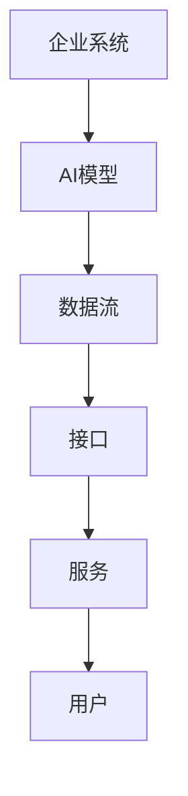
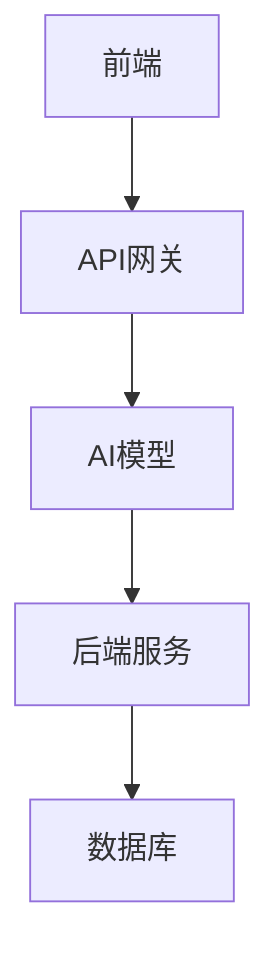

                 


# 企业系统中AI模型的集成与部署

> 关键词：AI模型、企业系统、集成部署、微服务架构、系统架构设计、API网关、模型压缩

> 摘要：  
本文将深入探讨AI模型在企业系统中的集成与部署的关键问题。通过分析当前企业系统中AI应用的现状与挑战，系统性地介绍AI模型集成与部署的核心技术、方法和最佳实践。从模型训练、调优到API集成、系统架构设计，再到实际项目实战，本文将全面解析如何在企业系统中高效、安全地部署AI模型，帮助企业更好地实现AI技术的落地应用。

---

## 第1章 企业系统中AI模型的集成与部署概述

### 1.1 问题背景与挑战

#### 1.1.1 企业系统中的AI应用现状
企业系统正在经历数字化转型，AI技术的应用越来越广泛。然而，AI模型的集成与部署仍然面临诸多挑战，例如：
- 模型训练时间长，资源消耗大。
- 部署复杂性高，难以与现有系统无缝集成。
- 模型更新与维护成本高。

#### 1.1.2 AI模型集成与部署的核心问题
- **模型兼容性**：AI模型需要与企业现有系统兼容，确保数据流和接口的统一。
- **性能优化**：AI模型在企业系统中的性能必须满足实时性和响应速度要求。
- **安全性与稳定性**：AI模型的部署必须保证系统的安全性和稳定性，防止数据泄露和系统崩溃。

#### 1.1.3 当前的主要挑战与痛点
- 技术层面：AI模型的训练、调优和压缩技术尚未成熟，难以满足企业需求。
- 系统层面：企业系统架构复杂，AI模型的集成需要考虑系统兼容性和扩展性。
- 人员层面：企业缺乏AI模型集成与部署的专业人才，导致实施困难。

### 1.2 问题描述与目标

#### 1.2.1 AI模型在企业系统中的应用场景
- **客户服务**：通过自然语言处理（NLP）技术实现智能客服。
- **数据分析**：利用机器学习（ML）模型进行数据预测和决策支持。
- **流程自动化**：通过AI模型实现业务流程的自动化。

#### 1.2.2 集成与部署的关键目标
- **高效集成**：确保AI模型能够快速、无缝地与企业系统集成。
- **性能优化**：提升AI模型的运行效率，降低资源消耗。
- **安全性与稳定性**：保证AI模型的部署不会对企业系统的安全性和稳定性造成影响。

#### 1.2.3 问题边界与外延
- **边界**：仅关注AI模型的集成与部署，不涉及模型训练和数据准备。
- **外延**：扩展至系统架构设计和性能优化。

### 1.3 核心概念与联系

#### 1.3.1 AI模型集成与部署的核心要素
- **模型训练**：通过大量数据训练AI模型，使其具备特定任务的能力。
- **模型调优**：通过优化算法和参数提升模型性能。
- **模型部署**：将AI模型部署到企业系统中，实现功能落地。

#### 1.3.2 核心概念的属性特征对比（表格形式）

| 核心概念 | 描述 | 属性特征 |
|----------|------|----------|
| 模型训练 | 数据预处理、算法选择、模型训练 | 数据量大、计算资源消耗高 |
| 模型调优 | 参数优化、算法改进 | 需要大量实验和验证 |
| 模型部署 | API接口设计、系统集成 | 需要考虑系统的兼容性和稳定性 |

#### 1.3.3 ER实体关系图（Mermaid流程图）



---

## 第2章 AI模型集成与部署的核心技术基础

### 2.1 AI模型训练与调优

#### 2.1.1 模型训练的基本原理
模型训练是通过大量数据，利用算法优化模型参数，使其能够准确预测或分类。例如，使用梯度下降算法优化神经网络模型。

#### 2.1.2 模型调优的策略与方法
- **超参数优化**：通过网格搜索或随机搜索选择最优超参数。
- **模型选择**：比较不同算法的性能，选择最适合任务的模型。

#### 2.1.3 模型压缩与轻量化技术
- **剪枝**：去除模型中冗余的神经元或参数。
- **量化**：将模型中的浮点数参数转换为低位整数，减少存储空间和计算时间。

### 2.2 AI模型推理与解释

#### 2.2.1 模型推理的基本流程
- **输入处理**：将输入数据预处理为模型可接受的形式。
- **模型推理**：通过模型计算得到输出结果。
- **结果解释**：将模型输出结果转化为人类可理解的形式。

#### 2.2.2 模型解释性的重要性
模型解释性是指模型输出结果背后的原因和逻辑，有助于企业理解和信任AI决策。

#### 2.2.3 可解释性模型的技术实现
- **线性回归**：通过系数解释变量对结果的影响。
- **决策树**：通过树结构解释决策路径。

### 2.3 AI模型的安全性与鲁棒性

#### 2.3.1 模型安全性的关键问题
- **对抗攻击**：通过对抗样本欺骗模型。
- **数据泄露**：模型可能泄露训练数据中的敏感信息。

#### 2.3.2 模型鲁棒性的提升方法
- **数据增强**：通过增加多样化的数据提升模型的泛化能力。
- **模型集成**：通过集成多个模型提升模型的稳定性和准确性。

#### 2.3.3 安全与鲁棒性测试的技术手段
- **对抗测试**：通过生成对抗样本测试模型的鲁棒性。
- **模型审计**：分析模型的内部结构，发现潜在的安全漏洞。

---

## 第3章 AI模型在企业系统中的集成方法

### 3.1 API网关集成

#### 3.1.1 API网关的基本概念
API网关是企业系统中常用的中间件，用于管理API的请求路由、认证授权和速率限制。

#### 3.1.2 API网关在AI模型集成中的作用
- **统一接口**：通过API网关提供统一的API接口，简化AI模型的调用。
- **流量管理**：通过API网关实现流量控制和负载均衡，确保系统的稳定性。

#### 3.1.3 API网关的实现与配置
- **API路由**：通过配置API网关的路由规则，实现AI模型的调用。
- **认证授权**：通过API网关实现API的认证和授权，确保系统的安全性。

### 3.2 SDK集成

#### 3.2.1 SDK的基本原理
SDK（软件开发工具包）是提供一组API和工具的软件包，用于简化AI模型的集成。

#### 3.2.2 SDK在AI模型集成中的优势
- **简化开发**：通过SDK提供简洁的API接口，简化AI模型的调用。
- **本地运行**：SDK可以运行在本地，减少对网络的依赖。

#### 3.2.3 SDK的安装与使用
- **安装**：通过pip等包管理工具安装SDK。
- **使用**：通过SDK提供的API接口调用AI模型。

### 3.3 中间件集成

#### 3.3.1 中间件在AI模型集成中的应用
- **消息队列**：通过中间件实现异步通信，提升系统的响应速度。
- **缓存**：通过中间件缓存常用数据，减少数据库的访问压力。

#### 3.3.2 中间件的选择与配置
- **选择**：根据需求选择合适的中间件，例如Redis、RabbitMQ等。
- **配置**：通过配置中间件的参数，优化系统的性能。

#### 3.3.3 中间件的性能优化
- **连接池**：通过连接池管理中间件的连接，减少连接的开销。
- **优化配置**：通过优化中间件的配置参数，提升系统的性能。

---

## 第4章 AI模型的部署与管理

### 4.1 私有化部署

#### 4.1.1 私有化部署的基本概念
私有化部署是指将AI模型部署在企业的内部服务器上，确保数据的安全性和隐私性。

#### 4.1.2 私有化部署的实现步骤
1. **环境搭建**：搭建服务器环境，安装必要的软件和工具。
2. **模型部署**：将AI模型部署到服务器上，配置运行环境。
3. **服务启动**：启动AI模型的服务，测试服务的可用性。

#### 4.1.3 私有化部署的优缺点分析
- **优点**：数据安全性高，隐私性好。
- **缺点**：资源消耗大，维护成本高。

### 4.2 公有云部署

#### 4.2.1 公有云部署的基本原理
公有云部署是指将AI模型部署在云服务提供商的服务器上，利用云服务的弹性扩展能力。

#### 4.2.2 公有云部署的实现步骤
1. **选择云服务**：选择合适的云服务提供商，例如AWS、阿里云等。
2. **模型部署**：将AI模型部署到云服务器上，配置运行环境。
3. **服务发布**：通过云服务提供商的平台发布服务，配置访问权限。

#### 4.2.3 公有云部署的优缺点分析
- **优点**：资源利用率高，弹性扩展能力强。
- **缺点**：数据控制权较低，可能面临数据泄露的风险。

### 4.3 混合部署

#### 4.3.1 混合部署的基本概念
混合部署是指将AI模型部分部署在内部服务器，部分部署在云服务器上，结合两者的优势。

#### 4.3.2 混合部署的实现步骤
1. **环境搭建**：搭建内部服务器和云服务器环境。
2. **模型部署**：将AI模型部分部署在内部服务器，部分部署在云服务器上。
3. **服务集成**：通过API网关等中间件实现内部服务器和云服务器的集成。

#### 4.3.3 混合部署的优缺点分析
- **优点**：兼顾数据安全性和资源利用率。
- **缺点**：部署复杂性高，维护成本较高。

---

## 第5章 企业系统中AI模型的系统架构设计

### 5.1 系统设计概述

#### 5.1.1 系统设计的目标与原则
- **目标**：确保AI模型的高效运行和系统的稳定性。
- **原则**：模块化设计、高可用性、可扩展性。

#### 5.1.2 系统设计的核心要素
- **模块划分**：将系统划分为前端、后端和数据层。
- **接口设计**：通过RESTful API实现模块之间的通信。
- **容错设计**：通过冗余和备份提升系统的容错能力。

#### 5.1.3 系统设计的优缺点分析
- **优点**：系统架构清晰，模块化设计便于维护。
- **缺点**：设计复杂，需要投入更多时间和资源。

### 5.2 系统架构设计

#### 5.2.1 系统功能设计
- **功能模块**：包括模型训练、模型部署、模型监控等。
- **功能流程**：通过流程图展示系统功能的执行流程。

#### 5.2.2 系统架构设计的mermaid图


#### 5.2.3 系统接口设计
- **输入接口**：通过API接口接收输入数据。
- **输出接口**：通过API接口返回处理结果。

#### 5.2.4 系统交互设计
- **交互流程**：通过序列图展示系统交互的详细流程。

---

## 第6章 项目实战：AI客服系统的集成与部署

### 6.1 项目背景与目标
- **背景**：企业需要提升客户服务效率，降低人工成本。
- **目标**：通过AI技术实现智能客服，提高客户满意度。

### 6.2 项目环境与工具安装
- **环境要求**：安装Python、Jupyter Notebook、TensorFlow等工具。
- **工具安装**：通过pip安装所需的Python库。

### 6.3 系统核心实现

#### 6.3.1 模型训练与调优
```python
import tensorflow as tf
from tensorflow.keras import layers

model = tf.keras.Sequential([
    layers.Dense(64, activation='relu'),
    layers.Dense(1, activation='sigmoid')
])

model.compile(optimizer='adam', loss='binary_crossentropy', metrics=['accuracy'])

model.fit(x_train, y_train, epochs=10, batch_size=32)
```

#### 6.3.2 API接口设计与实现
```python
from flask import Flask, request, jsonify

app = Flask(__name__)

@app.route('/predict', methods=['POST'])
def predict():
    data = request.json
    prediction = model.predict(data['input'])
    return jsonify({'result': prediction.tolist()})

if __name__ == '__main__':
    app.run()
```

#### 6.3.3 系统部署与测试
- **部署环境**：将AI模型部署到企业内部服务器或云服务器上。
- **测试流程**：通过API接口测试模型的响应时间和准确性。

### 6.4 项目小结
- **实现成果**：成功实现AI客服系统的集成与部署，提升了客户服务效率。
- **经验总结**：AI模型的集成与部署需要综合考虑系统架构、资源分配和安全性等多个方面。

---

## 第7章 最佳实践与小结

### 7.1 最佳实践 tips
- **模块化设计**：通过模块化设计提升系统的可维护性和可扩展性。
- **安全性与稳定性**：在部署过程中，必须优先考虑系统的安全性和稳定性。
- **性能优化**：通过模型压缩和轻量化技术优化AI模型的运行效率。

### 7.2 小结
本文系统性地介绍了企业系统中AI模型的集成与部署的关键技术与方法，通过实际案例分析，展示了如何在企业系统中高效、安全地部署AI模型。未来，随着AI技术的不断发展，企业系统中AI模型的集成与部署将更加智能化和自动化。

### 7.3 注意事项
- **数据安全**：在部署过程中，必须确保数据的安全性和隐私性。
- **系统兼容性**：在集成AI模型时，必须考虑系统兼容性和扩展性。
- **模型更新**：定期更新AI模型，确保模型的准确性和实用性。

### 7.4 拓展阅读
- **推荐书籍**：《深度学习实战》、《微服务设计》。
- **推荐文章**：《AI模型的优化与部署》、《企业系统架构设计》。

---

以上是《企业系统中AI模型的集成与部署》的技术博客文章的完整目录和内容框架。

