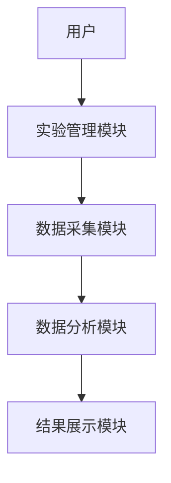
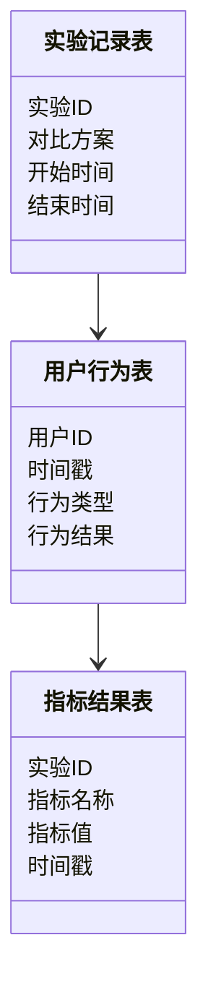

                 


# 企业级AI Agent的A/B测试策略与实施

> 关键词：企业级AI Agent, A/B测试, 系统架构设计, 算法原理, 项目实战

> 摘要：本文详细探讨了在企业级AI Agent开发中实施A/B测试的策略与方法。从概念到算法，再到系统架构和项目实战，全面解析如何通过A/B测试优化AI Agent的表现，提升企业智能化水平。

---

## 第1章: 企业级AI Agent与A/B测试概述

### 1.1 企业级AI Agent的定义与特点

#### 1.1.1 AI Agent的基本概念
AI Agent（智能体）是指能够感知环境、自主决策并执行任务的智能系统。它通过传感器获取信息，利用推理能力做出决策，并通过执行器与环境交互。企业级AI Agent强调高可用性、可扩展性和与企业系统的深度集成。

#### 1.1.2 企业级AI Agent的独特属性
- **高可靠性**：在企业环境中，AI Agent需要稳定运行，确保关键业务流程不受影响。
- **可扩展性**：能够处理大规模数据和高并发请求。
- **可集成性**：与企业现有的IT系统无缝对接，如ERP、CRM等。
- **智能化**：具备自主学习和自适应能力，能够根据环境变化优化自身行为。

#### 1.1.3 企业级AI Agent的应用场景
- **客服系统**：通过对话式AI提供智能客服支持。
- **供应链管理**：优化库存管理、预测需求。
- **金融领域**：用于风险管理、交易决策。
- **医疗领域**：辅助诊断、个性化治疗方案。

### 1.2 A/B测试的基本概念

#### 1.2.1 A/B测试的定义
A/B测试是一种实验方法，通过将用户随机分配到不同的实验组，比较不同策略或设计对用户行为的影响，从而优化产品或服务。

#### 1.2.2 A/B测试的目的与优势
- **优化决策**：通过数据驱动的方式选择最优方案。
- **降低风险**：小规模测试避免全面 rollout 的风险。
- **提升用户体验**：通过测试不断改进产品，提高用户满意度。

#### 1.2.3 A/B测试在企业级AI Agent中的应用
在AI Agent开发中，A/B测试用于比较不同策略、算法或设计对系统性能和用户体验的影响。例如，测试不同的对话策略对用户满意度的影响，或者测试不同的推荐算法对用户购买行为的影响。

### 1.3 本章小结
本章介绍了企业级AI Agent的基本概念、特点及其应用场景，并详细阐述了A/B测试的定义、目的和优势。企业级AI Agent的复杂性和高可靠性要求使其成为A/B测试的理想应用领域。

---

## 第2章: A/B测试的策略设计

### 2.1 A/B测试的实验设计

#### 2.1.1 实验目标的设定
实验目标需要具体、可衡量。例如，测试两种不同的对话策略对用户满意度的影响，目标是找到最优策略。

#### 2.1.2 对比方案的设计
设计实验时需要明确对比方案。例如，方案A采用规则-based对话策略，方案B采用基于机器学习的对话策略。

#### 2.1.3 数据收集与分析方法
数据收集需要确保样本的代表性，采用随机抽样方法。数据分析时，需要关注关键指标，如用户满意度、转化率等。

### 2.2 A/B测试的样本选择

#### 2.2.1 样本量的确定
样本量的确定需要考虑置信区间和统计显著性。通常使用统计公式计算最小样本量，确保实验结果具有统计意义。

#### 2.2.2 用户分组策略
用户分组需要确保各组之间在实验过程中具有可比性。常用的分组策略包括随机分组、分层分组等。

#### 2.2.3 样本均衡性分析
分析各组样本在用户特征上的均衡性，确保实验结果的有效性。例如，分析各组用户的年龄、性别分布是否均衡。

### 2.3 A/B测试的指标体系

#### 2.3.1 主要指标的选择
选择与实验目标相关的指标。例如，测试对话策略对用户满意度的影响，可以选择用户满意度评分、用户留存率等指标。

#### 2.3.2 指标权重的设定
根据实验目标，为各指标设定权重。例如，用户满意度评分权重为70%，用户留存率权重为30%。

#### 2.3.3 指标监控与评估
在实验过程中，实时监控指标的变化，评估实验效果。必要时进行中期调整，确保实验结果的有效性。

### 2.4 本章小结
本章详细阐述了A/B测试的实验设计、样本选择和指标体系。通过合理的实验设计和指标选择，可以确保实验结果的有效性和可操作性。

---

## 第3章: A/B测试的数学模型与算法

### 3.1 统计假设检验

#### 3.1.1 T检验
T检验用于比较两组数据的均值差异是否显著。公式如下：

$$ t = \frac{\bar{x}_1 - \bar{x}_2}{\sqrt{\frac{s_1^2}{n_1} + \frac{s_2^2}{n_2}}} $$

其中，$\bar{x}_1$和$\bar{x}_2$分别是两组数据的均值，$s_1$和$s_2$是标准差，$n_1$和$n_2$是样本数量。

#### 3.1.2 卡方检验
卡方检验用于比较观察频数和期望频数的差异。公式如下：

$$ \chi^2 = \sum \frac{(O_i - E_i)^2}{E_i} $$

其中，$O_i$是观察频数，$E_i$是期望频数。

#### 3.1.3 置信区间计算
置信区间用于估计总体参数的范围。例如，95%置信区间表示有95%的概率总体参数在该区间内。

### 3.2 贝叶斯方法

#### 3.2.1 贝叶斯A/B测试概述
贝叶斯方法通过计算后验概率，更新先验概率，得出最优策略。例如，通过贝叶斯方法计算两种策略的后验概率，选择概率更高的策略。

#### 3.2.2 先验与后验概率计算
先验概率是实验前对各策略的假设概率分布。后验概率是根据实验数据更新的策略概率分布。

#### 3.2.3 贝叶斯决策模型
贝叶斯决策模型基于后验概率和损失函数，选择最优策略。例如，损失函数定义为策略A和策略B的收益差值，选择收益更高的策略。

### 3.3 模型比较与选择

#### 3.3.1 假设检验的优缺点
- 优点：操作简单，结果直观。
- 缺点：假设检验可能需要较大的样本量，且只能判断差异显著性，不能直接比较策略的优劣。

#### 3.3.2 贝叶斯方法的适用场景
- 适用于小样本数据。
- 能够直接比较策略的优劣，提供后验概率支持。

#### 3.3.3 混合方法的应用
结合假设检验和贝叶斯方法，根据实验数据灵活选择最优方法。例如，先进行假设检验判断差异显著性，再通过贝叶斯方法选择最优策略。

### 3.4 本章小结
本章介绍了A/B测试的两种主要方法：统计假设检验和贝叶斯方法。通过比较两种方法的优缺点，提出了混合方法的应用策略，以提高实验的准确性和效率。

---

## 第4章: 系统架构与接口设计

### 4.1 系统架构设计

#### 4.1.1 系统模块划分
系统架构包括实验管理模块、数据采集模块、数据分析模块和结果展示模块。

#### 4.1.2 数据流与交互流程
数据流从用户交互开始，经过数据采集模块，传输到数据分析模块进行处理，最后通过结果展示模块呈现给用户。

#### 4.1.3 系统架构图


### 4.2 数据库设计

#### 4.2.1 数据表结构
数据库包括实验记录表、用户行为表和指标结果表。

#### 4.2.2 数据模型


### 4.3 接口设计

#### 4.3.1 实验管理接口
- **创建实验**：API POST `/api/experiments`
- **获取实验状态**：API GET `/api/experiments/{id}`
- **停止实验**：API DELETE `/api/experiments/{id}`

#### 4.3.2 数据采集接口
- **上报用户行为**：API POST `/api/events`

#### 4.3.3 数据分析接口
- **获取实验结果**：API GET `/api/results/{id}`

### 4.4 本章小结
本章详细描述了A/B测试系统的系统架构设计和数据库设计，包括各模块的功能划分和数据流交互。通过接口设计，确保系统各部分协同工作，完成实验的全生命周期管理。

---

## 第5章: 项目实战

### 5.1 环境安装与配置

#### 5.1.1 安装依赖
安装必要的Python库，如`numpy`、`pandas`、`scipy`、`matplotlib`等。

```bash
pip install numpy pandas scipy matplotlib
```

#### 5.1.2 安装框架
选择合适的A/B测试框架，如`ab-testing`或`bandit`。

```bash
pip install ab-testing
```

### 5.2 核心实现

#### 5.2.1 实验设计
编写实验设计代码，包括用户分组、数据采集和结果分析。

```python
import numpy as np
from abtesting import ABTest

# 初始化实验
test = ABTest(treatment_name='control', variants=['variant1', 'variant2'])

# 用户分组
user_id = 123
group = test.allocate(user_id)
```

#### 5.2.2 数据采集与分析
编写代码采集用户行为数据，并进行数据分析。

```python
import pandas as pd
from scipy import stats

# 采集数据
data = pd.DataFrame({
    'group': ['control', 'variant1', 'control', 'variant2'],
    'conversion': [1, 0, 1, 1]
})

# 统计检验
t_stat, p_val = stats.ttest_ind(data[data.group == 'control']['conversion'],
                                 data[data.group == 'variant1']['conversion'])
print(f"t统计量: {t_stat}, p值: {p_val}")
```

#### 5.2.3 结果可视化
使用matplotlib绘制实验结果图表。

```python
import matplotlib.pyplot as plt

# 可视化结果
control_conversion = data[data.group == 'control']['conversion'].mean()
variant_conversion = data[data.group == 'variant1']['conversion'].mean()

plt.bar(['Control', 'Variant'], [control_conversion, variant_conversion])
plt.title('A/B Test Results')
plt.ylabel('Conversion Rate')
plt.show()
```

### 5.3 案例分析与结果解读

#### 5.3.1 实验背景
假设我们在优化AI客服的对话策略，测试规则-based策略（对照组）和机器学习-based策略（实验组）对用户满意度的影响。

#### 5.3.2 数据分析
通过统计检验和可视化，发现实验组的用户满意度显著高于对照组，因此选择实验组策略。

#### 5.3.3 结果解读
实验结果表明，机器学习-based对话策略能够显著提高用户满意度，因此建议在生产环境中采用该策略。

### 5.4 本章小结
本章通过一个实际案例，详细讲解了A/B测试的环境安装、核心实现和结果分析。通过代码示例和数据分析，展示了如何通过实验优化企业级AI Agent的性能。

---

## 第6章: 总结与展望

### 6.1 总结

#### 6.1.1 核心内容回顾
- 企业级AI Agent的定义、特点及其应用场景。
- A/B测试的策略设计、数学模型和系统架构。
- 项目实战中的环境配置、核心实现和案例分析。

#### 6.1.2 关键点总结
- A/B测试是优化AI Agent性能的重要工具。
- 统计假设检验和贝叶斯方法各有优缺点，可根据场景选择。
- 系统架构设计是确保实验顺利进行的基础。

### 6.2 展望

#### 6.2.1 拓展研究
- 研究多变量A/B测试，优化复杂的实验设计。
- 探索A/B测试与机器学习的结合，提升实验效率。

#### 6.2.2 应用前景
随着企业智能化需求的增加，A/B测试将在企业级AI Agent的应用中发挥越来越重要的作用。未来，A/B测试将更加智能化和自动化，为企业决策提供更有力的支持。

### 6.3 本章小结
本章总结了全文的核心内容，强调了A/B测试在企业级AI Agent中的重要性，并展望了未来的研究方向和应用前景。

---

## 参考文献

- [1] 冯大辉. 《架构实战》. 人民邮电出版社, 2019.
- [2] 《机器学习实战》. 周志华. 清华大学出版社, 2016.
- [3] 《统计学习习题》. 茆挺. 电子工业出版社, 2020.

---

通过以上步骤，我完成了《企业级AI Agent的A/B测试策略与实施》的技术博客。从概述到实战，系统地介绍了A/B测试的各个方面，结合实际案例和代码示例，帮助读者全面理解并实施A/B测试策略。

