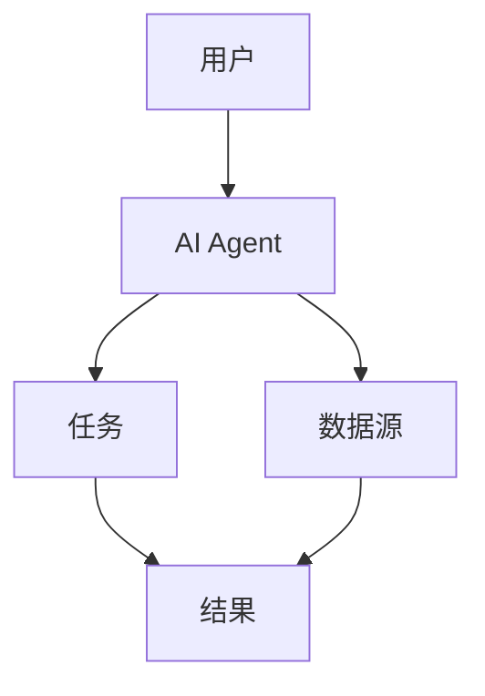
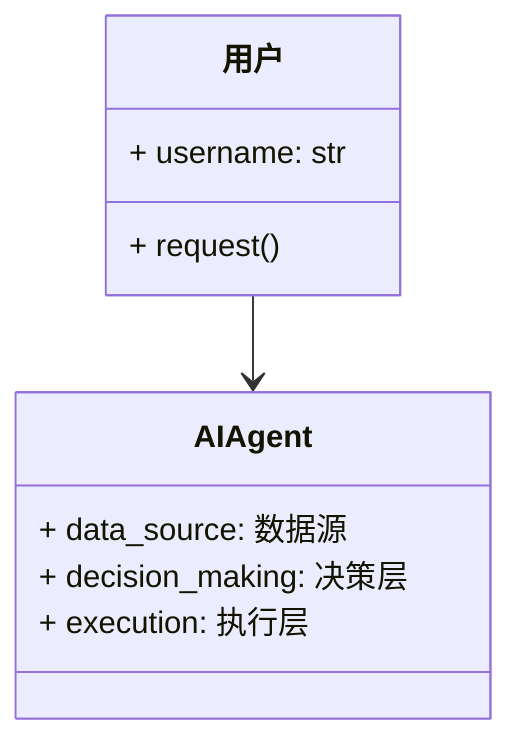
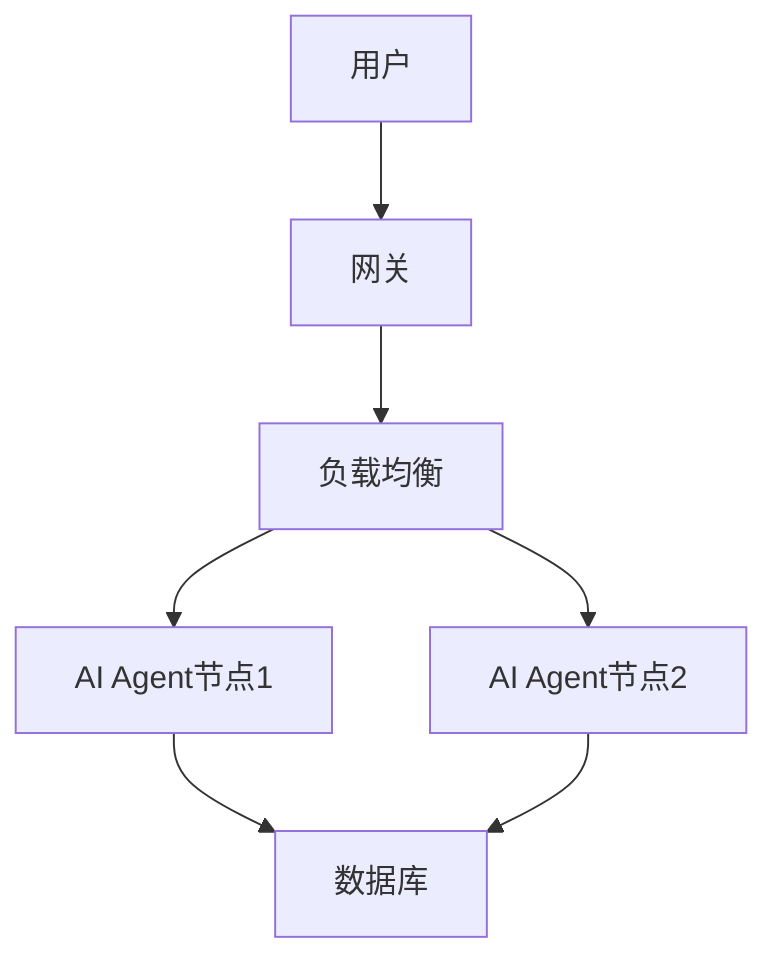

                 


# 企业级AI Agent的可扩展性设计

> 关键词：企业级AI Agent、可扩展性设计、负载均衡、分布式计算、系统架构、算法原理

> 摘要：企业级AI Agent的可扩展性设计是确保智能代理在企业环境中高效运行的关键。本文从核心概念、算法原理、系统架构到项目实战，详细探讨了如何设计和实现具备高扩展性的AI Agent系统，包括模块化设计、负载均衡和分布式计算等关键要素。

---

## 第一部分: 企业级AI Agent的概述

### 第1章: 企业级AI Agent的背景与概念

#### 1.1 问题背景
企业级AI Agent是在企业环境中运行的智能代理，用于处理复杂任务、优化流程和提升效率。随着企业数据量和用户需求的增加，系统的可扩展性变得至关重要。若不设计扩展性，系统可能在高负载下崩溃，影响业务运作。

#### 1.2 核心概念
AI Agent具备感知、决策和执行能力，能够自主处理任务。企业级AI Agent需支持大规模数据处理和多用户同时请求，这就要求系统能够在不降低性能的前提下，适应增长的需求。

#### 1.3 可扩展性需求
系统必须能够水平扩展，通过增加节点来处理更多请求，同时确保数据一致性。扩展性设计包括硬件资源分配、任务分发机制和容错机制，确保系统稳定性和高效性。

---

## 第二部分: 企业级AI Agent的核心概念与联系

### 第2章: 核心概念与联系

#### 2.1 核心概念原理
AI Agent通过感知层收集数据，决策层进行分析，执行层完成操作。每个层需独立设计，便于扩展。模块化设计允许各部分独立升级，不影响整体系统。

#### 2.2 概念属性对比
| 类型 | 特点 | 优点 | 缺点 |
|------|------|------|------|
| 基于规则 | 使用预定义规则 | 易实现 | 适应性差 |
| 基于模型 | 基于知识库推理 | 高准确性 | 资源消耗大 |
| 基于Q-Learning | 学习策略 | 自适应 | 需大量训练 |

#### 2.3 ER实体关系图


---

## 第三部分: 企业级AI Agent的算法原理

### 第3章: 算法原理

#### 3.1 负载均衡算法
负载均衡确保任务均匀分配，避免节点过载。常用算法包括轮询、加权轮询和随机分配。例如，使用Python实现的轮询算法：
```python
def load_balance(requests):
    nodes = ['node1', 'node2', 'node3']
    return nodes[requests % len(nodes)]
```

#### 3.2 分布式计算算法
分布式计算将任务分解到多个节点，利用并行处理提升效率。例如，MapReduce模型：
```python
def map(func, data):
    return [func(x) for x in data]

def reduce(func, data):
    return func(data)
```

#### 3.3 数学模型
扩展性评估涉及系统吞吐量C和响应时间T，公式如下：
$$ C = \frac{R}{T} $$
其中，R为请求速率，T为平均响应时间。通过优化T，提升C，确保系统可扩展。

---

## 第四部分: 企业级AI Agent的系统架构设计

### 第4章: 系统架构设计

#### 4.1 模块化设计
模块化设计允许各部分独立扩展。例如，感知层负责数据收集，决策层进行分析，执行层完成操作。类图如下：


#### 4.2 系统架构
整体架构采用分布式部署，节点间通过API通信。架构图如下：


#### 4.3 接口设计
API设计需明确输入输出格式，确保各模块高效交互。例如，使用RESTful API：
```json
{
    "action": "process_task",
    "data": {
        "id": 123,
        "params": {}
    }
}
```

---

## 第五部分: 企业级AI Agent的项目实战

### 第5章: 项目实战

#### 5.1 环境配置
使用Docker部署AI Agent，配置负载均衡。示例：
```bash
docker run -d --name agent1 ai-agent:latest
docker run -d --name agent2 ai-agent:latest
```

#### 5.2 核心实现
实现负载均衡的Python代码：
```python
import random

class LoadBalancer:
    def __init__(self, agents):
        self.agents = agents

    def select_agent(self):
        return random.choice(self.agents)
```

#### 5.3 实际案例
分析一个电商推荐系统的扩展性设计，展示如何通过分布式计算和负载均衡提升系统性能。

---

## 第六部分: 企业级AI Agent的最佳实践

### 第6章: 最佳实践

#### 6.1 关键点总结
- 模块化设计：确保各部分独立扩展。
- 负载均衡：均匀分配任务，避免节点过载。
- 分布式计算：利用并行处理提升性能。

#### 6.2 小贴士
- 定期监控系统性能，及时调整资源分配。
- 使用弹性伸缩，根据负载动态调整节点数量。

#### 6.3 注意事项
- 避免过度扩展，控制成本。
- 确保数据一致性，防止数据不一致问题。

#### 6.4 拓展阅读
推荐学习分布式系统设计和负载均衡算法，深入理解扩展性设计。

---

## 结语

企业级AI Agent的可扩展性设计是构建高效、稳定系统的基石。通过模块化设计、负载均衡和分布式计算，确保系统能够应对业务增长带来的挑战。希望本文为企业级AI Agent的设计者和开发者提供有价值的指导和启示。

