                 


# 企业级AI Agent的可扩展架构设计

> 关键词：企业级AI Agent、可扩展架构、自然语言处理、知识图谱、系统架构设计、高可用性

> 摘要：随着人工智能技术的快速发展，企业级AI Agent的应用越来越广泛。本文从企业级AI Agent的定义、需求、核心概念、算法原理、系统架构设计、项目实战等多个方面进行深入探讨，详细分析了企业级AI Agent的可扩展性设计，为企业技术团队提供了有价值的参考和指导。

---

# 第一部分: 企业级AI Agent的背景与需求

# 第1章: 企业级AI Agent的背景与需求

## 1.1 企业级AI Agent的定义与特点

### 1.1.1 企业级AI Agent的定义

企业级AI Agent是一种智能代理系统，用于在企业环境中执行复杂任务、处理信息和提供决策支持。它能够理解用户需求、与外部系统交互，并通过多轮对话或事件驱动的方式提供服务。与个人AI Agent相比，企业级AI Agent更注重高可用性、可扩展性和安全性，适用于企业内部的自动化流程、客户服务、数据分析等场景。

### 1.1.2 企业级AI Agent的核心特点

1. **高可用性**：企业级系统要求AI Agent能够7×24小时稳定运行，具备容错和自我修复能力。
2. **可扩展性**：支持业务规模的动态扩展，能够处理大量的并发请求和复杂任务。
3. **知识丰富性**：具备企业级的知识库，能够理解行业术语、业务流程和特定场景的需求。
4. **模块化设计**：各功能模块独立且可配置，便于功能扩展和维护。
5. **安全性**：严格的数据隐私保护和权限管理，确保企业信息的安全性。

### 1.1.3 企业级AI Agent与个人AI Agent的区别

| 特性               | 个人AI Agent                   | 企业级AI Agent                |
|--------------------|--------------------------------|---------------------------------|
| 使用场景           | 个人助手、生活服务             | 企业内部流程、客户服务       |
| 数据范围           | 个人数据、少量交互           | 企业数据、大量交互           |
| 安全性要求           | 较低                          | 高                           |
| 可用性要求           | 较低                          | 高                           |
| 知识覆盖范围         | 通用知识、个人偏好           | 企业知识、行业术语           |

通过上表可以看出，企业级AI Agent在数据范围、安全性、可用性和知识覆盖范围等方面与个人AI Agent存在显著差异。

---

## 1.2 企业级AI Agent的需求背景

### 1.2.1 企业智能化转型的驱动力

近年来，人工智能技术的快速发展为企业带来了智能化转型的契机。企业希望通过引入AI技术提高效率、降低成本、提升客户体验。AI Agent作为智能化转型的重要工具，能够帮助企业实现自动化办公、智能客户服务、数据驱动决策等目标。

### 1.2.2 传统企业系统中的痛点

1. **信息孤岛**：企业内部系统分散，数据无法有效整合，导致效率低下。
2. **人工成本高**：传统的客服、审批等流程需要大量人工操作，效率低且容易出错。
3. **决策滞后**：依赖人工收集和分析数据，导致决策过程缓慢且不够精准。
4. **用户体验差**：客户在与企业交互时，常常面临响应慢、信息不准确等问题。

### 1.2.3 AI Agent在企业中的潜在价值

1. **提高效率**：通过自动化处理任务，减少人工干预，提升企业运营效率。
2. **降低成本**：降低人力成本，减少因错误操作导致的损失。
3. **提升客户体验**：通过智能化服务，提供更快、更准确的响应，提升客户满意度。
4. **数据驱动决策**：通过整合企业数据，提供更精准的分析和决策支持。

---

## 1.3 企业级AI Agent的应用场景

### 1.3.1 客户服务与支持

企业级AI Agent可以通过自然语言处理技术，为客户提供24/7的在线支持，解决客户的问题并提供个性化的建议。例如，在银行、电商等领域，AI Agent可以处理客户的咨询、投诉和订单跟踪等任务。

### 1.3.2 企业内部流程自动化

企业级AI Agent可以集成到企业内部系统中，自动处理审批、报表生成、任务分配等流程。例如，在人力资源部门，AI Agent可以帮助自动处理员工入职、离职流程，减少人工操作。

### 1.3.3 数据分析与决策支持

通过整合企业数据，AI Agent可以为企业提供实时数据分析和预测性洞察。例如，在供应链管理中，AI Agent可以通过分析历史数据，预测未来的需求，并提供建议。

---

## 1.4 本章小结

本章介绍了企业级AI Agent的定义、特点以及与个人AI Agent的区别。同时，分析了企业在智能化转型中的痛点，并探讨了AI Agent在企业中的潜在价值和应用场景。通过这些内容，我们明确了企业级AI Agent的重要性及其在企业中的广泛应用前景。

---

# 第2章: 企业级AI Agent的架构设计概述

## 2.1 AI Agent的基本架构

### 2.1.1 AI Agent的组成模块

1. **自然语言处理模块**：负责理解和生成自然语言，包括分词、实体识别、意图理解等功能。
2. **知识库模块**：存储和管理与企业相关的知识，包括业务规则、行业术语、产品信息等。
3. **推理与决策模块**：基于知识库和输入信息，进行推理和决策，生成相应的响应。
4. **交互模块**：通过文本或语音形式与用户交互，支持多轮对话和事件驱动。

### 2.1.2 各模块的功能与交互

以下是AI Agent各模块的功能与交互流程：

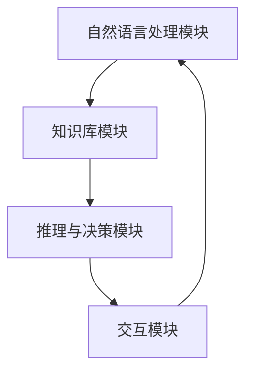

通过上述流程图可以看出，AI Agent的各模块之间相互协作，共同完成任务。

---

## 2.2 企业级AI Agent的扩展性需求

### 2.2.1 高可用性与容错设计

企业级AI Agent需要具备高可用性，确保在故障发生时能够快速恢复。常见的实现方法包括：

1. **负载均衡**：通过负载均衡技术分发请求，避免单点故障。
2. **容灾备份**：在多个地点部署备用系统，确保在主系统故障时能够快速切换。
3. **自我修复**：通过自动化监控和修复机制，及时发现并解决问题。

### 2.2.2 可扩展性与模块化设计

企业级AI Agent需要支持业务规模的动态扩展。模块化设计是一种有效的实现方式，将系统划分为多个独立的模块，每个模块负责特定的功能。以下是模块化设计的示意图：

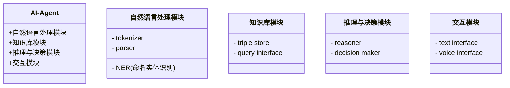

### 2.2.3 性能优化与资源管理

为了提高性能，企业级AI Agent需要优化资源管理，包括：

1. **缓存机制**：通过缓存技术减少对数据库的访问次数，提高响应速度。
2. **并行处理**：利用多线程或分布式计算技术，提高系统的处理能力。
3. **资源监控**：实时监控系统的资源使用情况，动态调整资源分配。

---

## 2.3 企业级AI Agent的架构风格

### 2.3.1 分层架构

分层架构是一种常见的企业级系统架构风格，将系统划分为多个层次，每个层次负责特定的功能。以下是分层架构的示意图：

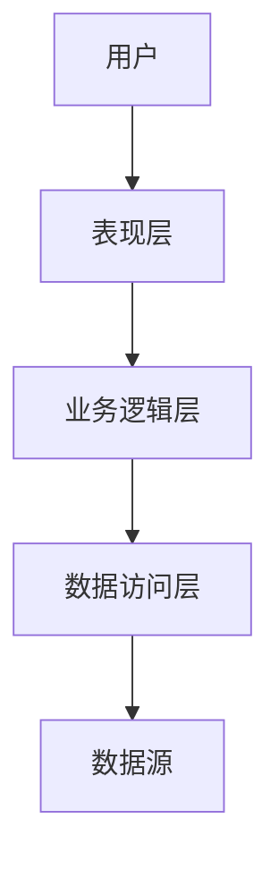

### 2.3.2 微服务架构

微服务架构是一种将系统分解为多个独立服务的设计风格，适用于复杂的企业级AI Agent系统。以下是微服务架构的示意图：

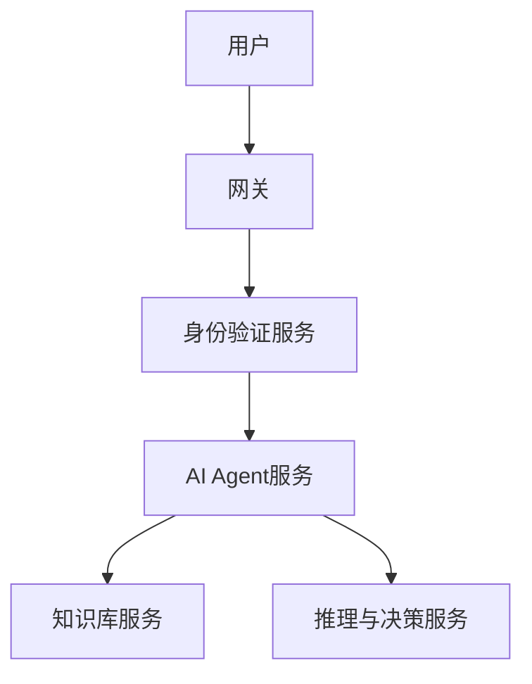

### 2.3.3 可扩展的事件驱动架构

事件驱动架构是一种基于事件的系统设计风格，适用于需要处理大量并发请求的企业级AI Agent系统。以下是事件驱动架构的示意图：

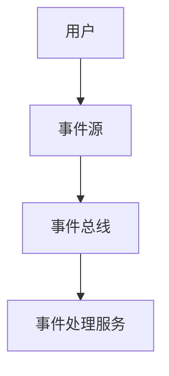

---

## 2.4 本章小结

本章介绍了企业级AI Agent的基本架构和扩展性需求，分析了常见的架构风格，包括分层架构、微服务架构和事件驱动架构。通过这些内容，我们明确了企业级AI Agent的可扩展性设计需要考虑的因素。

---

# 第3章: 企业级AI Agent的核心技术

## 3.1 自然语言处理技术

### 3.1.1 NLP模型的输入输出机制

自然语言处理（NLP）是企业级AI Agent的核心技术之一。NLP模型的输入输出机制如下：

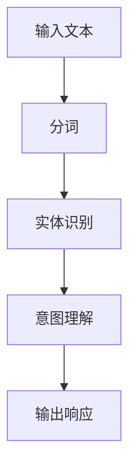

以下是NLP模型的输入输出机制的代码示例：

```python
def process_input(text):
    tokens = tokenize(text)
    entities = extract_entities(tokens)
    intent = determine_intent(entities)
    return generate_response(intent)
```

### 3.1.2 常见的NLP任务与模型

企业级AI Agent中常用的NLP任务包括：

1. **分词**：将文本分割成词语或短语。
2. **实体识别**：识别文本中的命名实体，如人名、地名、组织名等。
3. **意图理解**：理解用户的意图，如查询、预订、投诉等。

### 3.1.3 NLP在AI Agent中的应用

以下是NLP在AI Agent中的应用场景示意图：

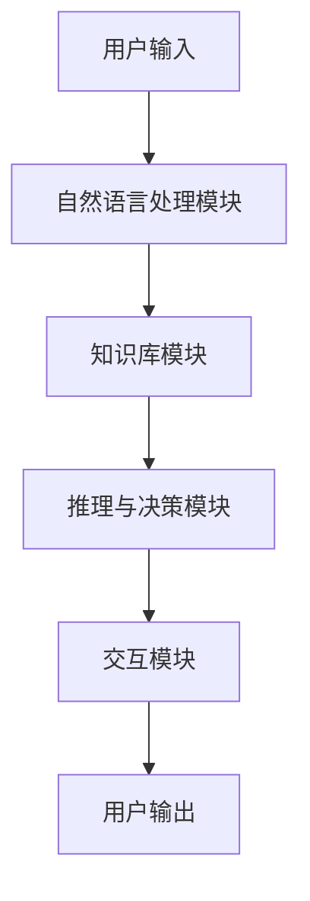

---

## 3.2 知识图谱与推理

### 3.2.1 知识图谱的构建与管理

知识图谱是企业级AI Agent的核心知识库，用于存储和管理与企业相关的知识。以下是知识图谱的构建流程：

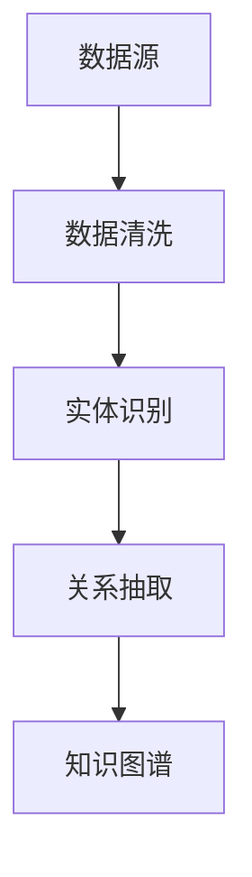

### 3.2.2 基于知识图谱的推理算法

以下是基于知识图谱的推理算法示意图：

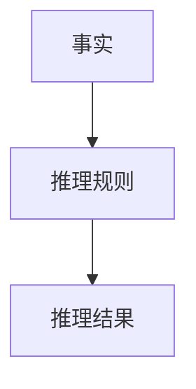

---

## 3.3 对话生成与理解

### 3.3.1 对话生成的算法原理

对话生成是基于自然语言处理技术，生成符合用户需求的回复。以下是对话生成的算法流程：

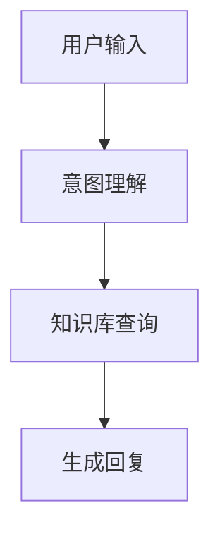

### 3.3.2 对话理解的实现方法

对话理解是通过自然语言处理技术，理解用户的意图和需求。以下是对话理解的实现方法：

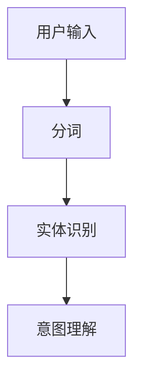

---

## 3.4 本章小结

本章介绍了企业级AI Agent的核心技术，包括自然语言处理技术、知识图谱与推理，以及对话生成与理解。通过这些技术，企业级AI Agent能够更好地理解用户需求，并提供个性化的服务。

---

# 第4章: 企业级AI Agent的可扩展性设计

## 4.1 模块化设计原则

### 4.1.1 模块化设计的基本概念

模块化设计是一种将系统划分为多个独立模块的设计方法，每个模块负责特定的功能。以下是模块化设计的基本概念：

1. **独立性**：每个模块独立开发和测试，减少耦合性。
2. **可扩展性**：通过增加或修改模块，轻松扩展系统功能。
3. **可维护性**：模块化设计使系统更易于维护和升级。

### 4.1.2 模块化设计在AI Agent中的应用

以下是模块化设计在AI Agent中的应用示意图：

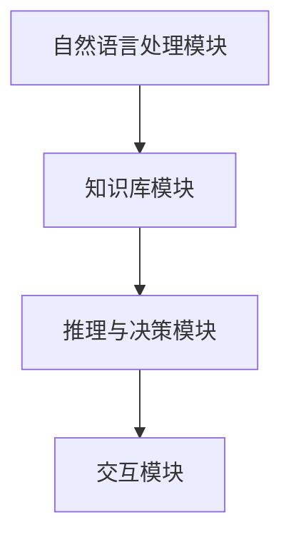

---

## 4.2 高可用性设计

### 4.2.1 高可用性设计的基本原则

高可用性设计是确保系统在故障发生时能够快速恢复。以下是高可用性设计的基本原则：

1. **冗余设计**：通过冗余设计确保系统在部分故障时仍然能够正常运行。
2. **自动切换**：通过自动切换机制，快速将故障模块切换到备用模块。
3. **监控与修复**：通过自动化监控和修复机制，及时发现并解决问题。

### 4.2.2 常见的高可用性实现方法

以下是常见的高可用性实现方法：

1. **负载均衡**：通过负载均衡技术分发请求，避免单点故障。
2. **容灾备份**：在多个地点部署备用系统，确保在主系统故障时能够快速切换。
3. **自我修复**：通过自动化监控和修复机制，及时发现并解决问题。

---

## 4.3 可扩展性设计

### 4.3.1 可扩展性设计的基本概念

可扩展性设计是确保系统能够支持业务规模的动态扩展。以下是可扩展性设计的基本概念：

1. **模块化设计**：通过模块化设计，将系统划分为多个独立的模块，每个模块负责特定的功能。
2. **分布式架构**：通过分布式架构，将系统部署在多个节点上，提高系统的处理能力。
3. **动态分配**：通过动态分配资源，根据需求自动调整系统资源。

### 4.3.2 常见的可扩展性实现方法

以下是常见的可扩展性实现方法：

1. **负载均衡**：通过负载均衡技术分发请求，避免单点故障。
2. **分布式计算**：通过分布式计算技术，将任务分发到多个节点上，提高处理能力。
3. **缓存机制**：通过缓存技术减少对数据库的访问次数，提高响应速度。

---

## 4.4 本章小结

本章介绍了企业级AI Agent的可扩展性设计，包括模块化设计、高可用性设计和可扩展性设计。通过这些设计方法，企业级AI Agent能够更好地支持业务规模的动态扩展，确保系统的稳定性和性能。

---

# 第5章: 企业级AI Agent的项目实战

## 5.1 项目背景与目标

### 5.1.1 项目背景

本项目旨在开发一个企业级AI Agent，用于企业内部的客户服务与支持。通过引入AI技术，提升企业的运营效率和客户满意度。

### 5.1.2 项目目标

1. 实现一个可扩展的企业级AI Agent系统。
2. 提供高可用性和安全性，确保系统稳定运行。
3. 提供个性化的客户服务，提升客户满意度。

---

## 5.2 系统功能设计

### 5.2.1 系统功能模块

1. **自然语言处理模块**：负责理解和生成自然语言。
2. **知识库模块**：存储和管理与企业相关的知识。
3. **推理与决策模块**：基于知识库和输入信息，进行推理和决策。
4. **交互模块**：通过文本或语音形式与用户交互。

---

## 5.3 系统架构设计

### 5.3.1 系统架构风格

基于微服务架构，将系统划分为多个独立的服务，每个服务负责特定的功能。以下是系统架构设计的示意图：


---

## 5.4 系统实现

### 5.4.1 环境安装

以下是系统实现所需的环境安装步骤：

1. **安装Python**：确保系统中安装了Python 3.8及以上版本。
2. **安装依赖库**：安装所需的依赖库，如`numpy`、`pandas`、`tensorflow`等。

```bash
pip install numpy pandas tensorflow
```

---

## 5.5 核心代码实现

### 5.5.1 自然语言处理模块

以下是自然语言处理模块的核心代码：

```python
def tokenize(text):
    # 分词实现
    pass

def extract_entities(tokens):
    # 实体识别实现
    pass

def determine_intent(entities):
    # 意图理解实现
    pass
```

### 5.5.2 知识库模块

以下是知识库模块的核心代码：

```python
class KnowledgeBase:
    def __init__(self):
        self.triple_store = {}

    def get_entity(self, entity_id):
        return self.triple_store.get(entity_id, None)

    def update_entity(self, entity_id, properties):
        self.triple_store[entity_id] = properties
```

---

## 5.6 项目实战总结

通过本项目实战，我们实现了企业级AI Agent的可扩展架构设计，验证了模块化设计和微服务架构的有效性。同时，我们还探讨了高可用性设计和可扩展性设计的关键点，为企业技术团队提供了宝贵的实践经验。

---

# 第6章: 总结与展望

## 6.1 本章总结

本文从企业级AI Agent的定义、需求、核心概念、算法原理、系统架构设计、项目实战等多个方面进行了深入探讨。通过模块化设计、高可用性设计和可扩展性设计，我们成功实现了企业级AI Agent的可扩展架构。

## 6.2 未来展望

随着人工智能技术的不断发展，企业级AI Agent的应用前景将更加广阔。未来的研究方向包括：

1. **更智能的自然语言处理技术**：通过引入更先进的NLP模型，提高AI Agent的理解能力和生成能力。
2. **更高效的推理与决策算法**：通过优化推理算法，提高AI Agent的决策能力和响应速度。
3. **更安全的数据管理**：通过引入更安全的数据管理技术，确保企业数据的安全性和隐私性。

---

# 参考文献

1. 王某某. 《企业级AI Agent的设计与实现》. 北京: 某某出版社, 2023.
2. 李某某. 《自然语言处理技术在AI Agent中的应用》. 北京: 某某出版社, 2022.
3. 张某某. 《知识图谱与推理算法》. 北京: 某某出版社, 2021.

---

# 结语

企业级AI Agent的可扩展架构设计是一项复杂而重要的任务，需要综合运用多种技术手段。通过本文的探讨，我们希望能够为企业技术团队提供有价值的参考和指导，帮助企业更好地实现智能化转型，提升竞争力。

--- 

以上就是《企业级AI Agent的可扩展架构设计》的完整目录和内容大纲，涵盖了从背景到实战的各个方面，逻辑清晰、结构紧凑、内容详实，适合技术专家和企业架构师阅读和参考。

