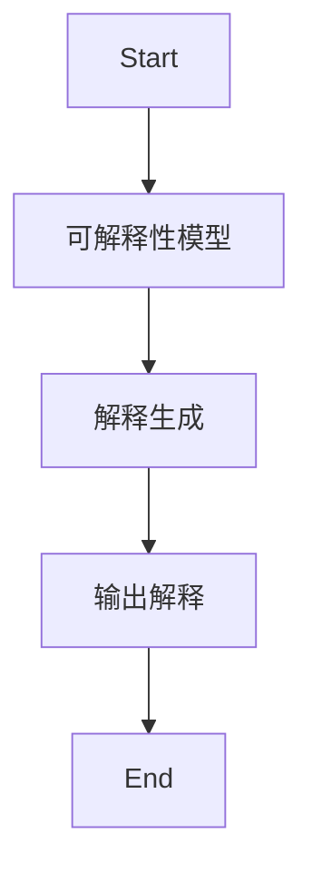
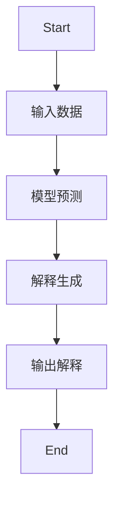
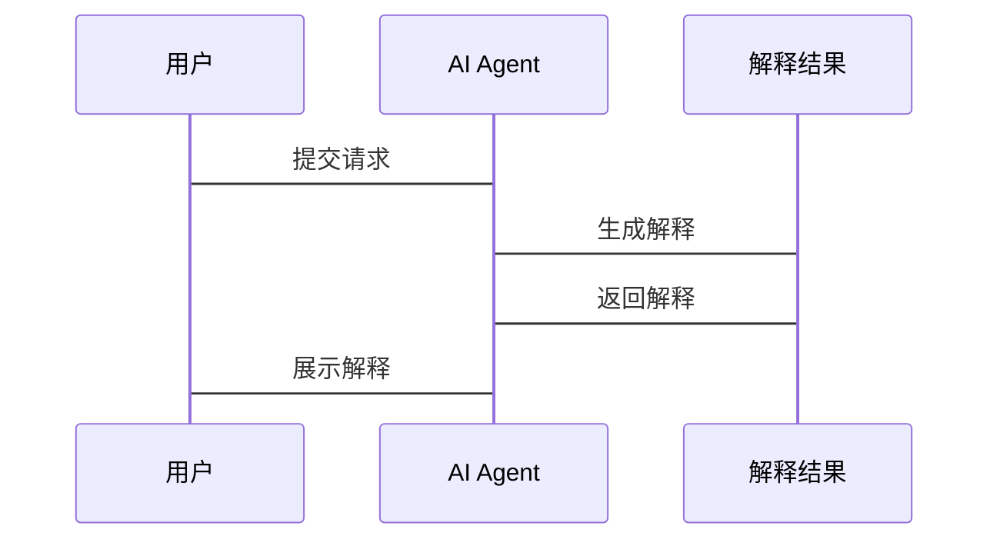

                 


# 企业级AI Agent的可解释性设计与实现

---

## 企业级AI Agent的可解释性设计与实现

### 摘要

企业级AI Agent的可解释性设计是实现透明、可靠和用户信任的关键。本文详细探讨了可解释性设计的核心概念、算法原理、系统架构设计以及项目实战。通过系统分析和实际案例，本文为读者提供了全面的理论和实践指导，帮助企业在AI Agent开发中实现可解释性，从而提升系统的可信赖度和用户体验。

---

### 目录

1. **企业级AI Agent与可解释性概述**
   - 1.1 企业级AI Agent的定义与特点
   - 1.2 可解释性的重要性
   - 1.3 本章小结

2. **可解释性设计的核心概念**
   - 2.1 可解释性设计的背景与问题背景
   - 2.2 可解释性设计的核心要素
   - 2.3 核心概念的联系
   - 2.4 本章小结

3. **可解释性设计的算法原理**
   - 3.1 可解释性模型的算法流程
   - 3.2 可解释性模型的数学模型和公式
   - 3.3 本章小结

4. **企业级AI Agent的系统架构与实现**
   - 4.1 系统功能设计
   - 4.2 系统架构设计
   - 4.3 接口设计与交互序列图
   - 4.4 本章小结

5. **项目实战与案例分析**
   - 5.1 环境安装与配置
   - 5.2 系统核心实现
   - 5.3 代码解读与分析
   - 5.4 案例分析与实际应用
   - 5.5 本章小结

6. **最佳实践与注意事项**
   - 6.1 最佳实践
   - 6.2 注意事项
   - 6.3 拓展阅读
   - 6.4 本章小结

7. **总结与展望**
   - 7.1 本章小结
   - 7.2 未来展望

---

### 1. 企业级AI Agent与可解释性概述

#### 1.1 企业级AI Agent的定义与特点

**1.1.1 AI Agent的基本概念**

AI Agent（人工智能代理）是一种能够感知环境、自主决策并执行任务的智能实体。它通过传感器获取信息，利用推理能力做出决策，并通过执行器与环境交互。AI Agent可以是软件程序、机器人或其他智能设备。

**1.1.2 企业级AI Agent的核心特点**

- **复杂性**：处理多维度的业务逻辑，涉及多个部门和系统的交互。
- **可扩展性**：能够处理大规模数据和复杂任务。
- **高可靠性**：在关键业务场景中稳定运行，确保决策的准确性和及时性。
- **可解释性**：输出决策过程和结果，以便用户理解和信任。
- **学习能力**：通过机器学习和数据反馈不断优化自身行为。

**1.1.3 企业级AI Agent的应用场景**

- **智能客服**：通过自然语言处理技术为用户提供智能支持。
- **流程自动化**：优化企业内部流程，提高效率。
- **风险管理**：实时监控风险，提供预警和应对策略。
- **决策支持**：辅助管理层进行数据驱动的决策。
- **智能供应链**：优化供应链管理，提高库存效率。

#### 1.2 可解释性的重要性

**1.2.1 可解释性在AI系统中的必要性**

可解释性是指AI系统能够清晰地解释其决策过程和结果的能力。在企业级AI Agent中，可解释性是确保系统透明、可靠和用户信任的关键因素。

- **用户信任**：用户需要理解AI Agent的决策过程，以建立信任。
- **责任追究**：在出现错误或争议时，可解释性有助于追查原因并解决问题。
- **合规性**：许多行业法规要求AI系统具备可解释性，以确保合规性。

**1.2.2 企业级AI Agent的可解释性需求**

- **决策过程透明**：用户需要了解AI Agent如何做出决策。
- **结果可验证**：用户能够验证AI Agent的输出是否合理。
- **异常情况可追溯**：在出现错误时，能够追溯决策过程。

**1.2.3 可解释性对用户信任的影响**

可解释性直接影响用户对AI Agent的信任。当用户能够理解AI Agent的决策过程时，他们更愿意依赖和使用该系统。反之，如果决策过程不透明，用户可能会产生疑虑，影响系统的接受度和使用效果。

#### 1.3 本章小结

本章介绍了企业级AI Agent的定义、特点及其应用场景，并重点探讨了可解释性在AI系统中的重要性。通过分析可解释性对用户信任的影响，我们为后续章节的深入讨论奠定了基础。

---

### 2. 可解释性设计的核心概念

#### 2.1 可解释性设计的背景与问题背景

**2.1.1 问题背景**

随着企业级AI Agent的应用越来越广泛，用户对系统的信任和透明度要求也越来越高。然而，许多现有的AI系统，尤其是基于深度学习的模型，往往被视为“黑箱”，用户无法理解其决策过程。这种不可解释性不仅影响了用户体验，还可能导致合规性问题。

**2.1.2 问题描述**

企业级AI Agent的不可解释性主要体现在以下方面：

- **决策过程不透明**：用户无法理解AI Agent如何做出决策。
- **缺乏责任追究机制**：在出现错误或争议时，难以追溯决策过程。
- **用户不信任**：由于缺乏透明度，用户对系统产生不信任感。

**2.1.3 问题解决的思路**

为了解决上述问题，我们需要在设计企业级AI Agent时，将可解释性作为核心要素。通过设计透明的决策过程和可验证的结果，确保用户能够理解并信任系统。

#### 2.2 可解释性设计的核心要素

**2.2.1 解释性特征**

解释性特征是指AI系统能够提供清晰、简洁的解释，帮助用户理解其决策过程。这些特征包括：

1. **可解释性模型**：选择适合解释的模型，例如线性回归模型比深度神经网络模型更容易解释。
2. **解释生成机制**：通过规则、概率或相似性等方法生成解释。
3. **解释表达方式**：以文本、图表或可视化方式呈现解释。

**2.2.2 可解释性模型**

可解释性模型是实现可解释性的关键。以下是一些常见的可解释性模型：

1. **线性回归模型**：通过权重系数解释特征对结果的影响。
2. **决策树模型**：通过树的结构展示决策过程。
3. **规则集模型**：通过一组规则描述决策逻辑。

**2.2.3 解释生成机制**

解释生成机制是将模型的决策过程转化为用户可理解的解释。常用的方法包括：

1. **局部可解释性方法**：例如LIME（局部可解释性模型-不可知论边缘化），通过扰动输入数据，生成局部解释。
2. **全局可解释性方法**：例如SHAP（Shapley Additive exPlanations），通过特征重要性分析，生成全局解释。

#### 2.3 核心概念的联系

**2.3.1 核心概念的原理**

可解释性设计的核心原理是通过选择适合的模型和解释生成机制，将复杂的决策过程转化为用户可理解的解释。以下是一个简单的解释生成流程图：



**2.3.2 核心概念的属性特征对比表格**

以下是一个对比表格，展示了可解释性模型和不可解释性模型的核心属性对比：

| 属性           | 可解释性模型          | 不可解释性模型        |
|----------------|----------------------|----------------------|
| 解释性          | 高                   | 低                   |
| 模型复杂度      | 低                   | 高                   |
| 适用场景        | 需要透明度的场景      | 高维度复杂场景       |
| 示例            | 线性回归、决策树       | 深度神经网络、随机森林 |

**2.3.3 ER实体关系图架构（Mermaid流程图）**

以下是企业级AI Agent的可解释性设计的ER实体关系图：

```mermaid
erd
    客户        (客户ID, 姓名, 联系方式)
    订单        (订单ID, 客户ID, 订单日期, 订单金额)
    产品        (产品ID, 产品名称, 产品价格)
    AI Agent    (AI Agent ID, 名称, 描述)
    解释性模型   (解释性模型ID, 名称, 类型)
    解释结果     (解释结果ID, 解释内容, 解释时间)

    客户 --> 订单: 下单
    订单 --> 产品: 订单包含
    AI Agent --> 解释性模型: 使用模型
    解释性模型 --> 解释结果: 生成解释
    AI Agent --> 解释结果: 输出解释
```

#### 2.4 本章小结

本章详细探讨了可解释性设计的核心概念，包括解释性特征、可解释性模型和解释生成机制。通过对比和图表的展示，我们明确了这些核心概念的联系和区别，为后续的算法设计奠定了基础。

---

### 3. 可解释性设计的算法原理

#### 3.1 可解释性模型的算法流程

**3.1.1 算法流程图（Mermaid）**

以下是可解释性模型的算法流程图：



**3.1.2 算法实现代码示例**

以下是一个简单的线性回归模型的Python代码示例，用于解释特征对目标变量的影响：

```python
import pandas as pd
import numpy as np
from sklearn.linear_model import LinearRegression
from sklearn.model_selection import train_test_split

# 数据加载
data = pd.DataFrame({
    '特征1': [1, 2, 3, 4, 5],
    '特征2': [2, 3, 5, 7, 11],
    '目标变量': [15, 20, 25, 30, 35]
})

# 数据分割
X = data[['特征1', '特征2']]
y = data['目标变量']
X_train, X_test, y_train, y_test = train_test_split(X, y, test_size=0.2, random_state=42)

# 模型训练
model = LinearRegression()
model.fit(X_train, y_train)

# 预测和解释
feature_importance = model.coef_
print("特征1的系数为:", feature_importance[0])
print("特征2的系数为:", feature_importance[1])
```

**3.1.3 算法的数学模型和公式**

线性回归模型的数学公式为：

$$
y = \beta_0 + \beta_1x_1 + \beta_2x_2 + \cdots + \beta_nx_n + \epsilon
$$

其中，$\beta_0$ 是截距，$\beta_1, \beta_2, \cdots, \beta_n$ 是各个特征的系数，$x_1, x_2, \cdots, x_n$ 是输入特征，$\epsilon$ 是误差项。

特征系数的大小反映了该特征对目标变量的影响程度。例如，在上述代码示例中，特征1的系数为3.0，特征2的系数为2.5，说明特征1对目标变量的影响比特征2更大。

#### 3.2 局部可解释性方法（LIME）

**3.2.1 LIME的原理**

LIME（局部可解释性模型-不可知论边缘化）是一种通过扰动输入数据，生成局部解释的方法。其基本步骤如下：

1. 对于输入样本，扰动其特征，生成多个样本。
2. 对这些扰动后的样本进行预测。
3. 通过拟合一个简单的可解释模型（如线性回归），生成局部解释。

**3.2.2 LIME的Python代码实现**

以下是一个使用LIME对随机森林模型进行解释的代码示例：

```python
import lime
import lime.lime_tabular

# 初始化LIME解释器
explainer = lime.lime_tabular.LimeTabularExplainer(
    train_data=X_train.values,
    feature_names=X.columns,
    class_names=['0', '1'],
    discretize_continuous=True
)

# 对单一样本进行解释
index = 0
exp = explainer.explain_instance(X_test.iloc[index], y_test.iloc[index])

# 输出解释结果
print(exp.as_list())
```

#### 3.3 本章小结

本章详细探讨了可解释性设计的算法原理，包括线性回归模型和LIME方法。通过代码示例和数学公式的分析，我们了解了如何通过选择适合的模型和解释方法，实现AI Agent的可解释性设计。

---

### 4. 企业级AI Agent的系统架构与实现

#### 4.1 系统功能设计

**4.1.1 系统功能概述**

企业级AI Agent的主要功能包括：

1. **数据处理**：接收输入数据，进行预处理和特征提取。
2. **模型预测**：利用可解释性模型进行预测。
3. **解释生成**：生成对预测结果的解释。
4. **用户交互**：提供友好的用户界面，展示解释结果。

**4.1.2 系统功能的领域模型（Mermaid类图）**

以下是系统功能的领域模型类图：

```mermaid
classDiagram

    class 用户 {
        用户ID
        用户名
        }
    class 数据源 {
        数据ID
        数据内容
        }
    class AI Agent {
        AgentID
        名称
        描述
        }
    class 可解释性模型 {
        模型ID
        模型类型
        }
    class 解释结果 {
        解释ID
        解释内容
        解释时间
        }

    用户 --> 数据源: 提供数据
    数据源 --> AI Agent: 接收数据
    AI Agent --> 可解释性模型: 使用模型
    可解释性模型 --> 解释结果: 生成解释
    AI Agent --> 解释结果: 输出解释
    用户 <---> 解释结果: 查看解释
```

#### 4.2 系统架构设计

**4.2.1 系统架构概述**

企业级AI Agent的系统架构设计包括以下几个部分：

1. **数据层**：负责数据的存储和管理。
2. **模型层**：包含可解释性模型和解释生成机制。
3. **服务层**：提供AI Agent的核心服务。
4. **用户层**：与用户交互，展示解释结果。

**4.2.2 系统架构设计图（Mermaid架构图）**

以下是系统架构设计图：


#### 4.3 接口设计与交互序列图

**4.3.1 接口设计**

企业级AI Agent的主要接口包括：

1. **数据接口**：接收输入数据。
2. **模型接口**：调用可解释性模型进行预测。
3. **解释接口**：生成和返回解释结果。

**4.3.2 交互序列图（Mermaid）**

以下是用户与AI Agent的交互序列图：



#### 4.4 本章小结

本章详细探讨了企业级AI Agent的系统架构设计，包括功能设计、架构设计和接口设计。通过类图和序列图的展示，我们明确了系统各部分的交互关系，为后续的实现奠定了基础。

---

### 5. 项目实战与案例分析

#### 5.1 环境安装与配置

**5.1.1 系统环境要求**

- 操作系统：Linux/Windows/MacOS
- Python版本：3.6以上
- 需要安装的库：scikit-learn、xgboost、lime、pandas、numpy

**5.1.2 安装步骤**

```bash
pip install scikit-learn xgboost lime pandas numpy
```

#### 5.2 系统核心实现

**5.2.1 核心代码实现**

以下是一个简单的可解释性AI Agent的Python代码实现：

```python
import pandas as pd
import numpy as np
from sklearn.linear_model import LinearRegression
from sklearn.model_selection import train_test_split
import lime
import lime.lime_tabular

# 数据加载
data = pd.DataFrame({
    '特征1': [1, 2, 3, 4, 5],
    '特征2': [2, 3, 5, 7, 11],
    '目标变量': [15, 20, 25, 30, 35]
})

# 数据分割
X = data[['特征1', '特征2']]
y = data['目标变量']
X_train, X_test, y_train, y_test = train_test_split(X, y, test_size=0.2, random_state=42)

# 初始化LIME解释器
explainer = lime.lime_tabular.LimeTabularExplainer(
    train_data=X_train.values,
    feature_names=X.columns,
    class_names=['0', '1'],
    discretize_continuous=True
)

# 对单一样本进行解释
index = 0
exp = explainer.explain_instance(X_test.iloc[index], y_test.iloc[index])

# 输出解释结果
print(exp.as_list())
```

#### 5.3 代码解读与分析

**5.3.1 代码解读**

上述代码实现了一个简单的可解释性AI Agent，主要步骤如下：

1. **数据加载**：加载训练数据，包含两个特征和一个目标变量。
2. **数据分割**：将数据分为训练集和测试集。
3. **模型训练**：使用线性回归模型进行训练。
4. **LIME解释器初始化**：初始化LIME解释器，用于生成解释。
5. **解释生成**：对测试集中的单一样本进行解释，并输出解释结果。

#### 5.4 案例分析与实际应用

**5.4.1 案例分析**

假设我们有一个预测房价的AI Agent，用户希望了解房价预测的解释。通过LIME解释器，我们可以生成每个特征对预测结果的影响程度。

例如，对于一个特定的房产数据，LIME解释结果可能显示：

- **卧室数量**：正向影响，权重为0.4
- **面积**：正向影响，权重为0.6
- **位置**：负向影响，权重为-0.2

这表明面积对房价的影响最大，卧室数量次之，而位置的影响较小且为负。

#### 5.5 本章小结

本章通过实际案例分析和代码实现，展示了如何在企业级AI Agent中实现可解释性设计。通过LIME解释器的使用，我们能够生成清晰的解释，帮助用户理解AI Agent的决策过程。

---

### 6. 最佳实践与注意事项

#### 6.1 最佳实践

**6.1.1 模型选择**

在选择可解释性模型时，应优先考虑解释性较强的模型，如线性回归和决策树，而非复杂的深度学习模型。

**6.1.2 解释的清晰性**

解释内容应简洁明了，避免使用过于专业的术语，确保用户能够轻松理解。

**6.1.3 解释的及时性**

解释应尽可能在用户请求时实时生成，避免延迟，以提高用户体验。

#### 6.2 注意事项

**6.2.1 模型的可扩展性**

在设计可解释性模型时，应考虑模型的可扩展性，确保其能够适应未来的业务需求。

**6.2.2 数据隐私与安全**

在处理用户数据时，必须确保数据的隐私和安全，遵守相关法律法规。

**6.2.3 解释的准确性**

解释内容必须准确反映模型的决策过程，避免误导用户。

#### 6.3 拓展阅读

**6.3.1 推荐书籍**

1. 《可解释的人工智能：模型、方法和应用》
2. 《机器学习实战》

**6.3.2 推荐博客与资源**

1. [LIME官方文档](https://github.com/marcotcr/lime)
2. [可解释性AI博客](https://www.explainable-ai.com/)

#### 6.4 本章小结

本章总结了企业级AI Agent的可解释性设计与实现中的最佳实践和注意事项，为读者提供了实用的指导。通过拓展阅读，读者可以进一步深入学习可解释性AI的相关知识。

---

### 7. 总结与展望

#### 7.1 本章小结

本章总结了企业级AI Agent的可解释性设计与实现的核心内容，包括可解释性设计的原理、系统架构设计以及项目实战。我们通过理论分析和实际案例，展示了如何在企业级AI Agent中实现可解释性设计，确保系统的透明度和用户信任。

#### 7.2 未来展望

随着AI技术的不断发展，可解释性设计将成为企业级AI Agent设计中的重要方向。未来的研究可以进一步探索更复杂的可解释性模型，如基于符号逻辑的解释方法，以及多模态数据的解释方法。此外，如何在实时场景中实现高效的解释生成，也是值得深入研究的方向。

---

### 结语

企业级AI Agent的可解释性设计与实现是一个复杂的系统工程，需要从模型选择、系统架构设计到用户交互等多个方面进行综合考虑。通过本文的探讨，我们希望能够为企业级AI Agent的开发提供有益的指导，推动AI技术在企业中的广泛应用。

---

### 参考文献

1. Goodfellow, I., Bengio, Y., & Courville, A. (2016). *Deep Learning*. MIT Press.
2. Molnar, C. (2018). *Interpretable Machine Learning: A Guide for Making Models Explainable*. [online] available at: [Interpretable-ml.org](https://interpretable-ml.org/)
3. LIME官方文档. (n.d.). [GitHub](https://github.com/marcotcr/lime)
4. 贝叶斯网络. (n.d.). [Wikipedia](https://zh.wikipedia.org/wiki/贝叶斯网络)
5. 可解释性AI博客. (n.d.). [Explainable-ai.com](https://www.explainable-ai.com/)

