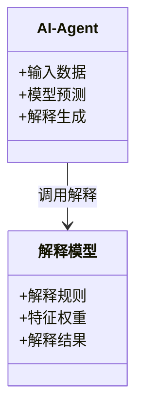
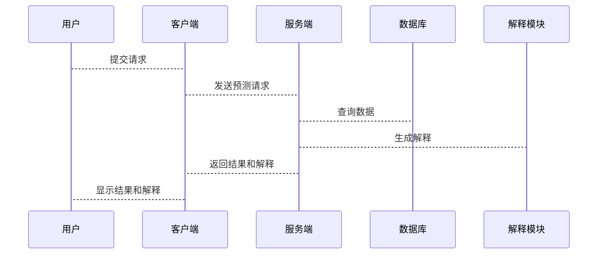

                 


# 企业级AI Agent的可解释性设计：增强决策透明度

## 关键词：企业级AI Agent，可解释性设计，决策透明度，LIME，SHAP，AI解释性算法，系统架构设计

## 摘要：本文深入探讨了企业级AI Agent的可解释性设计，重点分析了如何通过可解释性算法增强决策透明度。文章从AI Agent的基本概念出发，详细阐述了可解释性设计的核心原理、算法实现、系统架构设计以及项目实战，最后总结了最佳实践和未来发展方向。

---

# 第5章: 可解释性设计的系统分析与架构设计

## 5.1 问题场景介绍
### 5.1.1 企业级AI Agent的应用场景
### 5.1.2 可解释性设计的目标与范围

## 5.2 项目介绍
### 5.2.1 项目背景
### 5.2.2 项目目标
### 5.2.3 项目范围与约束

## 5.3 系统功能设计
### 5.3.1 领域模型设计


### 5.3.2 功能模块划分
- 数据预处理模块
- 模型训练模块
- 解释生成模块
- 交互界面模块

## 5.4 系统架构设计
### 5.4.1 系统架构图


### 5.4.2 关键模块设计
- 数据预处理模块：负责数据清洗、特征提取
- 模型训练模块：使用可解释性算法训练模型
- 解释生成模块：生成模型的解释文本
- 交互界面模块：展示预测结果和解释

## 5.5 系统接口设计
### 5.5.1 接口描述
- API接口：提供模型预测和解释生成服务
- 数据接口：定义数据格式和交互协议

## 5.6 系统交互设计
### 5.6.1 交互流程图


## 5.7 本章小结

---

# 第6章: 可解释性设计的项目实战

## 6.1 环境安装与配置
### 6.1.1 安装Python
### 6.1.2 安装依赖库
```bash
pip install lime shap pandas numpy scikit-learn
```

## 6.2 系统核心实现
### 6.2.1 数据预处理
```python
import pandas as pd
import numpy as np

# 加载数据
data = pd.read_csv('data.csv')

# 数据清洗
data.dropna(inplace=True)
```

### 6.2.2 模型训练
```python
from sklearn.ensemble import RandomForestClassifier

model = RandomForestClassifier()
model.fit(X_train, y_train)
```

### 6.2.3 解释生成
```python
import lime
from lime import lime_explanations

def generate_explanation(model, X):
    explainer = lime_explanations.Explainer()
    explanation = explainer.explain_instance(
        model, 
        X.iloc[0],
        num_samples=100
    )
    return explanation
```

## 6.3 代码实现与解读
### 6.3.1 LIME解释器实现
```python
import lime
from lime import lime_explanations

def explain_model(model, X):
    explainer = lime_explanations.Explainer()
    explanation = explainer.explain_instance(
        model,
        X.iloc[0],
        num_samples=100
    )
    return explanation.as_list()
```

### 6.3.2 SHAP值计算
```python
import shap

def calculate_shap_values(model, X):
    explainer = shap.TreeExplainer(model)
    shap_values = explainer.shap_values(X)
    return shap_values
```

## 6.4 实际案例分析
### 6.4.1 案例背景
### 6.4.2 数据分析
### 6.4.3 解释结果解读
- 特征重要性排序
- 单个样本的解释
- 整体解释的统计分析

## 6.5 项目总结与优化建议
### 6.5.1 项目成果
### 6.5.2 项目优化点
### 6.5.3 项目经验总结

## 6.6 本章小结

---

# 第7章: 可解释性设计的最佳实践与未来展望

## 7.1 最佳实践
### 7.1.1 设计阶段
- 明确需求
- 设计可解释性模块
- 选择合适的解释性算法

### 7.1.2 实现阶段
- 数据预处理
- 模型选择
- 解释生成

### 7.1.3 测试阶段
- 解释性测试
- 用户反馈
- 性能优化

## 7.2 小结
### 7.2.1 核心要点回顾
### 7.2.2 未来发展方向
- 更高效的解释性算法
- 更智能的解释生成方法
- 更人性化的交互界面

## 7.3 注意事项
### 7.3.1 模型选择的注意事项
### 7.3.2 解释性算法的适用场景
### 7.3.3 系统设计的常见误区

## 7.4 拓展阅读
### 7.4.1 推荐书籍
### 7.4.2 推荐论文
### 7.4.3 推荐工具

---

# 附录

## 附录A: 常见问题解答
### 1. 可解释性设计的核心目标是什么？
### 2. 如何选择适合的解释性算法？
### 3. 企业级AI Agent的可解释性设计有哪些挑战？

## 附录B: 参考文献
### 1. LIME官方文档
### 2. SHAP官方文档
### 3. 相关技术论文

## 附录C: 代码示例
```python
# 附录C中的代码示例
```

---

# 结语

企业级AI Agent的可解释性设计是实现决策透明化的关键。通过本文的详细讲解，读者可以系统地理解可解释性设计的核心原理、算法实现、系统架构设计以及项目实战。未来，随着技术的发展，可解释性设计将更加重要，也将为企业级AI Agent的应用带来更广泛的可能性。

