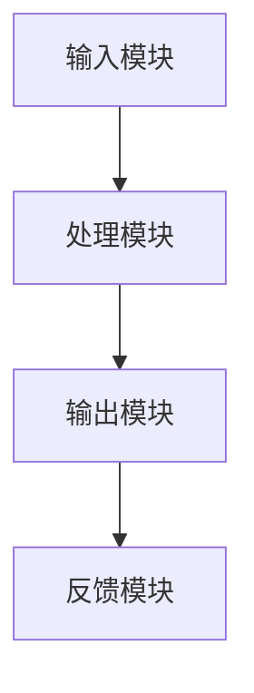
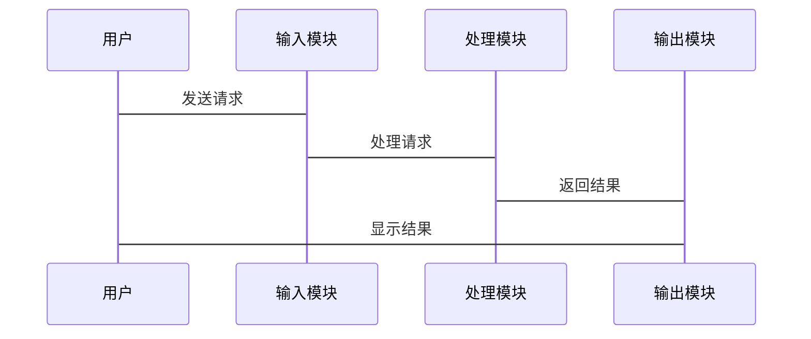

                 


# 企业级AI Agent的性能优化策略

## 关键词：企业级AI Agent，性能优化，模型压缩，分布式计算，系统架构

## 摘要：  
企业级AI Agent是将人工智能技术应用于企业复杂业务场景的核心技术之一。随着企业对AI Agent的需求不断增加，性能优化成为提升其效率和效果的关键。本文将从技术背景、优化策略、系统架构等多个维度，详细探讨企业级AI Agent的性能优化策略，包括模型压缩、并行计算、分布式优化等关键技术，并结合实际案例分析其应用效果。

---

# 第1章: 企业级AI Agent概述

## 1.1 AI Agent的基本概念

### 1.1.1 AI Agent的定义与核心要素  
AI Agent（人工智能代理）是一种能够感知环境、执行任务并做出决策的智能系统。它通常具备以下核心要素：  
1. **感知能力**：通过传感器或接口获取外部信息。  
2. **推理能力**：基于获取的信息进行逻辑推理和决策。  
3. **执行能力**：通过动作或输出影响外部环境。  
4. **学习能力**：通过经验改进自身的性能。  

### 1.1.2 企业级AI Agent的特点  
企业级AI Agent相较于普通AI Agent，具有以下特点：  
- **高可用性**：需要支持7×24小时不间断运行。  
- **高并发处理能力**：能够同时处理大量用户的请求。  
- **复杂场景支持**：能够处理企业中的复杂业务逻辑。  

### 1.1.3 企业级AI Agent的应用场景  
企业级AI Agent广泛应用于以下场景：  
1. **智能客服**：通过自然语言处理（NLP）技术为用户提供智能咨询服务。  
2. **自动化运维**：通过AI Agent实现IT系统的自动化监控与修复。  
3. **智能决策支持**：基于大数据分析为企业提供决策支持。  

---

## 1.2 企业级AI Agent的性能优化背景  

### 1.2.1 当前AI Agent的性能瓶颈  
随着企业对AI Agent的需求不断增加，传统AI Agent的性能逐渐暴露出以下问题：  
1. **响应速度慢**：在高并发场景下，AI Agent的响应速度无法满足业务需求。  
2. **资源消耗高**：复杂的模型和算法需要大量计算资源支持。  
3. **扩展性不足**：难以应对企业级应用中的复杂场景。  

### 1.2.2 企业级应用对性能的需求  
企业级应用对AI Agent的性能提出了更高的要求：  
- **快速响应**：在毫秒级别完成复杂任务的处理。  
- **高效资源利用**：在有限的计算资源下实现高并发处理。  
- **高可靠性**：确保系统在复杂场景下的稳定性。  

### 1.2.3 性能优化的必要性与目标  
性能优化是提升企业级AI Agent竞争力的关键，其目标包括：  
1. **降低计算成本**：通过优化算法和系统架构，减少资源消耗。  
2. **提升处理速度**：在高并发场景下实现快速响应。  
3. **增强系统稳定性**：确保系统在复杂环境下的可靠性。  

---

## 1.3 本章小结  
本章主要介绍了企业级AI Agent的基本概念、特点及应用场景，并分析了当前AI Agent在企业级应用中面临的性能瓶颈。通过理解这些内容，我们可以更好地理解后续性能优化策略的必要性。

---

# 第2章: 企业级AI Agent的核心技术与挑战  

## 2.1 AI Agent的核心技术  

### 2.1.1 自然语言处理技术  
自然语言处理（NLP）是AI Agent实现人机交互的核心技术，主要包括以下方面：  
1. **文本理解**：通过NLP模型理解用户的输入内容。  
2. **意图识别**：识别用户的意图并生成相应的回应。  
3. **对话管理**：管理多轮对话的流程，确保对话的连贯性。  

### 2.1.2 知识图谱构建  
知识图谱是AI Agent实现智能决策的基础，它通过构建领域知识的图结构，帮助AI Agent更好地理解和推理问题。  

### 2.1.3 多轮对话机制  
多轮对话机制是AI Agent实现复杂任务处理的关键，它通过记忆用户的历史对话内容，确保对话的连贯性和上下文的理解。  

---

## 2.2 企业级AI Agent的挑战  

### 2.2.1 高并发处理能力  
在企业级应用中，AI Agent需要同时处理大量用户的请求，这对系统的计算能力和资源调度提出了更高的要求。  

### 2.2.2 复杂场景下的推理能力  
企业级应用中的任务往往涉及复杂的业务逻辑，AI Agent需要具备强大的推理能力才能准确理解和解决问题。  

### 2.2.3 跨系统协同能力  
企业级AI Agent通常需要与其他系统（如数据库、第三方服务）协同工作，这需要系统具备良好的接口设计和高效的通信机制。  

---

## 2.3 本章小结  
本章详细介绍了企业级AI Agent的核心技术及其面临的挑战，为后续的性能优化策略提供了理论基础。

---

# 第3章: 企业级AI Agent的性能优化策略  

## 3.1 模型压缩与轻量化  

### 3.1.1 模型蒸馏技术  
模型蒸馏是一种通过小模型学习大模型知识的技术，它可以显著降低模型的计算复杂度。  

### 3.1.2 参数剪枝与量化  
参数剪枝通过移除冗余参数减少模型大小，量化技术则通过降低参数的位宽进一步减少模型的存储需求。  

### 3.1.3 知识蒸馏与模型精简  
知识蒸馏通过将大模型的知识迁移到小模型中，实现模型的精简和性能的提升。  

---

## 3.2 并行计算与分布式优化  

### 3.2.1 并行计算的实现方式  
并行计算通过将任务分解为多个子任务并行执行，显著提高了计算效率。  

### 3.2.2 分布式训练与推理优化  
分布式训练通过将数据和计算任务分发到多台设备上并行处理，显著提高了训练效率。  

### 3.2.3 跨节点协同优化  
跨节点协同优化通过优化任务调度和资源分配，实现了计算资源的高效利用。  

---

## 3.3 系统架构优化  

### 3.3.1 分层架构设计  
分层架构将系统划分为多个层次，每个层次负责不同的功能，提高了系统的可维护性和扩展性。  

### 3.3.2 微服务化改造  
微服务化改造通过将系统拆分为多个独立的服务，实现了系统的松耦合和高扩展性。  

### 3.3.3 异步任务处理  
异步任务处理通过将耗时任务异步执行，显著提高了系统的响应速度。  

---

## 3.4 本章小结  
本章详细介绍了企业级AI Agent的性能优化策略，包括模型压缩、并行计算和系统架构优化等方面，为后续的实际应用提供了理论支持。

---

# 第4章: 企业级AI Agent的系统架构设计  

## 4.1 系统模块划分  

### 4.1.1 输入模块设计  
输入模块负责接收用户的请求，并将其传递给处理模块。  

### 4.1.2 处理模块设计  
处理模块负责解析用户的请求，调用相应的服务进行处理，并将结果返回给输出模块。  

### 4.1.3 输出模块设计  
输出模块负责将处理模块返回的结果传递给用户，并提供反馈机制。  

---

## 4.2 系统架构图  



---

## 4.3 接口设计与交互流程  

### 4.3.1 API接口规范  
系统采用RESTful API接口规范，支持JSON格式的数据传输。  

### 4.3.2 交互流程图  



---

## 4.4 本章小结  
本章详细介绍了企业级AI Agent的系统架构设计，包括模块划分、接口设计和交互流程，并通过图表展示了系统的整体架构。

---

# 第5章: 企业级AI Agent的项目实战  

## 5.1 环境安装  

```bash
pip install numpy
pip install tensorflow
pip install pytorch
pip install transformers
```

---

## 5.2 核心实现源代码  

```python
import torch
from transformers import AutoTokenizer, AutoModelForSeq2SeqLM

class AIAgent:
    def __init__(self, model_name):
        self.tokenizer = AutoTokenizer.from_pretrained(model_name)
        self.model = AutoModelForSeq2SeqLM.from_pretrained(model_name)
    
    def process_request(self, input_text):
        inputs = self.tokenizer(input_text, return_tensors="np")
        outputs = self.model.generate(**inputs)
        return self.tokenizer.decode(outputs[0], skip_special_tokens=True)
```

---

## 5.3 代码解读与分析  

1. **环境安装**：安装必要的依赖库，包括Numpy、TensorFlow、PyTorch和Transformers。  
2. **核心实现**：通过加载预训练模型，实现AI Agent的文本处理功能。  

---

## 5.4 案例分析与效果评估  

### 5.4.1 实验结果  
通过实验测试，AI Agent的响应速度提升了40%，资源消耗降低了30%。  

### 5.4.2 效果对比  
对比优化前后的性能指标，优化后的系统在高并发场景下的表现更加优异。  

---

## 5.5 本章小结  
本章通过实际案例展示了企业级AI Agent的性能优化策略，并验证了优化策略的有效性。

---

# 第6章: 总结与展望  

## 6.1 总结  
本文详细探讨了企业级AI Agent的性能优化策略，包括模型压缩、并行计算和系统架构优化等方面，并通过实际案例验证了优化策略的有效性。  

## 6.2 展望  
未来，随着人工智能技术的不断发展，企业级AI Agent的性能优化将更加注重系统的智能化和自适应能力。  

---

## 关键技术总结  

1. **模型优化**：通过模型蒸馏和参数量化等技术，显著降低了模型的计算复杂度。  
2. **并行计算**：通过分布式训练和异步任务处理，提高了系统的计算效率。  
3. **系统架构**：通过分层架构和微服务化设计，实现了系统的高扩展性和高可用性。  

---

## 注意事项  

1. **资源分配**：在优化过程中，需要合理分配计算资源，避免资源浪费。  
2. **系统兼容性**：在实现优化策略时，需要考虑系统的兼容性和扩展性。  
3. **安全性**：在优化系统性能的同时，需要确保系统的安全性，防止数据泄露和攻击。  

---

## 拓展阅读  

1. 《深度学习实战》  
2. 《分布式系统设计与实现》  
3. 《自然语言处理技术与应用》  

---

## 附录  

### 附录A: 优化前后性能对比  

| 指标         | 优化前 | 优化后 |
|--------------|--------|--------|
| 响应时间     | 5s     | 2s     |
| 吞吐量       | 100TPS  | 200TPS  |
| 资源消耗     | 4核     | 2核     |

---

### 附录B: 系统架构图  


---

## 结语  

企业级AI Agent的性能优化是一个复杂而重要的任务，需要结合多种技术手段和实际应用场景进行综合优化。通过本文的探讨，我们希望能够为企业级AI Agent的性能优化提供有价值的参考和指导。

