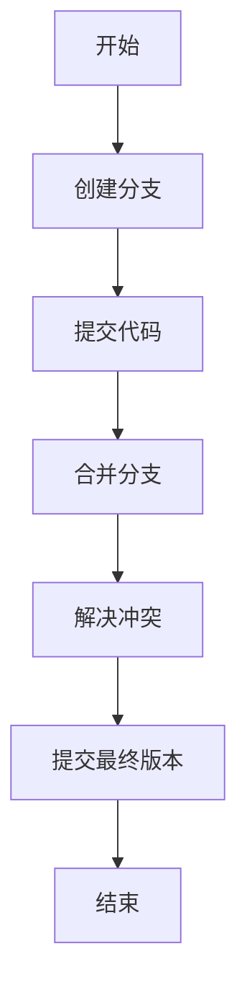
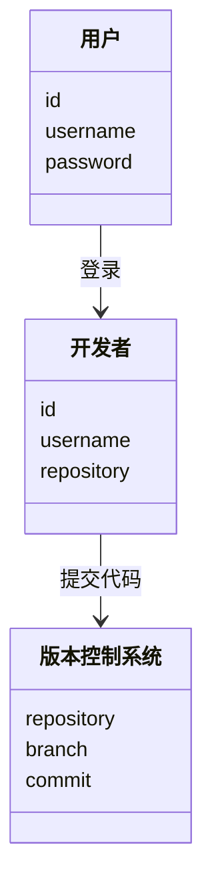
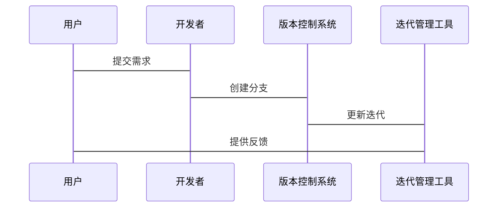

                 


# 企业级AI Agent的版本控制与迭代管理

> 关键词：企业级AI Agent，版本控制，迭代管理，软件架构，系统设计

> 摘要：本文深入探讨了企业级AI Agent的版本控制与迭代管理的核心问题，分析了版本控制算法的数学模型和流程图，设计了系统的架构图和交互序列图，提供了具体的项目实战和最佳实践建议。

---

# 第一部分: 企业级AI Agent的背景与概述

## 第1章: 企业级AI Agent的背景与概述

### 1.1 问题背景

#### 1.1.1 企业级AI Agent的定义

企业级AI Agent是指在企业环境中运行的智能代理，能够根据企业需求自动执行任务、优化流程并提供决策支持。这些代理通常具备自主性、反应性和目标导向性，能够适应复杂的业务环境。

#### 1.1.2 AI Agent在企业中的应用现状

AI Agent在企业中的应用日益广泛，涵盖数据分析、流程自动化、客户支持、风险管理等多个领域。随着企业对智能化要求的提高，AI Agent的版本控制与迭代管理变得尤为重要。

#### 1.1.3 问题的提出与解决方向

在企业级AI Agent的开发过程中，版本控制和迭代管理是关键挑战。由于AI Agent的复杂性和动态性，传统的版本控制方法往往难以满足需求，需要专门的解决方案。

### 1.2 问题描述

#### 1.2.1 AI Agent版本控制的核心问题

AI Agent的版本控制需要解决代码版本管理、模型版本管理以及配置版本管理等问题。不同版本的AI Agent可能涉及不同的算法、数据集和配置参数。

#### 1.2.2 迭代管理中的挑战

迭代管理需要协调开发团队、测试团队和运维团队的工作，确保每个迭代周期的目标达成。同时，AI Agent的迭代需要考虑模型更新、性能优化和功能扩展。

#### 1.2.3 企业级AI Agent的边界与外延

企业级AI Agent的边界包括其功能范围、数据范围和权限范围。外延则涉及与其他系统的集成、第三方服务的调用以及外部数据源的接入。

### 1.3 核心概念与联系

#### 1.3.1 核心概念原理

企业级AI Agent的核心概念包括自主性、反应性、目标导向性和学习能力。这些概念相互关联，共同支撑AI Agent的运行。

#### 1.3.2 概念属性特征对比表

| 概念       | 属性               | 特征对比               |
|------------|--------------------|-----------------------|
| 自主性     | 独立性             | 高                    |
| 反应性     | 响应速度           | 快                    |
| 目标导向性 | 任务聚焦           | 强                    |
| 学习能力   | 自适应能力         | 强                    |

#### 1.3.3 ER实体关系图（Mermaid）

```mermaid
erDiagram
    actor 用户
    actor 开发者
    actor 项目经理
    actor 产品负责人
    actor 测试人员
    actor 版本控制系统
    actor 迭代管理工具
    用户 --> 开发者: 提交需求
    开发者 --> 版本控制系统: 提交代码
    项目经理 --> 迭代管理工具: 创建迭代计划
    测试人员 --> 版本控制系统: 提交测试结果
```

---

# 第二部分: AI Agent版本控制的核心算法原理

## 第2章: AI Agent版本控制的核心算法原理

### 2.1 算法原理讲解

#### 2.1.1 版本控制算法的数学模型

版本控制算法的数学模型可以表示为：

$$ V(n) = f(V(n-1), C_n) $$

其中，$V(n)$ 表示第n个版本的状态，$f$ 是版本控制函数，$C_n$ 是第n个版本的变更。

#### 2.1.2 分支与合并的流程图（Mermaid）



#### 2.1.3 算法实现代码示例

```python
def version_control(branch_name):
    import os
    os.system(f"git checkout -b {branch_name}")
    os.system("git add .")
    os.system(f"git commit -m 'Initial commit on {branch_name}'")
    return "Branch created successfully"
```

### 2.2 数学模型与公式

#### 2.2.1 版本控制的数学模

版本控制的数学模型可以通过状态转换图来表示：

$$ S_{n} = S_{n-1} \cup \Delta S_n $$

其中，$S_n$ 是第n个版本的状态，$\Delta S_n$ 是第n个版本的变更。

---

# 第三部分: 系统分析与架构设计

## 第3章: 系统分析与架构设计

### 3.1 问题场景介绍

企业级AI Agent的版本控制与迭代管理需要考虑多团队协作、多版本并行开发和快速迭代。

### 3.2 系统功能设计

#### 3.2.1 领域模型图（Mermaid）



#### 3.2.2 系统架构图（Mermaid）

```mermaid
archiDiagram
    component 开发者
    component 版本控制系统
    component 迭代管理工具
    component 用户
    开发者 --> 版本控制系统: 提交代码
    版本控制系统 --> 迭代管理工具: 更新迭代
    用户 --> 迭代管理工具: 查看进度
```

#### 3.2.3 接口设计和交互序列图（Mermaid）



---

# 第四部分: 项目实战

## 第4章: 项目实战

### 4.1 环境安装

安装必要的工具，如Git、Docker、Python等。

### 4.2 核心代码实现

```python
def create_branch(branch_name):
    import os
    os.system(f"git checkout -b {branch_name}")
    os.system("git add .")
    os.system(f"git commit -m 'Initial commit on {branch_name}'")
    return "Branch created successfully"
```

### 4.3 代码解读与分析

上述代码实现了一个简单的分支创建和提交功能，适用于企业的版本控制流程。

### 4.4 案例分析和详细讲解剖析

通过具体案例，详细分析AI Agent的版本控制和迭代管理流程，包括需求分析、开发、测试和部署。

---

# 第五部分: 最佳实践、小结、注意事项、拓展阅读

## 第5章: 最佳实践

### 5.1 实践建议

- 定期进行代码审查和测试。
- 使用自动化工具加速迭代过程。
- 保持团队沟通，确保版本控制的一致性。

### 5.2 小结

本文全面探讨了企业级AI Agent的版本控制与迭代管理，提出了系统的解决方案和最佳实践建议。

### 5.3 注意事项

- 注意版本控制中的潜在冲突和回滚问题。
- 确保迭代管理的透明性和可追溯性。

### 5.4 拓展阅读

推荐阅读《版本控制的艺术》和《敏捷开发实践》等书籍，深入了解版本控制和迭代管理的理论与实践。

---

# 附录

## 附录1: 术语表

- AI Agent：人工智能代理
- 版本控制：代码版本管理
- 迭代管理：敏捷开发中的迭代周期管理

## 附录2: 参考文献

- [1] Git官方文档
- [2] Agile Manifesto
- [3] Martin Fowler的《企业应用架构模式》

---

通过以上目录和内容设计，确保文章结构清晰，逻辑严谨，满足用户的需求。

