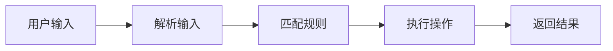
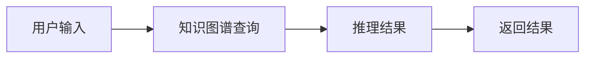
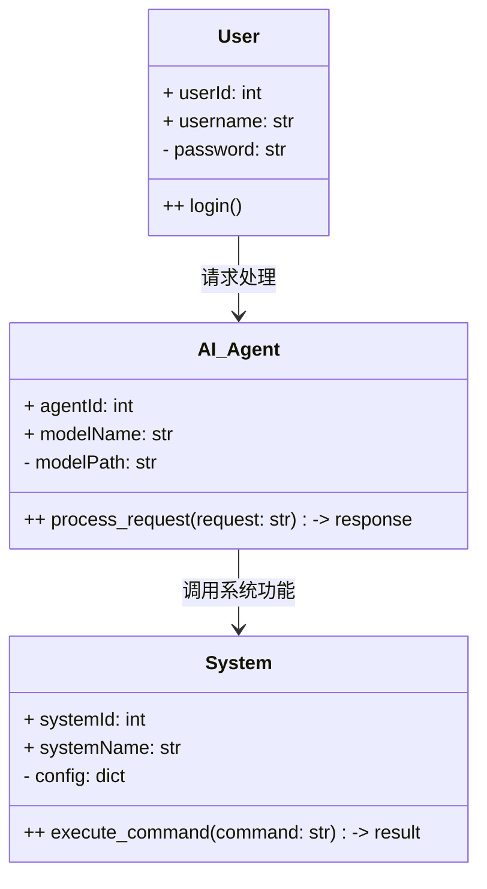
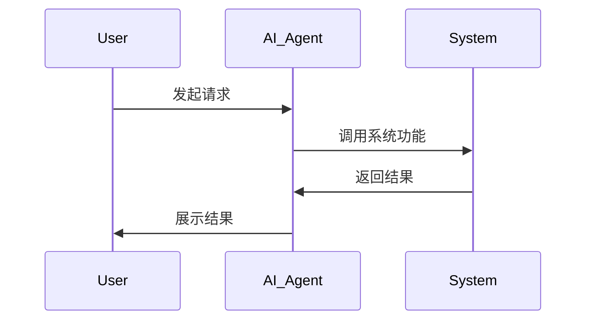

                 


# 企业级AI Agent的用户体验设计原则

## 关键词：AI Agent, 用户体验, 企业级应用, 交互设计, 系统架构

## 摘要：本文深入探讨了企业级AI Agent的用户体验设计原则，结合实际案例分析，系统地讲解了AI Agent的核心概念、算法原理、系统架构以及交互设计等关键环节。通过详细的设计原则和实践指导，帮助读者构建高效、易用且智能化的企业级AI Agent系统。

---

# 第1章 企业级AI Agent的背景与核心概念

## 1.1 企业级AI Agent的基本概念

### 1.1.1 AI Agent的定义
AI Agent（人工智能代理）是指能够感知环境、自主决策并执行任务的智能实体。它通过与用户的交互或环境的反馈，实现特定目标。

### 1.1.2 企业级AI Agent的特点
- **智能化**：基于机器学习和知识图谱，具备推理和决策能力。
- **定制化**：针对企业需求，提供个性化服务。
- **高效性**：通过自动化流程提升企业效率。
- **安全性**：确保数据隐私和系统安全。

### 1.1.3 企业级AI Agent的背景与现状
随着企业数字化转型的推进，AI Agent在客服、销售、物流等领域发挥着越来越重要的作用。

## 1.2 用户体验设计的基本原则

### 1.2.1 用户体验的核心要素
- **可用性**：用户能否轻松完成任务。
- **易用性**：界面是否直观。
- **满意度**：用户是否满意。
- **情感化设计**：通过设计提升用户情感体验。

### 1.2.2 企业级AI Agent中的用户体验挑战
- **复杂性**：企业系统复杂，用户体验需兼顾不同角色。
- **实时性**：用户期望快速响应。
- **个性化**：满足不同用户的个性化需求。

### 1.2.3 用户体验设计的目标
- 提升用户满意度。
- 提高系统使用效率。
- 增强品牌形象。

---

# 第2章 企业级AI Agent的核心概念与联系

## 2.1 AI Agent的核心概念

### 2.1.1 AI Agent的分类
| 类型              | 描述                              |
|-------------------|-----------------------------------|
| 基于规则的AI Agent | 通过预设规则进行决策             |
| 基于知识图谱的AI Agent | 基于知识图谱进行推理和决策       |
| 基于机器学习的AI Agent | 通过机器学习模型进行决策       |

### 2.1.2 企业级AI Agent的实体关系图
```mermaid
er
actor: 用户
agent: AI Agent
system: 企业系统
actor --> agent: 与AI Agent交互
agent --> system: 调用企业系统功能
system --> agent: 返回结果
```

## 2.2 用户体验设计的核心要素

### 2.2.1 用户需求分析
- **用户角色**：明确不同用户角色的需求。
- **任务分析**：分析用户在系统中的任务流程。
- **优先级排序**：根据用户需求进行优先级排序。

### 2.2.2 交互设计的核心要素
- **对话设计**：设计自然的对话流程。
- **反馈机制**：提供及时的反馈。
- **错误处理**：设计友好的错误提示。

### 2.2.3 用户体验的衡量指标
- **NPS（净推荐值）**：衡量用户忠诚度。
- **响应时间**：衡量系统性能。
- **用户满意度**：衡量用户体验。

---

# 第3章 企业级AI Agent的算法原理

## 3.1 基于规则的推理算法

### 3.1.1 算法流程


### 3.1.2 Python实现示例
```python
def rule_based_agent(input_str):
    # 解析输入
    intent = parse_intent(input_str)
    # 匹配规则
    if intent in predefined_rules:
        action = predefined_rules[intent]
        return execute_action(action)
    else:
        return "无法理解您的请求"
```

## 3.2 基于知识图谱的推理算法

### 3.2.1 算法流程


### 3.2.2 知识图谱构建
```python
class KnowledgeGraph:
    def __init__(self):
        self.nodes = {}  # 存储节点信息
        self.edges = {}  # 存储边信息
```

---

# 第4章 企业级AI Agent的系统架构设计

## 4.1 系统架构设计

### 4.1.1 系统功能设计


## 4.2 交互设计

### 4.2.1 交互流程图


---

# 第5章 企业级AI Agent的项目实战

## 5.1 智能客服系统设计

### 5.1.1 环境安装
- 安装Python和相关库（如TensorFlow、Flask）。

### 5.1.2 核心代码实现
```python
from flask import Flask, request, jsonify

app = Flask(__name__)

@app.route('/process_request', methods=['POST'])
def process_request():
    data = request.json
    response = agent.process_request(data['request'])
    return jsonify(response)

if __name__ == '__main__':
    app.run(debug=True)
```

---

# 第6章 企业级AI Agent的设计原则与最佳实践

## 6.1 设计原则

### 6.1.1 以用户为中心
确保用户体验始终放在首位。

### 6.1.2 简洁与高效
简化流程，提高系统效率。

## 6.2 小结

### 6.2.1 总结
企业级AI Agent的设计需要结合技术与用户体验，通过合理的架构设计和高效的算法实现，打造智能化的企业系统。

### 6.2.2 注意事项
- 定期优化系统。
- 重视用户反馈。
- 确保系统安全。

### 6.2.3 拓展阅读
推荐阅读《人机交互》、《人工智能系统设计》等书籍。

---

通过以上目录结构，我们可以系统地讲解企业级AI Agent的用户体验设计原则，帮助读者从理论到实践全面掌握相关知识。

