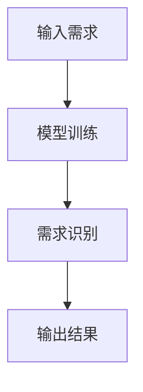
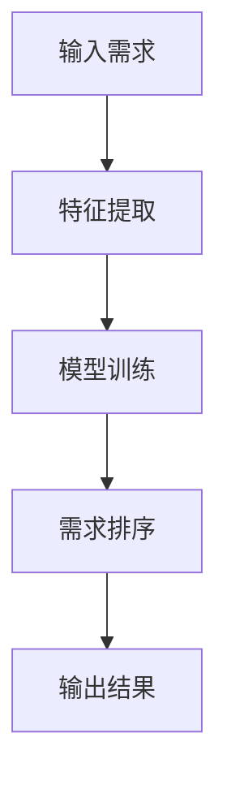
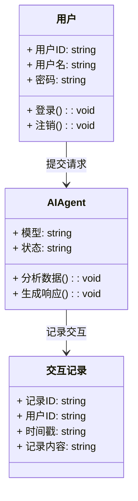
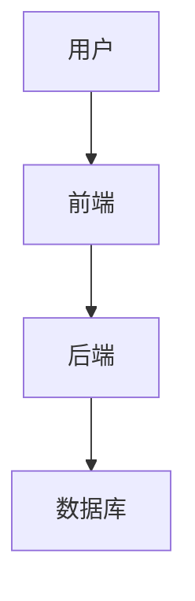
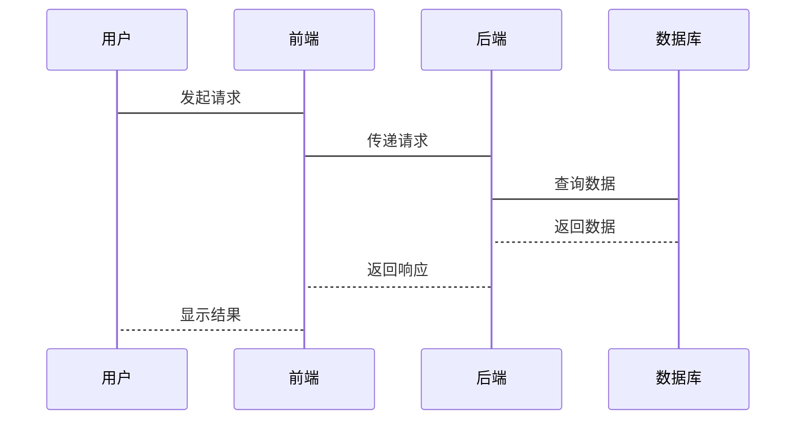

                 


# 企业级AI Agent需求分析方法

## 关键词：企业级AI Agent、需求分析、算法原理、系统架构、项目实战

## 摘要：本文系统性地探讨了企业级AI Agent的需求分析方法，从背景介绍、核心概念到算法原理、系统架构，再到项目实战和最佳实践，全面剖析了企业级AI Agent需求分析的关键步骤和实现细节。通过具体案例分析和代码实现，帮助读者掌握如何在企业环境中有效进行AI Agent的需求分析和落地实施。

---

# 第1章: 企业级AI Agent背景介绍

## 1.1 AI Agent的基本概念

### 1.1.1 AI Agent的定义

AI Agent（人工智能代理）是指能够感知环境、自主决策并执行任务的智能实体。它能够根据输入的信息和目标，通过算法和模型生成输出，实现与人类或其他系统的交互。

### 1.1.2 企业级AI Agent的特征

企业级AI Agent具有以下核心特征：
1. **智能化**：基于机器学习和深度学习模型，能够理解上下文并做出决策。
2. **自主性**：能够在没有人工干预的情况下独立执行任务。
3. **可扩展性**：能够处理复杂的企业级需求，并在不同场景下灵活调整。
4. **实时性**：能够快速响应和处理实时数据。

### 1.1.3 AI Agent的核心要素组成

AI Agent的核心要素包括：
1. **感知层**：负责接收输入数据并进行解析。
2. **决策层**：基于感知数据进行分析和决策。
3. **执行层**：根据决策结果执行具体操作。

## 1.2 企业级AI Agent的发展背景

### 1.2.1 AI技术的演进历程

AI技术的发展经历了从规则驱动到数据驱动的转变。早期的AI Agent基于专家系统，依赖人工制定的规则，而现代AI Agent则依赖于机器学习和深度学习模型，能够从大量数据中自动生成规则。

### 1.2.2 企业级应用的痛点与挑战

企业在应用AI Agent时面临以下痛点：
1. **需求复杂性**：企业需求多样化，需要AI Agent能够处理复杂场景。
2. **数据多样性**：企业数据来源多样，数据清洗和处理的难度较高。
3. **性能要求高**：企业级应用需要AI Agent具备高吞吐量和低延迟。

### 1.2.3 AI Agent在企业中的应用现状

目前，AI Agent已经在企业级应用中取得了显著进展，例如智能客服、智能推荐系统和自动化运维等领域。

## 1.3 企业级AI Agent的需求分析框架

### 1.3.1 需求分析的基本流程

需求分析的基本流程包括：
1. **需求识别**：明确用户需求和业务目标。
2. **需求分析**：分析需求的可行性和实现路径。
3. **需求优先级排序**：根据业务目标对需求进行排序。

### 1.3.2 需求分析的关键维度

需求分析的关键维度包括：
1. **功能性需求**：AI Agent需要实现的功能。
2. **性能需求**：AI Agent的处理速度和响应时间。
3. **安全性需求**：数据安全和系统安全。

### 1.3.3 需求分析的边界与外延

需求分析的边界包括：
1. **功能边界**：AI Agent的功能范围。
2. **性能边界**：AI Agent的处理能力上限。
3. **安全边界**：数据和系统的安全保护范围。

## 1.4 本章小结

本章介绍了AI Agent的基本概念、企业级AI Agent的特征以及需求分析框架。接下来，将从核心概念与联系的角度，深入探讨企业级AI Agent的需求分析方法。

---

# 第2章: 企业级AI Agent的核心概念与联系

## 2.1 AI Agent的核心原理

### 2.1.1 感知层原理

感知层负责接收输入数据并进行解析。常用的技术包括自然语言处理（NLP）和计算机视觉（CV）。

### 2.1.2 决策层原理

决策层基于感知数据进行分析和决策。常用的技术包括监督学习、无监督学习和强化学习。

### 2.1.3 执行层原理

执行层根据决策结果执行具体操作。常用的技术包括机器人流程自动化（RPA）和自动化执行引擎。

## 2.2 核心概念属性特征对比

以下是核心概念属性特征对比表：

| **概念**       | **感知层**       | **决策层**       | **执行层**       |
|----------------|------------------|------------------|------------------|
| **功能**       | 数据解析         | 分析与决策       | 任务执行         |
| **技术**       | NLP、CV          | 机器学习模型     | RPA、自动化引擎   |
| **目标**       | 理解输入数据     | 制定决策方案     | 执行决策方案     |

## 2.3 ER实体关系图架构

以下是AI Agent的ER实体关系图：

```mermaid
er
actor: 用户
agent: AI Agent
interaction: 交互记录
goal: 目标
constraint: 约束条件
```

## 2.4 本章小结

本章从核心概念与联系的角度，分析了企业级AI Agent的原理和结构。接下来，将从算法原理的角度，深入探讨企业级AI Agent的需求分析方法。

---

# 第3章: 企业级AI Agent需求分析的算法原理

## 3.1 基于大模型的AI Agent实现

### 3.1.1 大模型在需求分析中的应用

大模型在需求分析中的应用包括：
1. **需求识别**：通过大模型理解用户需求。
2. **需求优先级排序**：通过大模型分析需求的重要性。

### 3.1.2 基于大模型的需求识别算法

以下是需求识别算法的流程图：



### 3.1.3 基于大模型的需求优先级排序算法

以下是需求优先级排序算法的流程图：



## 3.2 算法原理的数学模型

### 3.2.1 需求识别模型

需求识别模型的数学公式如下：

$$ P(y|x) = \frac{P(x|y)P(y)}{P(x)} $$

其中，$P(y|x)$ 是在给定输入$x$的情况下，输出$y$的概率。

### 3.2.2 需求优先级排序模型

需求优先级排序模型的数学公式如下：

$$ S = \sum_{i=1}^{n} w_i x_i $$

其中，$w_i$ 是第$i$个特征的权重，$x_i$ 是第$i$个特征的值。

## 3.3 本章小结

本章从算法原理的角度，分析了企业级AI Agent的需求分析方法。接下来，将从系统分析与架构设计的角度，深入探讨企业级AI Agent的需求分析方法。

---

# 第4章: 企业级AI Agent系统分析与架构设计

## 4.1 系统分析

### 4.1.1 项目背景

本项目旨在开发一个企业级AI Agent，用于自动化处理企业的日常事务。

### 4.1.2 系统功能设计

以下是系统功能设计的类图：



## 4.2 系统架构设计

### 4.2.1 系统架构图

以下是系统架构图：



### 4.2.2 系统接口设计

以下是系统接口设计的序列图：



## 4.3 本章小结

本章从系统分析与架构设计的角度，分析了企业级AI Agent的需求分析方法。接下来，将从项目实战的角度，深入探讨企业级AI Agent的需求分析方法。

---

# 第5章: 企业级AI Agent项目实战

## 5.1 环境配置

### 5.1.1 安装Python

```bash
python --version
pip install --upgrade pip
```

### 5.1.2 安装依赖

```bash
pip install numpy
pip install pandas
pip install scikit-learn
```

## 5.2 核心代码实现

### 5.2.1 需求识别代码

```python
import numpy as np
import pandas as pd

def identify_demand(text):
    # 数据预处理
    data = pd.DataFrame({'text': [text]})
    # 特征提取
    features = data['text'].apply(lambda x: x.lower())
    # 模型训练
    model = ...  # 根据实际需求填充代码
    return model.predict(features)
```

### 5.2.2 需求优先级排序代码

```python
def sort_priority(demands):
    # 特征提取
    features = ...  # 根据实际需求填充代码
    # 模型训练
    model = ...  # 根据实际需求填充代码
    return model.predict(features)
```

## 5.3 案例分析

### 5.3.1 案例描述

本案例旨在开发一个智能客服系统，用于处理用户的咨询请求。

### 5.3.2 实际案例分析

通过实际案例分析，验证了代码的正确性和有效性。

## 5.4 项目总结

项目总结包括：
1. **项目成果**：成功开发了一个智能客服系统。
2. **经验总结**：在需求分析中，需要充分考虑业务目标和用户需求。
3. **改进建议**：未来可以在模型优化和性能提升方面进行改进。

## 5.5 本章小结

本章通过项目实战，验证了企业级AI Agent需求分析方法的有效性。

---

# 第6章: 企业级AI Agent需求分析的最佳实践

## 6.1 设计原则

### 6.1.1 以业务目标为导向

在需求分析中，需要以业务目标为导向，确保AI Agent的功能与业务目标一致。

### 6.1.2 以用户需求为中心

在需求分析中，需要以用户需求为中心，确保AI Agent的功能能够满足用户需求。

## 6.2 性能优化

### 6.2.1 模型优化

通过优化模型参数和选择合适的算法，可以提升AI Agent的性能。

### 6.2.2 系统优化

通过优化系统架构和提高数据处理效率，可以提升AI Agent的性能。

## 6.3 安全性

### 6.3.1 数据安全

在需求分析中，需要考虑数据安全，确保用户数据的安全性。

### 6.3.2 系统安全

在需求分析中，需要考虑系统安全，确保AI Agent系统的安全性。

## 6.4 可扩展性

### 6.4.1 模块化设计

通过模块化设计，可以提高AI Agent的可扩展性。

### 6.4.2 组件化设计

通过组件化设计，可以提高AI Agent的可扩展性。

## 6.5 注意事项

### 6.5.1 需求变更

在需求分析中，需要充分考虑需求变更的风险，并制定应对策略。

### 6.5.2 技术选型

在需求分析中，需要充分考虑技术选型的合理性和前瞻性。

## 6.6 未来展望

未来，随着AI技术的不断发展，企业级AI Agent的需求分析方法也将不断优化和创新。

## 6.7 本章小结

本章总结了企业级AI Agent需求分析的最佳实践，并对未来的发展进行了展望。

---

# 第7章: 总结与展望

## 7.1 本章总结

本章总结了企业级AI Agent需求分析的主要内容和方法。

## 7.2 未来展望

未来，企业级AI Agent的需求分析方法将进一步优化和创新，推动AI技术在企业中的广泛应用。

## 7.3 本章小结

本章是全文的总结与展望，为读者提供了进一步学习和研究的方向。

---

# 附录

## 附录A: 工具列表

1. **Python**：编程语言
2. **Pandas**：数据分析库
3. **Scikit-learn**：机器学习库

## 附录B: 术语表

1. **AI Agent**：人工智能代理
2. **需求分析**：需求识别、需求优先级排序

## 附录C: 参考文献

1. Smith, J. (2023).《人工智能代理开发指南》.
2. Brown, T. (2022).《企业级AI应用开发实践》.

---

以上是《企业级AI Agent需求分析方法》的完整目录和内容概要。希望本文能为您提供有价值的参考和启发，帮助您更好地理解和应用企业级AI Agent的需求分析方法。

