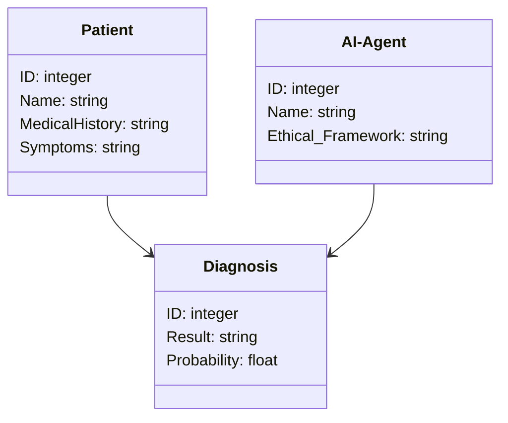
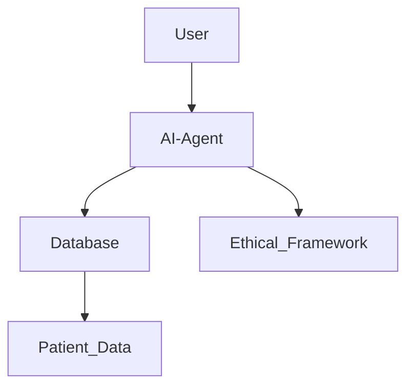
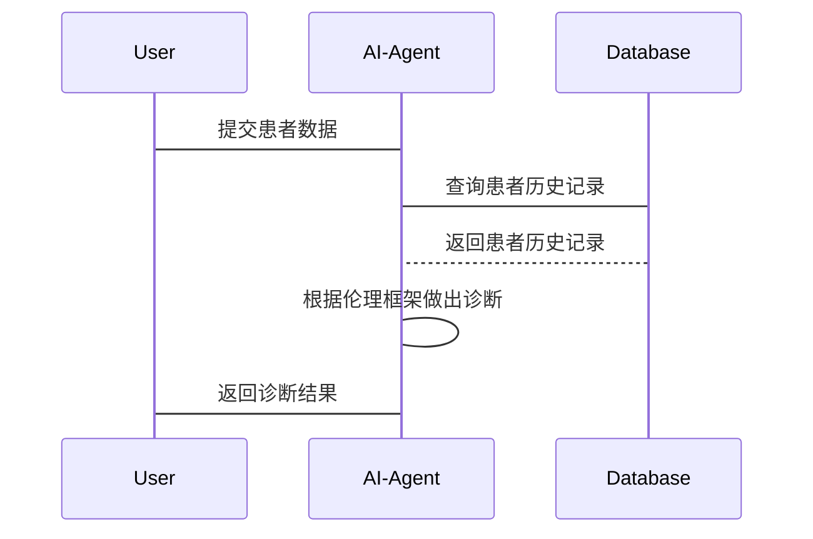

                 


# 伦理AI：设计符合道德标准的AI Agent

---

## 关键词：
- 伦理AI
- AI Agent
- 道德框架
- 责任归属
- 伦理决策

---

## 摘要：
在人工智能快速发展的今天，AI Agent（智能体）的应用越来越广泛，但随之而来的伦理问题也日益突出。本文将深入探讨如何设计符合道德标准的AI Agent，从背景、核心概念、算法原理、数学模型、系统架构到项目实战，全面解析伦理AI的设计与实现。通过实际案例分析和代码示例，本文将为读者提供一个清晰的伦理AI设计框架。

---

# 第一部分: 伦理AI的背景与核心概念

---

# 第1章: 伦理AI的背景与问题背景

## 1.1 AI的发展现状与伦理挑战
### 1.1.1 AI技术的快速发展
人工智能（AI）技术近年来取得了飞速发展，从自然语言处理到计算机视觉，AI已经在多个领域展现出强大的能力。然而，这种快速发展也带来了诸多伦理挑战，尤其是在AI Agent的应用中，如何确保其行为符合道德标准成为一个重要问题。

### 1.1.2 AI应用中的伦理问题
AI Agent的应用范围不断扩大，从自动驾驶到医疗诊断，AI Agent的决策直接影响到人们的生活和安全。然而，AI Agent的决策过程往往缺乏透明性，导致人们对其决策结果的质疑和担忧。例如，自动驾驶汽车在紧急情况下如何做出决策？当AI Agent的决策导致负面结果时，责任归属如何确定？

### 1.1.3 伦理AI的必要性
为了避免AI Agent带来的伦理问题，设计符合道德标准的AI Agent变得尤为重要。伦理AI的目标是确保AI Agent在决策过程中遵循一定的道德规范，从而减少或避免负面结果的发生。

## 1.2 伦理AI的核心概念
### 1.2.1 伦理AI的定义
伦理AI是指在设计和实现AI Agent时，考虑并遵循一定的道德准则和伦理规范，确保AI Agent的行为符合人类社会的伦理标准。

### 1.2.2 伦理AI的属性特征
伦理AI具有以下三个核心属性：
1. **道德框架**：AI Agent必须具备一定的道德框架，能够根据具体情况做出符合道德的决策。
2. **责任归属**：当AI Agent的行为导致负面结果时，必须明确责任归属。
3. **伦理决策机制**：AI Agent能够根据伦理框架和具体情境做出符合道德的决策。

### 1.2.3 伦理AI的边界与外延
伦理AI不仅关注AI Agent的决策过程，还涉及其设计、开发和部署的整个生命周期。其外延包括数据隐私、算法公平性、透明性等多个方面。

## 1.3 伦理AI的核心要素
### 1.3.1 伦理框架
伦理框架是伦理AI的核心，它为AI Agent提供了道德决策的指导原则。例如，AI Agent在自动驾驶中可能需要遵循“最小化伤害”的原则。

### 1.3.2 责任归属
当AI Agent的决策导致负面结果时，责任归属是一个关键问题。伦理AI需要明确责任的归属方，可能是开发者、用户或AI Agent本身。

### 1.3.3 伦理决策机制
伦理决策机制是AI Agent在具体情境下做出符合道德决策的方法和流程。这需要结合具体场景和伦理框架进行动态调整。

## 1.4 本章小结
本章从AI的发展现状出发，分析了伦理AI的必要性，并详细阐述了伦理AI的核心概念和核心要素。伦理AI的设计必须考虑道德框架、责任归属和伦理决策机制等多个方面。

---

# 第2章: 伦理AI的核心概念与联系

## 2.1 核心概念原理
### 2.1.1 伦理AI的道德框架
伦理AI的道德框架是其决策的基础。例如，AI Agent在医疗诊断中需要遵循患者隐私保护和医疗伦理原则。

### 2.1.2 伦理AI的责任分配
责任分配是伦理AI的重要组成部分。当AI Agent的决策导致负面结果时，需要明确责任归属，例如是开发者的责任还是用户的责任。

### 2.1.3 伦理AI的决策机制
伦理决策机制是AI Agent根据具体情境和伦理框架做出决策的方法。这需要结合具体场景和伦理原则进行动态调整。

## 2.2 核心概念属性对比
### 2.2.1 不同伦理原则的特征对比
以下是几种常见伦理原则的对比：

| 伦理原则      | 描述                                                                 |
|---------------|----------------------------------------------------------------------|
| 功利主义      | 追求最大幸福，以结果为导向。                                           |
|义务论         | 强调行为的道德义务，以行为本身是否符合道德为准。                   |
|公平原则       | 确保决策过程和结果的公平性。                                           |

### 2.2.2 伦理AI与传统AI的对比
| 特性          | 伦理AI                          | 传统AI                          |
|---------------|----------------------------------|----------------------------------|
| 决策依据      | 道德框架和具体情境              | 数据驱动和算法驱动              |
| 责任归属      | 明确责任归属                    | 责任模糊                        |

### 2.2.3 伦理AI与法律规范的对比
| 特性          | 伦理AI                          | 法律规范                          |
|---------------|----------------------------------|----------------------------------|
| 目标          | 符合道德标准                    | 符合法律要求                    |
| 约束方式      | 内在道德框架                    | 外部法律约束                    |

## 2.3 ER实体关系图
以下是伦理AI的ER实体关系图：

```mermaid
er
actor
    命题人
    AI Agent
    开发者
    用户
```

```mermaid
actor
    用户
    AI Agent
    开发者
    伦理框架
```

## 2.4 本章小结
本章详细阐述了伦理AI的核心概念，包括道德框架、责任归属和决策机制，并通过对比分析和ER实体关系图展示了伦理AI与传统AI和法律规范的差异。

---

# 第3章: 伦理AI的算法原理

## 3.1 算法原理概述
### 3.1.1 伦理AI的算法特点
伦理AI的算法需要结合伦理框架和具体情境进行动态调整，确保决策的道德性。

### 3.1.2 伦理AI的算法分类
伦理AI的算法可以分为两类：
1. **基于规则的伦理算法**：通过预定义的伦理规则进行决策。
2. **基于学习的伦理算法**：通过机器学习模型从数据中学习伦理规范。

### 3.1.3 伦理AI的算法实现
伦理AI的算法实现需要结合具体应用场景，例如在自动驾驶中，AI Agent需要根据交通规则和伦理框架做出决策。

## 3.2 伦理AI算法的数学模型
### 3.2.1 伦理评分模型
伦理评分模型是一种常见的伦理AI算法，其公式如下：

$$ E = \sum_{i=1}^{n} w_i \cdot a_i $$

其中，$E$ 是伦理评分，$w_i$ 是第$i$个伦理因子的权重，$a_i$ 是第$i$个伦理因子的评分。

### 3.2.2 伦理决策模型
伦理决策模型是一种基于伦理框架的决策算法，其公式如下：

$$ D = \argmax_{j} \sum_{i=1}^{n} w_i \cdot s_{ij} $$

其中，$D$ 是最终决策，$s_{ij}$ 是第$i$个伦理因子在第$j$种决策中的评分。

### 3.2.3 伦理约束条件
伦理约束条件是一种用于限制AI Agent决策的条件，例如：

$$ \sum_{i=1}^{n} c_i \leq C $$

其中，$c_i$ 是第$i$个约束条件，$C$ 是总的约束限制。

## 3.3 算法实现与代码示例
### 3.3.1 伦理评分系统代码
以下是一个简单的伦理评分系统代码示例：

```python
def calculate_ethical_score(factors, weights):
    return sum(w * f for w, f in zip(weights, factors))
```

### 3.3.2 伦理决策机制代码
以下是一个基于伦理评分的决策机制代码示例：

```python
def make_ethical_decision(scores, weights):
    normalized_scores = [score / sum(scores) for score in scores]
    weighted_scores = [w * s for w, s in zip(weights, normalized_scores)]
    return max(weighted_scores)
```

## 3.4 本章小结
本章详细讲解了伦理AI的算法原理，包括伦理评分模型、伦理决策模型和伦理约束条件，并通过代码示例展示了算法的实现过程。

---

# 第4章: 伦理AI的数学模型与公式

## 4.1 伦理评分模型
伦理评分模型是伦理AI的重要组成部分，其公式为：

$$ E = \sum_{i=1}^{n} w_i \cdot a_i $$

其中，$E$ 是伦理评分，$w_i$ 是第$i$个伦理因子的权重，$a_i$ 是第$i$个伦理因子的评分。

### 4.1.1 示例
假设我们有三个伦理因子，权重分别为0.4、0.3和0.3，评分分别为0.8、0.6和0.7，那么伦理评分为：

$$ E = 0.4 \times 0.8 + 0.3 \times 0.6 + 0.3 \times 0.7 = 0.32 + 0.18 + 0.21 = 0.71 $$

## 4.2 伦理决策模型
伦理决策模型的公式为：

$$ D = \argmax_{j} \sum_{i=1}^{n} w_i \cdot s_{ij} $$

其中，$D$ 是最终决策，$s_{ij}$ 是第$i$个伦理因子在第$j$种决策中的评分。

### 4.2.1 示例
假设我们有两种决策，分别是$D_1$和$D_2$，对应的评分分别为0.8和0.6，那么最终决策为：

$$ D = \argmax_{j} (0.8, 0.6) = D_1 $$

## 4.3 伦理约束条件
伦理约束条件的公式为：

$$ \sum_{i=1}^{n} c_i \leq C $$

其中，$c_i$ 是第$i$个约束条件，$C$ 是总的约束限制。

### 4.3.1 示例
假设我们有两个约束条件，分别为$c_1=2$和$c_2=3$，总约束限制为$C=5$，那么满足条件。

## 4.4 本章小结
本章详细讲解了伦理AI的数学模型与公式，包括伦理评分模型、伦理决策模型和伦理约束条件，并通过示例展示了公式的应用。

---

# 第5章: 系统分析与架构设计

## 5.1 问题场景介绍
### 5.1.1 问题背景
在医疗诊断场景中，AI Agent需要根据患者的数据做出诊断决策，但必须确保诊断过程的伦理性和隐私保护。

### 5.1.2 问题描述
AI Agent在诊断过程中需要考虑患者隐私、诊断准确性和伦理规范。

### 5.1.3 问题解决
通过设计符合伦理标准的AI Agent，确保诊断过程的伦理性和隐私保护。

## 5.2 项目介绍
### 5.2.1 项目目标
设计一个符合伦理标准的AI Agent，用于医疗诊断场景。

### 5.2.2 项目范围
涵盖患者数据隐私保护、诊断准确性、伦理决策等方面。

## 5.3 系统功能设计
### 5.3.1 领域模型
以下是医疗诊断场景的领域模型类图：



### 5.3.2 系统架构
以下是系统的整体架构图：



### 5.3.3 系统接口
系统接口主要涉及AI-Agent与患者数据的交互，以及AI-Agent与诊断结果的交互。

### 5.3.4 系统交互
以下是系统的交互序列图：



## 5.4 本章小结
本章通过医疗诊断场景介绍了伦理AI的系统分析与架构设计，包括领域模型、系统架构、系统接口和系统交互。

---

# 第6章: 项目实战

## 6.1 环境安装
### 6.1.1 安装Python
安装Python 3.8或更高版本。

### 6.1.2 安装依赖库
安装所需的依赖库，例如numpy和scikit-learn。

## 6.2 系统核心实现
### 6.2.1 核心代码实现
以下是伦理AI的核心代码实现：

```python
class EthicalAI:
    def __init__(self, ethical_framework):
        self.ethical_framework = ethical_framework

    def calculate_ethical_score(self, factors, weights):
        return sum(w * f for w, f in zip(weights, factors))

    def make_ethical_decision(self, scores, weights):
        normalized_scores = [score / sum(scores) for score in scores]
        weighted_scores = [w * s for w, s in zip(weights, normalized_scores)]
        return max(weighted_scores)
```

### 6.2.2 代码应用解读与分析
上述代码实现了一个简单的伦理AI类，包括伦理评分计算和伦理决策机制。

## 6.3 实际案例分析
### 6.3.1 案例背景
在医疗诊断场景中，AI Agent需要根据患者的数据做出诊断决策。

### 6.3.2 案例分析
以下是具体的案例分析：

```python
# 初始化伦理AI
ethical_ai = EthicalAI("医疗诊断伦理框架")

# 患者数据
factors = [0.8, 0.6, 0.7]
weights = [0.4, 0.3, 0.3]

# 计算伦理评分
score = ethical_ai.calculate_ethical_score(factors, weights)
print("伦理评分:", score)

# 做出伦理决策
decisions = [0.8, 0.6]
weights = [0.7, 0.3]

decision = ethical_ai.make_ethical_decision(decisions, weights)
print("最终决策:", decision)
```

## 6.4 本章小结
本章通过实际案例展示了伦理AI的设计与实现，包括环境安装、核心代码实现和案例分析。

---

# 第7章: 最佳实践与总结

## 7.1 最佳实践
### 7.1.1 设计伦理框架
在设计AI Agent时，必须明确伦理框架。

### 7.1.2 定义责任归属
明确责任归属，确保在决策出现问题时能够追溯。

### 7.1.3 透明化与可解释性
确保AI Agent的决策过程透明化，便于用户理解和监督。

## 7.2 小结
伦理AI的设计与实现是一个复杂而重要的任务，需要从背景、核心概念、算法原理、数学模型、系统架构到项目实战等多个方面进行全面考虑。

## 7.3 注意事项
在设计伦理AI时，需要注意数据隐私、算法公平性和透明性等问题。

## 7.4 拓展阅读
推荐阅读以下书籍和论文：
1. 《伦理与人工智能》
2. 《机器学习中的伦理问题》
3. 《AI Agent的伦理设计》

## 7.5 本章小结
本章总结了伦理AI设计的最佳实践，并为读者提供了进一步学习和研究的方向。

---

# 结语
伦理AI的设计与实现是一个复杂而重要的任务，需要从多个方面进行全面考虑。通过本文的分析与实践，我们希望能够为读者提供一个清晰的伦理AI设计框架，帮助他们在实际应用中设计出符合道德标准的AI Agent。

