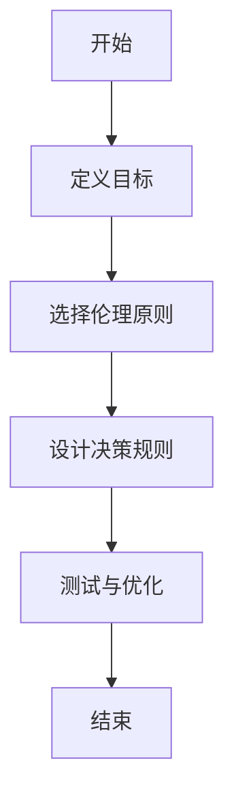
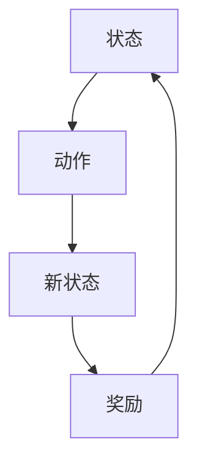

                 


# 伦理考量：设计负责任的AI Agent

## 关键词：AI Agent，伦理框架，负责任设计，强化学习，系统架构

## 摘要：  
本文探讨了在设计AI Agent时如何融入伦理考量，以确保其行为符合社会伦理标准。文章从AI Agent的基本概念出发，分析了伦理框架的核心要素，详细讲解了AI Agent的决策算法及其伦理实现，最后通过实际案例展示了如何将伦理考量融入AI Agent的设计中。本文旨在为AI开发者和伦理学家提供一个系统性的设计指南，帮助他们共同构建负责任的AI Agent。

---

## 第一部分: 伦理考量与AI Agent的背景介绍

### 第1章: AI Agent的基本概念与伦理问题

#### 1.1 AI Agent的定义与类型
AI Agent（智能体）是指能够感知环境并采取行动以实现目标的实体。它可以是一个软件程序、机器人或其他智能系统。AI Agent的核心特征包括自主性、反应性、目标导向和社会性。

- **自主性**：AI Agent能够在没有外部干预的情况下独立运作。
- **反应性**：AI Agent能够根据环境变化调整其行为。
- **目标导向**：AI Agent的行为旨在实现特定目标。
- **社会性**：AI Agent能够与其他实体（包括人类）交互并协作。

AI Agent可以分为以下几类：
1. **简单反射型AI Agent**：基于预定义规则对输入做出反应。
2. **基于模型的AI Agent**：利用内部模型预测环境变化并做出决策。
3. **目标导向型AI Agent**：根据目标优化其行为。
4. **社会型AI Agent**：能够与人类或其他AI Agent协作。

#### 1.2 AI Agent的现状与发展趋势
目前，AI Agent技术已经在多个领域得到广泛应用，例如：
- **智能家居**：通过AI Agent实现设备之间的联动。
- **自动驾驶**：AI Agent负责车辆的感知和决策。
- **虚拟助手**：如Siri、Alexa等，能够理解用户指令并执行任务。

未来，AI Agent将朝着以下方向发展：
1. **更强的自主性**：AI Agent能够更自主地解决问题。
2. **更复杂的决策能力**：通过强化学习等技术提升决策的复杂性。
3. **更强大的社交能力**：AI Agent将能够更好地与人类交互并理解情感。

#### 1.3 伦理问题在AI Agent中的重要性
随着AI Agent的普及，其行为对社会的影响越来越大。伦理问题的重要性体现在以下几个方面：
1. **避免伤害**：AI Agent的行为不应导致对人类或其他生命的伤害。
2. **公平性**：AI Agent的决策应公平，不应歧视特定群体。
3. **透明性**：AI Agent的决策过程应透明，便于人类理解和监督。
4. **责任归属**：当AI Agent的行为出现问题时，需要明确责任归属。

设计负责任的AI Agent不仅是技术问题，更是伦理问题。只有将伦理考量融入设计中，才能确保AI Agent的广泛应用不会对社会造成负面影响。

#### 1.4 本章小结
本章介绍了AI Agent的基本概念、类型和发展趋势，并强调了伦理问题在AI Agent设计中的重要性。接下来，我们将深入探讨伦理框架的核心要素。

---

## 第二部分: AI Agent的伦理框架与核心概念

### 第2章: 伦理框架的核心要素

#### 2.1 伦理原则的分类与对比
伦理原则是指导AI Agent行为的基本准则。常见的伦理原则包括：
1. **功利主义**：以最大化整体利益为目标。
2. **义务论**：基于道德义务做出决策。
3. **美德伦理**：以培养良好的品德为核心。

以下是一个对比表，展示了三种伦理原则的核心特点：

| 伦理原则 | 核心目标 | 决策依据 | 适用场景 |
|----------|----------|----------|----------|
| 功利主义 | 最大化整体利益 | 预测结果 | 社会层面的决策 |
| 义务论   | 遵守道德义务 | 行为准则 | 个体层面的决策 |
| 美德伦理 | 培养良好品德 | 品德修养 | 教育与个人成长 |

#### 2.2 伦理框架的设计与选择
设计伦理框架时，需要考虑以下原则：
1. **可操作性**：框架应能够指导实际决策。
2. **可调整性**：框架应能够根据场景动态调整。
3. **透明性**：框架的决策过程应清晰可解释。

以下是一个简单的伦理框架设计流程：



#### 2.3 伦理框架与AI Agent的结合
将伦理框架融入AI Agent设计中，可以通过以下方式实现：
1. **强化学习**：通过奖励机制将伦理原则融入决策过程。
2. **规则系统**：基于伦理框架制定行为规则。

以下是一个简单的强化学习流程图：



#### 2.4 本章小结
本章详细探讨了伦理框架的核心要素，并展示了如何将伦理原则融入AI Agent的设计中。接下来，我们将深入探讨AI Agent的算法原理。

---

## 第三部分: AI Agent的算法原理与伦理实现

### 第3章: AI Agent的决策算法

#### 3.1 强化学习算法
强化学习是一种通过试错来优化决策的算法。其核心在于通过奖励机制指导AI Agent的学习过程。

- **数学模型**：强化学习的目标是最优化策略π(a|s)，即在状态s下选择动作a的概率。
  
  $$ V(s) = \max_a Q(s,a) $$

- **代码实现**：以下是一个简单的强化学习算法示例：

  ```python
  def reinforce_learning(env):
      # 初始化参数
      parameters = initialize_parameters()
      while True:
          # 与环境交互
          state = env.reset()
          episode_rewards = []
          while not done:
              action = policy(state, parameters)
              next_state, reward, done = env.step(action)
              episode_rewards.append(reward)
              # 更新参数
              parameters = update_parameters(parameters, state, action, reward)
          # 计算总奖励
          total_reward = sum(episode_rewards)
          # 检查终止条件
          if total_reward > threshold:
              break
      return parameters
  ```

#### 3.2 基于规则的决策算法
基于规则的决策算法通过预定义的规则来指导AI Agent的行为。

- **规则系统设计**：规则系统通常包括以下步骤：

  ```mermaid
  graph TD
      A[输入] --> B[匹配规则]
      B --> C[执行动作]
      C --> D[输出]
  ```

- **代码实现**：以下是一个简单的基于规则的决策算法示例：

  ```python
  def rule_based_decision(state, rules):
      for rule in rules:
          if rule['condition'](state):
              return rule['action']
      # 如果没有匹配规则，执行默认动作
      return default_action
  ```

#### 3.3 组合式决策算法
组合式决策算法结合了强化学习和基于规则的优势，通过动态调整规则和学习策略来优化决策。

- **算法流程**：

  ```mermaid
  graph TD
      A[输入] --> B[规则匹配]
      B --> C[强化学习决策]
      C --> D[综合决策]
      D --> E[输出]
  ```

- **代码实现**：以下是一个组合式决策算法的示例：

  ```python
  def hybrid_decision(state, rules, model):
      # 先执行规则匹配
      for rule in rules:
          if rule['condition'](state):
              return rule['action']
      # 如果没有匹配规则，使用强化学习模型决策
      return model.predict(state)
  ```

#### 3.4 本章小结
本章详细讲解了AI Agent的决策算法，并展示了如何将伦理考量融入算法设计中。接下来，我们将探讨AI Agent的系统架构。

---

## 第四部分: AI Agent的系统架构与伦理实现

### 第4章: AI Agent的系统架构

#### 4.1 系统架构设计
AI Agent的系统架构通常包括以下三个层次：

1. **感知层**：负责感知环境并收集数据。
2. **决策层**：负责处理数据并做出决策。
3. **执行层**：负责执行决策并输出结果。

- **系统架构图**：

  ```mermaid
  graph TD
      A[感知层] --> B[决策层]
      B --> C[执行层]
      C --> D[输出]
  ```

#### 4.2 系统功能设计
系统功能设计需要考虑以下几个方面：

- **领域模型**：领域模型描述了系统的功能和交互关系。

  ```mermaid
  classDiagram
      class AI-Agent {
          perceive(environment)
          decide(action)
          execute(action)
      }
      class Environment {
          provide(state)
          receive(action)
      }
  ```

- **系统接口设计**：系统接口设计需要考虑输入输出的格式和协议。

- **系统交互设计**：系统交互设计需要考虑用户与AI Agent的交互流程。

  ```mermaid
  sequenceDiagram
      participant User
      participant AI-Agent
      User -> AI-Agent: 发出指令
      AI-Agent -> Environment: 感知环境
      AI-Agent -> AI-Agent: 内部决策
      AI-Agent -> Environment: 执行动作
      Environment -> User: 返回反馈
  ```

#### 4.3 系统优化与伦理实现
在系统优化过程中，需要考虑以下伦理问题：

1. **透明性**：系统的行为需要透明，便于用户监督。
2. **可解释性**：系统的决策过程需要可解释，便于用户理解。
3. **公平性**：系统的决策不应歧视特定群体。

#### 4.4 本章小结
本章详细探讨了AI Agent的系统架构，并展示了如何将伦理考量融入系统设计中。接下来，我们将通过实际案例展示如何将伦理考量融入AI Agent的设计中。

---

## 第五部分: 项目实战：设计负责任的AI Agent

### 第5章: 项目实战

#### 5.1 项目背景与目标
本项目旨在设计一个负责任的AI Agent，用于医疗辅助决策。项目目标包括：
1. 提供准确的医疗建议。
2. 确保决策的透明性和可解释性。
3. 避免对患者造成伤害。

#### 5.2 环境安装与依赖
为了实现本项目，需要以下环境和依赖：

- **Python 3.8以上版本**
- **TensorFlow 2.0以上版本**
- **其他依赖库**：numpy, scikit-learn

#### 5.3 核心代码实现
以下是AI Agent的核心代码实现：

```python
class AI-Agent:
    def __init__(self):
        self.rules = []  # 预定义规则
        self.model = None  # 强化学习模型

    def perceive(self, environment):
        # 感知环境并返回状态
        return environment.get_state()

    def decide(self, state):
        # 执行规则匹配
        for rule in self.rules:
            if rule['condition'](state):
                return rule['action']
        # 如果没有匹配规则，使用强化学习模型决策
        return self.model.predict(state)

    def execute(self, action):
        # 执行动作并返回结果
        return self.environment.step(action)
```

#### 5.4 案例分析与实现解读
通过医疗辅助AI Agent的案例，我们可以看到伦理考量在设计中的重要性：

1. **规则设计**：规则需要确保对患者的治疗方案是公平和合理的。
2. **模型训练**：模型需要通过强化学习不断优化，确保决策的公平性和透明性。
3. **系统测试**：系统需要通过大量的测试，确保在各种情况下都能做出负责任的决策。

#### 5.5 项目小结
本项目展示了如何将伦理考量融入AI Agent的设计中。通过实际案例，我们可以看到伦理考量对系统设计的重要影响。

---

## 第六部分: 最佳实践与总结

### 第6章: 最佳实践

#### 6.1 设计原则
在设计AI Agent时，应遵循以下原则：
1. **透明性**：确保系统的决策过程清晰可解释。
2. **可调整性**：系统应能够根据需求动态调整。
3. **公平性**：系统的决策不应歧视特定群体。
4. **责任归属**：明确系统的责任归属。

#### 6.2 注意事项
在实际应用中，需要注意以下几点：
1. **数据隐私**：确保数据的隐私性和安全性。
2. **系统安全**：确保系统的安全性，防止恶意攻击。
3. **用户教育**：对用户进行适当的教育，确保他们能够正确使用系统。

#### 6.3 拓展阅读
以下是一些推荐阅读的书籍和论文：
1. 《伦理的算法：如何在数字时代做正确的事》
2. 《强化学习：理论与应用》
3. 《人工智能的伦理挑战与解决方案》

#### 6.4 本章小结
本章总结了设计负责任AI Agent的最佳实践，并提供了相关的注意事项和拓展阅读材料。

---

## 第七部分: 总结

### 第7章: 总结

#### 7.1 核心内容回顾
本文详细探讨了设计负责任AI Agent的核心要素，包括伦理框架、算法原理和系统架构。通过实际案例，我们展示了如何将伦理考量融入AI Agent的设计中。

#### 7.2 未来展望
随着技术的发展，AI Agent将变得更加智能和自主。如何在设计中融入更多的伦理考量，将是未来研究的重要方向。

#### 7.3 致谢
感谢读者的耐心阅读，感谢所有参与本文写作的人员。

---

## 附录

### 附录A: 术语表
- **AI Agent**：智能体，能够感知环境并采取行动以实现目标的实体。
- **伦理框架**：指导AI Agent行为的基本准则和规则。
- **强化学习**：一种通过试错来优化决策的算法。

### 附录B: 参考文献
1. Russell, S., & Norvig, P. (2010). Artificial Intelligence: A Modern Approach.
2.

