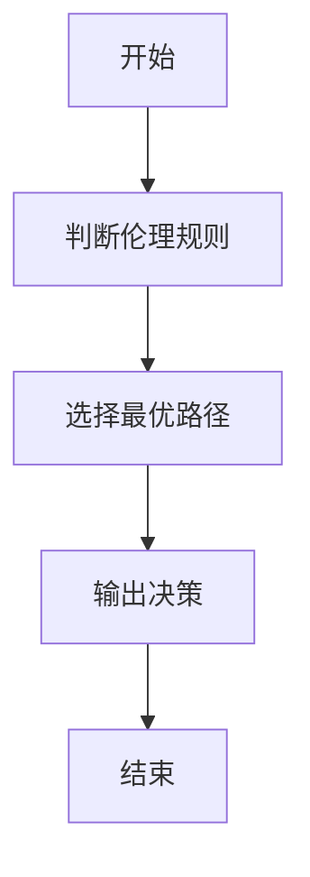
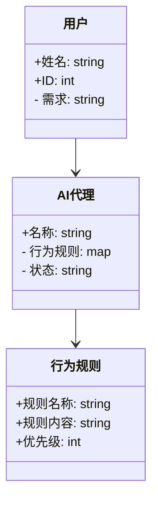
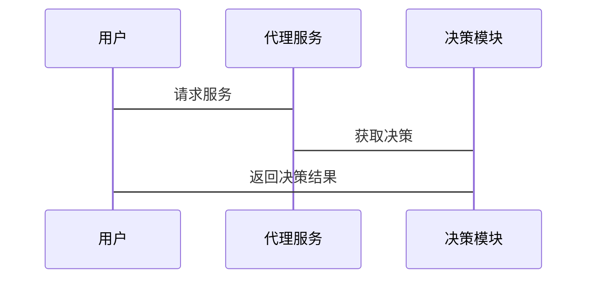

                 


# 伦理设计：构建负责任的AI Agent

**关键词**：伦理设计, AI Agent, 责任, 算法原理, 系统架构

**摘要**：  
随着人工智能技术的快速发展，AI Agent（智能体）在各个领域的应用越来越广泛。然而，AI Agent的行为可能会对社会、伦理和法律产生深远影响。本文将深入探讨如何通过伦理设计构建负责任的AI Agent。通过分析伦理设计的核心概念、算法原理、系统架构以及实际案例，本文旨在为AI Agent的开发和应用提供一种系统化的方法，确保其在实现功能的同时，符合伦理规范，承担相应的责任。

---

# 正文

## 第一部分：背景介绍

### 第1章：伦理设计的核心概念

#### 1.1 问题背景与描述
人工智能技术的快速发展为社会带来了巨大的便利，但同时也带来了新的挑战。AI Agent作为一种能够自主决策和执行任务的智能体，其行为可能会对人类社会产生深远的影响。例如，自动驾驶汽车的决策可能影响交通安全，医疗AI的决策可能影响患者的生命健康。因此，如何确保AI Agent的行为符合伦理规范，成为了一个亟待解决的问题。

#### 1.2 核心概念与结构
伦理设计是指在AI Agent的设计和开发过程中，融入伦理考量，确保其行为符合社会伦理规范。伦理设计的核心要素包括：
1. **伦理决策**：AI Agent在决策过程中考虑伦理规则。
2. **责任分配**：明确AI Agent及其开发者在行为中的责任归属。
3. **伦理框架**：构建一套指导AI Agent行为的伦理准则和规则。

通过这些要素的结合，伦理设计能够帮助AI Agent在复杂场景中做出符合伦理的决策。

---

## 第二部分：核心概念与联系

### 第2章：伦理设计的核心概念

#### 2.1 核心概念原理
伦理设计的原理可以从以下几个方面进行分析：
1. **伦理决策的数学模型**：将伦理规则转化为数学表达式，用于指导AI Agent的决策过程。
2. **责任分配的理论基础**：基于伦理学理论，明确AI Agent在不同场景中的责任归属。
3. **伦理框架的设计原则**：构建一套通用的伦理框架，适用于不同类型的AI Agent。

#### 2.2 核心概念属性对比
为了更好地理解伦理设计的核心概念，我们可以从以下几个方面进行对比分析：

| **属性**      | **伦理决策**       | **责任分配**       | **伦理框架**       |
|----------------|--------------------|--------------------|--------------------|
| **目标**      | 生成符合伦理的决策 | 确定责任归属       | 指导AI行为         |
| **输入**      | 伦理规则、场景     | 行为结果、规则     | 伦理准则           |
| **输出**      | 决策结果           | 责任主体           | 行为规范           |

#### 2.3 ER实体关系图
通过ER图，我们可以更直观地理解伦理设计的核心概念：

```mermaid
er
    actor: 用户
    agent: AI代理
    action: 行为
    decision: 决策
    rule: 伦理规则
    responsibility: 责任
    outcome: 结果
    actor --> action
    action --> decision
    decision --> outcome
    decision --> rule
    rule --> responsibility
    responsibility --> agent
```

---

## 第三部分：算法原理

### 第3章：伦理设计的算法原理

#### 3.1 算法原理讲解
伦理设计的算法原理可以通过以下步骤实现：

1. **伦理规则匹配**：AI Agent根据当前场景匹配适用的伦理规则。
2. **决策树构建**：基于伦理规则构建决策树，用于指导决策过程。
3. **责任分配**：根据决策结果分配责任。

#### 3.2 算法实现
以下是基于伦理框架的决策树算法实现：



#### 3.3 算法数学模型
伦理决策的数学模型可以表示为：

$$
\text{决策} = \arg\min_{d \in D} \{ L(d) \}
$$

其中，$D$ 是决策集合，$L(d)$ 是决策 $d$ 的伦理损失函数。通过最小化伦理损失函数，AI Agent可以生成符合伦理规范的决策。

---

## 第四部分：系统分析与架构设计

### 第4章：系统架构设计

#### 4.1 领域模型设计
以下是AI Agent的领域模型：



#### 4.2 系统架构设计
以下是系统的整体架构图：


#### 4.3 接口设计与交互流程
以下是系统交互的流程图：



---

## 第五部分：项目实战

### 第5章：项目实战与案例分析

#### 5.1 环境安装
为了实现伦理设计的AI Agent，我们需要以下环境：
- Python 3.8+
- Mermaid图示工具
- 数据库（如MySQL）

#### 5.2 核心功能实现
以下是伦理决策模块的Python代码实现：

```python
class EthicalAgent:
    def __init__(self, rules):
        self.rules = rules

    def decide(self, scenario):
        # 匹配适用的规则
        applicable_rules = [rule for rule in self.rules if rule.applies(scenario)]
        # 选择最优规则
        if applicable_rules:
            return applicable_rules[0].apply(scenario)
        else:
            return default_decision(scenario)
```

#### 5.3 案例分析
以自动驾驶汽车为例，假设一辆自动驾驶汽车在紧急情况下需要做出决策：

1. **场景描述**：前方突然出现行人，车辆需要紧急制动或转向。
2. **伦理规则**：优先保护行人生命安全。
3. **决策过程**：AI Agent根据伦理规则做出决策，选择紧急制动。
4. **结果分析**：虽然可能造成车辆损坏，但保护了行人生命安全，符合伦理规范。

---

## 第六部分：总结与展望

### 第6章：总结与最佳实践

#### 6.1 小结
通过伦理设计，我们可以构建负责任的AI Agent，确保其行为符合伦理规范。本文从核心概念、算法原理、系统架构到实际案例，全面分析了伦理设计的实现方法。

#### 6.2 最佳实践
1. 在AI Agent的设计过程中，始终优先考虑伦理规范。
2. 定期更新伦理规则，以适应社会价值观的变化。
3. 建立责任追溯机制，明确各方的责任归属。

#### 6.3 注意事项
- 伦理设计需要结合具体场景，避免一刀切。
- 在实现过程中，要注意算法的可解释性，确保决策过程透明。

#### 6.4 拓展阅读
- 《伦理与人工智能》
- 《负责任的人工智能设计》

---

**结语**  
伦理设计是构建负责任的AI Agent的关键。通过本文的分析，我们希望能够为AI Agent的开发提供一种系统化的方法，确保其在实现功能的同时，符合伦理规范，承担相应的责任。

