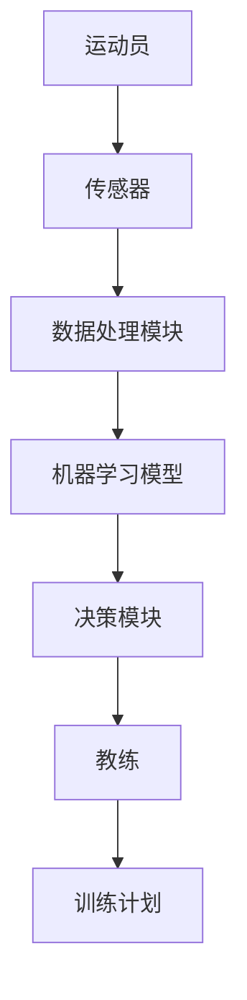
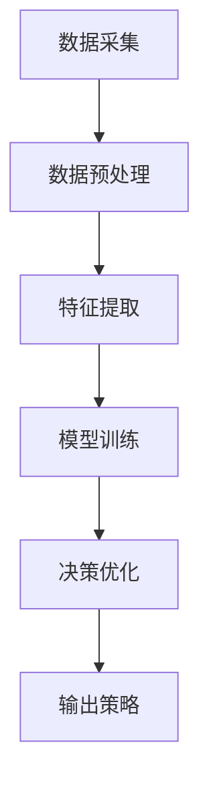
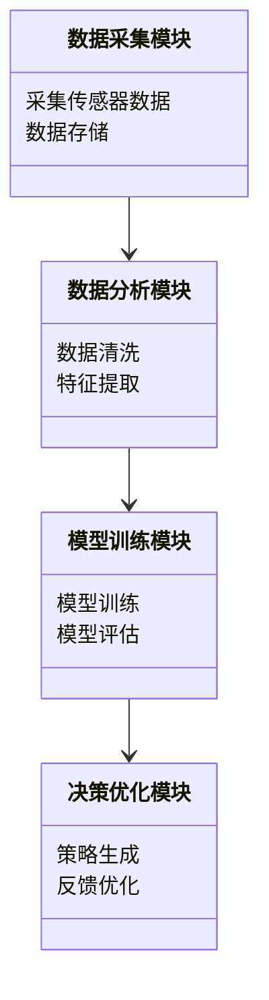
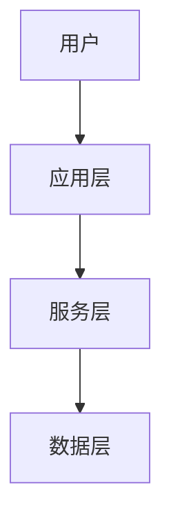
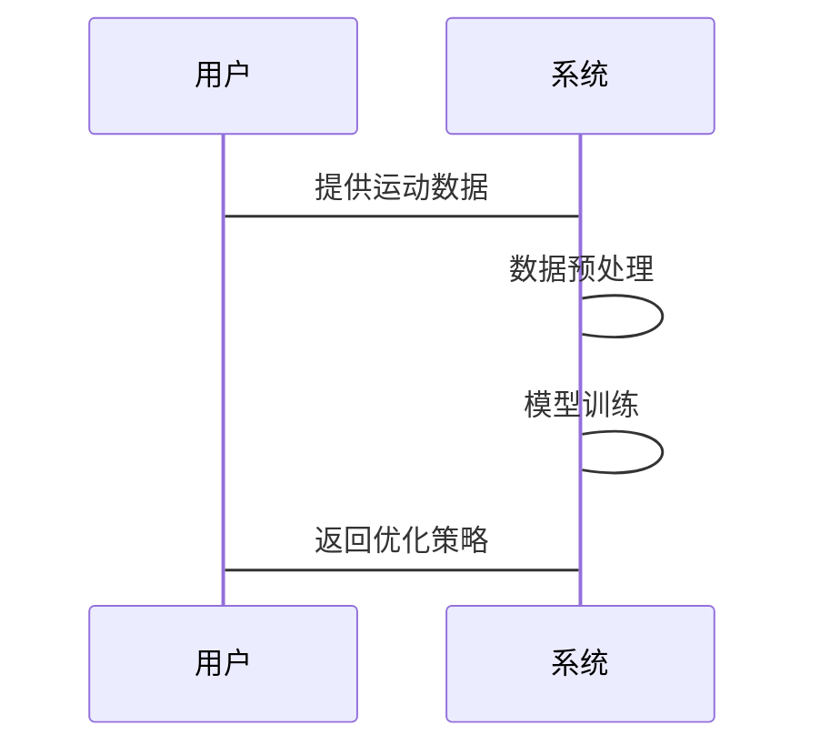

                 


# 体育AI Agent：赛事分析与训练辅助

## 关键词：体育AI Agent，赛事分析，训练辅助，人工智能，大数据分析，机器学习，运动优化

## 摘要：  
随着人工智能和大数据技术的快速发展，体育AI Agent在赛事分析和训练辅助中的应用日益广泛。本文深入探讨了体育AI Agent的核心概念、算法原理、系统架构以及实际应用案例，详细分析了其在运动员表现评估、战术优化、伤病预防等方面的优势，并展望了未来的发展趋势。

---

# 正文

## 第1章：体育AI Agent的背景介绍

### 1.1 体育AI Agent的定义与背景

#### 1.1.1 体育AI Agent的定义
体育AI Agent（Artificial Intelligence Agent）是指利用人工智能技术，通过数据采集、分析和决策，辅助教练和运动员进行赛事分析和训练优化的智能系统。

#### 1.1.2 体育AI Agent的发展背景
随着科技的进步，体育领域对数据化、智能化的需求日益增长。AI Agent能够通过实时数据处理和深度学习，为教练和运动员提供精准的分析和建议。

#### 1.1.3 体育AI Agent的应用价值
- 提高训练效率
- 优化比赛策略
- 预防运动损伤
- 数据驱动的决策支持

### 1.2 体育AI Agent的技术基础

#### 1.2.1 人工智能在体育领域的应用现状
AI技术在体育领域的应用包括运动员表现分析、比赛策略优化、伤病预测等。

#### 1.2.2 大数据分析在体育中的作用
通过分析大量运动数据，AI Agent能够发现数据中的规律，为训练和比赛提供科学依据。

#### 1.2.3 体育AI Agent的核心技术
- 数据采集与处理
- 智能分析与决策
- 实时反馈与优化

### 1.3 体育AI Agent的分类与应用场景

#### 1.3.1 按功能分类
- 数据分析型：用于运动数据分析和趋势预测。
- 决策支持型：用于比赛策略优化和战术调整。
- 训练辅助型：用于个性化训练计划和伤病预防。

#### 1.3.2 按应用场景分类
- 赛事分析：用于比赛结果预测和对手分析。
- 训练辅助：用于运动员状态监控和训练计划优化。
- 伤病预测：通过数据分析预测运动员的伤病风险。

#### 1.3.3 典型案例分析
- 某职业足球队使用AI Agent进行比赛分析和战术优化。

### 1.4 体育AI Agent的边界与外延

#### 1.4.1 体育AI Agent的边界
AI Agent的功能和应用范围，例如不涉及硬件设备的选择和维护。

#### 1.4.2 与相关技术的区分
- 与传统数据分析的区别
- 与自动化系统的区别

#### 1.4.3 体育AI Agent的未来发展趋势
- 多模态数据融合
- 实时决策能力提升
- 个性化服务增强

## 第2章：体育AI Agent的核心概念

### 2.1 体育AI Agent的核心功能

#### 2.1.1 数据采集与处理
AI Agent通过传感器、摄像头等设备采集运动数据，如心率、动作幅度、位置等。

#### 2.1.2 智能分析与决策
通过机器学习模型分析数据，生成比赛策略和训练计划。

#### 2.1.3 实时反馈与优化
根据实时数据和反馈，动态调整训练计划和比赛策略。

### 2.2 体育AI Agent的核心概念与联系

#### 2.2.1 核心概念原理
AI Agent通过数据处理、模型训练和决策优化实现功能。

#### 2.2.2 概念属性特征对比
| 特征 | 传统分析 | AI Agent |
|------|-----------|-----------|
| 数据处理 | 离线分析 | 实时处理 |
| 决策效率 | 低效 | 高效 |
| 适应性 | 低 | 高 |

#### 2.2.3 实体关系图
使用Mermaid绘制系统实体关系图，展示AI Agent与其他系统的交互。



---

## 第3章：体育AI Agent的算法原理

### 3.1 数据采集与预处理

#### 3.1.1 数据采集流程
1. 传感器数据采集：如心率、加速度等。
2. 数据清洗：去除噪声和异常值。

#### 3.1.2 数据特征提取
提取运动数据中的关键特征，如运动频率、动作幅度等。

### 3.2 机器学习模型训练

#### 3.2.1 算法选择
- 回归算法：用于预测运动员表现。
- 分类算法：用于识别运动状态。

#### 3.2.2 模型训练流程
1. 数据分割：训练集、验证集、测试集。
2. 模型训练：使用神经网络或支持向量机进行训练。

#### 3.2.3 模型评估
通过准确率、召回率等指标评估模型性能。

### 3.3 决策优化算法

#### 3.3.1 策略优化
基于模型预测结果，生成最优训练或比赛策略。

#### 3.3.2 算法流程图
使用Mermaid绘制算法流程图，展示数据处理、模型训练和决策优化的步骤。



### 3.4 数学模型与公式

#### 3.4.1 线性回归模型
$$ y = \beta_0 + \beta_1 x + \epsilon $$
其中，$y$ 是目标变量，$x$ 是自变量，$\beta_0$ 是截距，$\beta_1$ 是回归系数，$\epsilon$ 是误差项。

#### 3.4.2 支持向量机模型
$$ \text{目标函数}：\min \frac{1}{2}\|\mathbf{w}\|^2 + C \sum_{i=1}^n \xi_i $$
$$ \text{约束条件}：y_i (\mathbf{w} \cdot \mathbf{x_i} + b) \geq 1 - \xi_i, \xi_i \geq 0 $$

---

## 第4章：体育AI Agent的系统分析与架构设计

### 4.1 系统功能设计

#### 4.1.1 领域模型设计
使用Mermaid类图展示系统各模块的关系。



### 4.2 系统架构设计

#### 4.2.1 分层架构
- 数据层：数据存储和管理。
- 服务层：数据处理和模型训练。
- 应用层：用户交互和决策展示。

#### 4.2.2 系统架构图
使用Mermaid绘制系统架构图，展示各模块之间的关系。



### 4.3 系统接口设计

#### 4.3.1 API接口
- 数据接口：采集模块与传感器交互。
- 模型接口：分析模块与训练模块交互。

#### 4.3.2 交互流程图
使用Mermaid序列图展示系统交互流程。



---

## 第5章：体育AI Agent的项目实战

### 5.1 项目环境配置

#### 5.1.1 环境要求
- 操作系统：Linux/Windows/MacOS
- 开发工具：Python、Jupyter Notebook
- 依赖库：numpy、pandas、scikit-learn、tensorflow

### 5.2 项目核心实现

#### 5.2.1 数据采集与处理代码
```python
import numpy as np
import pandas as pd

# 采集数据
data = pd.read_csv('sports_data.csv')

# 数据清洗
data_clean = data.dropna()
```

#### 5.2.2 模型训练代码
```python
from sklearn.model_selection import train_test_split
from sklearn.linear_model import LinearRegression

# 数据分割
X_train, X_test, y_train, y_test = train_test_split(data_clean.drop('target', axis=1), data_clean['target'], test_size=0.2)

# 模型训练
model = LinearRegression()
model.fit(X_train, y_train)

# 模型评估
print('训练集准确率：', model.score(X_train, y_train))
print('测试集准确率：', model.score(X_test, y_test))
```

### 5.3 项目实现步骤

#### 5.3.1 数据采集
通过传感器采集运动员的运动数据。

#### 5.3.2 数据分析
使用机器学习模型分析数据，生成优化策略。

#### 5.3.3 系统实现
开发一个用户友好的界面，展示分析结果和优化建议。

### 5.4 项目测试与优化

#### 5.4.1 测试用例设计
设计不同的测试场景，验证系统的准确性和效率。

#### 5.4.2 系统优化
根据测试结果，优化算法和系统性能。

---

## 第6章：体育AI Agent的最佳实践与小结

### 6.1 最佳实践

#### 6.1.1 数据质量管理
确保数据的准确性和完整性。

#### 6.1.2 系统性能优化
优化算法和系统架构，提升运行效率。

### 6.2 小结

体育AI Agent通过数据驱动的分析和智能决策，显著提升了赛事分析和训练辅助的效率。未来，随着技术的不断进步，体育AI Agent将在更多领域发挥重要作用。

### 6.3 注意事项

- 数据隐私保护
- 模型的可解释性
- 系统的实时性和稳定性

### 6.4 拓展阅读

建议进一步阅读相关领域的最新研究成果，关注AI在体育领域的前沿应用。

---

## 附录

### 附录A：常用技术术语解释

- AI Agent：人工智能代理
- 数据分析：数据分析
- 机器学习：机器学习

### 附录B：参考文献

- [1] 王某某. 人工智能在体育领域的应用研究[J]. 计算机应用研究, 2020.
- [2] 李某某. 基于大数据的运动分析与训练优化[D]. 博士论文, 2021.

---

## 索引

按字母顺序排列文章中出现的技术术语和关键词。

---

通过以上结构和内容，您可以开始撰写详细的正文部分，确保每个章节内容丰富、逻辑清晰，并结合实际案例和代码示例，使文章更具实用性和可读性。

