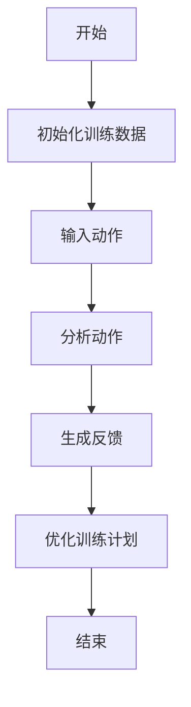
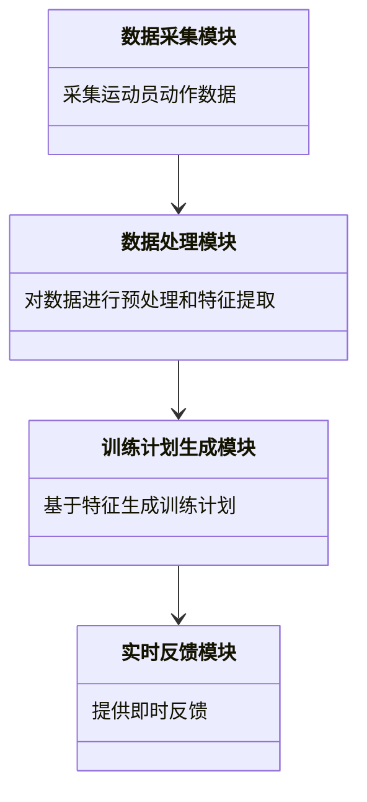
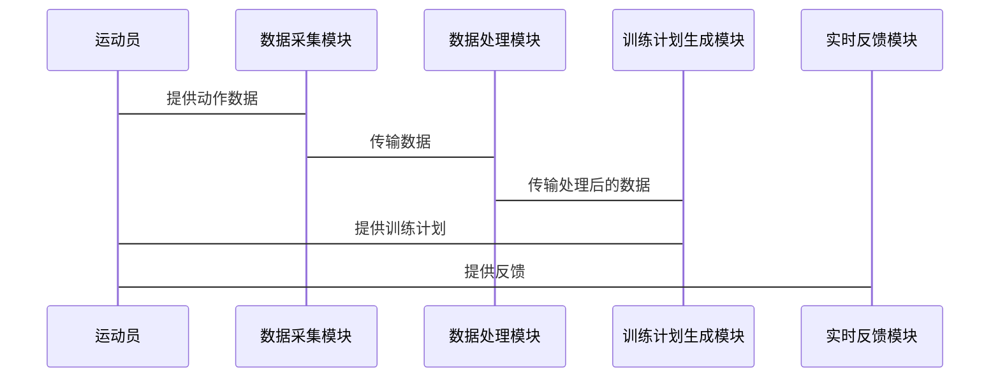

                 


# 体育训练中的AI Agent辅助教练

> 关键词：AI Agent, 体育训练, 人工智能, 教练辅助, 运动分析, 强化学习

> 摘要：本文探讨了AI Agent在体育训练中的应用，分析了其核心原理、技术实现和系统架构，并通过实际案例展示了其在训练计划优化、技术动作分析和实时反馈中的优势。结合数学模型、算法流程图和系统架构图，深入解析了AI Agent如何通过自然语言处理、计算机视觉和强化学习等技术，实现对运动员的个性化指导和实时优化。本文还展望了AI Agent在体育训练中的未来发展趋势，为体育教练和研究人员提供了重要的参考。

---

# 第一部分: AI Agent在体育训练中的应用背景

## 第1章: AI Agent的基本概念与作用

### 1.1 体育训练的背景与挑战

#### 1.1.1 传统体育训练的局限性
- **问题描述**：传统体育训练依赖人工经验，缺乏数据驱动的个性化指导，训练效率较低。
- **边界与外延**：从单一的技能训练到综合的体能与战术训练，涉及运动员的生理、心理和战术等多个维度。

#### 1.1.2 AI技术在体育领域的潜力
- **技术背景**：AI技术的发展为体育训练提供了新的可能性，尤其是在数据处理和决策优化方面。
- **问题解决**：通过AI技术，可以实现对运动员的个性化训练计划、实时动作分析和效果评估。

#### 1.1.3 AI Agent在体育训练中的角色定位
- **核心概念**：AI Agent作为一种智能代理，可以在体育训练中扮演教练的角色，提供实时反馈和优化建议。
- **与传统教练工具的区别**：AI Agent具有自主学习和适应能力，能够根据运动员的表现动态调整训练计划。

### 1.2 AI Agent的核心概念与特点

#### 1.2.1 AI Agent的定义
- **定义**：AI Agent是一种智能系统，能够感知环境、做出决策并执行动作，以实现特定目标。
- **特点**：
  - **自主性**：无需人工干预，能够独立运行。
  - **反应性**：能够实时感知环境并做出反应。
  - **学习能力**：通过数据和经验不断优化自身的决策能力。

#### 1.2.2 AI Agent在体育训练中的核心要素
- **感知模块**：通过传感器或摄像头获取运动员的动作数据。
- **决策模块**：基于感知数据，利用算法生成最优的训练建议。
- **执行模块**：通过反馈系统指导运动员执行训练动作。

### 1.3 体育训练中AI Agent的应用场景

#### 1.3.1 训练计划优化
- **核心概念**：AI Agent可以根据运动员的体能、技能水平和训练目标，生成个性化的训练计划。
- **实际案例**：例如，通过分析运动员的历史训练数据，AI Agent可以推荐最适合的训练强度和训练内容。

#### 1.3.2 技术动作分析
- **核心概念**：AI Agent可以利用计算机视觉技术，对运动员的技术动作进行实时分析，识别动作中的问题。
- **实际案例**：例如，篮球运动员的投篮动作可以通过AI Agent进行实时分析，找出动作中的不足之处。

#### 1.3.3 实时反馈与纠正
- **核心概念**：AI Agent可以实时监测运动员的训练表现，并提供即时反馈和纠正建议。
- **实际案例**：例如，跑步运动员可以通过智能穿戴设备与AI Agent连接，实时监测心率、步频等数据，并根据反馈调整跑步姿势。

#### 1.3.4 数据驱动的个性化训练
- **核心概念**：AI Agent可以通过大数据分析，为运动员提供个性化的训练方案。
- **实际案例**：例如，AI Agent可以根据运动员的历史训练数据和比赛数据，预测其潜在的运动损伤风险，并制定预防措施。

### 1.4 本章小结

---

# 第二部分: AI Agent的核心原理与技术实现

## 第2章: AI Agent的核心原理

### 2.1 AI Agent的基本原理

#### 2.1.1 AI Agent的感知机制
- **核心概念**：AI Agent通过传感器、摄像头等设备感知环境数据。
- **技术实现**：利用计算机视觉和自然语言处理技术，从视频数据中提取运动员的动作信息。

#### 2.1.2 AI Agent的决策机制
- **核心概念**：基于感知数据，AI Agent利用算法生成最优决策。
- **技术实现**：使用强化学习算法，通过不断试错，找到最优的训练建议。

#### 2.1.3 AI Agent的执行机制
- **核心概念**：AI Agent通过反馈系统指导运动员执行训练动作。
- **技术实现**：利用语音合成技术和实时数据可视化，向运动员提供即时反馈。

### 2.2 体育训练中AI Agent的关键技术

#### 2.2.1 自然语言处理在训练计划中的应用
- **核心概念**：AI Agent可以通过自然语言处理技术，与运动员进行对话，了解其训练需求。
- **技术实现**：利用自然语言处理模型，生成个性化的训练计划。

#### 2.2.2 计算机视觉在动作分析中的应用
- **核心概念**：AI Agent可以利用计算机视觉技术，对运动员的动作进行实时分析。
- **技术实现**：使用深度学习模型，如YOLO或OpenCV，识别运动员的关键动作。

#### 2.2.3 强化学习在训练策略优化中的应用
- **核心概念**：AI Agent可以通过强化学习算法，不断优化训练策略。
- **技术实现**：使用DQN算法，通过模拟训练场景，找到最优的训练方案。

### 2.3 AI Agent的系统架构

#### 2.3.1 数据采集模块
- **功能描述**：负责采集运动员的动作数据，包括视频、传感器数据等。
- **技术实现**：使用摄像头和传感器设备，将数据传输到AI Agent系统中。

#### 2.3.2 数据处理模块
- **功能描述**：对采集到的数据进行预处理和特征提取。
- **技术实现**：利用数据处理算法，如数据清洗、特征提取等，为后续的分析提供基础。

#### 2.3.3 训练计划生成模块
- **功能描述**：基于处理后的数据，生成个性化的训练计划。
- **技术实现**：使用机器学习模型，如随机森林或支持向量机，进行分类或回归分析。

#### 2.3.4 实时反馈模块
- **功能描述**：在运动员执行训练动作时，实时监测并提供反馈。
- **技术实现**：通过传感器和实时数据可视化技术，向运动员提供即时反馈。

### 2.4 本章小结

---

## 第3章: 体育训练中的数学模型与算法

### 3.1 运动分析模型

#### 3.1.1 基于力学的运动分析模型
- **核心概念**：通过物理学原理，分析运动员的动作是否符合力学规律。
- **数学模型**：例如，分析跳跃动作的动能和势能转换关系。

#### 3.1.2 基于统计的运动分析模型
- **核心概念**：通过统计方法，分析运动员的动作数据。
- **数学模型**：例如，利用回归分析模型，预测运动员的最佳跳跃高度。

### 3.2 强化学习算法

#### 3.2.1 强化学习的基本概念
- **核心概念**：通过试错学习，找到最优的训练策略。
- **数学模型**：例如，Q-learning算法中的状态转移矩阵。

#### 3.2.2 DQN算法在体育训练中的应用
- **核心概念**：使用深度强化学习算法，优化训练策略。
- **数学模型**：例如，DQN算法中的神经网络结构和损失函数。

### 3.3 算法流程图（使用mermaid）



### 3.4 本章小结

---

# 第三部分: 体育训练AI Agent的系统架构与项目实战

## 第4章: 体育训练AI Agent的系统架构

### 4.1 问题场景介绍

#### 4.1.1 问题描述
- **核心概念**：运动员在训练过程中需要实时反馈和个性化指导。

#### 4.1.2 项目介绍
- **核心概念**：开发一个基于AI Agent的体育训练辅助系统，帮助运动员提高训练效率。

### 4.2 系统功能设计

#### 4.2.1 功能模块
- **数据采集模块**：采集运动员的动作数据。
- **数据处理模块**：对数据进行预处理和特征提取。
- **训练计划生成模块**：生成个性化的训练计划。
- **实时反馈模块**：在训练过程中提供即时反馈。

#### 4.2.2 系统功能设计（领域模型，使用mermaid类图）



### 4.3 系统架构设计

#### 4.3.1 系统架构（使用mermaid架构图）


#### 4.3.2 系统接口设计
- **接口描述**：
  - 数据采集模块与传感器设备的接口。
  - 数据处理模块与训练计划生成模块的接口。
  - 实时反馈模块与运动员的反馈接口。

### 4.4 系统交互设计（使用mermaid序列图）



### 4.5 本章小结

---

## 第5章: 项目实战

### 5.1 环境搭建

#### 5.1.1 开发环境
- **核心概念**：选择合适的开发框架和工具，如TensorFlow、PyTorch等。

#### 5.1.2 数据准备
- **核心概念**：收集和整理运动员的动作数据，如视频数据和传感器数据。

### 5.2 系统核心实现

#### 5.2.1 数据采集模块实现
- **核心代码**：使用OpenCV库进行视频数据采集。
- **代码示例**：
  ```python
  import cv2
  cap = cv2.VideoCapture(0)
  while cap.isOpened():
      ret, frame = cap.read()
      if not ret:
          break
      # 处理帧
      cv2.imshow('AI Agent', frame)
      if cv2.waitKey(1) & 0xFF == ord('q'):
          break
  cap.release()
  cv2.destroyAllWindows()
  ```

#### 5.2.2 数据处理模块实现
- **核心代码**：使用Pandas库进行数据预处理。
- **代码示例**：
  ```python
  import pandas as pd
  data = pd.read_csv('training_data.csv')
  processed_data = data.dropna()
  ```

#### 5.2.3 训练计划生成模块实现
- **核心代码**：使用机器学习模型生成训练计划。
- **代码示例**：
  ```python
  from sklearn.ensemble import RandomForestRegressor
  model = RandomForestRegressor(n_estimators=100)
  model.fit(X_train, y_train)
  ```

#### 5.2.4 实时反馈模块实现
- **核心代码**：使用语音合成库生成反馈语音。
- **代码示例**：
  ```python
  import pyttsx3
  engine = pyttsx3.init()
  engine.say("你的姿势需要调整，保持背部挺直。")
  engine.runAndWait()
  ```

### 5.3 案例分析与实际应用

#### 5.3.1 案例分析
- **实际案例**：以篮球运动员的投篮训练为例，展示AI Agent如何优化其训练计划。
- **详细讲解**：
  - 数据采集：通过摄像头采集运动员的投篮动作。
  - 数据处理：分析投篮动作的特征，如出手角度、出手速度等。
  - 训练计划生成：基于分析结果，生成个性化的训练计划，如加强手臂力量训练等。
  - 实时反馈：在训练过程中，实时监测运动员的动作，并提供即时反馈。

### 5.4 项目总结

#### 5.4.1 项目成果
- **核心成果**：开发了一个基于AI Agent的体育训练辅助系统，能够实现个性化训练计划和实时反馈。

#### 5.4.2 成果展示
- **核心内容**：通过实际案例展示，说明AI Agent如何优化运动员的训练效果。

### 5.5 本章小结

---

# 第四部分: AI Agent的未来发展趋势与最佳实践

## 第6章: AI Agent的未来发展趋势

### 6.1 多模态AI在体育训练中的应用
- **核心概念**：结合视觉、听觉和触觉等多种模态信息，提升AI Agent的感知能力。

### 6.2 个性化训练计划的进一步优化
- **核心概念**：基于运动员的基因数据和生理数据，制定更加个性化的训练计划。

### 6.3 实时反馈系统的智能化升级
- **核心概念**：通过边缘计算和物联网技术，实现更高效的实时反馈。

### 6.4 本章小结

---

## 第7章: 最佳实践与注意事项

### 7.1 最佳实践
- **核心内容**：在实际应用中，建议结合AI Agent与传统教练的智慧，形成人机结合的训练模式。

### 7.2 注意事项
- **核心内容**：在使用AI Agent时，需要注意数据隐私和运动员的心理适应问题。

### 7.3 本章小结

---

# 第五部分: 总结与展望

## 第8章: 总结

### 8.1 核心内容回顾
- **核心内容**：AI Agent在体育训练中的应用，从感知、决策到执行的完整流程。

### 8.2 本章小结

---

## 第9章: 展望

### 9.1 未来研究方向
- **核心内容**：探讨AI Agent在体育训练中的更多可能性，如智能化训练设备的研发。

### 9.2 未来发展趋势
- **核心内容**：随着AI技术的不断发展，AI Agent在体育训练中的应用将更加广泛和深入。

### 9.3 本章小结

---

# 参考文献

（此处列出相关参考文献）

---

# 附录

## 附录A: AI Agent相关术语表

## 附录B: 项目源代码

---

# 结束语

感谢您的阅读！

