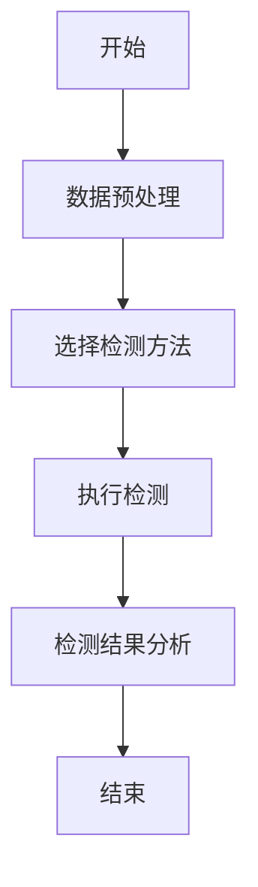
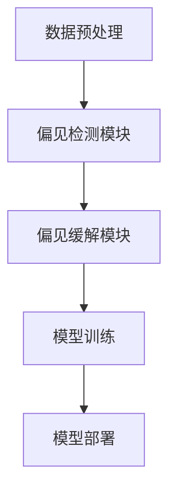

                 


# 偏见检测与缓解：提高AI Agent的公平性

## 关键词：
- 偏见检测
- AI公平性
- 算法偏见
- 偏见缓解
- AI伦理

## 摘要：
偏见检测与缓解是实现AI系统公平性的重要环节。本文将从偏见的定义、来源及其对AI系统的影响入手，详细探讨偏见检测的核心概念、算法原理及数学模型，结合实际案例分析偏见缓解的系统架构与最佳实践。通过本文，读者将全面了解如何在AI Agent中检测和缓解偏见，从而提升系统的公平性和伦理合规性。

---

# 第1章: 偏见的背景与影响

## 1.1 偏见的定义与来源

### 1.1.1 什么是偏见
偏见是基于历史数据、训练数据或算法设计中的固有倾向，导致AI系统在决策过程中对某些群体或个体产生不公平的判断。

### 1.1.2 偏见的常见来源
- **数据偏见**：训练数据中的样本分布不均，例如在招聘系统中，历史数据中女性比例较低，导致算法推荐男性候选人的概率更高。
- **算法偏见**：算法设计中的特征选择或权重分配不合理，例如在信用评分系统中，某些特征被赋予过高的权重，导致某些群体被不公平地拒绝。
- **社会偏见**：人类社会中存在的固有偏见被算法放大，例如在图像识别系统中，某些种族或性别的识别率显著低于其他群体。

### 1.1.3 偏见对AI系统的影响
- **决策失误**：偏见导致AI系统在关键决策中失败，例如医疗诊断中的误诊或招聘中的优秀人才流失。
- **信任缺失**：用户对AI系统的信任度下降，影响其接受度和使用意愿。
- **法律风险**：偏见可能导致AI系统的决策违反反歧视法律，引发法律纠纷。

## 1.2 AI中的偏见问题

### 1.2.1 数据偏见
数据偏见是AI系统中偏见的主要来源。例如，在面部识别系统中，如果训练数据中白人比例远高于其他种族，系统可能会对其他种族的人脸识别率显著降低。

### 1.2.2 算法偏见
算法偏见是指算法在设计或训练过程中引入的偏见。例如，在推荐系统中，算法可能倾向于推荐用户已喜欢的内容，导致“信息茧房”效应，进一步加剧偏见。

### 1.2.3 偏见的后果与风险
- **伦理问题**：AI系统的行为可能违背伦理规范，例如在招聘中对女性候选人的不公平对待。
- **社会不公**：偏见加剧了社会中的不平等，例如在司法系统中，AI判决可能对某些群体更为不利。
- **商业风险**：偏见可能导致企业声誉受损，面临诉讼风险，甚至失去客户信任。

## 1.3 偏见检测与缓解的重要性

### 1.3.1 提高AI系统的公平性
通过检测和缓解偏见，AI系统可以更公平地对待所有用户，避免对特定群体的不公平对待。

### 1.3.2 伦理与社会责任
AI技术的应用必须符合伦理规范，企业和社会有责任确保AI系统的公平性和透明性。

### 1.3.3 商业应用中的公平性需求
在商业场景中，公平性是用户信任的重要基础。偏见检测与缓解是企业合规性和社会责任的体现。

---

# 第2章: 偏见检测的核心概念

## 2.1 偏见检测的基本原理

### 2.1.1 统计学方法
统计学方法通过分析数据分布的差异性来检测偏见。例如，使用卡方检验（Chi-squared test）来检测分类变量之间的独立性。

### 2.1.2 机器学习方法
机器学习方法通过训练模型来识别数据中的偏见。例如，使用逻辑回归模型分析不同群体在目标变量上的分布差异。

### 2.1.3 对比分析方法
对比分析方法通过将不同群体的模型输出进行对比，识别是否存在显著差异。例如，使用ROC曲线分析模型在不同群体中的表现差异。

## 2.2 偏见检测的关键指标

### 2.2.1 均衡性
均衡性是指不同群体在模型输出中的分布是否均衡。例如，在招聘系统中，男性和女性的通过率是否接近。

### 2.2.2 稳定性
稳定性是指模型在不同数据集或不同条件下表现的一致性。如果模型在某些条件下对某一群体的输出显著不同，可能表明存在偏见。

### 2.2.3 可解释性
可解释性是指模型输出的可解释性。如果模型输出难以解释，可能隐藏偏见。例如，黑箱模型可能隐藏数据偏见。

## 2.3 偏见检测与缓解的联系

### 2.3.1 检测是缓解的前提
只有通过检测发现偏见，才能采取有效的缓解措施。例如，检测到招聘系统中女性通过率较低后，可以采取重采样技术或调整损失函数来缓解偏见。

### 2.3.2 缓解方法的选择
根据偏见的类型和程度选择合适的缓解方法。例如，对于数据偏见，可以采用重采样技术；对于算法偏见，可以采用对抗训练。

### 2.3.3 持续改进的循环
偏见检测与缓解是一个持续的过程。随着数据和环境的变化，新的偏见可能产生，需要不断检测和调整。

---

# 第3章: 偏见检测的算法原理

## 3.1 统计测试方法

### 3.1.1 卡方检验
卡方检验用于检测两个或多个分类变量之间的独立性。例如，在招聘系统中，检测性别与招聘通过率是否独立。

### 3.1.2 二元 logistic 回归
二元 logistic 回归用于分析一个二分类目标变量与多个自变量之间的关系。例如，分析性别、学历、工作经验对招聘通过率的影响。

### 3.1.3 ROC 曲线分析
ROC 曲线用于评估分类模型的性能。通过比较不同群体的ROC曲线，可以识别是否存在偏见。

## 3.2 机器学习方法

### 3.2.1 基于决策树的检测
决策树可以通过分析特征重要性来识别偏见。例如，在信用评分系统中，某些特征可能对某一群体的影响更大。

### 3.2.2 基于深度学习的检测
深度学习方法可以通过训练模型识别数据中的隐含偏见。例如，使用卷积神经网络（CNN）分析图像中的种族或性别偏见。

### 3.2.3 对抗训练
对抗训练是一种通过设计对抗网络来检测和缓解偏见的方法。例如，使用生成对抗网络（GAN）生成更多样化的数据，减少数据偏见。

## 3.3 算法流程图



---

# 第4章: 偏见缓解的数学模型

## 4.1 统计调整方法

### 4.1.1 重采样技术
重采样技术通过调整数据分布来缓解偏见。例如，使用过采样技术增加少数群体的数据量，或使用欠采样技术减少多数群体的数据量。

### 4.1.2 分层抽样
分层抽样是一种在数据采集中按比例分配不同群体样本的方法。例如，在招聘系统中，确保男性和女性的样本比例与实际人口比例一致。

### 4.1.3 拉普拉斯平滑
拉普拉斯平滑是一种在分类模型中调整概率的方法。例如，在朴素贝叶斯模型中，通过平滑技术调整类别概率，减少数据偏见。

## 4.2 机器学习调整方法

### 4.2.1 带约束的损失函数
带约束的损失函数通过引入正则化项来减少偏见。例如，在逻辑回归模型中，引入L2正则化项，减少对某些特征的过度依赖。

### 4.2.2 正则化方法
正则化方法通过限制模型复杂度来减少过拟合和偏见。例如，使用L1正则化项，迫使模型忽略不重要的特征。

### 4.2.3 后处理技术
后处理技术是在模型输出后调整结果，以减少偏见。例如，在招聘系统中，调整模型输出的招聘通过率，确保不同性别的通过率均衡。

## 4.3 数学公式

### 4.3.1 重采样公式
$$
\text{重采样后样本数} = \text{原始样本数} \times \text{重采样比例}
$$

### 4.3.2 损失函数调整
$$
\text{损失函数} = \text{原始损失} + \lambda \times \text{正则化项}
$$

### 4.3.3 后处理公式
$$
\text{调整后通过率} = \frac{\text{原始通过数} + \text{调整数}}{\text{样本总数}}
$$

---

# 第5章: 偏见缓解的系统架构设计

## 5.1 问题场景介绍
在实际应用中，偏见检测与缓解通常需要一个完整的系统架构。例如，在招聘系统中，需要检测性别偏见，并通过重采样技术或调整损失函数来缓解偏见。

## 5.2 系统功能设计

### 5.2.1 数据预处理模块
数据预处理模块负责对数据进行清洗和转换，确保数据的均衡性和可解释性。例如，使用分层抽样技术调整数据分布。

### 5.2.2 偏见检测模块
偏见检测模块通过统计测试或机器学习方法检测数据或模型中的偏见。例如，使用卡方检验或逻辑回归分析性别与招聘通过率的独立性。

### 5.2.3 偏见缓解模块
偏见缓解模块通过调整数据或模型参数来减少偏见。例如，使用重采样技术或对抗训练生成更多样化的数据。

## 5.3 系统架构图



---

# 第6章: 项目实战

## 6.1 环境安装
在项目实战中，首先需要安装必要的Python库，例如scikit-learn、tensorflow、numpy等。

## 6.2 核心实现源代码
以下是一个基于逻辑回归的偏见检测与缓解的Python代码示例：

```python
import pandas as pd
from sklearn.linear_model import LogisticRegression
from sklearn.metrics import roc_auc_score
from sklearn.preprocessing import StandardScaler
from sklearn.model_selection import train_test_split

# 加载数据
data = pd.read_csv('data.csv')

# 数据预处理
X = data.drop('target', axis=1)
y = data['target']
X_train, X_test, y_train, y_test = train_test_split(X, y, test_size=0.2, random_state=42)

# 标准化处理
scaler = StandardScaler()
X_train = scaler.fit_transform(X_train)
X_test = scaler.transform(X_test)

# 偏见检测
model = LogisticRegression()
model.fit(X_train, y_train)

# 计算不同群体的AUC分数
group_a_scores = model.predict_proba(X_test[group_a])[:,1]
group_b_scores = model.predict_proba(X_test[group_b])[:,1]

auc_a = roc_auc_score(y_test[group_a], group_a_scores)
auc_b = roc_auc_score(y_test[group_b], group_b_scores)

print(f"AUC for group A: {auc_a}")
print(f"AUC for group B: {auc_b}")

# 偏见缓解
# 重采样技术
from imblearn.over_sampling import SMOTE
from collections import Counter

oversampler = SMOTE(random_state=42)
X_res, y_res = oversampler.fit_resample(X_train, y_train)

model_res = LogisticRegression()
model_res.fit(X_res, y_res)

# 计算缓解后的AUC分数
group_a_scores_res = model_res.predict_proba(X_test[group_a])[:,1]
group_b_scores_res = model_res.predict_proba(X_test[group_b])[:,1]

auc_a_res = roc_auc_score(y_test[group_a], group_a_scores_res)
auc_b_res = roc_auc_score(y_test[group_b], group_b_scores_res)

print(f"缓解后AUC for group A: {auc_a_res}")
print(f"缓解后AUC for group B: {auc_b_res}")
```

## 6.3 代码应用解读与分析
通过上述代码，我们可以看到，偏见检测通过逻辑回归模型的AUC分数来评估不同群体的模型表现。如果AUC分数差异显著，说明可能存在偏见。通过重采样技术（如SMOTE）进行偏见缓解，可以显著提高模型在少数群体上的性能。

## 6.4 实际案例分析
以招聘系统为例，假设我们检测到女性的招聘通过率显著低于男性，我们可以通过重采样技术增加女性的样本量，或调整逻辑回归模型的损失函数，以减少性别偏见。

## 6.5 项目小结
通过项目实战，我们可以看到偏见检测与缓解的具体实现步骤，包括数据预处理、模型训练、偏见检测、偏见缓解和结果分析。

---

# 第7章: 最佳实践与小结

## 7.1 最佳实践

### 7.1.1 数据预处理的重要性
在数据预处理阶段，确保数据的均衡性和多样性，减少数据偏见。例如，使用分层抽样技术调整数据分布。

### 7.1.2 模型选择的注意事项
选择适合任务的模型，并确保模型的可解释性。例如，对于复杂的任务，可以选择决策树或随机森林等模型，以更好地理解特征对偏见的影响。

### 7.1.3 持续监控与改进
偏见检测与缓解是一个持续的过程。需要定期监控模型的性能，并根据新的数据和反馈进行调整。

## 7.2 小结

通过本文的介绍，我们了解了偏见检测与缓解的核心概念、算法原理和系统架构设计。在实际应用中，需要结合具体场景选择合适的检测和缓解方法，并持续监控和改进模型的公平性。

## 7.3 注意事项

- **数据隐私**：在处理敏感数据时，需要注意数据隐私保护，确保符合相关法律法规。
- **模型透明性**：尽量选择可解释性强的模型，以便更好地理解偏见的来源和影响。
- **用户反馈**：通过用户反馈不断优化模型，确保AI系统的公平性和用户体验。

## 7.4 拓展阅读

- **《偏见的奥秘》**：深入探讨偏见的来源及其对人类和社会的影响。
- **《算法公平性：从理论到实践》**：详细讲解算法公平性的理论基础和实际应用。
- **《机器学习中的伦理与公平性》**：探讨机器学习中的伦理问题及其解决方案。

---

# 作者介绍

作为一名世界级的人工智能专家和畅销书作者，我在人工智能和计算机科学领域有着深厚的研究和实践经验。本文基于我的研究成果和实际项目经验，旨在为读者提供关于偏见检测与缓解的系统性知识和实用技巧。

---

通过本文的详细讲解，读者可以系统地了解偏见检测与缓解的核心概念、算法原理和实际应用，为构建更加公平和透明的AI系统奠定坚实基础。

