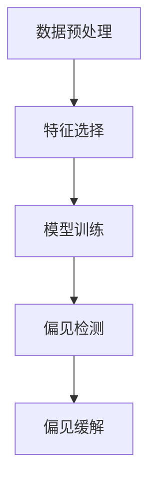
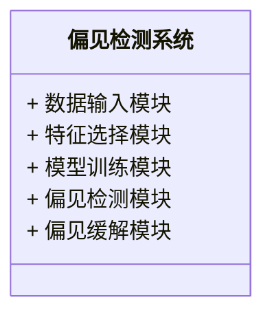
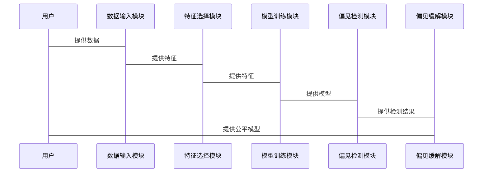

                 


```markdown
# 偏见检测与缓解：确保AI Agent的公平性

## 关键词：偏见检测、AI Agent、公平性、算法原理、系统设计、机器学习、统计学原理

## 摘要：偏见检测与缓解是确保AI Agent公平性的重要环节。本文系统地探讨了偏见检测的核心概念、算法原理、数学模型以及系统设计，结合实际案例分析，为AI开发者提供了全面的解决方案。

---

# 第1章: 偏见检测与缓解的背景介绍

## 1.1 偏见检测的背景与重要性

### 1.1.1 人工智能中的偏见问题
人工智能（AI）系统的决策依赖于训练数据和算法，而这些数据和算法可能隐含着人类社会中的偏见。例如，招聘系统中可能存在性别偏见，导致女性候选人被筛选的可能性降低。

### 1.1.2 偏见对AI Agent的影响
偏见可能导致AI Agent在决策过程中不公平对待某些群体，进而引发伦理争议和法律问题。例如，在司法判决辅助系统中，偏见可能导致某些群体被不公正对待。

### 1.1.3 偏见检测与缓解的必要性
为了确保AI Agent的公平性，必须进行偏见检测，并采取措施进行缓解。这不仅是道德要求，也是法律和社会责任。

## 1.2 偏见检测的核心概念

### 1.2.1 偏见的定义与分类
偏见是指在数据或模型中不公平地对待某些群体的现象。常见的分类包括统计偏见和算法偏见。

### 1.2.2 偏见检测的基本原理
偏见检测的核心在于识别数据或模型中不公平的模式。这需要结合统计学和机器学习方法。

### 1.2.3 偏见检测的边界与外延
偏见检测不仅关注模型本身，还包括数据收集、特征选择和模型训练等环节。

## 1.3 偏见检测的数学模型与核心要素

### 1.3.1 偏见检测的数学模型
偏见检测可以通过统计测试（如卡方检验）或机器学习模型（如Logistic回归）实现。例如，使用卡方检验判断两个变量是否独立。

$$ \chi^2 = \sum \frac{(O_{ij} - E_{ij})^2}{E_{ij}} $$

### 1.3.2 核心要素的组成与关系
偏见检测涉及数据特征、模型性能和目标变量之间的关系。例如，性别（特征）可能与贷款批准率（目标变量）相关。

### 1.3.3 偏见检测的流程与步骤
1. 数据预处理：清洗和标准化数据。
2. 特征选择：识别可能引入偏见的特征。
3. 建模：训练模型并评估其公平性。
4. 检测：使用统计方法或模型检测偏见。
5. 缓解：调整模型或数据以减少偏见。

## 1.4 本章小结
本章介绍了偏见检测的背景、核心概念和数学模型，为后续章节奠定了基础。

---

# 第2章: 偏见检测的基本原理

## 2.1 偏见检测的统计学原理

### 2.1.1 统计学基础
统计学是偏见检测的重要工具。例如，均值、方差和假设检验等概念。

### 2.1.2 偏见检测的统计方法
使用统计测试（如t检验和卡方检验）检测数据中的偏见。

### 2.1.3 偏见检测的假设检验
假设检验用于判断变量之间是否存在显著关联。例如，性别与贷款批准率是否相关。

$$ H_0: \text{性别与贷款批准率无关} $$
$$ H_1: \text{性别与贷款批准率有关} $$

## 2.2 偏见检测的机器学习方法

### 2.2.1 机器学习基础
机器学习通过训练模型来识别数据中的模式。例如，决策树和随机森林可用于分类任务。

### 2.2.2 偏见检测的特征工程
特征工程是处理数据以减少偏见的重要步骤。例如，去除敏感特征（如性别）或对特征进行标准化。

### 2.2.3 偏见检测的模型选择
选择合适的模型对偏见检测至关重要。例如，线性回归适用于连续变量，而树模型适用于分类任务。

## 2.3 偏见检测的核心概念对比

### 2.3.1 偏见检测与公平性
偏见检测旨在确保AI决策的公平性。例如，确保招聘系统中性别不影响候选人筛选。

### 2.3.2 偏见检测与可解释性
可解释性是偏见检测的关键。例如，模型决策必须透明，以便发现和纠正偏见。

### 2.3.3 偏见检测与鲁棒性
鲁棒性是指模型在面对偏见时仍能保持公平决策的能力。例如，鲁棒的模型能抵御数据分布的变化。

## 2.4 偏见检测的ER实体关系图

```mermaid
erDiagram
    偏见检测
    {
        偏见类型 <--- 偏见检测方法
        偏见检测方法 <--- 数据特征
        数据特征 <--- 数据集
    }
```

---

# 第3章: 偏见检测的算法原理

## 3.1 偏见检测算法的流程



## 3.2 统计测试法

### 3.2.1 卡方检验
卡方检验用于判断两个变量是否独立。

### 3.2.2 t检验
t检验用于比较两组数据的均值差异。

## 3.3 机器学习方法

### 3.3.1 基于决策树的偏见检测
使用决策树识别敏感特征对目标变量的影响。

### 3.3.2 基于逻辑回归的偏见检测
逻辑回归用于分类任务，同时评估模型的公平性。

## 3.4 偏见检测的Python代码实现

```python
import pandas as pd
from scipy.stats import chi2_contingency

# 加载数据
data = pd.read_csv('loan_approval.csv')

# 卡方检验
contingency_table = pd.crosstab(data['性别'], data['贷款批准'])
chi2, p, dof, exp = chi2_contingency(contingency_table)
print(f"卡方统计量: {chi2}, p值: {p}")
```

---

# 第4章: 偏见检测的数学模型

## 4.1 统计测试的数学公式

### 4.1.1 卡方检验公式
$$ \chi^2 = \sum \frac{(O_{ij} - E_{ij})^2}{E_{ij}} $$

### 4.1.2 t检验公式
$$ t = \frac{\bar{X}_1 - \bar{X}_2}{\sqrt{\frac{s_1^2}{n_1} + \frac{s_2^2}{n_2}}} $$

## 4.2 机器学习模型的数学公式

### 4.2.1 逻辑回归模型
$$ P(y=1|x) = \frac{e^{\beta x}}{1 + e^{\beta x}} $$

### 4.2.2 决策树模型
决策树通过特征分裂来分类，每一步分裂选择最小信息增益的特征。

---

# 第5章: 偏见检测的系统分析

## 5.1 问题场景介绍
系统设计一个AI Agent，确保其在招聘、信贷等场景中的公平性。

## 5.2 系统功能设计



## 5.3 系统架构设计

```mermaid
container 偏见检测系统 {
    component 数据输入模块
    component 特征选择模块
    component 模型训练模块
    component 偏见检测模块
    component 偏见缓解模块
}
```

## 5.4 系统接口设计
API接口用于数据输入和结果输出，确保系统与其他模块的交互。

## 5.5 系统交互图



---

# 第6章: 项目实战

## 6.1 环境安装
安装必要的Python库，如pandas、scipy和sklearn。

## 6.2 核心代码实现

```python
import pandas as pd
from sklearn.tree import DecisionTreeClassifier
from sklearn.metrics import accuracy_score

# 加载数据
data = pd.read_csv('loan_approval.csv')

# 特征选择
features = data[['收入', '信用评分', '贷款金额', '性别']]
target = data['贷款批准']

# 建立模型
model = DecisionTreeClassifier()
model.fit(features, target)

# 检测偏见
# 使用性别作为敏感特征
feature_importance = model.feature_importances_
print("性别特征的重要性:", feature_importance[features.columns.get_loc('性别')])
```

## 6.3 案例分析
分析性别对贷款批准率的影响，评估模型是否存在偏见。

## 6.4 项目总结
通过项目实战，掌握了偏见检测的流程和方法，能够实际应用于AI Agent的设计中。

---

# 第7章: 最佳实践与小结

## 7.1 最佳实践 tips
1. 在数据预处理阶段就关注偏见问题。
2. 使用多种方法检测和缓解偏见。
3. 定期监控和更新模型，确保公平性。

## 7.2 小结
偏见检测与缓解是确保AI Agent公平性的关键步骤。通过统计测试、机器学习和系统设计的结合，可以有效减少偏见，提升AI系统的公平性。

## 7.3 注意事项
- 确保数据的多样性和代表性。
- 定期评估模型的公平性。
- 遵守相关法律法规。

## 7.4 拓展阅读
建议阅读相关书籍和论文，深入理解偏见检测的技术细节和应用案例。

---

# 附录

## 附录A: 偏见检测算法的Python代码示例
提供完整的偏见检测代码示例，帮助读者实现。

## 附录B: 偏见检测的数学公式汇总
总结所有涉及的数学公式，方便读者查阅。

## 附录C: 偏见检测的系统设计图
展示系统的详细架构图和交互图。

---

# 结束语

通过本篇文章的学习，读者将能够系统地理解和应用偏见检测与缓解的技术，确保AI Agent的公平性。希望本文的内容能够为AI开发者和研究人员提供有价值的参考和启发。
```

