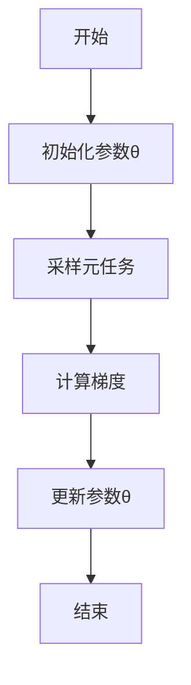
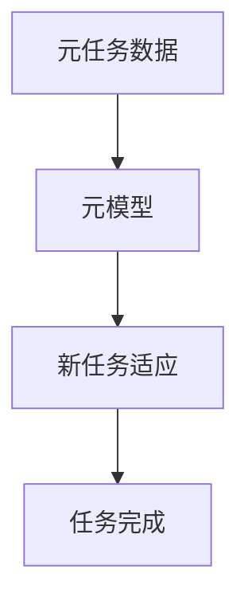

                 


# 元学习在AI Agent中的应用：快速适应新任务

## 关键词：元学习，AI Agent，快速适应，新任务，算法，应用场景

## 摘要：  
元学习是一种能够让AI Agent快速适应新任务的新兴技术，通过学习如何学习，元学习能够使AI在面对未知任务时，迅速掌握所需技能。本文将从元学习的基本概念、算法原理、系统架构到实际应用进行详细探讨，揭示其在AI Agent中的重要作用和潜在价值。

---

## 正文

### 第一章：元学习的基本概念与背景

#### 1.1 元学习的定义与核心概念
元学习（Meta-Learning）是一种机器学习范式，旨在通过“学习如何学习”来提高模型对新任务的适应能力。与传统机器学习不同，元学习不依赖于大量标注数据，而是通过在多个任务上的训练，使模型能够快速适应新任务。

**元学习的核心概念**：
- **元任务**：指元学习过程中用于训练的多个子任务。
- **元模型**：用于在新任务上进行快速推理的模型。
- **任务适应**：元模型通过调整参数或策略，快速适应新任务的能力。

#### 1.2 元学习的背景与问题背景
传统机器学习方法在面对新任务时，通常需要大量的标注数据和重新训练，这在实际应用中效率低下。元学习的提出，正是为了解决这一问题，通过预训练模型的快速调整，实现对新任务的快速适应。

**问题描述**：
- 数据获取成本高：在某些领域，标注数据的获取成本非常高，元学习可以有效减少对大量标注数据的依赖。
- 任务多样性：在多任务或零样本任务场景中，元学习能够显著提高模型的泛化能力。

### 第二章：元学习的核心概念与联系

#### 2.1 元学习的原理与机制
元学习的原理可以简单理解为“学习如何从经验中学习”。通过在多个任务上的训练，元模型能够提取出通用的特征和策略，从而在面对新任务时，能够快速调整自身参数，适应新任务的需求。

**元学习的机制**：
1. **任务采样**：从多个元任务中采样数据，用于训练元模型。
2. **快速适应**：通过参数调整或策略搜索，元模型能够在新任务上快速完成适应。

#### 2.2 元学习的核心概念对比表
以下是元学习与其他相关概念的对比：

| 概念       | 描述                                                                 |
|------------|----------------------------------------------------------------------|
| 传统机器学习 | 需要大量标注数据，针对单一任务进行训练                               |
| 元学习     | 学习如何学习，适用于多任务场景，快速适应新任务                       |
| 自监督学习 | 利用未标注数据，通过数据本身的结构进行学习                           |
| 迁移学习   | 利用已有任务的知识，辅助新任务的学习                                   |

#### 2.3 元学习的ER实体关系图
元学习系统中，实体关系如下：

```mermaid
er
    %% 元学习系统实体关系图
    %% 作者：[你的名字]
    classDiagram
    class 元任务 {
        id
        任务名称
        数据集
    }
    class 元模型 {
        参数
        模型结构
        适应策略
    }
    class 新任务 {
        任务名称
        数据集
        适应需求
    }
    元任务 --> 元模型 : 训练
    元模型 --> 新任务 : 适应
```

### 第三章：元学习算法的原理与流程

#### 3.1 元学习算法的基本原理
元学习算法的核心思想是通过在多个任务上的训练，学习一种通用的策略或参数初始化方式，使得在面对新任务时，能够快速调整模型参数，完成任务。

**算法流程**：
1. **元任务采样**：从多个元任务中随机采样，生成训练数据。
2. **模型训练**：在多个元任务上训练元模型，学习通用的特征表示。
3. **任务适应**：在新任务上，通过调整元模型的参数或策略，快速适应新任务。

#### 3.2 常见的元学习算法
目前，元学习领域主要的算法包括：
- **MAML（Meta-Automated Learning）**：通过优化参数的参数，使得模型能够在新任务上快速收敛。
- **ReMAML（Reparameterized MAML）**：对MAML的改进版本，通过参数重参数化降低计算复杂度。

### 第四章：元学习算法的数学模型与公式

#### 4.1 MAML算法的数学模型
MAML算法的目标是最小化所有元任务上的平均损失：

$$ \min_{\theta} \sum_{i=1}^{N} \mathcal{L}_i(\theta) $$

其中，$\theta$是模型参数，$\mathcal{L}_i$是第i个元任务的损失函数。

在具体实现中，MAML算法通过对参数$\theta$进行二阶泰勒展开，得到参数更新规则：

$$ \theta_{new} = \theta_{old} - \eta \sum_{i=1}^{N} \nabla_{\theta} \mathcal{L}_i(\theta_{old}) $$

#### 4.2 ReMAML算法的数学模型
ReMAML算法通过引入重参数化技巧，将参数更新规则简化为：

$$ \theta_{new} = \theta_{old} - \eta \sum_{i=1}^{N} \nabla_{\theta} \mathcal{L}_i(\theta_{old}) $$

与MAML相比，ReMAML在计算过程中引入了重参数化技巧，使得计算效率更高。

### 第五章：元学习算法的流程图与代码实现

#### 5.1 MAML算法的流程图


#### 5.2 MAML算法的代码实现
```python
import torch
import torch.nn as nn
import torch.optim as optim

class MetaLearner(nn.Module):
    def __init__(self, meta_params):
        super().__init__()
        # 元模型的结构定义
        self.meta_params = meta_params

    def forward(self, x, task_id):
        # 根据任务ID调整参数
        theta = self.meta_params[task_id]
        return x.mm(theta)

def train(model, optimizer, tasks, num_epochs):
    for epoch in range(num_epochs):
        for task in tasks:
            x, y = get_task_data(task)
            # 前向传播
            output = model(x, task)
            loss = criterion(output, y)
            # 反向传播
            optimizer.zero_grad()
            loss.backward()
            optimizer.step()
    return model
```

### 第六章：系统分析与架构设计

#### 6.1 系统架构设计


### 第七章：项目实战

#### 7.1 项目背景与目标
假设我们有一个图像分类任务，需要快速适应新的类别。

#### 7.2 项目实现
```python
import torch
import torch.nn as nn
import torch.optim as optim
import torchvision

def main():
    # 初始化元模型
    meta_params = [nn.Parameter(torch.randn(2, 2)) for _ in range(100)]
    model = MetaLearner(meta_params)
    optimizer = optim.Adam(model.parameters(), lr=1e-3)
    
    # 训练过程
    for epoch in range(100):
        for task in tasks:
            x, y = get_task_data(task)
            output = model(x, task)
            loss = criterion(output, y)
            optimizer.zero_grad()
            loss.backward()
            optimizer.step()
    
    # 新任务适应
    new_task_data, new_labels = get_new_task()
    output = model(new_task_data, new_task_id)
    print(output)

if __name__ == "__main__":
    main()
```

### 第八章：最佳实践

#### 8.1 小结
元学习在AI Agent中的应用前景广阔，能够显著提升模型的适应能力。

#### 8.2 注意事项
- **计算复杂度**：元学习通常需要较高的计算资源。
- **数据质量**：元任务数据的质量直接影响模型的性能。

#### 8.3 拓展阅读
- "Meta-Learning for Few-Shot Image Classification" by V. Mnih et al.

---

通过以上分析，我们可以看到，元学习在AI Agent中的应用具有重要的意义。它不仅能够提高模型的适应能力，还能在实际应用中显著提升效率和效果。

