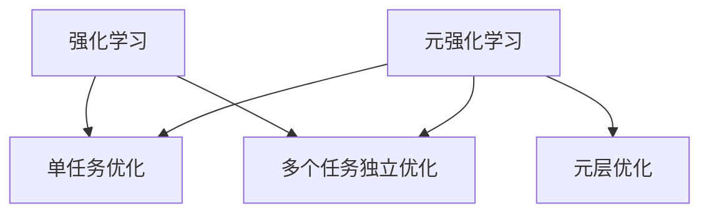
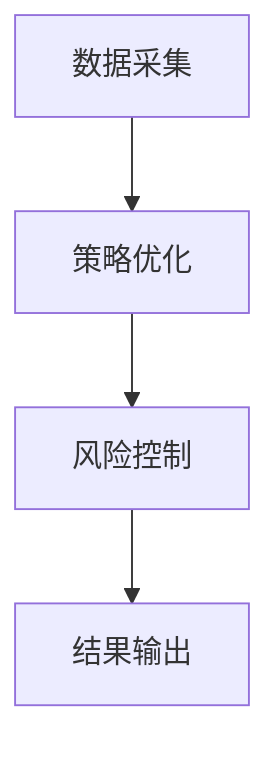
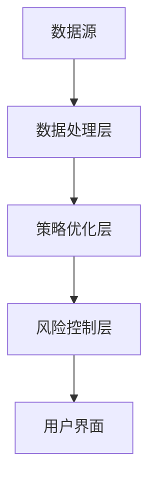

                 


# 元强化学习在投资策略快速迭代中的应用

> 关键词：元强化学习，投资策略，快速迭代，强化学习，算法优化

> 摘要：元强化学习作为一种新兴的人工智能技术，正在被广泛应用于投资策略的快速迭代中。本文将从元强化学习的基本概念出发，逐步深入探讨其在投资策略中的应用，包括投资策略的建模与优化、算法原理、系统架构设计、项目实战以及最佳实践等。通过本文的阐述，读者将能够全面理解元强化学习在投资领域的优势，并掌握其实际应用方法。

---

# 第一部分: 元强化学习基础

## 第1章: 元强化学习概述

### 1.1 元强化学习的定义与特点

#### 1.1.1 元强化学习的定义
元强化学习（Meta-Reinforcement Learning）是一种高级的强化学习形式，它通过在元层（Meta-layer）上优化强化学习算法，使得学习系统能够更快地适应不同的任务和环境。与传统强化学习不同，元强化学习不仅关注单个任务的优化，还关注如何在多个任务之间共享知识和经验，从而实现快速学习和策略迭代。

$$
\text{元强化学习的目标} = \argmax_{\theta} \sum_{i=1}^{N} R_i(\theta)
$$

其中，$R_i(\theta)$ 表示第 $i$ 个任务的奖励函数，$\theta$ 是模型参数。

#### 1.1.2 元强化学习的核心特点
- **快速学习**：通过元层的优化，元强化学习可以在较少的训练数据和时间下快速适应新任务。
- **多任务学习**：能够同时优化多个任务，共享知识和经验，提高整体性能。
- **自适应性**：能够根据环境的变化动态调整策略，适应复杂的投资场景。

#### 1.1.3 元强化学习与传统强化学习的对比
下表展示了元强化学习与传统强化学习的核心区别：

| 对比维度                | 传统强化学习                 | 元强化学习                 |
|-------------------------|------------------------------|-----------------------------|
| 学习目标                | 单一任务的优化               | 多个任务的优化和共享       |
| 知识共享                | 任务之间独立，无知识共享     | 任务之间共享知识和经验     |
| 适应性                  | 较低，适应新任务需要重新训练 | 较高，能够快速适应新任务   |

### 1.2 元强化学习的核心概念与联系

#### 1.2.1 元学习机制
元学习机制是元强化学习的核心，它通过在元层优化学习策略，使得强化学习算法能够在多个任务之间快速切换和适应。元学习机制通常包括以下步骤：

1. **初始化**：设置元层的参数 $\theta$ 和强化学习层的参数 $\phi$。
2. **元层优化**：通过优化 $\theta$，使得强化学习层在多个任务上的表现最优。
3. **强化学习层执行**：在每个任务中，强化学习层根据 $\phi$ 执行策略并获得奖励。
4. **反馈与更新**：根据奖励反馈，优化 $\theta$ 和 $\phi$。

#### 1.2.2 强化学习与元强化学习的关系
元强化学习是强化学习的一种扩展，它通过引入元层优化，增强了强化学习的泛化能力和适应性。下图展示了强化学习和元强化学习的关系：



---

# 第二部分: 元强化学习在投资策略中的应用

## 第2章: 投资策略的建模与优化

### 2.1 投资策略的建模

#### 2.1.1 投资策略的定义与分类
投资策略是投资者在市场中进行资产配置和交易决策的具体方法。常见的投资策略包括：

1. **均值-方差优化**：通过优化资产组合的期望收益和风险。
2. **动量策略**：基于价格动量效应进行买卖决策。
3. **因子投资**：基于特定因子（如市值、价值、动量等）构建投资组合。

#### 2.1.2 基于元强化学习的投资策略建模
元强化学习在投资策略建模中的优势在于其能够快速适应市场的变化。通过元层的优化，元强化学习可以在多个市场环境下快速调整策略，实现投资组合的动态优化。

#### 2.1.3 策略模型的评估与优化
投资策略的评估通常涉及以下指标：

- **夏普比率**：衡量投资组合的风险调整后收益。
- **最大回撤**：衡量投资组合在一定时间内的最大亏损。
- **收益-波动率比**：衡量收益与风险的比值。

元强化学习可以通过优化这些指标，实现投资策略的最优配置。

### 2.2 元强化学习在投资策略优化中的应用

#### 2.2.1 策略迭代的加速
元强化学习通过元层的优化，可以显著加速投资策略的迭代过程。传统的强化学习需要在每个任务上独立训练，而元强化学习可以在多个任务之间共享知识，从而减少训练时间。

#### 2.2.2 多目标优化的实现
投资策略的优化通常涉及多个目标，如收益最大化、风险最小化等。元强化学习可以通过多目标优化算法，在这些目标之间找到平衡点。

#### 2.2.3 风险控制的优化
元强化学习可以通过动态调整投资组合的风险参数，实现风险控制的优化。例如，当市场波动性增加时，元强化学习可以通过元层的优化，快速调整投资组合的风险暴露。

---

## 第3章: 元强化学习的算法原理

### 3.1 元强化学习算法概述

#### 3.1.1 元学习算法的分类
元学习算法主要分为两类：

1. **基于梯度的元学习算法**：通过优化元层的梯度，实现快速适应新任务。
2. **基于非梯度的元学习算法**：通过构建元模型，实现任务之间的知识共享。

#### 3.1.2 基于梯度的元学习算法
基于梯度的元学习算法通过优化元层的梯度，使得强化学习层能够在新任务上快速适应。其核心思想是：

$$
\nabla_{\theta} J(\theta) = \sum_{i=1}^{N} \nabla_{\theta} J_i(\theta)
$$

其中，$J_i(\theta)$ 是第 $i$ 个任务的损失函数。

#### 3.1.3 基于非梯度的元学习算法
基于非梯度的元学习算法通过构建元模型，实现任务之间的知识共享。其核心思想是：

$$
\theta_{\text{new}} = \theta_{\text{old}} + \alpha \cdot (\theta_j - \theta_i)
$$

其中，$\alpha$ 是学习率，$\theta_i$ 和 $\theta_j$ 是不同任务的参数。

### 3.2 元强化学习算法的实现

#### 3.2.1 算法实现的步骤
1. **初始化**：设置元层参数 $\theta$ 和强化学习层参数 $\phi$。
2. **元层优化**：通过优化 $\theta$，使得强化学习层在多个任务上的表现最优。
3. **强化学习层执行**：在每个任务中，强化学习层根据 $\phi$ 执行策略并获得奖励。
4. **反馈与更新**：根据奖励反馈，优化 $\theta$ 和 $\phi$。

#### 3.2.2 算法实现的代码示例

```python
import numpy as np

def meta_reinforcement_learning(tasks):
    theta = np.random.randn()  # 元层参数
    phi = np.random.randn()    # 强化学习层参数
    for task in tasks:
        # 强化学习层执行
        reward = evaluate_policy(phi, task)
        # 元层优化
        gradient = compute_gradient(theta, task, reward)
        theta += learning_rate * gradient
        # 更新强化学习层参数
        phi += meta_learning_rate * (theta - phi)
    return theta, phi
```

---

## 第4章: 投资策略快速迭代的系统架构

### 4.1 系统功能设计

#### 4.1.1 系统功能模块划分
1. **数据采集模块**：采集市场数据，如股票价格、指数等。
2. **策略优化模块**：基于元强化学习算法，优化投资策略。
3. **风险控制模块**：动态调整投资组合的风险参数。
4. **结果输出模块**：输出优化后的投资策略和相关指标。

#### 4.1.2 系统功能流程图



### 4.2 系统架构设计

#### 4.2.1 系统架构图



---

## 第5章: 项目实战

### 5.1 环境安装与配置

#### 5.1.1 环境要求
- Python 3.8+
- TensorFlow或PyTorch
- NumPy

#### 5.1.2 安装依赖
```bash
pip install numpy tensorflow matplotlib
```

### 5.2 系统核心实现

#### 5.2.1 元强化学习算法实现

```python
def meta_learning(meta_tasks):
    theta = tf.Variable(tf.random.normal(shape=[]), trainable=True)
    for task in meta_tasks:
        with tf.GradientTape() as tape:
            # 强化学习层执行
            policy = get_policy(theta)
            reward = compute_reward(policy, task)
            # 元层优化
            loss = -tf.reduce_mean(reward)
            gradient = tape.gradient(loss, theta)
            optimizer.apply_gradients(zip([gradient], [theta]))
    return theta
```

#### 5.2.2 投资策略优化实现

```python
def optimize_portfolio(prices, window_size=20):
    # 数据预处理
    normalized_prices = normalize_prices(prices)
    # 元强化学习优化
    theta = meta_learning(normalized_prices)
    # 策略执行
    portfolio = get_optimal_portfolio(theta, window_size)
    return portfolio
```

### 5.3 实际案例分析

#### 5.3.1 案例背景
假设我们有三个不同的投资任务：股票A、股票B和股票C。我们需要通过元强化学习算法，优化这三个股票的投资策略。

#### 5.3.2 案例实现

```python
import numpy as np

def main():
    # 数据准备
    prices = np.array([100, 105, 98, 110, 108])
    window_size = 5
    # 元强化学习优化
    theta = meta_learning(prices)
    # 策略执行
    portfolio = optimize_portfolio(prices, window_size)
    print("优化后的投资组合:", portfolio)

if __name__ == "__main__":
    main()
```

---

## 第6章: 最佳实践与总结

### 6.1 最佳实践 tips

1. **数据质量**：确保输入数据的高质量，包括完整性、准确性和及时性。
2. **模型选择**：根据具体任务选择合适的元强化学习算法。
3. **超参数调优**：合理设置学习率、优化器等超参数，以提高模型性能。

### 6.2 小结

通过本文的阐述，我们全面探讨了元强化学习在投资策略快速迭代中的应用。从基本概念到算法实现，再到实际案例分析，我们展示了元强化学习在投资领域的重要性和潜力。

### 6.3 注意事项

- **计算资源**：元强化学习的训练需要较高的计算资源，尤其是当任务数量较多时。
- **模型解释性**：元强化学习模型的解释性较差，需要结合其他方法进行解释和分析。

### 6.4 拓展阅读

- 《Meta-Reinforcement Learning for Investment Strategy》
- 《Deep Reinforcement Learning in Finance》

---

通过本文的详细讲解，读者可以深入了解元强化学习在投资策略中的应用，并掌握其实际操作方法。希望本文能为相关领域的研究和实践提供有价值的参考。

