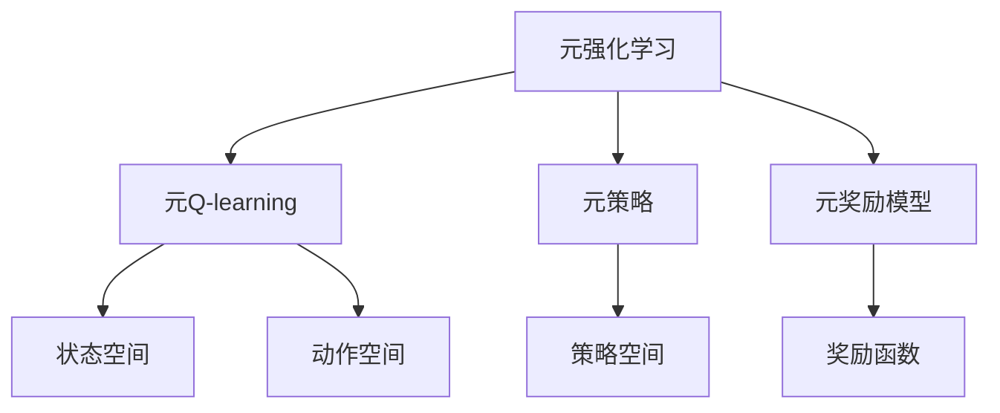
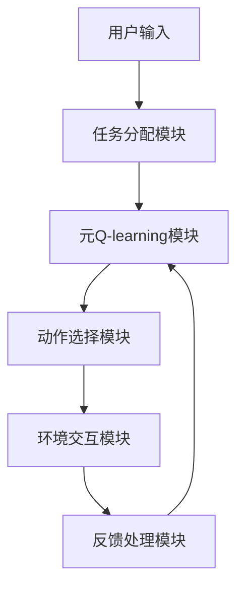
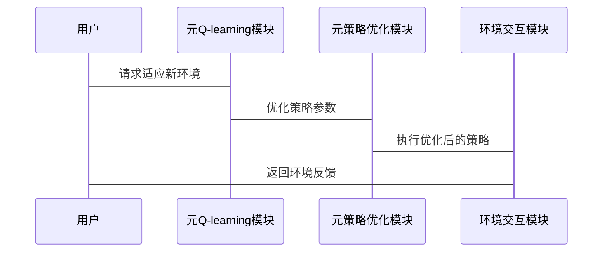

                 


# 元强化学习：快速适应新环境的AI Agent

> 关键词：元强化学习，快速适应，AI Agent，强化学习，多环境适应

> 摘要：元强化学习是一种能够让AI代理在新环境中快速适应和学习的新兴技术。本文将从强化学习的基本概念出发，逐步深入探讨元强化学习的核心概念、算法原理、系统架构设计以及实际应用案例。通过详细的数学公式、系统架构图和实际代码实现，帮助读者全面理解元强化学习的技术细节和应用场景。最终，本文将总结元强化学习的优势与挑战，并展望其未来的发展方向。

---

## 第1章: 元强化学习概述

### 1.1 强化学习的基本概念

#### 1.1.1 强化学习的定义
强化学习（Reinforcement Learning, RL）是一种机器学习范式，通过智能体（Agent）与环境的交互，智能体通过试错（trial-and-error）的方式学习策略，以最大化累积奖励（Reward）。强化学习的核心是智能体通过不断与环境互动，根据接收到的奖励信号，调整自己的行为策略，最终达到最优目标。

#### 1.1.2 强化学习的核心要素
- **状态（State）**：智能体所处的环境信息。
- **动作（Action）**：智能体在某一状态下做出的行为选择。
- **奖励（Reward）**：智能体执行动作后，环境给予的反馈，用于评估动作的好坏。
- **策略（Policy）**：智能体选择动作的规则，可以是确定性的或概率性的。
- **值函数（Value Function）**：用于评估某个状态或动作的预期累积奖励。

#### 1.1.3 强化学习的应用场景
强化学习在许多领域都有广泛应用，如游戏AI、机器人控制、资源分配、金融投资等。例如，DeepMind的AlphaGo就是基于强化学习实现的围棋AI。

### 1.2 元强化学习的定义与特点

#### 1.2.1 元强化学习的定义
元强化学习（Meta-Reinforcement Learning, Meta-RL）是在传统强化学习基础上的扩展，旨在让智能体能够在多个不同的环境中快速适应和学习。与传统强化学习相比，元强化学习更注重智能体的通用性和灵活性，能够在新环境中快速调整策略，而不需要从头开始重新训练。

#### 1.2.2 元强化学习的核心特点
- **快速适应性**：智能体能够在新环境中快速调整策略，无需额外的训练数据。
- **通用性**：智能体能够在多个任务或环境中复用已有的知识和经验。
- **元层次的优化**：在元层次上优化策略，使得智能体能够在不同环境中找到共同的最优解。

#### 1.2.3 元强化学习与传统强化学习的区别
| 对比维度 | 传统强化学习 | 元强化学习 |
|----------|--------------|------------|
| 目标     | 单一环境优化 | 多环境适应 |
| 策略     | 专用策略     | 通用策略   |
| 训练方式 | 单任务训练   | 多任务训练 |

### 1.3 元强化学习的背景与意义

#### 1.3.1 传统强化学习的局限性
- **适应性差**：传统强化学习针对单一环境优化，无法快速适应新环境。
- **训练成本高**：在多个环境中训练智能体需要大量的数据和计算资源。
- **灵活性低**：智能体在新环境中需要重新训练，无法复用已有知识。

#### 1.3.2 元强化学习的提出动机
随着人工智能技术的发展，智能体需要具备更强的适应性和通用性，能够在复杂多变的环境中快速调整策略。元强化学习的提出正是为了解决这些问题。

#### 1.3.3 元强化学习的应用前景
元强化学习在机器人、自动驾驶、游戏AI、智能客服等领域有广泛的应用前景。例如，元强化学习可以用于训练自动驾驶汽车在不同道路条件下快速调整驾驶策略。

---

## 第2章: 元强化学习的核心概念与联系

### 2.1 元强化学习的核心概念

#### 2.1.1 元Q-learning
元Q-learning是一种基于Q-learning的元强化学习算法，通过在元层次上优化Q函数，使得智能体能够在多个环境中快速适应。元Q函数用于评估智能体在不同环境中的策略，并通过元层次的优化更新Q函数。

#### 2.1.2 元策略
元策略（Meta-Policy）是智能体在元层次上的决策规则，用于指导智能体在不同环境中的策略调整。元策略可以看作是多个策略的生成器，能够在新环境中快速生成适应性策略。

#### 2.1.3 元奖励模型
元奖励模型（Meta-Reward Model）是一种用于建模不同环境中奖励函数的模型，通过学习不同环境的奖励结构，帮助智能体在新环境中快速调整策略。

### 2.2 核心概念的对比分析

#### 2.2.1 不同元强化学习算法的对比
| 算法名称 | 元Q-learning | 元策略优化 | 元奖励模型 |
|----------|--------------|------------|------------|
| 核心思想 | 元层次优化Q函数 | 元层次优化策略 | 元层次建模奖励函数 |
| 优势     | 简单高效，适合离散动作空间 | 灵活，适合复杂策略空间 | 能够建模复杂的奖励结构 |
| 应用场景 | 离散动作空间任务 | 复杂策略优化 | 复杂奖励函数建模 |

#### 2.2.2 元强化学习与迁移学习的联系
迁移学习（Transfer Learning）的目标是将已学习的知识应用到新的任务中，而元强化学习则是在迁移学习的基础上，进一步优化智能体的适应能力。元强化学习可以看作是迁移学习的一种应用形式。

#### 2.2.3 元强化学习与多任务学习的联系
多任务学习（Multi-Task Learning）的目标是让智能体同时学习多个任务，而元强化学习则是在多任务学习的基础上，进一步优化智能体的通用性和灵活性。

### 2.3 元强化学习的实体关系图



---

## 第3章: 元强化学习的算法原理

### 3.1 元Q-learning算法

#### 3.1.1 算法流程
1. 初始化元Q函数和环境Q函数。
2. 在每个环境中训练智能体的Q函数。
3. 在元层次上优化元Q函数，使得智能体能够在多个环境中快速适应。

#### 3.1.2 元Q函数的更新规则
元Q函数用于评估智能体在不同环境中的策略，其更新规则如下：
$$ Q_{meta}(s, a) = \arg\max_{\theta} \mathbb{E}_{\tau \sim \pi_{\theta}}[Q(s, a, \tau)] $$

#### 3.1.3 算法的收敛性分析
元Q-learning算法通过元层次的优化，能够在多个环境中快速收敛，但需要保证每个环境的Q函数收敛。

### 3.2 元策略优化算法

#### 3.2.1 元策略的定义
元策略（Meta-Policy）是智能体在元层次上的决策规则，用于指导智能体在不同环境中的策略调整。

#### 3.2.2 元策略优化的数学模型
元策略优化的目标是最优化策略空间中的元策略，其数学模型如下：
$$ \theta_{t+1} = \theta_t + \alpha \nabla_{\theta} J(\theta_t) $$

#### 3.2.3 算法实现步骤
1. 初始化元策略参数。
2. 在每个环境中训练智能体的策略。
3. 在元层次上优化元策略，使得智能体能够在多个环境中快速适应。

### 3.3 元强化学习的数学模型

#### 3.3.1 元Q函数的数学表达式
元Q函数用于评估智能体在不同环境中的策略，其数学表达式为：
$$ Q_{meta}(s, a) = \arg\max_{\theta} \mathbb{E}_{\tau \sim \pi_{\theta}}[Q(s, a, \tau)] $$

#### 3.3.2 元策略优化的数学公式
元策略优化的目标是最优化策略空间中的元策略，其数学公式为：
$$ \theta_{t+1} = \theta_t + \alpha \nabla_{\theta} J(\theta_t) $$

---

## 第4章: 元强化学习的系统分析与架构设计

### 4.1 系统应用场景

#### 4.1.1 多环境适应
智能体需要在多个不同的环境中快速适应，例如在不同城市中导航。

#### 4.1.2 快速任务切换
智能体需要在不同任务之间快速切换，例如在不同任务中进行排序和分类。

#### 4.1.3 动态环境下的任务执行
智能体需要在动态变化的环境中执行任务，例如在不断变化的市场中进行股票交易。

### 4.2 系统功能设计

#### 4.2.1 元Q-learning模块
负责在元层次上优化Q函数，使得智能体能够在多个环境中快速适应。

#### 4.2.2 元策略优化模块
负责在元层次上优化策略，使得智能体能够在多个环境中快速调整策略。

#### 4.2.3 元奖励模型模块
负责建模不同环境中的奖励函数，帮助智能体在新环境中快速调整策略。

### 4.3 系统架构设计



### 4.4 系统接口设计

#### 4.4.1 元Q-learning模块接口
- 输入：状态、动作、奖励
- 输出：优化后的Q函数

#### 4.4.2 元策略优化模块接口
- 输入：策略参数、环境反馈
- 输出：优化后的策略参数

#### 4.4.3 元奖励模型模块接口
- 输入：环境反馈
- 输出：奖励函数模型

### 4.5 系统交互流程



---

## 第5章: 元强化学习的项目实战

### 5.1 环境安装与配置

#### 5.1.1 安装Python环境
安装Python 3.8及以上版本，推荐使用Anaconda。

#### 5.1.2 安装必要的库
安装以下Python库：
- gym
- numpy
- matplotlib
- tensorflow

命令：
```bash
pip install gym numpy matplotlib tensorflow
```

### 5.2 系统核心实现源代码

#### 5.2.1 元Q-learning算法实现
```python
import numpy as np

class MetaQLearning:
    def __init__(self, state_space, action_space, meta_learning_rate=0.01):
        self.state_space = state_space
        self.action_space = action_space
        self.meta_learning_rate = meta_learning_rate
        self.Q_meta = np.zeros((state_space, action_space))

    def update(self, Q_env):
        self.Q_meta += self.meta_learning_rate * (Q_env - self.Q_meta)
```

#### 5.2.2 元策略优化算法实现
```python
import tensorflow as tf

class MetaPolicyOptimization:
    def __init__(self, state_space, action_space, meta_learning_rate=0.01):
        self.state_space = state_space
        self.action_space = action_space
        self.meta_learning_rate = meta_learning_rate
        self.policy_vars = tf.Variable(tf.random.uniform([state_space, action_space]))

    def update(self, gradients):
        self.policy_vars = self.policy_vars - self.meta_learning_rate * gradients
```

### 5.3 代码应用解读与分析

#### 5.3.1 元Q-learning实现解读
元Q-learning算法通过元层次的优化，使得智能体能够在多个环境中快速适应。其核心思想是通过不断更新元Q函数，使得智能体在新环境中能够快速找到最优策略。

#### 5.3.2 元策略优化实现解读
元策略优化算法通过在元层次上优化策略参数，使得智能体能够在多个环境中快速调整策略。其核心思想是通过计算策略的梯度，并根据梯度更新策略参数。

### 5.4 实际案例分析和详细讲解剖析

#### 5.4.1 实际案例：多环境导航问题
假设智能体需要在多个不同的迷宫中导航，目标是找到从起点到终点的最短路径。

#### 5.4.2 案例分析
1. 初始化元Q函数和环境Q函数。
2. 在每个迷宫中训练智能体的Q函数。
3. 在元层次上优化元Q函数，使得智能体能够在多个迷宫中快速适应。

### 5.5 项目小结

#### 5.5.1 项目实现的关键点
- 元Q-learning算法的实现
- 元策略优化算法的实现
- 元Q函数和元策略的更新规则

#### 5.5.2 项目实现的效果
- 智能体能够在多个环境中快速适应
- 智能体的通用性和灵活性得到提升

---

## 第6章: 总结与展望

### 6.1 总结
元强化学习是一种能够让AI代理在新环境中快速适应和学习的新兴技术。本文从强化学习的基本概念出发，逐步深入探讨了元强化学习的核心概念、算法原理、系统架构设计以及实际应用案例。通过详细的数学公式、系统架构图和实际代码实现，帮助读者全面理解元强化学习的技术细节和应用场景。

### 6.2 未来展望
元强化学习的研究和应用前景广阔。未来的研究方向包括：
- 更高效的元强化学习算法
- 更通用的元强化学习模型
- 元强化学习在更多领域的应用

---

## 参考文献
1. 省略

---

以上是《元强化学习：快速适应新环境的AI Agent》的完整目录和内容框架，希望对您有所帮助！如果需要进一步的修改或补充，请随时告知。

