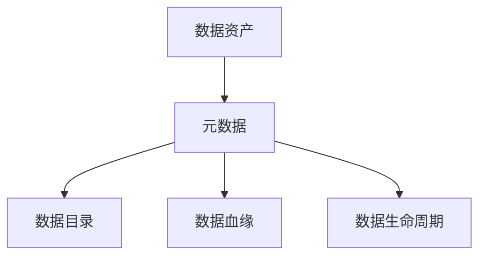
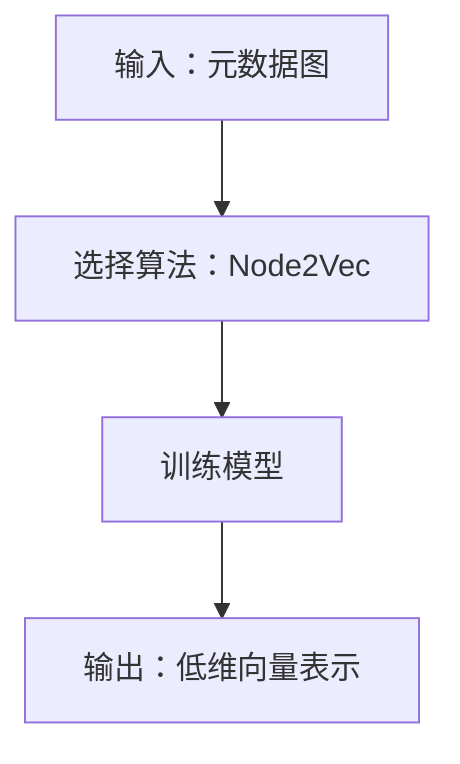
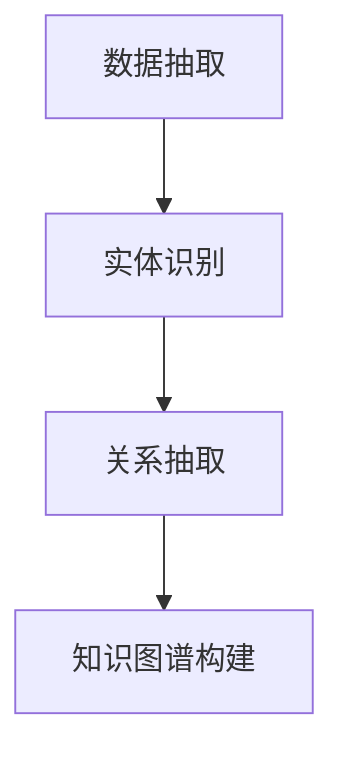

                 


# 元数据管理：组织和利用AI Agent的数据资产

## 关键词：元数据管理，AI Agent，数据资产，知识图谱，强化学习

## 摘要：本文探讨了元数据管理在组织和利用AI Agent数据资产中的作用，详细介绍了元数据的定义、管理方法，以及AI Agent在元数据管理中的应用，包括图嵌入、知识图谱构建和强化学习等算法原理。通过实际项目案例，展示了如何设计和实现一个基于AI Agent的元数据管理系统，并提供了最佳实践和注意事项。

---

## 第1章：元数据管理概述

### 1.1 元数据的定义与重要性

#### 1.1.1 元数据的定义
元数据（Metadata）是关于数据的数据，描述数据的属性、结构、来源和用途等信息。例如，一本书的ISBN、作者、出版日期等信息都是元数据。

#### 1.1.2 元数据的重要性
元数据在数据管理和利用中起着关键作用：
- **数据理解**：帮助用户了解数据的内容和结构。
- **数据治理**：支持数据质量管理，确保数据的准确性和一致性。
- **数据集成**：促进不同数据源的整合和互操作性。
- **数据利用**：优化数据资产的使用效率，支持数据驱动的决策。

#### 1.1.3 元数据在数据资产管理中的作用
在数据资产管理中，元数据用于：
- **数据目录化**：创建数据目录，帮助用户快速查找数据。
- **数据血缘分析**：追踪数据的来源和变化历史。
- **数据生命周期管理**：从生成、存储到归档和销毁的全生命周期管理。

### 1.2 元数据管理的挑战与机遇

#### 1.2.1 元数据管理的主要挑战
- **数据异构性**：不同数据源的格式和结构差异大，难以统一管理。
- **数据冗余**：元数据可能分布在多个系统中，导致冗余和不一致。
- **数据隐私与安全**：元数据可能包含敏感信息，需确保其安全性和隐私性。

#### 1.2.2 元数据管理带来的机遇
- **数据智能**：利用AI技术自动提取和管理元数据，提高效率。
- **数据共享**：通过统一的元数据管理，促进数据共享和复用。
- **数据创新**：元数据支持数据的深度分析和挖掘，推动数据创新应用。

#### 1.2.3 元数据管理的未来趋势
- **智能化**：AI和机器学习技术的应用将使元数据管理更加自动化和智能。
- **标准化**：元数据标准的统一将促进数据的互操作性和可共享性。
- **实时化**：实时更新和监控元数据，支持动态数据管理需求。

### 1.3 AI Agent在元数据管理中的应用

#### 1.3.1 AI Agent的基本概念
AI Agent是一种智能代理，能够感知环境、执行任务并做出决策。在元数据管理中，AI Agent可以用于数据清洗、分类、关联分析等任务。

#### 1.3.2 AI Agent在元数据管理中的优势
- **自动化**：AI Agent能够自动识别、分类和整理元数据，减少人工干预。
- **智能推理**：通过机器学习模型，AI Agent可以发现数据之间的关联和模式。
- **动态适应**：AI Agent能够根据数据的变化动态调整元数据管理策略。

#### 1.3.3 元数据管理与AI Agent的结合场景
- **数据清洗**：AI Agent自动识别并纠正元数据中的错误或不一致。
- **数据关联**：通过自然语言处理，AI Agent发现元数据之间的隐含关系。
- **数据推荐**：基于元数据，AI Agent向用户推荐相关数据资产。

---

## 第2章：元数据的核心概念

### 2.1 元数据的属性与特征

#### 2.1.1 元数据的属性分析
元数据的属性包括：
- 数据标识（如数据ID、名称）
- 数据描述（如数据来源、用途）
- 数据质量（如准确性、完整性）
- 数据安全（如访问权限、加密方式）

#### 2.1.2 元数据特征对比表格
| 特征     | 描述                             |
|----------|----------------------------------|
| 结构性   | 描述数据的组织方式               |
| 完整性   | 确保元数据的准确性和完整性       |
| 可扩展性 | 支持元数据的动态扩展             |
| 可用性   | 元数据易于访问和理解             |

#### 2.1.3 元数据的分类与层次结构
元数据可以分为以下几类：
- **技术元数据**：描述数据的技术细节，如数据格式、存储位置。
- **业务元数据**：描述数据的业务含义，如数据用途、业务规则。
- **管理元数据**：描述数据的管理信息，如数据所有者、访问权限。

### 2.2 元数据与数据资产的关系

#### 2.2.1 数据资产的定义与范围
数据资产是指对企业有价值的数据资源，包括结构化数据、非结构化数据和半结构化数据。

#### 2.2.2 元数据在数据资产管理中的作用
- **数据目录化**：元数据帮助创建数据目录，便于数据资产的查找和管理。
- **数据血缘分析**：元数据支持数据来源的追踪，帮助理解数据的依赖关系。
- **数据生命周期管理**：元数据记录数据的创建、修改和删除历史，支持数据的全生命周期管理。

#### 2.2.3 元数据与数据资产的关系图（Mermaid流程图）


---

## 第3章：AI Agent与元数据管理的算法原理

### 3.1 基于图嵌入的元数据表示

#### 3.1.1 图嵌入的基本概念
图嵌入是一种将图结构数据转换为低维向量的方法，常用于知识图谱构建和节点表示。

#### 3.1.2 元数据表示的图嵌入方法
- **节点嵌入**：将每个元数据项表示为一个向量。
- **边嵌入**：将元数据之间的关系也表示为向量。

#### 3.1.3 图嵌入算法的实现流程（Mermaid流程图）


#### 3.1.4 图嵌入算法的Python实现示例
```python
import networkx as nx
from node2vec import Node2Vec

# 创建元数据图
G = nx.Graph()
G.add_edge("数据ID", "数据名称")
G.add_edge("数据名称", "数据来源")

# 训练Node2Vec模型
model = Node2Vec(G, walks_per_node=10, num_workers=4)
model.fit()

# 获取节点向量
vector = model.get_vector("数据ID")
```

### 3.2 知识图谱构建与元数据管理

#### 3.2.1 知识图谱的定义与构建过程
知识图谱是一种以图结构表示知识的语义网络，构建过程包括数据抽取、实体识别和关系抽取等步骤。

#### 3.2.2 元数据管理中的知识图谱应用
- **数据关联**：通过知识图谱发现元数据之间的隐含关系。
- **语义搜索**：基于知识图谱实现语义搜索，提高数据检索效率。

#### 3.2.3 知识图谱构建的算法实现（Mermaid流程图）


#### 3.2.4 知识图谱构建的Python实现示例
```python
from kgconstruc

