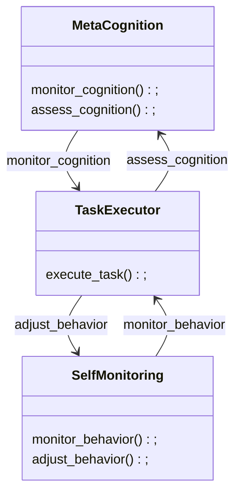
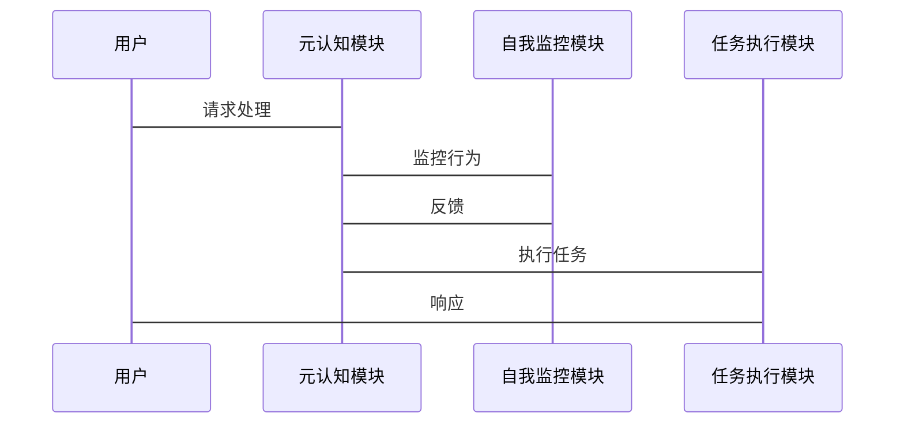

                 


# 元认知AI Agent：自我监控与调节

## 关键词：元认知AI Agent、自我监控、调节机制、元学习、系统架构

## 摘要：本文将详细探讨元认知AI Agent的核心概念、算法原理、系统架构及其在实际应用中的实现。通过分析元认知机制与自我监控调节机制的关系，结合具体的算法模型和系统设计，阐述如何构建具备自我监控与调节能力的AI Agent。文章还将通过实际项目案例，展示元认知AI Agent在不同场景下的应用，并总结其优势与挑战。

---

# 第1章 元认知AI Agent的背景与问题背景

## 1.1 元认知AI Agent的定义与核心概念

### 1.1.1 元认知AI Agent的定义

元认知AI Agent（Meta-cognitive AI Agent）是一种具备元认知能力的智能体，能够对自身的认知过程进行监控、评估和调节。与传统AI Agent不同，元认知AI Agent不仅能够执行任务，还能理解自己的思考过程，并根据反馈进行自我优化。

### 1.1.2 元认知AI Agent的核心概念

元认知AI Agent的核心概念包括元认知机制和自我监控与调节机制。元认知机制负责对认知过程的监控，而自我监控与调节机制则负责根据监控结果进行调整。

### 1.1.3 元认知AI Agent的背景与问题背景

随着人工智能技术的不断发展，AI Agent在各个领域的应用日益广泛。然而，传统AI Agent缺乏对自身认知过程的监控和调节能力，导致在复杂动态环境中表现受限。元认知AI Agent的提出旨在解决这一问题。

### 1.1.4 元认知AI Agent的问题描述与解决思路

传统AI Agent在处理复杂任务时，往往无法有效应对环境的变化和不确定性。元认知AI Agent通过引入元认知和自我监控调节机制，能够实时评估自身的行为，并根据评估结果进行优化调整。

### 1.1.5 元认知AI Agent的边界与外延

元认知AI Agent的边界包括其认知过程的监控和调节范围，以及其在不同环境中的适应能力。其外延则涉及与其他AI技术的结合，如强化学习和自适应系统。

### 1.1.6 元认知AI Agent的概念结构与核心要素组成

元认知AI Agent的概念结构由元认知机制、自我监控调节机制和任务执行机制三部分组成。核心要素包括认知监控、认知评估和认知调节。

---

# 第2章 元认知AI Agent的核心概念与联系

## 2.1 元认知机制的原理与特点

### 2.1.1 元认知机制的基本原理

元认知机制通过对外部环境和内部认知过程的双重监控，实现对认知过程的评估和调节。

### 2.1.2 元认知机制的核心特点

元认知机制具有自我意识、动态适应和多层次监控的特点。

### 2.1.3 元认知机制与传统AI的区别

传统AI仅关注任务执行，而元认知AI Agent具备对自身认知过程的监控能力。

### 2.1.4 元认知机制的实现方式

通过引入元学习算法，元认知机制能够实现对认知过程的监控和优化。

## 2.2 自我监控与调节机制的原理与特点

### 2.2.1 自我监控机制的基本原理

自我监控机制通过收集和分析系统运行数据，实现对认知过程的实时监控。

### 2.2.2 自我调节机制的核心特点

自我调节机制能够根据监控结果动态调整系统的行为策略。

### 2.2.3 自我监控与调节机制的实现方式

通过引入反馈机制和自适应算法，自我监控与调节机制能够实现对系统行为的优化。

## 2.3 元认知机制与自我监控调节机制的联系与区别

### 2.3.1 元认知机制与自我监控调节机制的联系

两者都关注认知过程的监控和优化。

### 2.3.2 元认知机制与自我监控调节机制的区别

元认知机制侧重于认知过程的监控，而自我监控调节机制侧重于根据监控结果进行调整。

### 2.3.3 元认知机制与自我监控调节机制的协同作用

两者协同作用，能够实现对认知过程的全面监控和优化。

---

# 第3章 元认知AI Agent的算法原理

## 3.1 元学习算法

### 3.1.1 元学习算法的定义

元学习算法是一种通过学习如何学习的方法，能够快速适应新任务。

### 3.1.2 元学习算法的数学模型

元学习算法通常采用多层神经网络结构，通过元学习层对参数进行优化。

### 3.1.3 元学习算法的工作流程

1. 初始化参数。
2. 通过元学习层对参数进行优化。
3. 通过任务层执行具体任务。

## 3.2 自适应机制

### 3.2.1 自适应机制的定义

自适应机制是指系统能够根据环境变化自动调整自身行为的能力。

### 3.2.2 自适应机制的数学模型

自适应机制通常采用自适应滤波器或自适应网络结构。

### 3.2.3 自适应机制的工作流程

1. 监控环境变化。
2. 根据变化调整系统参数。
3. 重新执行任务并评估结果。

## 3.3 元认知AI Agent算法的实现

### 3.3.1 算法实现的步骤

1. 初始化元认知机制和自我监控调节机制。
2. 执行任务并收集反馈。
3. 根据反馈优化系统参数。

### 3.3.2 算法实现的代码示例

```python
def meta_learning_algorithm(task):
    # 初始化元认知机制
    meta_cognition = MetaCognition()
    # 初始化自我监控调节机制
    self_monitor = SelfMonitoring()
    # 执行任务
    result = task.execute(meta_cognition, self_monitor)
    # 收集反馈
    feedback = task.get_feedback(result)
    # 优化系统参数
    meta_cognition.optimize(feedback)
    self_monitor.adapt(feedback)
    return result
```

---

# 第4章 元认知AI Agent的系统分析与架构设计

## 4.1 系统功能设计

### 4.1.1 领域模型设计

使用Mermaid类图展示领域模型，包括元认知机制、自我监控调节机制和任务执行机制。



### 4.1.2 系统架构设计

使用Mermaid架构图展示系统架构，包括前端、后端和元认知模块。


### 4.1.3 系统接口设计

系统接口设计包括元认知监控接口、自我调节接口和任务执行接口。

### 4.1.4 系统交互设计

使用Mermaid序列图展示系统交互流程。



---

# 第5章 元认知AI Agent的项目实战

## 5.1 环境安装与配置

### 5.1.1 安装依赖

安装必要的Python库，如TensorFlow、Keras等。

### 5.1.2 配置开发环境

配置Jupyter Notebook或PyCharm作为开发环境。

## 5.2 核心实现

### 5.2.1 元认知机制实现

实现元认知机制的监控和评估功能。

### 5.2.2 自我监控调节机制实现

实现自我监控和调节功能。

## 5.3 代码实现与解读

### 5.3.1 元认知机制代码

```python
class MetaCognition:
    def monitor_cognition(self, agent):
        # 实现认知监控逻辑
        pass

    def assess_cognition(self, agent):
        # 实现认知评估逻辑
        pass

    def optimize(self, feedback):
        # 实现参数优化逻辑
        pass
```

### 5.3.2 自我监控调节机制代码

```python
class SelfMonitoring:
    def monitor_behavior(self, agent):
        # 实现行为监控逻辑
        pass

    def adjust_behavior(self, feedback):
        # 实现行为调整逻辑
        pass
```

### 5.3.3 任务执行模块代码

```python
class TaskExecutor:
    def execute_task(self, meta_cognition, self_monitor):
        # 执行任务逻辑
        pass
```

## 5.4 实际案例分析与应用

### 5.4.1 案例分析

分析一个具体案例，展示元认知AI Agent的应用场景。

### 5.4.2 应用分析

总结案例中的应用效果和优化方向。

---

# 第6章 总结与展望

## 6.1 总结

### 6.1.1 元认知AI Agent的核心内容回顾

回顾文章的核心内容，包括元认知机制、自我监控调节机制和算法原理。

### 6.1.2 元认知AI Agent的优势与局限

总结元认知AI Agent的优势和当前存在的局限性。

### 6.1.3 元认知AI Agent的实际应用价值

探讨元认知AI Agent在不同领域的应用价值。

## 6.2 展望

### 6.2.1 未来研究方向

提出未来研究的可能方向，如多智能体协同、强化学习结合等。

### 6.2.2 元认知AI Agent的发展趋势

分析元认知AI Agent的发展趋势和潜在应用前景。

### 6.2.3 元认知AI Agent技术的挑战与机遇

探讨元认知AI Agent技术面临的挑战和带来的机遇。

## 6.3 最佳实践 tips

### 6.3.1 实践 tips

提供实际应用中的建议和技巧。

### 6.3.2 小结

总结全文，强调元认知AI Agent的重要性和潜力。

### 6.3.3 注意事项

提醒读者在实际应用中需要注意的问题。

## 6.4 拓展阅读

### 6.4.1 推荐书籍

推荐相关的书籍和论文。

### 6.4.2 推荐资源

推荐在线资源和工具，供读者进一步学习。

---

# 附录

## 附录A：元认知AI Agent相关术语表

## 附录B：元认知AI Agent算法的数学公式汇总

## 附录C：参考文献

---

通过以上目录和内容的详细阐述，相信读者能够全面理解元认知AI Agent的核心概念、算法原理和实际应用。

