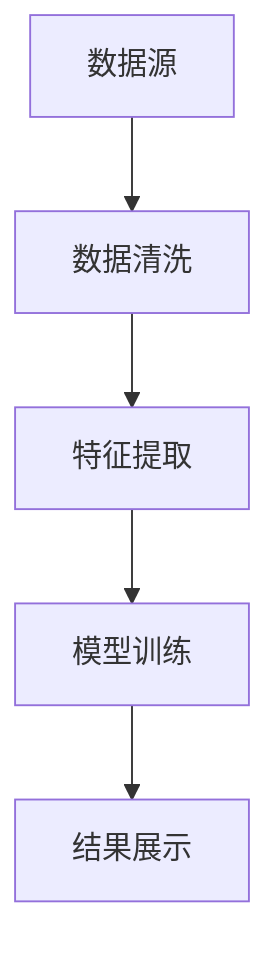
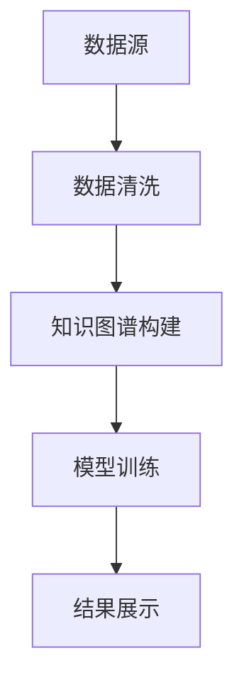

                 


# 全球股市估值与人工智能在司法系统中的应用

> 关键词：全球股市估值、人工智能、司法系统、机器学习、大数据、NLP、法律知识图谱

> 摘要：本文探讨了人工智能在全球股市估值和司法系统中的应用，分析了AI如何提升股市估值的准确性和司法系统的效率，详细讲解了相关算法、系统架构和实战案例。

---

## 第一部分: 全球股市估值

### 第1章: 股市估值背景与核心概念

#### 1.1 股市估值的定义与分类
股市估值是通过对公司基本面和市场因素的分析，评估股票的合理价格范围。常见的估值方法包括市盈率、市净率和现金流折现法。

#### 1.2 影响股市估值的主要因素
- 宏观经济因素：GDP增长率、利率、通货膨胀等。
- 行业因素：行业发展趋势、政策影响。
- 公司基本面：盈利能力、财务状况、管理团队等。

#### 1.3 股市估值的核心目标
- 发现被低估或高估的股票。
- 辅助投资者做出投资决策。

---

### 第2章: 人工智能在股市估值中的应用

#### 2.1 AI与股市分析的结合
人工智能通过大数据分析和机器学习算法，帮助预测股价走势，识别市场趋势。

#### 2.2 基于机器学习的估值模型
- 线性回归模型：用于预测股票价格。
- 支持向量机：分类股票的高或低风险。
- 神经网络：深度学习分析复杂市场关系。

#### 2.3 大数据与NLP的应用
- 大数据挖掘：分析历史数据，识别价格模式。
- NLP：解析新闻、社交媒体数据，预测市场情绪。

---

### 第3章: 系统架构与实现

#### 3.1 系统功能模块
- 数据采集：从API获取股票数据。
- 数据处理：清洗、特征提取。
- 模型训练：训练机器学习模型。
- 结果展示：可视化估值结果。

#### 3.2 算法实现与优化
- 使用Python的Scikit-learn库实现线性回归和SVM。
- 通过网格搜索优化模型参数。

#### 3.3 系统架构图


---

### 第4章: 项目实战与案例分析

#### 4.1 项目环境搭建
- 安装Python、Pandas、Scikit-learn等库。
- 准备股票数据集。

#### 4.2 核心代码实现
```python
import pandas as pd
from sklearn.linear_model import LinearRegression

# 数据加载与处理
data = pd.read_csv('stock_data.csv')
X = data[['市盈率', '市净率']]
y = data['股价']

# 模型训练
model = LinearRegression()
model.fit(X, y)

# 模型预测
print(model.predict(X))
```

#### 4.3 案例分析
以某公司为例，使用线性回归模型预测其股价走势，分析模型的准确性和适用性。

---

## 第二部分: 人工智能在司法系统中的应用

### 第5章: 司法系统背景与核心概念

#### 5.1 司法系统的现状与痛点
- 案件处理效率低。
- 法律知识分散，难以系统化。

#### 5.2 人工智能在司法中的作用
- 辅助案件分类。
- 自动生成法律文书。
- 风险评估与预测。

---

### 第6章: 基于AI的司法系统分析

#### 6.1 法律知识图谱
- 构建法律实体关系图，辅助案件分析。
- 使用NLP技术提取法律条款。

#### 6.2 司法大数据分析
- 统计分析案件类型和判决结果。
- 发现司法趋势和规律。

#### 6.3 深度学习在司法中的应用
- 使用LSTM模型分析法律文书。
- 训练分类模型预测案件结果。

---

### 第7章: 司法AI系统的系统架构

#### 7.1 系统功能模块
- 数据采集：收集司法数据。
- 知识图谱构建：构建法律知识图谱。
- 模型训练：训练分类和预测模型。

#### 7.2 系统架构图


---

### 第8章: 司法AI系统的项目实战

#### 8.1 项目环境搭建
- 安装Python、TensorFlow、NLP库。
- 准备司法数据集。

#### 8.2 核心代码实现
```python
import tensorflow as tf
from tensorflow.keras import layers

# 构建神经网络模型
model = tf.keras.Sequential([
    layers.Dense(64, activation='relu'),
    layers.Dense(1, activation='sigmoid')
])

# 编译模型
model.compile(optimizer='adam', loss='binary_crossentropy')
model.fit(X_train, y_train, epochs=10, batch_size=32)
```

#### 8.3 案例分析
以某司法案例为例，展示如何使用AI模型辅助案件分类和判决建议。

---

## 第三部分: 结论与展望

### 结论
人工智能在股市估值和司法系统中的应用显著提升了效率和准确性。通过机器学习和大数据技术，AI能够帮助人类做出更明智的决策。

### 展望
未来，随着AI技术的进步，股市估值和司法系统将更加智能化和自动化。法律知识图谱和深度学习模型的应用将进一步优化司法流程。

### 最佳实践 Tips
- 在使用AI模型时，确保数据的准确性和完整性。
- 定期更新模型，适应市场变化。
- 关注数据隐私和伦理问题，确保AI应用的合规性。

---

通过本文的详细分析，读者可以深入了解人工智能在全球股市估值和司法系统中的应用，掌握相关技术的核心原理和实际操作方法。

