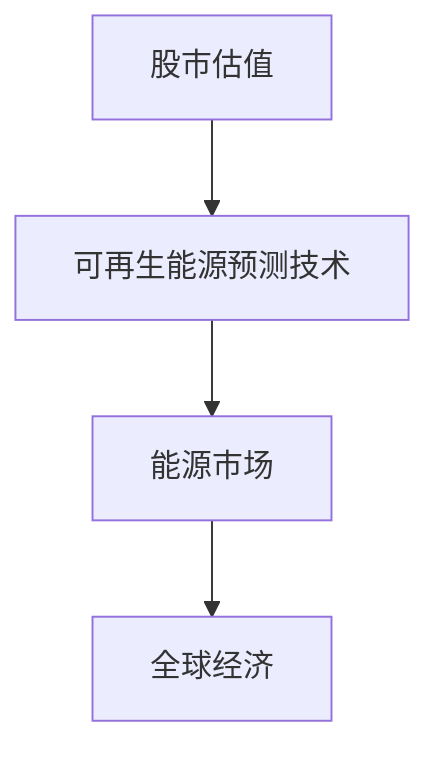
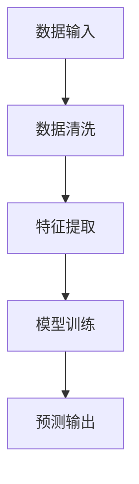
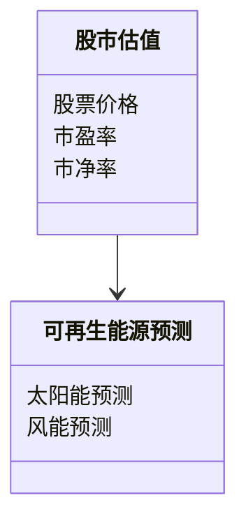
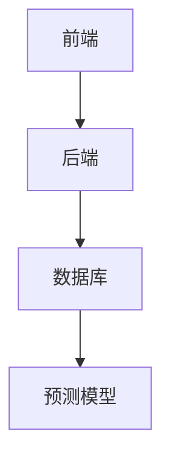
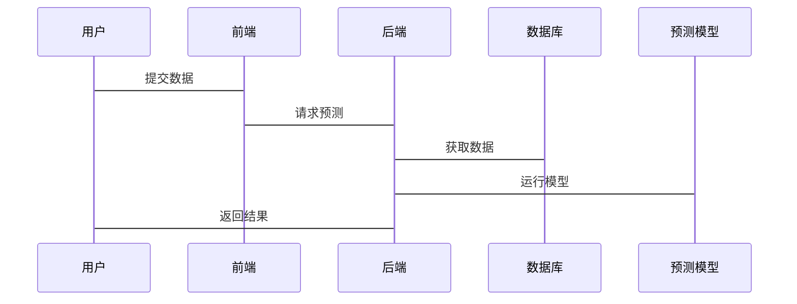

                 


# 全球股市估值与可再生能源预测技术的关系

> 关键词：全球股市估值、可再生能源、预测技术、机器学习、经济模型

> 摘要：本文探讨了全球股市估值与可再生能源预测技术之间的关系，分析了股市估值的核心概念、可再生能源预测技术的原理，以及两者如何共同影响全球经济。通过详细的技术分析、算法流程图、数学模型和实际案例，本文展示了如何利用预测技术优化股市估值，推动能源转型和经济可持续发展。

---

## 第一部分：全球股市估值与可再生能源预测技术的背景与关系

### 第1章：全球股市估值与可再生能源预测技术的背景介绍

#### 1.1 全球股市估值的基本概念

##### 1.1.1 股市估值的定义与核心要素
股市估值是通过对上市公司的财务数据和市场表现进行分析，估算其股票的内在价值。核心要素包括市盈率（P/E）、市净率（P/B）、股息率等。

##### 1.1.2 全球股市估值的多样性与影响因素
全球股市估值受宏观经济环境、政策法规、行业趋势和公司业绩等多重因素影响，具有高度复杂性和多样性。

##### 1.1.3 股市估值与宏观经济的关系
股市估值是宏观经济的晴雨表，反映了整体经济的健康状况和市场信心。

#### 1.2 可再生能源预测技术的定义与特点

##### 1.2.1 可再生能源的定义与分类
可再生能源包括太阳能、风能、水能等，具有清洁、可再生和可持续的特点。

##### 1.2.2 可再生能源预测技术的核心特征
预测技术基于数据分析和建模，用于预测可再生能源的产量和市场需求。

##### 1.2.3 可再生能源预测技术的应用场景
应用场景包括电力系统规划、能源交易和政策制定等。

#### 1.3 全球股市估值与可再生能源预测技术的关系概述

##### 1.3.1 股市估值与可再生能源产业的互动
可再生能源企业的市场表现直接影响股市估值，而股市估值则为可再生能源行业提供了资金支持。

##### 1.3.2 可再生能源技术进步对股市估值的影响
技术创新降低了成本，提高了可再生能源的竞争力，从而提升了相关企业的估值。

##### 1.3.3 全球经济与能源转型的双重驱动
能源转型推动了可再生能源的发展，而股市估值为这一转型提供了资金和资源。

---

### 第2章：全球股市估值与可再生能源预测技术的核心概念与联系

#### 2.1 核心概念与原理

##### 2.1.1 股市估值的核心原理
股市估值通过分析公司财务数据和市场环境，评估其股票的真实价值。

##### 2.1.2 可再生能源预测技术的数学模型
预测技术基于统计学和机器学习算法，构建数学模型进行预测。

##### 2.1.3 两者关系的理论框架
两者关系的理论框架通过分析可再生能源的市场表现和经济影响，结合股市估值模型，构建综合分析框架。

#### 2.2 核心概念对比与联系

##### 2.2.1 股市估值与可再生能源预测技术的特征对比
| 特征                | 股市估值                | 可再生能源预测技术            |
|---------------------|------------------------|-----------------------------|
| 数据来源            | 公司财务数据、市场数据 | 天气数据、能源消耗数据        |
| 目标                | 评估股票价值            | 预测能源产量、需求            |
| 方法                | 财务分析、市场分析      | 时间序列分析、机器学习        |

##### 2.2.2 两者关系的ER实体关系图


---

### 第3章：可再生能源预测技术的算法原理与数学模型

#### 3.1 数据分析与预测模型

##### 3.1.1 数据预处理与特征选择
数据预处理包括清洗和标准化，特征选择通过相关性分析确定关键变量。

##### 3.1.2 时间序列预测模型
时间序列预测模型如ARIMA，用于预测可再生能源的产量和需求。

##### 3.1.3 机器学习与深度学习的应用
机器学习算法如随机森林和神经网络用于提高预测精度。

#### 3.2 算法流程图



#### 3.3 数学模型与公式

##### 3.3.1 线性回归模型
$$ y = \beta_0 + \beta_1x + \epsilon $$

##### 3.3.2 神经网络模型
$$ a^{(l)} = \sigma(w^{(l)}a^{(l-1)} + b^{(l)}) $$

##### 3.3.3 时间序列模型
$$ ARIMA(p, d, q) $$

---

### 第4章：全球股市估值与可再生能源预测技术的系统分析与架构设计

#### 4.1 问题场景介绍

##### 4.1.1 股市估值与可再生能源预测的双重需求
投资者需要准确的股市估值，同时能源行业需要可靠的可再生能源预测。

#### 4.2 项目介绍

##### 4.2.1 项目目标
构建综合模型，分析可再生能源对股市估值的影响，优化能源投资决策。

#### 4.3 系统功能设计

##### 4.3.1 领域模型


#### 4.4 系统架构设计

##### 4.4.1 系统架构图


#### 4.5 系统交互设计

##### 4.5.1 交互序列图


---

## 第五章：项目实战与代码实现

### 5.1 环境安装

#### 5.1.1 安装Python和相关库
安装Python 3.x，使用pip安装numpy、pandas、scikit-learn和keras。

### 5.2 系统核心实现源代码

#### 5.2.1 数据预处理代码
```python
import pandas as pd
import numpy as np

data = pd.read_csv('renewable_energy.csv')
data = data.dropna()
data['date'] = pd.to_datetime(data['date'])
data.set_index('date', inplace=True)
```

#### 5.2.2 特征选择与模型训练
```python
from sklearn.feature_selection import SelectKBest
from sklearn.preprocessing import StandardScaler
from sklearn.linear_model import LinearRegression

features = data.columns[:-1]
target = data.columns[-1]

selector = SelectKBest(k=5).fit_transform(data[features], data[target])
scaler = StandardScaler().fit(selector)
X = scaler.transform(selector)
y = data[target]

model = LinearRegression().fit(X, y)
```

#### 5.2.3 预测与结果分析
```python
from sklearn.metrics import mean_squared_error

y_pred = model.predict(X)
mse = mean_squared_error(y, y_pred)
print(f"均方误差：{mse}")
```

---

## 第六章：总结与最佳实践

### 6.1 最佳实践

#### 6.1.1 数据质量的重要性
确保数据的完整性和准确性，避免偏差。

#### 6.1.2 模型选择与优化
根据数据特征选择合适的模型，并通过交叉验证优化参数。

#### 6.1.3 结合领域知识
结合能源行业的专业知识，提升模型的准确性和实用性。

### 6.2 小结

通过本文的分析，我们了解了全球股市估值与可再生能源预测技术的关系，掌握了相关算法和模型的实现方法，为优化能源投资和经济决策提供了技术支持。

### 6.3 注意事项

- 数据隐私和安全问题需高度重视。
- 模型的实时性和可扩展性需进一步优化。

### 6.4 拓展阅读

建议阅读相关领域的最新研究，关注可再生能源和金融市场的动态，以提升预测模型的精度和应用价值。

---

以上是《全球股市估值与可再生能源预测技术的关系》的技术博客文章的完整目录和内容框架。

