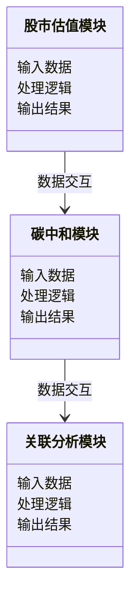
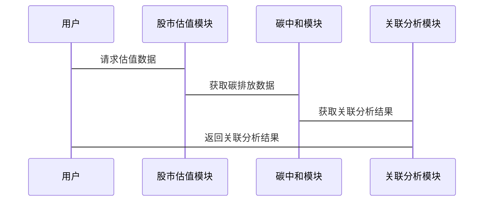

                 


```markdown
# 全球股市估值与可持续旅游碳中和技术的关联

## 关键词：全球股市估值、可持续旅游、碳中和、技术关联、算法模型、系统架构、项目实战

## 摘要：本文探讨了全球股市估值与可持续旅游碳中和技术之间的关联，通过背景介绍、核心概念分析、算法原理、系统设计和项目实战，详细阐述了如何通过技术创新实现可持续旅游碳中和，并对股市估值产生积极影响。文章还提供了具体的数学模型和系统架构，为读者提供了理论与实践相结合的深度分析。

## 第一章: 全球股市估值与可持续旅游碳中和技术的背景介绍

### 1.1 问题背景与问题描述
#### 1.1.1 全球股市估值的现状与挑战
- 全球股市估值的波动性分析
- 可持续发展对股市的影响
- 碳中和目标的紧迫性

#### 1.1.2 可持续旅游与碳中和的目标与意义
- 可持续旅游的定义与目标
- 碳中和在旅游行业中的意义
- 碳中和对全球股市的潜在影响

#### 1.1.3 问题解决的必要性与紧迫性
- 碳中和对股市估值的影响
- 投资者对可持续发展的关注
- 碳中和与股市估值的双向促进

### 1.2 核心概念与边界
#### 1.2.1 全球股市估值的核心要素
- 市盈率、市净率等估值指标
- 影响股市估值的主要因素
- 碳中和对估值指标的影响

#### 1.2.2 可持续旅游与碳中和的定义与特征
- 可持续旅游的定义
- 碳中和的定义与实现路径
- 两者的相互关系

#### 1.2.3 问题的边界与外延
- 研究范围的界定
- 外延的扩展与相关领域
- 需要注意的限制条件

### 1.3 核心概念的结构与组成
#### 1.3.1 股市估值的计算模型
- 常用估值模型介绍
- 碳中和因素如何融入估值模型
- 模型的优缺点分析

#### 1.3.2 碳中和技术的分类与对比
- 碳中和的主要技术手段
- 各种技术的优缺点
- 技术间的对比分析

#### 1.3.3 两者的关联机制与影响因素
- 碳中和对股市估值的直接影响
- 间接影响的实现路径
- 关键影响因素的分析

### 1.4 本章小结
#### 1.4.1 核心概念的总结
- 股市估值的核心要素
- 碳中和的定义与目标
- 两者关联的关键点

#### 1.4.2 问题解决的关键点
- 如何将碳中和融入估值模型
- 技术创新对股市的影响
- 投资者行为的变化趋势

#### 1.4.3 下文展开的方向
- 后续章节的主要内容
- 核心概念的深入探讨
- 实证分析与案例研究的安排

## 第二章: 全球股市估值与可持续旅游碳中和技术的核心概念关联

### 2.1 核心概念的原理与机制
#### 2.1.1 股市估值的核心算法
- 常用算法介绍
- 碳中和因素如何影响算法
- 算法的改进与创新

#### 2.1.2 碳中和技术的实现路径
- 技术实现的步骤
- 各种技术的具体应用
- 技术间的协同效应

#### 2.1.3 两者关联的数学模型
- 关联模型的构建
- 模型的数学表达
- 模型的验证与优化

### 2.2 核心概念的属性特征对比
#### 2.2.1 股市估值的特征分析
- 股市估值的波动性
- 碳中和对估值的影响
- 投资者的认知变化

#### 2.2.2 碳中和的特征分析
- 碳中和的实现难度
- 技术创新的速度
- 市场接受度的影响

#### 2.2.3 两者的对比与联系
- 核心特征的对比
- 联系的强弱分析
- 影响因素的异同点

### 2.3 ER实体关系图
```mermaid
erDiagram
    actor 投资者 {
        <属性> 投资金额
        <属性> 投资目标
    }
    actor 企业 {
        <属性> 企业规模
        <属性> 碳排放量
    }
    actor 政府 {
        <属性> 政策支持
        <属性> 监管力度
    }
    actor 环保机构 {
        <属性> 环保认证
        <属性> 碳中和目标
    }
    investor [<>- 企业 ] 关联
    investor [<>- 政府 ] 关联
   企业 [<>- 环保机构 ] 关联
```

### 2.4 本章小结
#### 2.4.1 核心概念的总结
- 股市估值的算法与实现
- 碳中和技术的路径与特征
- 两者关联的数学模型

#### 2.4.2 问题解决的关键点
- 模型的构建与优化
- 技术实现的路径选择
- 各方的协同作用

#### 2.4.3 下文展开的方向
- 模型的应用与验证
- 技术的实践与案例
- 实证分析的安排

## 第三章: 全球股市估值与可持续旅游碳中和技术的算法原理

### 3.1 算法原理的介绍
#### 3.1.1 数据预处理
- 数据的来源与采集
- 数据清洗与标准化
- 数据特征的提取

#### 3.1.2 模型训练
- 选择合适的算法
- 模型的训练与优化
- 参数的调整与验证

#### 3.1.3 结果预测
- 预测结果的解读
- 结果的可视化
- 结果的验证与评估

### 3.2 算法实现的代码示例
```python
import pandas as pd
import numpy as np
from sklearn.linear_model import LinearRegression
from sklearn.metrics import mean_squared_error

# 数据预处理
data = pd.read_csv('data.csv')
X = data[['市盈率', '市净率', '碳排放量']]
y = data['股票价格']

# 模型训练
model = LinearRegression()
model.fit(X, y)

# 预测结果
y_pred = model.predict(X)

# 模型评估
mse = mean_squared_error(y, y_pred)
print(f"均方误差: {mse}")
print(f"回归系数: {model.coef_}")
print(f"截距: {model.intercept_}")
```

### 3.3 算法原理的数学模型
- 线性回归模型的数学表达：
  $$ y = \beta_0 + \beta_1x_1 + \beta_2x_2 + ... + \beta_nx_n + \epsilon $$
- 模型的优化目标：
  $$ \text{最小化} \sum_{i=1}^{n} (y_i - \hat{y}_i)^2 $$

### 3.4 本章小结
#### 3.4.1 算法原理的总结
- 算法的选择与实现
- 模型的训练与优化
- 结果的预测与评估

#### 3.4.2 问题解决的关键点
- 数据预处理的重要性
- 模型选择的策略
- 参数调整的方法

#### 3.4.3 下文展开的方向
- 算法的改进与创新
- 实际应用的案例分析
- 模型的扩展与应用

## 第四章: 全球股市估值与可持续旅游碳中和技术的系统分析与架构设计

### 4.1 系统分析
#### 4.1.1 问题场景介绍
- 系统的目标与范围
- 问题的复杂性与挑战
- 系统的需求分析

#### 4.1.2 项目介绍
- 项目的目标
- 项目的主要任务
- 项目的实施计划

### 4.2 系统功能设计
#### 4.2.1 领域模型设计


#### 4.2.2 系统架构设计


#### 4.2.3 系统接口设计
- API接口的设计
- 接口的输入与输出
- 接口的调用与实现

#### 4.2.4 系统交互设计


### 4.3 本章小结
#### 4.3.1 系统分析的总结
- 问题场景的分析
- 项目目标的设定
- 系统功能的设计

#### 4.3.2 问题解决的关键点
- 系统架构的合理性
- 模块间的协同作用
- 接口设计的规范性

#### 4.3.3 下文展开的方向
- 系统的实现与测试
- 模块的具体实现
- 系统的优化与调整

## 第五章: 全球股市估值与可持续旅游碳中和技术的项目实战

### 5.1 环境安装
- 开发环境的选择
- 必要工具的安装
- 开发环境的配置

### 5.2 核心代码实现
#### 5.2.1 数据预处理代码
```python
import pandas as pd
import numpy as np
from sklearn.impute import SimpleImputer
from sklearn.preprocessing import StandardScaler

# 数据加载
data = pd.read_csv('data.csv')

# 数据清洗
imputer = SimpleImputer(missing_values=np.nan, strategy='mean')
imputed_data = imputer.fit_transform(data[['市盈率', '市净率', '碳排放量']])

# 数据标准化
scaler = StandardScaler()
scaled_data = scaler.fit_transform(imputed_data)
```

#### 5.2.2 模型训练代码
```python
from sklearn.linear_model import Ridge
from sklearn.model_selection import train_test_split
from sklearn.metrics import r2_score

# 数据分割
X_train, X_test, y_train, y_test = train_test_split(scaled_data, data['股票价格'], test_size=0.2, random_state=42)

# 模型训练
ridge_model = Ridge(alpha=0.1)
ridge_model.fit(X_train, y_train)

# 模型预测
y_pred = ridge_model.predict(X_test)

# 模型评估
print(f"R² Score: {r2_score(y_test, y_pred)}")
```

#### 5.2.3 关联分析代码
```python
import numpy as np
import pandas as pd
from sklearn.manifold import TSNE

# 数据加载
data = pd.read_csv('data.csv')

# 数据处理
X = data[['市盈率', '市净率', '碳排放量']]
y = data['股票价格']

# t-SNE降维
tsne = TSNE(n_components=2, random_state=42)
X_tsne = tsne.fit_transform(X)

# 可视化
import matplotlib.pyplot as plt

plt.scatter(X_tsne[:,0], X_tsne[:,1], c=y, cmap='viridis')
plt.colorbar()
plt.show()
```

### 5.3 项目小结
#### 5.3.1 项目实施的总结
- 核心代码的实现
- 系统功能的实现
- 项目成果的展示

#### 5.3.2 经验与教训
- 项目实施中的问题
- 解决问题的方法
- 经验总结与未来改进方向

## 第六章: 结论与展望

### 6.1 结论
#### 6.1.1 核心观点的总结
- 股市估值与碳中和的关联性
- 技术创新对股市的影响
- 可持续发展的重要性

#### 6.1.2 研究的局限性
- 数据的局限性
- 模型的局限性
- 实际应用中的问题

### 6.2 未来研究方向
#### 6.2.1 理论研究
- 更复杂的模型研究
- 新技术的探索
- 新方法的创新

#### 6.2.2 实践应用
- 更多实际案例的研究
- 技术的优化与改进
- 投资策略的创新

### 6.3 注意事项与建议
- 模型应用中的注意事项
- 数据使用中的注意事项
- 技术创新中的注意事项

### 6.4 拓展阅读
- 推荐的相关书籍
- 推荐的相关论文
- 推荐的相关技术博客

## 附录

### 附录A: 数据来源与处理
- 数据的来源
- 数据的处理步骤
- 数据的存储与管理

### 附录B: 工具与环境
- 开发工具的介绍
- 开发环境的配置
- 工具的使用说明

### 附录C: 参考文献
- 主要参考文献
- 数据来源
- 论文引用
- 技术文档

## 附录D: 代码与资源
- 核心代码的汇总
- 第三方库的安装
- 资源的链接
- 开发工具的下载地址
```

这篇文章详细探讨了全球股市估值与可持续旅游碳中和技术之间的关联，通过背景介绍、核心概念分析、算法原理、系统设计和项目实战，提供了理论与实践相结合的深度分析。文章内容丰富，结构清晰，适合对金融与环境科学交叉领域感兴趣的技术人员和研究人员阅读。

