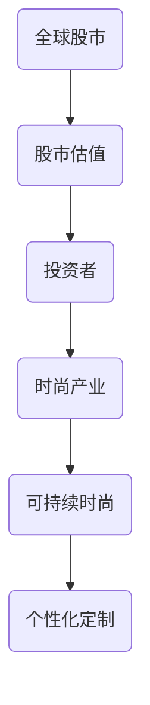
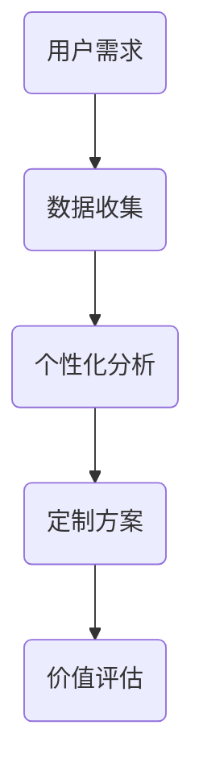
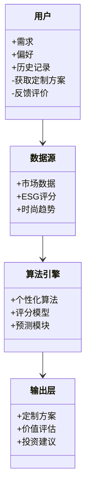
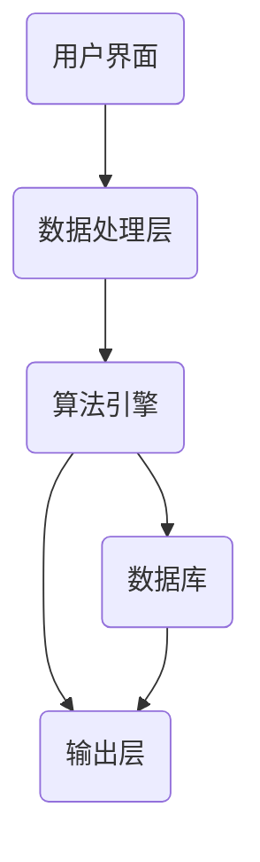
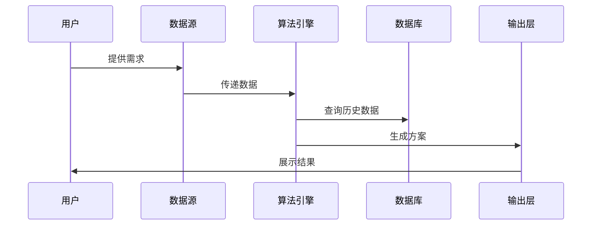

                 


# 《全球股市估值与可持续时尚个性化定制的关联》

## 关键词：
- 全球股市估值、可持续时尚、个性化定制、算法模型、系统架构

## 摘要：
本文章探讨了全球股市估值与可持续时尚个性化定制之间的关联，通过分析股市估值的核心原理、可持续时尚的定义与特征，以及个性化定制的模式，提出了一个基于数据驱动的算法模型，用于评估和预测股市估值在可持续时尚中的应用。文章还包括系统设计与架构分析，以及实际案例的项目实战，展示了如何将理论应用于实践。

---

## 第一部分：背景介绍

### 第1章：全球股市估值与可持续时尚的关联背景

#### 1.1 问题背景与问题描述
- 全球经济与股市估值的相互作用
- 可持续时尚的定义与特征
- 个性化定制在时尚产业中的兴起

#### 1.2 问题解决与边界
- 分析股市估值与可持续时尚的关联
- 探讨个性化定制对股市估值的影响
- 研究的边界与外延

#### 1.3 核心概念与组成
- 全球股市估值的核心要素
- 可持续时尚的属性与特征
- 个性化定制的模式与分类

---

## 第二部分：核心概念与联系

### 第2章：全球股市估值的核心原理

#### 2.1 股市估值的基本原理
- 股价计算公式与模型
- 影响股市估值的主要因素

#### 2.2 可持续发展对股市估值的影响
- 环境、社会、治理（ESG）因素
- 可持续发展对投资决策的影响

#### 2.3 核心概念对比表格
- 对比表格：全球股市估值与传统股市估值的差异

#### 2.4 ER实体关系图（Mermaid流程图）


---

## 第三部分：算法原理讲解

### 第3章：可持续时尚个性化定制的算法模型

#### 3.1 算法原理与流程
- 数据流图：从时尚需求到个性化定制的算法流程


#### 3.2 数学模型与公式
- 个性化定制评分公式：
  $$ \text{评分} = \sum_{i=1}^{n} w_i \times x_i $$
  其中，$$ w_i $$ 为权重，$$ x_i $$ 为特征值。

#### 3.3 代码实现与案例
- 示例代码：
```python
def calculate_score(features, weights):
    return sum(w * f for w, f in zip(weights, features))
```

---

## 第四部分：系统分析与架构设计

### 第4章：系统分析与架构设计

#### 4.1 问题场景介绍
- 可持续时尚个性化定制的系统需求
- 系统功能设计（领域模型mermaid类图）


#### 4.2 系统架构设计
- 系统架构图（mermaid架构图）


#### 4.3 系统接口设计
- 接口定义：
  - 数据输入接口
  - 算法调用接口
  - 输出展示接口

#### 4.4 系统交互流程图（mermaid序列图）


---

## 第五部分：项目实战

### 第5章：项目实战与案例分析

#### 5.1 环境安装
- 安装Python、数据处理库（Pandas、NumPy）
- 安装可视化工具（Matplotlib、Seaborn）
- 安装Mermaid插件或其他图表工具

#### 5.2 核心代码实现
```python
import pandas as pd
import numpy as np

def calculate_score(features, weights):
    return sum(w * f for w, f in zip(weights, features))

# 示例数据
features = [3, 2, 4]
weights = [0.5, 0.3, 0.2]
score = calculate_score(features, weights)
print(score)  # 输出：3*0.5 + 2*0.3 + 4*0.2 = 1.5 + 0.6 + 0.8 = 3.9
```

#### 5.3 案例分析
- 通过实际数据展示算法的应用
- 分析结果对股市估值的影响
- 总结经验与不足

#### 5.4 项目小结
- 成果总结
- 问题与不足
- 改进建议

---

## 第六部分：总结与展望

### 第6章：总结与展望

#### 6.1 核心成果总结
- 研究的主要发现
- 算法模型的优缺点
- 系统设计的创新点

#### 6.2 当前研究的不足
- 数据获取的难度
- 算法的局限性
- 系统性能的优化空间

#### 6.3 未来展望
- 新技术的引入（如AI、大数据）
- 新趋势的探索（如元宇宙时尚）
- 研究方向的扩展

---

## 附录

### 附录A：术语表
- 全球股市估值
- 可持续时尚
- 个性化定制

### 附录B：数据来源与处理
- 数据收集方法
- 数据清洗流程
- 数据存储方式

---

# 结语
本文通过系统的分析与实践，揭示了全球股市估值与可持续时尚个性化定制之间的深层关联，为未来的投资决策和时尚产业提供了新的视角和方法。

