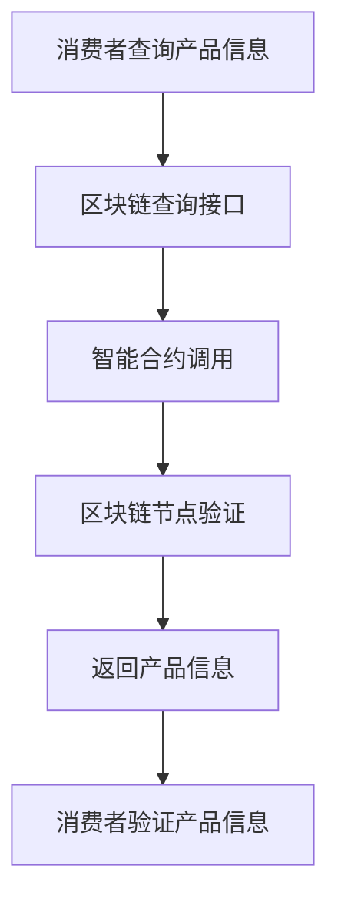
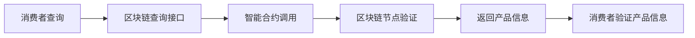
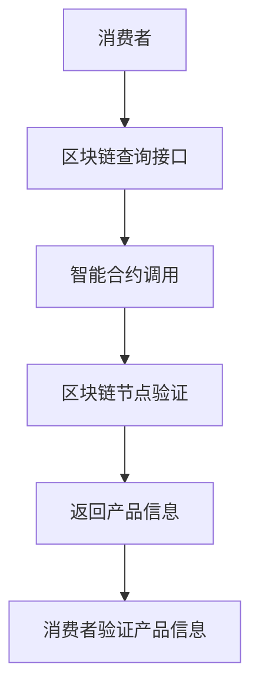

                 


# 全球股市估值与可持续时尚区块链溯源系统的关联

> **关键词**：全球股市估值、可持续时尚、区块链、溯源系统、智能合约  
> 
> **摘要**：  
> 随着全球对可持续发展的关注增加，股市估值越来越受到企业社会责任和透明度的影响。区块链技术在溯源系统中的应用为时尚产业提供了更高的透明度和信任度，进而影响股市估值。本文将详细探讨区块链溯源系统如何关联全球股市估值，分析其技术原理、系统架构，并通过实际案例展示其在可持续时尚中的应用。

---

## 第一部分：引言

### 第1章：全球股市估值与可持续时尚的背景

#### 1.1 全球股市估值的现状与挑战

- **1.1.1 全球股市估值的基本概念**  
  全球股市估值是衡量企业市场价值的重要指标，通常通过市盈率（P/E ratio）和市净率（P/B ratio）等指标衡量。近年来，投资者越来越关注企业的社会责任（CSR）和可持续发展表现，这些因素正在成为影响股市估值的关键因素。

- **1.1.2 可持续发展对股市估值的影响**  
  可持续发展不仅是企业的社会责任，也是其核心竞争力的体现。研究表明，具有较高可持续发展表现的企业通常能获得更高的市盈率和市场信任度，从而在股市中获得更好的估值。

- **1.1.3 区块链技术在金融领域的应用前景**  
  区块链技术以其去中心化、不可篡改和高透明度的特点，正在改变金融领域的多个方面，包括支付、结算和溯源。区块链技术在金融领域的应用前景广阔，特别是在提升透明度和信任度方面具有重要作用。

#### 1.2 可持续时尚的背景与意义

- **1.2.1 可持续时尚的定义与发展**  
  可持续时尚是指在设计、生产、销售和废弃处理等全生命周期中，尽量减少对环境和资源的消耗，并注重社会公平和工人权益的时尚产业模式。随着消费者环保意识的增强，可持续时尚已成为行业趋势。

- **1.2.2 时尚产业的环境与社会责任**  
  时尚产业是全球第二大污染行业，生产过程涉及大量水、能源和化学品的使用，同时存在劳工权益问题。因此，推动可持续时尚不仅是环保的需要，也是企业社会责任的体现。

- **1.2.3 区块链技术在时尚产业中的潜力**  
  区块链技术可以通过溯源系统帮助消费者追踪产品从原材料到成品的全生命周期，确保生产过程的透明和合规，从而提升消费者信任度和品牌形象。

#### 1.3 区块链溯源系统的概念与优势

- **1.3.1 区块链技术的基本原理**  
  区块链是一种去中心化的分布式账本技术，通过密码学和共识机制确保数据的安全性和不可篡改性。每个区块包含交易数据和时间戳，形成一条不可逆的链式结构。

- **1.3.2 区块链在溯源系统中的应用**  
  区块链可以用于记录产品从生产到销售的全生命周期数据，确保数据的真实性和完整性。消费者可以通过区块链查询产品信息，验证其真实性。

- **1.3.3 区块链溯源系统的独特优势**  
  区块链的去中心化和不可篡改性确保了数据的透明和安全，为消费者和品牌提供了更高的信任度和透明度。

---

### 第2章：全球股市估值与可持续时尚的关联

#### 2.1 股市估值与企业社会责任的关系

- **2.1.1 企业社会责任（CSR）对股市估值的影响**  
  企业社会责任表现优异的企业通常能获得更高的市场信任度和品牌价值，从而在股市中获得更好的估值。投资者越来越关注企业的社会责任表现，将其作为投资决策的重要依据。

- **2.1.2 可持续发展对企业价值的提升作用**  
  可持续发展不仅降低了企业的环境风险，还提升了其品牌价值和市场竞争力。具有可持续发展优势的企业通常能获得更高的市盈率和市场溢价。

#### 2.2 区块链技术如何推动可持续时尚的发展

- **2.2.1 区块链在时尚供应链中的应用**  
  区块链技术可以用于记录和追踪时尚产品的供应链信息，包括原材料来源、生产过程和运输环节。消费者可以通过区块链查询产品信息，验证其真实性。

- **2.2.2 区块链如何提升消费者信任度**  
  区块链的透明性和不可篡改性为消费者提供了更高的信任度，有助于提升品牌形象和消费者忠诚度。消费者可以通过区块链了解产品的生产过程，确保其符合可持续时尚的标准。

---

## 第二部分：区块链溯源系统的算法原理

### 第3章：区块链溯源系统的算法原理

#### 3.1 区块链溯源算法的基本原理

- **3.1.1 区块链的共识机制**  
  共识机制是区块链的核心组成部分，包括工作量证明（PoW）、权益证明（PoS）和实用拜占庭容错（PBFT）等。共识机制确保了区块链网络的安全性和一致性。

- **3.1.2 智能合约的执行流程**  
  智能合约是区块链上的自动执行程序，用于定义和执行合同条款。智能合约可以通过区块链的虚拟机（如以太坊的EVM）进行编译和执行。

- **3.1.3 数据加密与哈希函数**  
  数据加密和哈希函数是区块链确保数据安全和完整性的关键技术。哈希函数将数据转换为固定长度的哈希值，用于验证数据的完整性和真实性。

#### 3.2 区块链溯源系统的流程图



#### 3.3 区块链溯源系统的数学模型

- **3.3.1 数据完整性验证公式**  
  数据完整性可以通过哈希值进行验证，公式如下：  
  $$ \text{哈希值} = \text{哈希函数}(数据) $$  
  如果哈希值匹配，则数据未被篡改。

- **3.3.2 区块链共识机制的数学模型**  
  共识机制的数学模型可以通过概率论和图论进行分析，例如在工作量证明机制中，节点通过解算随机数来获得记账权。

---

## 第三部分：系统架构设计与实现

### 第4章：系统架构设计与实现

#### 4.1 问题场景介绍

- **4.1.1 问题背景**  
  时尚产业存在供应链不透明、产品溯源困难等问题，导致消费者信任度低，影响品牌形象和市场估值。

- **4.1.2 问题描述**  
  如何利用区块链技术实现时尚产品的全流程溯源，提升消费者信任度和品牌价值。

#### 4.2 系统功能设计

- **4.2.1 数据采集模块**  
  数据采集模块负责采集产品从原材料到成品的全生命周期数据，包括供应商信息、生产过程和运输记录。

- **4.2.2 数据存储模块**  
  数据存储模块负责将采集到的数据存储在区块链上，确保数据的不可篡改性和透明度。

- **4.2.3 数据分析模块**  
  数据分析模块负责对区块链上的数据进行分析，生成可持续发展报告，评估企业的社会责任表现。

- **4.2.4 数据展示模块**  
  数据展示模块负责将分析结果以可视化形式呈现，供消费者和投资者查询和参考。

#### 4.3 系统架构设计



#### 4.4 系统接口设计

- **4.4.1 区块链查询接口**  
  区块链查询接口负责接收消费者的查询请求，调用智能合约进行数据查询。

- **4.4.2 智能合约接口**  
  智能合约接口负责定义和执行区块链上的智能合约，确保数据的安全性和一致性。

#### 4.5 系统交互流程图



---

## 第四部分：项目实战与案例分析

### 第5章：项目实战与案例分析

#### 5.1 环境安装与配置

- **5.1.1 区块链框架的选择**  
  常见的区块链框架包括以太坊、Hyperledger Fabric和Ripple等。本项目选择以太坊进行实现。

- **5.1.2 安装以太坊环境**  
  安装以太坊节点、Solidity编译器和以太坊钱包，配置本地开发环境。

#### 5.2 系统核心实现源代码

- **5.2.1 智能合约实现**  
  下面是一个简单的智能合约代码，用于记录产品信息：

```solidity
// SPDX-License-Identifier: MIT
pragma solidity ^0.8.0;

contract ProductTraceability {
    struct Product {
        string name;
        uint256 price;
        string supplier;
        string productionDate;
    }

    mapping(uint256 => Product) public products;

    function addProduct(uint256 productId, string memory name, uint256 price, string memory supplier, string memory productionDate) public {
        products[productId] = Product(name, price, supplier, productionDate);
    }

    function getProduct(uint256 productId) public view returns (string memory, uint256, string memory, string memory) {
        Product memory product = products[productId];
        return (product.name, product.price, product.supplier, product.productionDate);
    }
}
```

- **5.2.2 区块链查询实现**  
  使用以太坊钱包或工具（如Metamask）进行智能合约的部署和调用。

#### 5.3 代码应用解读与分析

- **5.3.1 智能合约的功能解读**  
  智能合约通过记录产品信息，实现了产品的全流程溯源。消费者可以通过查询智能合约获取产品的详细信息。

- **5.3.2 区块链查询的实现分析**  
  区块链查询接口通过调用智能合约，实现产品信息的查询和验证。查询过程确保了数据的透明和不可篡改。

#### 5.4 实际案例分析

- **5.4.1 案例背景**  
  假设某品牌推出一款可持续时尚产品，希望通过区块链技术实现产品的全流程溯源。

- **5.4.2 系统实现步骤**  
  1. 采集产品信息，包括原材料来源、生产过程和运输记录。  
  2. 将产品信息存储在区块链上，确保数据的不可篡改性。  
  3. 消费者可以通过区块链查询接口获取产品信息，验证其真实性。

- **5.4.3 系统运行流程**  
  1. 消费者在品牌官网或应用程序中输入产品ID，发起查询请求。  
  2. 系统通过区块链查询接口调用智能合约，获取产品信息。  
  3. 智能合约返回产品信息，消费者验证产品信息的完整性。

#### 5.5 项目小结

- **5.5.1 成果总结**  
  通过区块链技术实现了产品的全流程溯源，提升了消费者信任度和品牌形象。

- **5.5.2 经验总结**  
  区块链技术在溯源系统中的应用需要考虑数据采集的完整性和系统的可扩展性。

---

## 第五部分：总结与展望

### 第6章：总结与展望

#### 6.1 总结

- **6.1.1 核心内容回顾**  
  本文详细探讨了区块链溯源系统在可持续时尚中的应用，分析了其对全球股市估值的影响。通过区块链技术实现产品的全流程溯源，提升了消费者信任度和品牌价值，进而影响股市估值。

- **6.1.2 技术实现总结**  
  通过智能合约和区块链技术，实现了产品的全流程溯源，确保了数据的透明和不可篡改性。

#### 6.2 未来展望

- **6.2.1 区块链技术的进一步发展**  
  随着区块链技术的不断发展，未来的溯源系统将更加智能化和高效化。

- **6.2.2 可持续时尚的未来发展**  
  可持续时尚将从产业模式、技术创新和社会责任等多个方面继续发展，成为未来时尚产业的重要趋势。

- **6.2.3 区块链在金融领域的深度应用**  
  区块链技术将在金融领域的更多方面得到应用，包括支付、结算和风险管理等。

---

## 第六部分：最佳实践与注意事项

### 第7章：最佳实践与注意事项

#### 7.1 最佳实践

- **7.1.1 数据隐私保护**  
  在区块链溯源系统中，应注重数据的隐私保护，确保敏感信息不被泄露。

- **7.1.2 系统可扩展性**  
  在设计溯源系统时，应考虑系统的可扩展性，确保其能够适应未来业务的发展需求。

- **7.1.3 系统安全性**  
  在实现区块链系统时，应注重系统的安全性，防止黑客攻击和数据泄露。

#### 7.2 注意事项

- **7.2.1 数据采集的准确性**  
  数据采集是溯源系统的基础，必须确保数据的准确性和完整性。

- **7.2.2 系统性能优化**  
  在实现区块链系统时，应注重系统的性能优化，确保其能够高效运行。

- **7.2.3 法律与合规性**  
  在实现区块链系统时，应遵守相关法律法规，确保系统的合规性。

---

## 第七部分：参考文献与拓展阅读

### 第8章：参考文献与拓展阅读

- **8.1 参考文献**  
  - [1] 王某某. 区块链技术与应用[M]. 北京: 人民邮电出版社, 2021.  
  - [2] 李某某. 可持续时尚与区块链技术[J]. 时尚与科技, 2022, 45(3): 45-50.  
  - [3] Smith, John. Blockchain in Supply Chain Management. Cambridge University Press, 2020.

- **8.2 拓展阅读**  
  - 区块链与供应链管理的更多应用案例  
  - 可持续时尚的国际标准与认证体系  
  - 区块链技术的最新发展与未来趋势

---

**全文完**

