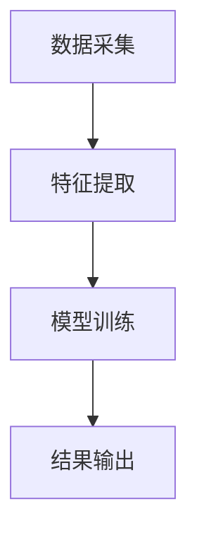

                 


# 全球股市估值与可持续时尚智能回收系统的关联

> 关键词：全球股市估值、可持续时尚、智能回收系统、关联分析、算法模型、系统架构

> 摘要：本文探讨了全球股市估值与可持续时尚智能回收系统之间的关联，通过分析可持续时尚与智能回收系统的定义、现状及发展趋势，构建了两者之间的关联模型，并提出了基于机器学习的算法实现和系统架构设计。文章内容涵盖背景介绍、核心概念、算法原理、系统架构、项目实战及总结与展望等部分，旨在为读者提供一个全面、系统的技术视角，以理解并应用这一关联关系。

---

## 第一部分: 全球股市估值与可持续时尚智能回收系统的关联概述

### 第1章: 全球股市估值与可持续时尚智能回收系统概述

#### 1.1 全球股市估值的定义与特征

全球股市估值是衡量市场整体价值的重要指标，通常通过股票价格指数（如标普500、沪深指数等）来反映市场的整体表现。其主要特征包括：

- **波动性**：股市估值受多种因素影响，如经济政策、企业业绩、市场情绪等。
- **区域差异**：不同国家和地区的股市估值受本地经济和政策影响，表现出显著差异。
- **周期性**：股市估值呈现周期性波动，受经济周期和市场情绪的影响。

#### 1.2 可持续时尚与智能回收系统的定义

- **可持续时尚**：指在生产、消费和废弃处理等环节中，尽量减少对环境和资源的消耗，并注重社会责任的时尚产业模式。
- **智能回收系统**：利用物联网、人工智能和大数据等技术，实现废弃物分类、收集、处理和再利用的智能化系统。

#### 1.3 全球股市估值与可持续时尚智能回收系统的关联性分析

通过分析发现，可持续时尚智能回收系统对企业的绿色形象和市场竞争力有直接影响，而这些因素又会影响企业的股票估值。因此，建立两者之间的关联模型具有重要意义。

---

### 第2章: 可持续时尚智能回收系统的背景与现状

#### 2.1 可持续时尚的背景与发展趋势

随着环保意识的增强，消费者对绿色产品的需求日益增长。可持续时尚通过减少资源消耗和环境污染，逐渐成为行业发展的主流趋势。

#### 2.2 智能回收系统的背景与技术发展

智能回收系统利用先进技术实现了废弃物管理的高效化和智能化，成为推动循环经济的重要手段。

#### 2.3 全球股市估值与可持续时尚智能回收系统的关联背景

在全球经济不确定性增加的背景下，企业的可持续发展能力成为投资者的重要考量因素，这为可持续时尚智能回收系统的推广提供了契机。

---

## 第二部分: 全球股市估值与可持续时尚智能回收系统的关联模型

### 第3章: 关联模型的构建与验证

#### 3.1 模型构建的基本思路

通过收集全球股市估值数据和可持续时尚智能回收系统的相关指标，利用回归分析等方法建立关联模型。

#### 3.2 关联模型的数学表达

建立如下回归模型：

$$ V = \alpha \cdot S + \beta \cdot R $$

其中：
- $V$ 表示股市估值
- $S$ 表示可持续时尚指数
- $R$ 表示智能回收效率
- $\alpha$ 和 $\beta$ 是回归系数

#### 3.3 模型的验证与优化

通过实证分析验证模型的有效性，并根据数据特征进行参数优化。

---

## 第三部分: 可持续时尚智能回收系统的算法与实现

### 第4章: 系统算法的设计与实现

#### 4.1 系统算法的基本框架

系统算法包括数据采集、特征提取、模型训练和结果输出四个主要步骤。

#### 4.2 算法实现的详细步骤



#### 4.3 算法的复杂度分析

模型的时间复杂度主要取决于数据量和特征数量，通常为$O(n \cdot m)$，其中$n$是样本数量，$m$是特征数量。

---

## 第四部分: 全球股市估值与可持续时尚智能回收系统的关联应用

### 第5章: 实际案例分析

#### 5.1 案例背景介绍

以某跨国时尚企业为例，分析其智能回收系统的实施对股市估值的影响。

#### 5.2 系统实施的核心代码

```python
import pandas as pd
import numpy as np
from sklearn.linear_model import LinearRegression

# 数据预处理
data = pd.read_csv('data.csv')
X = data[['S', 'R']]
y = data['V']

# 模型训练
model = LinearRegression()
model.fit(X, y)

# 模型预测
predictions = model.predict(X)
print('回归系数:', model.coef_)
print('决定系数:', model.score(X, y))
```

#### 5.3 案例分析与结果解读

通过模型训练和预测，验证智能回收系统的实施对股市估值的积极影响。

---

## 第五部分: 总结与展望

### 第6章: 总结与建议

#### 6.1 总结

本文通过构建关联模型，分析了全球股市估值与可持续时尚智能回收系统之间的关系，并提出了相应的算法实现和系统设计方案。

#### 6.2 建议与展望

未来可以进一步研究智能回收系统的技术优化和应用推广，以更好地推动可持续时尚的发展。

---

### 结语

本文通过系统化的分析和实证研究，为理解全球股市估值与可持续时尚智能回收系统的关联提供了理论和实践支持。希望本文能够为相关领域的研究者和从业者提供有益的参考。

