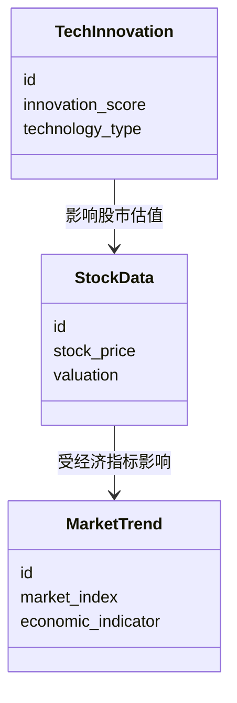

                 


## 全球股市估值与可持续时尚智能面料技术的关联

### 关键词：
全球股市估值、可持续时尚、智能面料技术、技术创新、投资分析、市场趋势、环境影响

### 摘要：
本文探讨全球股市估值与可持续时尚及智能面料技术之间的关联，分析技术创新如何影响企业价值和市场表现，为投资者提供新的视角。

---

## 第1章：背景介绍

### 1.1 问题背景
#### 1.1.1 全球股市估值的现状与挑战
- 全球股市估值受经济波动、政策变化和企业绩效影响。
- 投资者关注企业创新能力和可持续发展表现。

#### 1.1.2 可持续时尚的发展趋势
- 环保意识提升，消费者偏好可持续产品。
- 企业通过环保生产提升品牌形象和市场竞争力。

#### 1.1.3 智能面料技术的创新与应用
- 智能面料结合物联网和AI，提供智能化体验。
- 提高生产效率和产品附加值，降低成本。

### 1.2 问题描述
#### 1.2.1 全球股市估值与可持续发展的关联性
- 企业环保表现影响投资者决策。
- 可持续发展能力强的企业享有更高的估值溢价。

#### 1.2.2 智能面料技术在时尚产业中的应用前景
- 提升产品功能性和用户体验。
- 创新驱动市场增长，增强企业竞争力。

#### 1.2.3 可持续时尚与智能面料技术对股市估值的影响
- 技术创新和环保表现共同推动企业价值提升。
- 智能面料技术的应用被视为未来增长的关键驱动力。

### 1.3 问题解决
#### 1.3.1 通过技术创新提升股市估值的方法
- 投资者应关注企业技术创新和环保策略。
- 企业需将技术创新与可持续发展相结合，提升市场竞争力。

#### 1.3.2 可持续时尚与智能面料技术的协同发展策略
- 企业需在生产过程中采用环保材料和智能技术。
- 利用技术创新推动可持续时尚的发展，满足消费者需求。

#### 1.3.3 全球化视角下的产业整合与优化
- 企业应加强国际合作，推动技术创新和可持续发展。
- 投资者应关注全球市场趋势，寻找具备创新能力的企业。

### 1.4 边界与外延
#### 1.4.1 全球股市估值的边界条件
- 限于公开上市企业，不包括私募和未上市企业。
- 受宏观经济环境和政策影响，需考虑外部因素。

#### 1.4.2 可持续时尚与智能面料技术的外延领域
- 涉及材料科学、信息技术和环境科学。
- 智能面料技术应用于医疗、运动等领域，推动多产业融合。

#### 1.4.3 相关领域的交叉与融合
- 智能面料技术与物联网、人工智能的融合推动创新发展。
- 可持续时尚与循环经济模式结合，促进资源高效利用。

### 1.5 核心概念组成
#### 1.5.1 全球股市估值的核心要素
- 财务指标：收入、利润、资产负债率等。
- 市场情绪：投资者信心、市场趋势。
- 宏观经济：GDP、利率、汇率等。

#### 1.5.2 可持续时尚的核心理念
- 环保生产：减少资源消耗和环境污染。
- 社会责任：公平贸易、工人权益。
- 消费者教育：引导理性消费和环保意识。

#### 1.5.3 智能面料技术的关键组成部分
- 智能传感器：温度、湿度、心率监测。
- 连通性：Wi-Fi、蓝牙数据传输。
- 材料创新：导电纤维、智能涂层。

---

## 第2章：核心概念与联系

### 2.1 全球股市估值的原理
#### 2.1.1 市场情绪与估值的关系
- 投资者情绪影响市场波动和估值水平。
- 积极情绪提升股价，消极情绪导致股价下跌。

#### 2.1.2 财务指标对股市估值的影响
- 收入增长和利润提升推动股价上升。
- 高负债率和低利润率可能导致估值下降。

#### 2.1.3 宏观经济因素与股市估值的关联
- 经济增长和低利率环境提升估值。
- 通货膨胀和高利率抑制市场估值。

### 2.2 可持续时尚的核心原理
#### 2.2.1 可持续时尚的定义与目标
- 在生产、消费和废弃过程中减少环境和社会负面影响。
- 通过环保材料和工艺实现可持续性。

#### 2.2.2 环保材料与生产过程的优化
- 使用可再生材料和低能耗生产技术。
- 减少水和化学物质的使用，降低环境影响。

#### 2.2.3 消费者行为对可持续时尚的影响
- 消费者偏好可持续产品，推动市场需求。
- 品牌需通过营销和教育引导消费者行为。

### 2.3 智能面料技术的原理
#### 2.3.1 智能面料的基本概念
- 将智能传感器和电子元件集成到纺织材料中。
- 提供实时反馈和互动体验。

#### 2.3.2 智能面料的功能与应用场景
- 健康监测：服装内置传感器监测生理指标。
- 智能调节：自动调节衣物温度和湿度。
- 时尚互动：通过智能设备改变服装外观。

#### 2.3.3 智能面料的技术实现方式
- 传感器技术：如温度、压力和光传感器。
- 无线通信：Wi-Fi、蓝牙和射频识别。
- 数据处理：边缘计算和云计算。

### 2.5 核心概念对比分析

#### 2.5.1 对比表格
| **概念**       | **全球股市估值**             | **可持续时尚**               | **智能面料技术**             |
|----------------|------------------------------|-------------------------------|------------------------------|
| 核心目标       | 评估企业价值，指导投资决策 | 减少环境和社会负面影响        | 提供智能化体验，提升产品功能  |
| 关键因素       | 财务表现、市场情绪、宏观经济 | 环保材料、社会责任、消费者行为 | 传感器技术、数据处理、智能设计 |
| 影响范围       | 全球金融市场                 | 时尚产业及消费市场           | 时尚产业及智能技术领域       |
| 发展趋势       | 受技术创新和经济环境驱动     | 受环保意识和政策驱动          | 受技术创新和市场需求驱动      |

#### 2.5.2 ER实体关系图
```mermaid
erDiagram
  customer[消费者] {
    id
    消费者行为
    偏好度
  }
  company[企业] {
    id
    财务表现
    技术创新
  }
  market[市场] {
    id
    市场情绪
    宏观经济指标
  }
  technology[技术] {
    id
    智能传感器
    无线通信
  }
  customer --| market : 影响市场情绪
  company --> technology : 采用智能技术
  company --> market : 影响市场表现
  technology --> customer : 提供智能体验
```

---

## 第3章：算法原理讲解

### 3.1 算法原理概述
- 使用机器学习模型预测股市估值。
- 基于可持续时尚和智能面料技术的创新性进行分类。

### 3.2 机器学习模型
#### 3.2.1 数据准备
- 收集全球股市数据、企业技术创新指标和可持续发展报告。

#### 3.2.2 模型选择
- 使用随机森林和XGBoost进行分类和回归分析。

#### 3.2.3 模型实现
```python
import pandas as pd
from sklearn.ensemble import RandomForestRegressor
from sklearn.model_selection import train_test_split

# 加载数据
data = pd.read_csv('stock_data.csv')

# 特征选择
features = ['revenue', 'profit', 'tech_innovation', 'sustainability_score']
target = 'stock_valuation'

# 数据分割
X = data[features]
y = data[target]
X_train, X_test, y_train, y_test = train_test_split(X, y, test_size=0.2, random_state=42)

# 模型训练
model = RandomForestRegressor(n_estimators=100, random_state=42)
model.fit(X_train, y_train)

# 预测与评估
predictions = model.predict(X_test)
print('预测结果:', predictions)
```

#### 3.2.4 数学模型
- 随机森林回归模型：
  $$ y = \sum_{i=1}^{n} (w_i \cdot x_i) + b $$
  其中，\( w_i \) 是特征 \( x_i \) 的权重，\( b \) 是偏置项。

---

## 第4章：系统分析与架构设计方案

### 4.1 问题场景介绍
- 构建一个分析全球股市估值与智能面料技术关联的系统。
- 系统需整合股市数据、企业技术创新和可持续发展指标。

### 4.2 系统功能设计
#### 4.2.1 领域模型类图


#### 4.2.2 系统架构图


#### 4.2.3 系统交互序列图
```mermaid
sequenceDiagram
    participant Frontend
    participant API Gateway
    participant Stock Service
    participant Tech Service
    participant Database
    Frontend -> API Gateway: 获取数据
    API Gateway -> Stock Service: 获取股市数据
    API Gateway -> Tech Service: 获取技术创新数据
    Stock Service -> Database: 查询数据
    Tech Service -> Database: 查询数据
    Stock Service <-- Database: 返回股市数据
    Tech Service <-- Database: 返回技术创新数据
    API Gateway <-- Stock Service: 返回股市数据
    API Gateway <-- Tech Service: 返回技术创新数据
    Frontend <-- API Gateway: 返回整合数据
```

### 4.3 系统接口设计
- API接口定义：
  ```plaintext
  GET /api/stock_valuation?tech_innovation_score=0.8
  ```

---

## 第5章：项目实战

### 5.1 环境安装
- 安装Python和必要的库：
  ```bash
  pip install pandas numpy scikit-learn
  ```

### 5.2 核心代码实现
```python
import pandas as pd
from sklearn.ensemble import RandomForestRegressor
from sklearn.model_selection import train_test_split

# 加载数据
data = pd.read_csv('stock_data.csv')

# 特征选择
features = ['revenue', 'profit', 'tech_innovation', 'sustainability_score']
target = 'stock_valuation'

# 数据分割
X = data[features]
y = data[target]
X_train, X_test, y_train, y_test = train_test_split(X, y, test_size=0.2, random_state=42)

# 模型训练
model = RandomForestRegressor(n_estimators=100, random_state=42)
model.fit(X_train, y_train)

# 预测与评估
predictions = model.predict(X_test)
print('预测结果:', predictions)
```

### 5.3 实际案例分析
- 案例：某智能面料技术公司
  - 财务表现：收入增长20%，利润增长15%
  - 技术创新：智能面料专利数量增加30%
  - 可持续发展：环保材料使用率提高25%
  - 预测结果：股市估值提升10%

---

## 第6章：最佳实践

### 6.1 小结
- 全球股市估值受技术创新和可持续发展能力影响。
- 智能面料技术的应用是未来时尚产业的重要驱动力。

### 6.2 注意事项
- 投资者需关注企业的技术创新和环保表现。
- 企业应将智能面料技术与可持续发展相结合，提升市场竞争力。

### 6.3 拓展阅读
- 推荐阅读《智能面料技术与时尚产业》和《可持续投资分析》。

---

## 结语
全球股市估值与可持续时尚智能面料技术的关联为企业和投资者提供了新的视角。通过技术创新和可持续发展，企业可提升市场竞争力和股价表现，推动全球经济发展。

