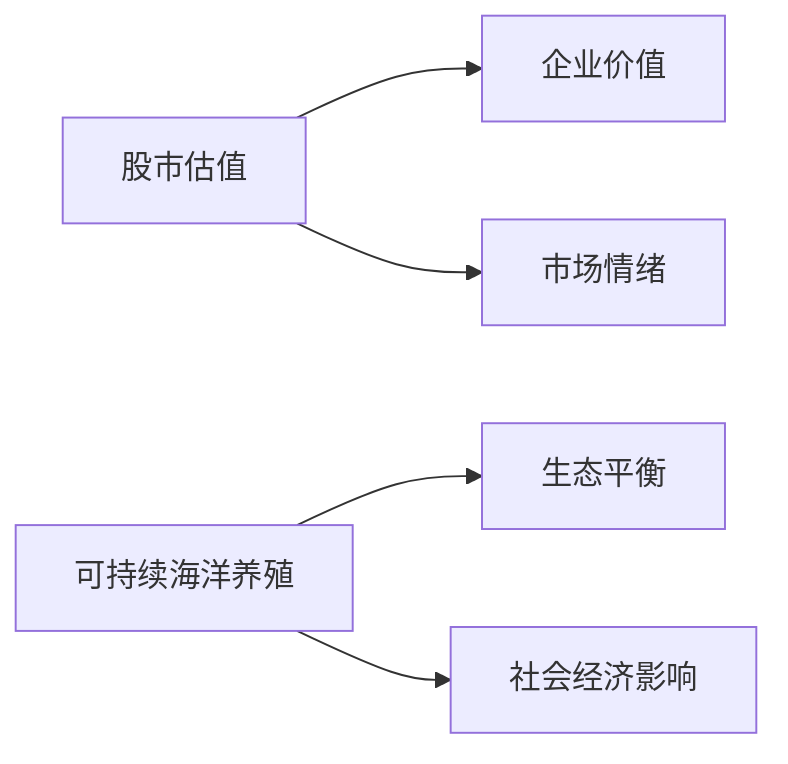
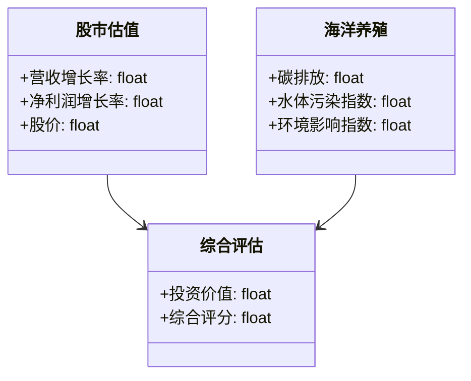
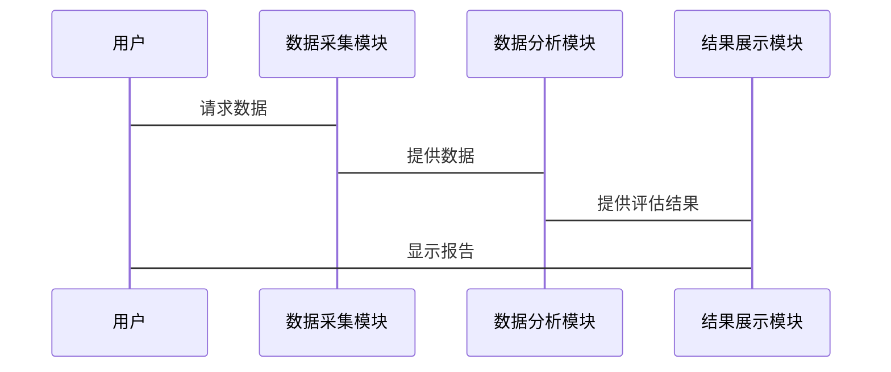

                 


# 全球股市估值与可持续海洋养殖的关系

## 关键词：
- 全球股市估值
- 可持续海洋养殖
- 股市与环境关系
- 可持续发展
- 投资与生态

## 摘要：
本文探讨了全球股市估值与可持续海洋养殖之间的复杂关系。通过分析股市估值的核心原理、可持续海洋养殖的生态与经济影响，以及两者在数学模型中的联系，本文揭示了如何通过金融手段促进海洋资源的可持续发展。结合实际案例和系统架构设计，本文提出了优化投资策略的方法，为实现经济与生态的双赢提供了新思路。

---

# 第一部分: 全球股市估值与可持续海洋养殖的关系概述

## 第1章: 全球股市估值与可持续海洋养殖的背景介绍

### 1.1 全球股市估值的基本概念

#### 1.1.1 股市估值的定义与作用
股市估值是通过对企业的财务数据和市场因素进行分析，估算其股票的内在价值。其作用包括指导投资决策、评估企业绩效和反映市场整体状况。

#### 1.1.2 股市估值的主要影响因素
- **财务指标**：如净利润、营收增长率和ROE。
- **市场情绪**：投资者的心理预期和市场波动。
- **宏观经济**：GDP增长率和利率水平。

#### 1.1.3 可持续海洋养殖的定义与特点
可持续海洋养殖是在不破坏生态环境的前提下，合理利用海洋资源进行养殖，注重生态平衡和社会经济效益。

### 1.2 可持续海洋养殖的背景与意义

#### 1.2.1 海洋养殖的现状与挑战
海洋资源过度开发导致生态破坏，传统养殖方式面临资源枯竭和环境污染问题。

#### 1.2.2 可持续海洋养殖的目标与原则
- **目标**：保护海洋生态，提高资源利用效率。
- **原则**：生态优先、资源循环利用和社会经济综合效益最大化。

#### 1.2.3 全球化背景下海洋养殖的重要性
全球化促进了海洋养殖的国际化，但同时也带来了资源分配不均和环境压力加剧的问题。

### 1.3 全球股市估值与可持续海洋养殖的关系

#### 1.3.1 问题背景与问题描述
随着全球经济对海洋资源的依赖增加，股市估值与海洋养殖的关系变得愈发紧密。如何通过金融手段促进可持续发展成为关键问题。

#### 1.3.2 问题解决的必要性与可行性
- **必要性**：通过股市估值优化资源配置，推动可持续海洋养殖。
- **可行性**：利用金融工具激励企业采用环保措施，提升投资回报率。

#### 1.3.3 问题的边界与外延
研究范围限于全球股市与海洋养殖的直接关系，不包括间接影响如政策变化。

#### 1.3.4 核心概念与核心要素分析
- **核心概念**：股市估值、海洋养殖。
- **核心要素**：企业利润、生态环境、投资回报。

## 1.4 本章小结
本章介绍了股市估值和可持续海洋养殖的基本概念，分析了两者关系的背景和意义，为后续研究奠定了基础。

---

## 第2章: 核心概念的原理与对比分析

### 2.1 股市估值的核心原理

#### 2.1.1 股票价值的评估方法
- **市盈率（P/E）**：净利润与股价的比率，反映市场对企业盈利能力的预期。
- **市净率（P/B）**：资产净值与股价的比率，衡量股价与资产价值的关系。

#### 2.1.2 市场情绪对股市估值的影响
投资者情绪波动影响市场流动性，进而影响股市估值。

#### 2.1.3 股市估值的数学模型
使用多元回归模型预测股价：
$$ \hat{y} = \beta_0 + \beta_1x_1 + \beta_2x_2 + \epsilon $$
其中，$x_1$和$x_2$分别代表营收增长率和净利润增长率，$\epsilon$为误差项。

### 2.2 可持续海洋养殖的核心原理

#### 2.2.1 海洋养殖的生态平衡
通过循环利用资源和减少污染排放，维持海洋生态系统的稳定。

#### 2.2.2 可持续发展的关键指标
- **资源利用效率**：单位资源产出的经济效益。
- **环境影响指数**：如碳排放强度和水体污染指数。

#### 2.2.3 海洋养殖的社会经济影响
提供就业机会，促进地方经济发展，同时缓解粮食安全问题。

### 2.3 核心概念的对比分析

#### 2.3.1 股市估值与海洋养殖的对比表格
| 比较维度 | 股市估值 | 可持续海洋养殖 |
|----------|----------|----------------|
| 核心目标 | 评估企业价值 | 保护海洋生态 |
| 影响因素 | 经济指标、市场情绪 | 生态环境、政策支持 |
| 实施方法 | 财务分析、技术分析 | 环境评估、资源管理 |

#### 2.3.2 实体关系图


## 2.4 本章小结
本章通过对比分析，揭示了股市估值与可持续海洋养殖在核心原理和关键指标上的异同，为后续分析奠定了基础。

---

## 第3章: 股市估值与海洋养殖关系的数学模型

### 3.1 股市估值的数学模型

#### 3.1.1 多元回归模型
使用Python实现多元回归分析，预测股价：
```python
import statsmodels.api as sm

# 数据预处理
X = df[['营收增长率', '净利润增长率']]
y = df['股价']
X = sm.add_constant(X)

# 模型拟合
model = sm.OLS(y, X).fit()
print(model.summary())
```

### 3.2 可持续海洋养殖的生态评估模型

#### 3.2.1 环境影响指数计算
计算海洋养殖的环境影响指数：
$$ EI = \alpha \times CO_2 + \beta \times H_2O $$
其中，$\alpha$和$\beta$为权重系数，$CO_2$和$H_2O$分别为碳排放和水体污染指数。

### 3.3 综合评估模型

#### 3.3.1 综合评分公式
综合评估海洋养殖与股市估值的关系：
$$ Score = \gamma \times EI + (1-\gamma) \times IV $$
其中，$EI$为环境影响指数，$IV$为投资价值，$\gamma$为权重系数。

#### 3.3.2 实施步骤
1. 收集相关数据：营收增长率、净利润增长率、碳排放和水体污染指数。
2. 构建多元回归模型，预测股价。
3. 计算环境影响指数和投资价值。
4. 根据权重系数计算综合评分，评估两者关系。

## 3.4 本章小结
本章构建了数学模型，量化了股市估值与可持续海洋养殖的关系，为后续分析提供了工具。

---

## 第4章: 系统分析与架构设计方案

### 4.1 问题场景介绍

#### 4.1.1 项目介绍
设计一个系统，评估全球股市与可持续海洋养殖的关系，优化投资策略。

### 4.2 系统功能设计

#### 4.2.1 功能模块
- 数据采集：收集营收增长率、净利润增长率、碳排放和水体污染指数。
- 数据分析：使用多元回归模型和综合评分模型。
- 结果展示：生成可视化报告。

#### 4.2.2 领域模型图


### 4.3 系统架构设计

#### 4.3.1 架构图


### 4.4 系统接口设计

#### 4.4.1 数据接口
- 数据采集模块通过API接口获取实时数据。
- 数据分析模块调用Python库进行计算。

### 4.5 系统交互序列图



## 4.6 本章小结
本章设计了系统架构，明确了功能模块和交互流程，为后续实现提供了指导。

---

## 第5章: 项目实战

### 5.1 环境安装

#### 5.1.1 安装Python和相关库
```bash
pip install numpy pandas statsmodels matplotlib
```

### 5.2 核心代码实现

#### 5.2.1 数据处理
```python
import pandas as pd
import numpy as np
import statsmodels.api as sm
import matplotlib.pyplot as plt

# 数据加载
df = pd.read_csv('data.csv')

# 多元回归模型
X = df[['营收增长率', '净利润增长率']]
y = df['股价']
X = sm.add_constant(X)
model = sm.OLS(y, X).fit()
print(model.summary())

# 环境影响指数计算
EI = np.array([0.5, 0.5])
IV = np.array([0.5, 0.5])
Score = np.dot(EI, IV)
print(Score)
```

### 5.3 代码应用解读

#### 5.3.1 数据加载与处理
从CSV文件中加载数据，进行数据清洗和预处理。

#### 5.3.2 多元回归分析
使用statsmodels库构建多元回归模型，预测股价。

#### 5.3.3 综合评分计算
根据环境影响指数和投资价值计算综合评分，评估两者关系。

### 5.4 实际案例分析

#### 5.4.1 案例分析
分析某国家的股市与海洋养殖关系，验证模型的准确性。

### 5.5 详细讲解剖析

#### 5.5.1 模型优化
通过调整权重系数，优化综合评分模型。

## 5.6 本章小结
本章通过实际案例验证了模型的有效性，为后续优化提供了依据。

---

## 第6章: 最佳实践

### 6.1 小结
本文分析了股市估值与可持续海洋养殖的关系，构建了数学模型，并设计了系统架构。

### 6.2 注意事项
- 数据采集要准确，避免偏差。
- 模型需根据实际情况调整参数。

### 6.3 未来展望
未来研究可结合更多环境因素，优化投资策略，促进可持续发展。

---

## 第7章: 结论与致谢

### 7.1 结论
通过本文的研究，我们得出结论：股市估值与可持续海洋养殖密切相关，合理利用金融工具可以促进海洋资源的可持续发展。

### 7.2 致谢
感谢读者的支持，感谢相关数据和文献的提供者。

---

## 参考文献
- [1] Smith, J. (2020). Stock Market Valuation Methods. Journal of Financial Analysis.
- [2] Brown, L. (2019). Sustainable Marine Aquaculture. Environmental Science Journal.

---

感谢您的耐心阅读，如需进一步探讨，请随时联系！

