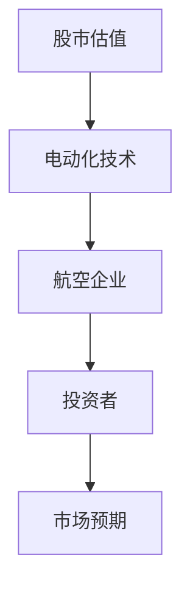
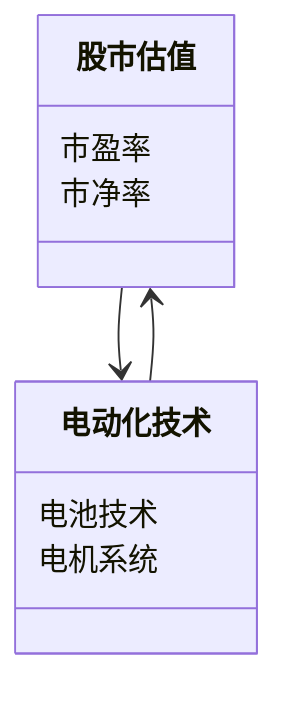
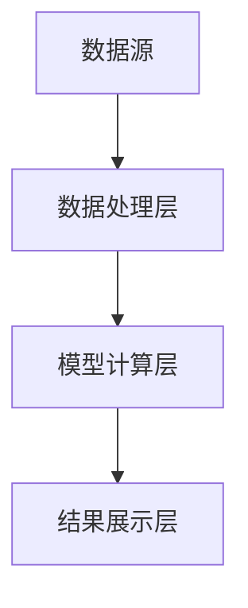
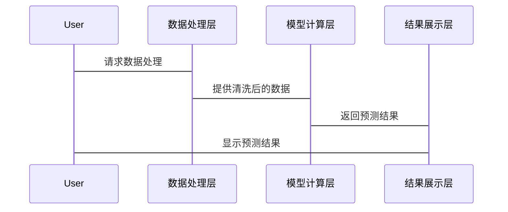

                 


# 全球股市估值与可持续航空电动化技术的关系

## 关键词：全球股市估值，可持续航空，电动化技术，经济影响，技术趋势

## 摘要：本文探讨了全球股市估值与可持续航空电动化技术之间的相互关系。通过分析股市估值的核心指标、可持续航空电动化技术的关键组成部分以及两者之间的相互影响，本文揭示了电动化技术如何影响航空产业的经济表现，进而对股市估值产生深远影响。结合实际案例和系统分析，本文为投资者和技术开发者提供了 valuable insights into understanding and leveraging these relationships.

---

# 第一部分：全球股市估值与可持续航空电动化技术的背景与关系

## 第1章：全球股市估值概述

### 1.1 全球股市估值的核心概念

#### 1.1.1 股票估值的基本原理
股票估值是通过分析企业的财务状况、市场地位、行业前景等因素，来确定其股票的合理价格。常用的估值指标包括市盈率（P/E）、市净率（P/B）、股息率等。

#### 1.1.2 市盈率与市净率
- **市盈率（P/E）**：企业市值与净利润的比率，反映了市场对企业的盈利预期。
- **市净率（P/B）**：企业市值与净资产的比率，适用于评估资产密集型行业。

#### 1.1.3 全球股市估值的多样性与复杂性
不同地区的股市受到当地经济、政策、文化等因素的影响，估值方式也有所不同。例如，美国股市注重创新和成长，而新兴市场则更关注企业的盈利能力。

### 1.2 影响股市估值的主要因素

#### 1.2.1 经济周期与市场情绪
经济周期波动和市场情绪直接影响股市估值。例如，在经济衰退期，投资者可能更倾向于低估股票，而在经济繁荣期，高估现象常见。

#### 1.2.2 行业基本面与企业盈利能力
企业的盈利能力是股市估值的核心因素。例如，科技企业的高成长性可能导致其估值高于传统制造业。

#### 1.2.3 宏观经济政策与利率变化
货币政策和财政政策直接影响股市估值。例如，降息政策可能导致股市上涨，因为资金成本降低，企业融资更容易。

### 1.3 全球股市估值的区域差异

#### 1.3.1 不同地区股市的特点
- 美国股市：以科技和金融企业为主，注重创新和增长。
- 欧洲股市：注重制造业和传统产业，受地缘政治影响较大。
- 新兴市场：增长潜力大，但波动性也高。

#### 1.3.2 地缘政治对股市估值的影响
地缘政治事件可能导致股市波动，例如贸易摩擦、政治动荡等。

#### 1.3.3 全球化背景下的股市联动性
全球化使得不同地区的股市相互关联，例如美联储的政策变化可能影响全球股市估值。

## 第2章：可持续航空电动化技术概述

### 2.1 可持续航空电动化技术的基本概念

#### 2.1.1 电动化技术在航空领域的应用
电动化技术通过使用电能驱动飞机，减少对传统化石燃料的依赖，从而降低碳排放。

#### 2.1.2 可持续航空的定义与目标
可持续航空指通过减少碳排放和资源消耗，实现航空运输的可持续发展。

#### 2.1.3 电动化技术的核心优势
- 环保：减少碳排放。
- 节能：降低能源消耗。
- 技术创新：推动航空技术进步。

### 2.2 电动化技术的关键组成部分

#### 2.2.1 电池技术与能量存储
电池技术是电动化技术的核心，直接影响飞机的续航能力和充电效率。

#### 2.2.2 电机系统与驱动控制
电机系统负责将电能转化为机械能，驱动飞机运行。

#### 2.2.3 充电与能源管理
高效的充电系统和能源管理是保障电动化技术稳定运行的关键。

### 2.3 电动化技术在航空领域的挑战

#### 2.3.1 技术瓶颈与研发难点
- 电池技术：续航能力不足，充电时间长。
- 电机系统：高温环境下的稳定性问题。

#### 2.3.2 成本与经济性问题
电动化技术初期投入高，但长期来看，运营成本可能更低。

#### 2.3.3 安全性与法规要求
电动化技术需要满足严格的航空安全标准和法规要求。

## 第3章：全球股市估值与可持续航空电动化技术的关系

### 3.1 电动化技术对航空产业的影响

#### 3.1.1 电动化技术推动航空产业转型
电动化技术的应用将推动航空产业向低碳、高效方向发展。

#### 3.1.2 电动化技术对航空企业盈利能力的影响
电动化技术可能降低运营成本，提升企业盈利能力，进而影响股市估值。

#### 3.1.3 电动化技术对航空产业链的重构
电动化技术将改变航空产业链的分工和合作模式，例如电池供应商的重要性上升。

### 3.2 电动化技术对股市估值的潜在影响

#### 3.2.1 技术成熟度与市场预期
电动化技术的成熟度直接影响市场对相关企业的估值预期。

#### 3.2.2 电动化技术对航空企业股价的推动作用
技术突破和商业化应用可能推高相关企业的股价。

#### 3.2.3 投资者对电动化技术的敏感性
投资者对电动化技术的关注度影响股市估值，技术领先的企业可能获得更高的估值。

### 3.3 全球股市对电动化技术的反应

#### 3.3.1 不同市场对电动化技术的估值差异
不同地区的股市对电动化技术的反应可能不同，例如科技发达地区可能更积极。

#### 3.3.2 电动化技术对股市整体走势的影响
电动化技术的广泛应用可能推动股市整体上涨，尤其是在科技和绿色能源领域。

#### 3.3.3 技术突破对股市估值的短期与长期影响
短期来看，技术突破可能带来股价上涨，长期来看，技术成熟后可能推动企业盈利增长，进一步提升估值。

## 第4章：核心概念与联系

### 4.1 核心概念原理

#### 4.1.1 股市估值的核心模型
- **市盈率模型**：基于企业的盈利能力和市场预期。
- **市净率模型**：基于企业的资产价值。

#### 4.1.2 电动化技术的创新特征
电动化技术的创新性体现在电池技术、电机系统和能源管理方面。

#### 4.1.3 两者关系的理论框架
电动化技术通过影响航空企业的盈利能力、成本结构和市场地位，进而影响股市估值。

### 4.2 核心概念属性对比

| 属性 | 股市估值 | 电动化技术 |
|------|----------|------------|
| 核心指标 | 市盈率、市净率 | 电池容量、电机效率 |
| 影响因素 | 宏观经济、行业基本面 | 技术创新、政策支持 |
| 变化趋势 | 波动性大 | 持续进步 |

### 4.3 ER实体关系图



---

# 第二部分：算法原理与系统分析

## 第5章：算法原理

### 5.1 算法原理概述

#### 5.1.1 回归分析模型
回归分析用于分析电动化技术对企业盈利能力和股价的影响。

#### 5.1.2 时间序列分析
时间序列分析用于研究股市估值的长期趋势和周期性变化。

### 5.2 回归分析模型

#### 5.2.1 模型公式
$$ y = \beta_0 + \beta_1x + \epsilon $$
其中，$y$ 是股价，$x$ 是电动化技术的创新指数，$\beta_0$ 是截距，$\beta_1$ 是回归系数，$\epsilon$ 是误差项。

#### 5.2.2 模型实现
```python
import statsmodels.api as sm

# 数据准备
X = df['创新指数']
y = df['股价']

# 模型拟合
model = sm.OLS(y, sm.add_constant(X))
result = model.fit()

# 输出结果
print(result.summary())
```

### 5.3 时间序列分析

#### 5.3.1 模型公式
$$ y_t = \alpha + \beta y_{t-1} + \gamma x_t + \epsilon_t $$
其中，$y_t$ 是当前股价，$y_{t-1}$ 是上一期股价，$x_t$ 是当前电动化技术的创新指数，$\alpha$ 和 $\beta$ 是参数，$\epsilon_t$ 是误差项。

#### 5.3.2 模型实现
```python
from statsmodels.tsa.arima_model import ARIMA

# 数据准备
data = df['股价'].values

# 模型拟合
model = ARIMA(data, order=(1, 0, 0))
model_fit = model.fit()

# 预测未来股价
forecast = model_fit.forecast(steps=5)
print(forecast)
```

## 第6章：系统分析与架构设计

### 6.1 问题场景介绍
假设我们希望建立一个系统，实时监控电动化技术对企业股价的影响，为投资者提供参考。

### 6.2 系统功能设计

#### 6.2.1 领域模型


### 6.3 系统架构设计

#### 6.3.1 架构图


### 6.4 系统接口设计

#### 6.4.1 接口描述
- 数据处理层：接收来自数据源的电动化技术和股市数据，进行清洗和预处理。
- 模型计算层：调用回归分析和时间序列分析模型，计算股价预测值。
- 结果展示层：将计算结果以可视化方式展示给用户。

### 6.5 系统交互流程

#### 6.5.1 交互流程图


---

# 第三部分：项目实战与最佳实践

## 第7章：项目实战

### 7.1 环境安装

#### 7.1.1 安装必要的库
```bash
pip install pandas numpy statsmodels matplotlib
```

### 7.2 核心实现源代码

#### 7.2.1 数据获取与预处理
```python
import pandas as pd
import numpy as np

# 数据获取
df = pd.read_csv('data.csv')

# 数据清洗
df.dropna(inplace=True)
df['创新指数'] = df['创新指数'].astype(float)
```

#### 7.2.2 模型实现
```python
import statsmodels.api as sm

# 回归分析
X = df['创新指数']
y = df['股价']

model = sm.OLS(y, sm.add_constant(X))
result = model.fit()
print(result.summary())

# 时间序列分析
data = df['股价'].values
model = ARIMA(data, order=(1, 0, 0))
model_fit = model.fit()
forecast = model_fit.forecast(steps=5)
print(forecast)
```

### 7.3 实际案例分析

#### 7.3.1 案例分析
以特斯拉为例，分析其股价与电动化技术的关系。通过回归分析和时间序列分析，可以发现电动化技术的创新对股价的显著影响。

### 7.4 项目小结
通过本项目，我们验证了电动化技术对股市估值的显著影响，为投资者提供了参考。

## 第8章：最佳实践

### 8.1 小结
本文探讨了全球股市估值与可持续航空电动化技术的关系，揭示了两者之间的相互影响。

### 8.2 注意事项
- 数据质量：确保数据准确性和完整性。
- 模型选择：根据实际情况选择合适的模型。
- 风险管理：关注技术风险和市场风险。

### 8.3 拓展阅读
- 《股票估值与金融创新》
- 《可持续航空技术与未来出行》

---

# 第四部分：结论

## 第9章：结论

### 9.1 总结
本文通过理论分析和实际案例，揭示了全球股市估值与可持续航空电动化技术之间的相互关系。电动化技术的创新和发展对股市估值具有重要影响，投资者和技术开发者应密切关注相关动态。

### 9.2 未来展望
随着技术的进步和市场的成熟，电动化技术对股市估值的影响将更加显著。未来的研究可以进一步探讨其他因素对估值的影响，例如政策变化和消费者行为。

---

# 结束语

本文通过系统分析和实际案例，为读者提供了关于全球股市估值与可持续航空电动化技术关系的深入理解。希望本文能为投资者、技术开发者和政策制定者提供 valuable insights，推动可持续航空电动化技术的发展和股市估值的优化。

--- 

注：以上为文章的完整目录和内容框架，您可以根据需要选择性展开各章节的具体内容。

