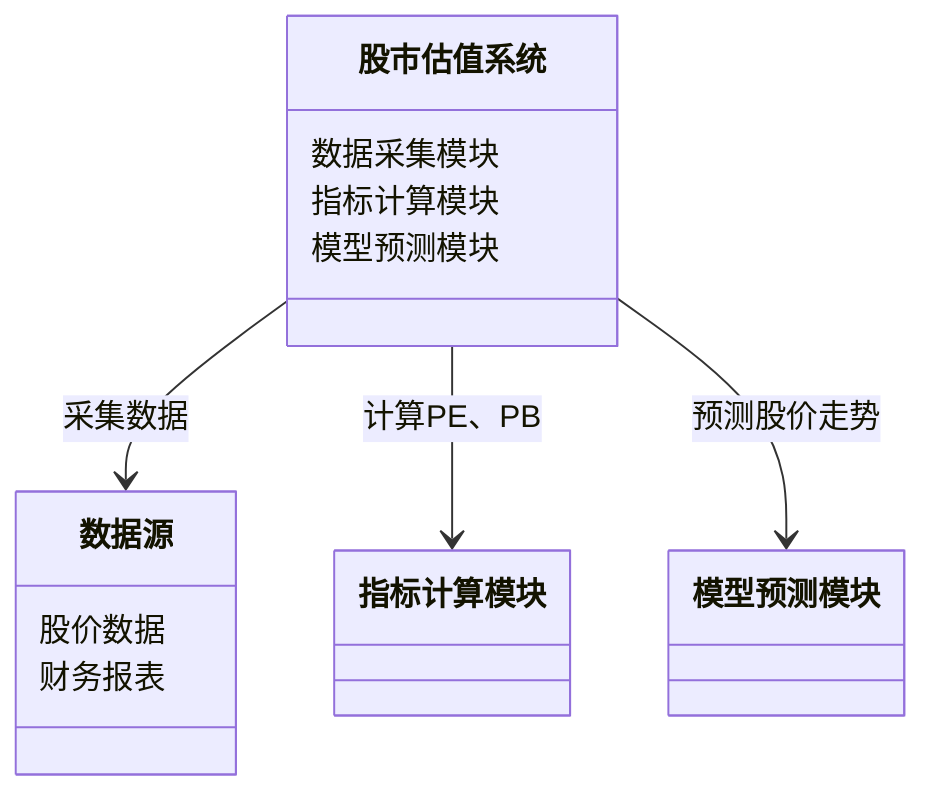

                 


# 全球股市估值与可食用包装在食品工业中的应用

> 关键词：股市估值、可食用包装、食品工业、算法原理、系统架构

> 摘要：本文探讨了全球股市估值与可食用包装在食品工业中的应用。首先，介绍了股市估值的核心概念与算法，接着分析了可食用包装的材料特性与应用。通过对比分析，展示了两者在食品工业中的潜在结合点，最后提出了系统的架构设计与优化建议。

---

## 第一部分：全球股市估值的背景与概念

### 第1章：全球股市估值概述

#### 1.1 股市估值的基本概念

股市估值是通过对企业的财务数据和市场表现进行分析，评估其内在价值的过程。核心指标包括市盈率（PE）、市净率（PB）、股息率等。这些指标帮助企业判断股票是否被高估或低估。

#### 1.2 全球主要股市的概况

全球主要股市包括美国的纽约证券交易所和纳斯达克，欧洲的伦敦金融时报和法兰克福证交所，以及亚洲的香港恒生指数和东京证交所。每个市场的特点和运行机制不同，但都遵循相似的估值原则。

#### 1.3 股市估值的核心要素

股市估值需要考虑宏观经济环境、行业趋势、公司基本面等因素。通过分析这些因素，投资者可以做出更明智的投资决策。

---

## 第二部分：可食用包装的背景与概念

### 第2章：可食用包装的定义与发展

#### 2.1 可食用包装的基本概念

可食用包装是一种创新材料，可以直接作为食品的一部分被消费。它通常由天然成分制成，如海藻、淀粉、蛋白质等。

#### 2.2 可食用包装的材料特性

可食用包装材料需具备生物降解性、安全性、稳定性等特性。这些材料能够有效保护食品，同时减少环境影响。

#### 2.3 可食用包装的应用场景

可食用包装广泛应用于零食、乳制品、海鲜等领域。它不仅延长了保质期，还提升了消费者体验。

---

## 第三部分：核心概念与联系

### 第3章：核心概念对比

通过表格对比股市估值和可食用包装的关键属性，展示两者在食品工业中的潜在结合点。

```mermaid
table
| 比较维度 | 股市估值 | 可食用包装 |
|----------|----------|------------|
| 核心目标 | 评估企业价值 | 保护食品 |
| 关键指标 | PE、PB | 降解速率 |
| 应用领域 | 投资决策 | 食品包装 |
| 技术基础 | 财务分析 | 材料科学 |
```

---

## 第四部分：算法与数学模型

### 第4章：股市估值算法

#### 4.1 PE估值法

PE（市盈率）= 股票价格 / 每股净利润。代码示例：

```python
import pandas as pd
import yfinance as yf

# 下载数据
data = yf.download('AAPL', start='2022-01-01', end='2023-01-01')
data['PE'] = data['Close'] / data['EPS'].fillna(0)
print(data['PE'].mean())
```

#### 4.2 DCF模型

DCF（现金流贴现法）用于评估企业未来现金流的现值。

$$DCF = \sum_{t=1}^{n} \frac{CF_t}{(1 + r)^t}$$

其中，$CF_t$为第t年的现金流，$r$为折现率。

---

## 第五部分：系统分析与架构

### 第5章：系统架构设计

#### 5.1 股市估值系统



---

## 第六部分：项目实战

### 第6章：项目实战

#### 6.1 股市估值项目

- **环境安装**：安装Python和相关库（pandas、yfinance）。
- **代码实现**：计算某公司过去一年的PE值。
- **案例分析**：分析PE趋势，判断股票是否被低估。

#### 6.2 可食用包装项目

- **材料选择**：选择可降解材料，测试其在不同环境下的降解速率。
- **性能测试**：评估包装的密封性和保质效果。

---

## 第七部分：综合应用与未来趋势

### 第7章：综合应用与未来趋势

#### 7.1 综合应用

可食用包装技术的引入可能提升食品企业的估值，因为它符合环保趋势，减少包装废弃物。

#### 7.2 未来趋势

随着技术进步，可食用包装将更加智能化，能够实时监测食品状态，进一步提升食品工业的效率和可持续性。

---

## 第八部分：最佳实践

### 第8章：最佳实践

#### 8.1 小结

股市估值和可食用包装在食品工业中的应用潜力巨大，结合两者的优势，企业可以实现更高的价值。

#### 8.2 注意事项

在股市投资中，需谨慎选择模型和数据源；在选择可食用包装材料时，需考虑成本和消费者接受度。

#### 8.3 拓展阅读

建议阅读《可降解材料的创新与应用》和《股市估值与投资策略》。

---

通过以上分析，我们详细探讨了全球股市估值与可食用包装在食品工业中的应用，结合实际案例和系统设计，为企业提供优化建议。

