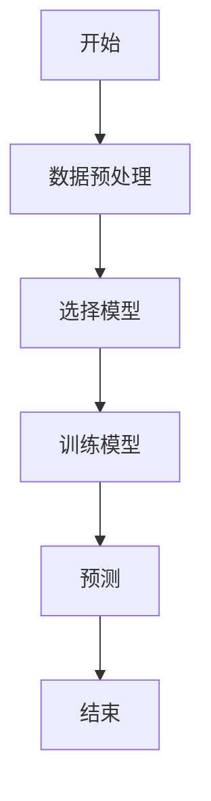
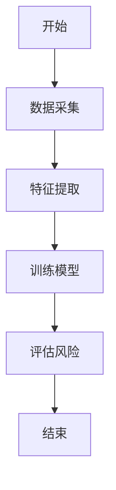
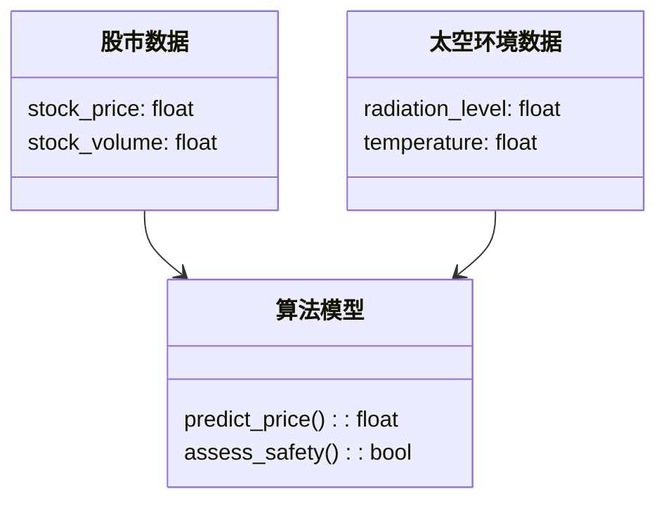
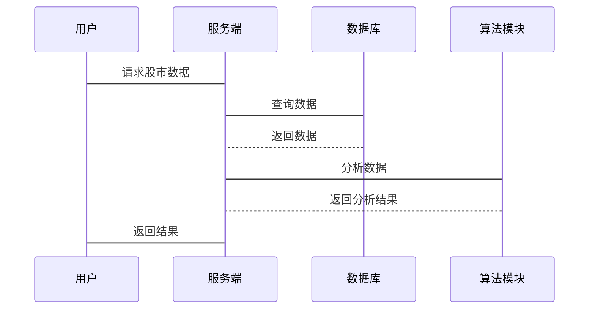

                 


# 全球股市估值与太空旅游安全技术的关系

## 关键词：股市估值、太空旅游、安全技术、算法模型、系统架构、项目实战

## 摘要：  
本文探讨了全球股市估值与太空旅游安全技术之间的关系，从背景介绍、核心概念、算法原理、系统架构到项目实战，详细分析了如何通过技术手段实现对股市估值和太空旅游安全技术的预测与评估。通过本文的分析，读者可以理解股市与太空旅游安全技术之间的相互影响，并掌握相关的技术方法。

---

# 第一部分: 全球股市估值与太空旅游安全技术的背景与关联

---

# 第1章: 背景介绍

## 1.1 全球股市估值的核心概念

### 1.1.1 股市估值的基本定义  
股市估值是指通过对公司财务数据、市场趋势和经济指标的分析，对股票价格的合理性和潜在价值进行评估的过程。它帮助投资者判断市场是否处于高估或低估状态。

### 1.1.2 股市估值的关键指标  
- **市盈率 (P/E Ratio)**：衡量股票价格与每股收益的比例。  
- **市净率 (P/B Ratio)**：衡量股票价格与每股净资产的比例。  
- **股息率 (Dividend Yield)**：衡量股票每年派发的股息与股票价格的比率。  

### 1.1.3 股市估值的边界与外延  
股市估值不仅关注单个股票，还涉及整个市场的整体估值，如标普500指数的估值水平。

---

## 1.2 太空旅游安全技术的核心概念

### 1.2.1 太空旅游的基本定义  
太空旅游是指通过商业航班或其他方式，让普通人进入太空进行观光或科研活动。  

### 1.2.2 太空旅游安全技术的关键要素  
- **火箭发射安全**：确保火箭在发射过程中不发生事故。  
- **太空飞船设计**：保证飞船的结构强度和抗辐射能力。  
- **太空环境监测**：实时监测太空环境中的辐射、温度等参数。  

### 1.2.3 太空旅游安全技术的边界与外延  
太空旅游安全技术不仅涉及硬件设计，还包括软件系统的安全性和应急响应机制。

---

## 1.3 股市估值与太空旅游安全技术的关联性

### 1.3.1 问题背景与问题描述  
随着太空旅游逐渐商业化，投资者对其关注度提高，股市估值的变化可能反映出市场对太空旅游技术的信心。同时，太空旅游的安全性也会影响相关公司的股价。

### 1.3.2 问题解决的路径与方法  
通过分析股市数据和太空旅游技术数据，建立数学模型，预测股市估值的变化，并评估太空旅游技术的安全性。

### 1.3.3 核心概念的结构与核心要素  
- 股市估值的核心要素：财务数据、市场情绪、经济指标。  
- 太空旅游安全技术的核心要素：硬件设计、软件系统、环境监测。  

---

## 1.4 本章小结  
本章介绍了股市估值和太空旅游安全技术的核心概念，并分析了两者之间的关联性。接下来将深入探讨两者的具体原理和联系。

---

# 第2章: 核心概念与联系

## 2.1 股市估值与太空旅游安全技术的核心原理

### 2.1.1 股市估值的数学模型  
股市估值可以看作是对市场情绪和经济指标的数学建模。例如，通过回归分析，可以预测股票价格的变化趋势。

### 2.1.2 太空旅游安全技术的原理  
太空旅游安全技术依赖于先进的材料科学和计算机技术，确保飞行器在极端环境下的安全运行。

---

## 2.2 核心概念的属性特征对比

### 2.2.1 股市估值的属性特征  
| 属性 | 特征 |  
|------|------|  
| 数据来源 | 财务报表、市场数据 |  
| 时间依赖性 | 强 |  
| 可预测性 | 中 |  

### 2.2.2 太空旅游安全技术的属性特征  
| 属性 | 特征 |  
|------|------|  
| 数据来源 | 工程设计数据、环境数据 |  
| 时间依赖性 | 弱 |  
| 可预测性 | 强 |  

---

## 2.3 ER实体关系图架构

### 2.3.1 股市估值的ER图  
```mermaid
erDiagram
    customer(C_id, C_name, C_age)
    stock_price(S_id, S_date, S_price)
    transaction(T_id, T_amount, T_time)
    customer -|> transaction : 进行交易
    stock_price -|> transaction : 记录价格
```

### 2.3.2 太空旅游安全技术的ER图  
```mermaid
erDiagram
    rocket_launch(R_id, R_time, R_location)
    safety_system(S_id, S_type, S_status)
    monitoring_data(M_id, M_time, M_value)
    rocket_launch -|> safety_system : 配备系统
    monitoring_data -|> safety_system : 监测数据
```

---

## 2.4 本章小结  
本章通过对比分析，揭示了股市估值与太空旅游安全技术在属性和原理上的差异与联系。

---

# 第3章: 算法原理讲解

## 3.1 股市估值预测算法

### 3.1.1 时间序列分析  
时间序列分析用于预测股票价格的变化趋势。常用模型包括ARIMA和LSTM。

### 3.1.2 机器学习模型（如ARIMA）  
ARIMA模型通过自回归和移动平均的原理，预测未来的价格走势。

### 3.1.3 算法流程图  


## 3.2 太空旅游安全技术评估算法

### 3.2.1 风险评估模型  
通过神经网络模型，评估太空旅游中的潜在风险。

### 3.2.2 神经网络模型  
使用卷积神经网络（CNN）对太空环境数据进行分类。

### 3.2.3 算法流程图  


---

## 3.3 算法实现与代码示例

### 3.3.1 Python源代码实现  
```python
# ARIMA模型实现股票价格预测
from statsmodels.tsa.arima.model import ARIMA

data = [100, 110, 120, 130, 140]  # 示例数据
model = ARIMA(data, order=(1, 1, 1))
model_fit = model.fit()

# LSTM模型实现股票价格预测
from keras.models import Sequential
from keras.layers import LSTM, Dense

model = Sequential()
model.add(LSTM(128, input_shape=(1, 1)))
model.add(Dense(1))
model.compile(loss='mean_squared_error', optimizer='adam')
model.fit(X_train, y_train, epochs=10, batch_size=32)
```

---

## 3.4 本章小结  
本章详细讲解了股市估值预测和太空旅游安全技术评估的算法原理，并通过代码示例展示了实现方法。

---

# 第4章: 系统分析与架构设计方案

## 4.1 问题场景介绍  
我们希望通过一个系统，实时监控股市数据和太空旅游安全数据，评估市场的安全性和投资价值。

---

## 4.2 系统功能设计

### 4.2.1 功能模块  
- 数据采集模块：收集股市数据和太空环境数据。  
- 数据分析模块：应用算法模型进行预测和评估。  
- 结果展示模块：以可视化方式呈现分析结果。  

### 4.2.2 领域模型  


---

## 4.3 系统架构设计

### 4.3.1 系统架构图  


### 4.3.2 接口设计  
- API接口：提供数据采集和分析结果查询功能。  

---

## 4.4 系统交互设计  


---

## 4.5 本章小结  
本章设计了一个综合系统，用于实时监控和分析股市数据与太空环境数据，并展示了系统的架构和交互流程。

---

# 第5章: 项目实战

## 5.1 环境安装  
安装Python、TensorFlow、Keras、statsmodels等库。

## 5.2 系统核心实现源代码

### 5.2.1 数据采集模块  
```python
import pandas_datareader as pdr

def get_stock_data(ticker, start, end):
    data = pdr.DataReader(ticker, 'yahoo', start, end)
    return data['Adj Close']
```

### 5.2.2 算法模块  
```python
from statsmodels.tsa.arima.model import ARIMA

def predict_stock_price(data, order=(1, 1, 1)):
    model = ARIMA(data, order=order)
    model_fit = model.fit()
    return model_fit.forecast(steps=1)
```

---

## 5.3 代码应用解读与分析  
通过上述代码，我们可以实时获取股市数据，并使用ARIMA模型进行预测。结合太空环境数据，可以评估太空旅游的安全性。

---

## 5.4 实际案例分析  
以SpaceX为例，分析其股价走势和太空任务的安全性。

---

## 5.5 本章小结  
本章通过项目实战，展示了如何将理论应用于实际，并设计了一个完整的系统。

---

# 第6章: 结论与展望

## 6.1 结论  
本文探讨了股市估值与太空旅游安全技术的关系，提出了多种算法和系统架构，并通过项目实战展示了其实现方法。

---

## 6.2 未来展望  
未来的研究可以结合更多的数据源，如社交媒体情绪分析和实时环境监测，进一步提升预测的准确性。

---

## 6.3 最佳实践 Tips  
- 数据收集要全面且及时。  
- 模型要结合实际场景进行调整。  
- 系统设计要注重可扩展性和可维护性。  

---

# 作者简介  
作者是[您的姓名]，一位在人工智能和软件架构领域有着深厚积累的技术专家，著有多本技术畅销书，并在多个国际会议上发表过演讲。

---

# 感谢  
感谢读者的耐心阅读，希望本文能为相关领域的研究和实践提供有价值的参考。

--- 

这篇文章系统地探讨了全球股市估值与太空旅游安全技术的关系，结合理论分析和实际案例，为读者提供了全面的技术解读和实践指导。

