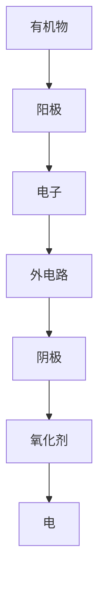
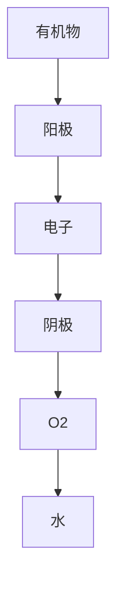

                 

# 全球股市估值与微生物燃料电池在废水处理中的应用

> 关键词：全球股市估值，微生物燃料电池，废水处理，环境技术，投资分析

> 摘要：本文探讨了全球股市估值与微生物燃料电池在废水处理中的应用。首先，介绍了全球股市估值的基本概念、方法及影响因素。其次，详细讲解了微生物燃料电池的工作原理、应用场景及其在废水处理中的优势。最后，分析了两者结合的可能性及潜在的经济价值。

---

# 第一章: 全球股市估值概述

## 1.1 股市估值的基本概念

### 1.1.1 股市估值的定义
股市估值是指通过对公司财务数据的分析，评估其股票的内在价值。这一过程帮助投资者判断股票是否被高估或低估。

### 1.1.2 股市估值的重要性
股市估值是投资者做出投资决策的重要依据。准确的估值有助于识别潜在的投资机会和风险。

### 1.1.3 全球股市的特点
全球股市具有多样性，不同地区的市场受宏观经济因素影响各异，投资者需要考虑地域差异。

## 1.2 估值方法与模型

### 1.2.1 市盈率（PE）法
市盈率=股票价格/每股收益（EPS）。例如，假设某公司股价为50元，每股收益为5元，则市盈率为10倍。

### 1.2.2 市净率（PB）法
市净率=股票价格/每股净资产（BPS）。例如，某公司股价为30元，每股净资产为15元，则市净率为2倍。

### 1.2.3 现金流折现模型（DCF）
DCF模型通过折现未来现金流来评估公司价值。公式为：
$$
\text{企业价值} = \sum_{t=1}^{n} \frac{\text{现金流}_t}{(1 + r)^t} + \frac{\text{终值}}{(1 + r)^n}
$$

## 1.3 全球股市估值的影响因素

### 1.3.1 宏观经济因素
包括GDP增长率、利率和通货膨胀率等。例如，低利率环境通常会推高股市估值。

### 1.3.2 行业因素
行业周期和竞争格局影响估值。例如，科技行业通常具有较高的市盈率。

### 1.3.3 公司基本面
包括收入、利润和资产负债情况。例如，高利润率公司通常有较高的估值。

---

# 第二章: 微生物燃料电池在废水处理中的应用

## 2.1 微生物燃料电池的基本原理

### 2.1.1 微生物燃料电池的定义
微生物燃料电池是一种利用微生物代谢活动产生电能的装置。

### 2.1.2 微生物燃料电池的工作原理
微生物在阳极将有机物分解为电子和质子，电子通过外电路传递到阴极，与氧化剂反应生成水。

### 2.1.3 微生物燃料电池的优势
能量回收效率高、环境友好且处理效果好。

## 2.2 微生物燃料电池的应用场景

### 2.2.1 废水处理中的应用
用于处理市政污水和工业废水，同时回收能量。

### 2.2.2 微生物燃料电池在能源回收中的作用
通过产电回收能量，减少能源消耗。

### 2.2.3 微生物燃料电池在环境保护中的意义
减少污染，推动可持续发展。

## 2.3 微生物燃料电池的工作原理图

---

# 第三章: 全球股市估值与微生物燃料电池的结合

## 3.1 股市估值与微生物燃料电池的关联

### 3.1.1 微生物燃料电池企业的上市情况
部分公司已上市，投资者可关注其股票表现。

### 3.1.2 微生物燃料电池技术对股市估值的影响
技术进步可能提升企业估值。

### 3.1.3 微生物燃料电池企业的投资价值评估
结合技术前景和财务数据进行评估。

## 3.2 微生物燃料电池技术的经济价值分析

### 3.2.1 微生物燃料电池的成本分析
材料和维护成本是主要成本。

### 3.2.2 微生物燃料电池的市场前景
随着环保需求增加，市场潜力大。

### 3.2.3 微生物燃料电池技术的经济效益
通过能源回收降低成本，提高收益。

---

# 第四章: 微生物燃料电池的核心技术

## 4.1 微生物燃料电池的电化学反应

### 4.1.1 阳极反应
$$
\text{有机物} + \text{H}_2\text{O} \rightarrow \text{CO}_2 + \text{H}^+ + \text{电子}
$$

### 4.1.2 阴极反应
$$
\text{O}_2 + 4\text{H}^+ + 4\text{电子} \rightarrow 2\text{H}_2\text{O}
$$

### 4.1.3 总反应式
$$
\text{有机物} + \text{O}_2 \rightarrow \text{CO}_2 + \text{H}_2\text{O}
$$

## 4.2 微生物燃料电池的核心技术图

---

# 小结

全球股市估值与微生物燃料电池在废水处理中的应用各有其独特性和重要性。通过结合两者的知识，我们可以更好地理解其在环境保护和投资领域的潜力。

---

# 最佳实践

- **小结**：本文详细探讨了全球股市估值与微生物燃料电池的应用，为投资者和技术人员提供了参考。
- **注意事项**：投资需谨慎，技术应用需结合实际情况。
- **拓展阅读**：建议进一步研究微生物燃料电池的技术优化和股市估值的预测模型。

---

以上为文章的完整大纲和内容，您可以根据需要进行调整和补充。

