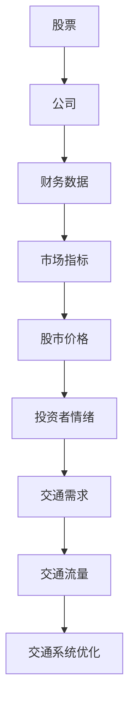
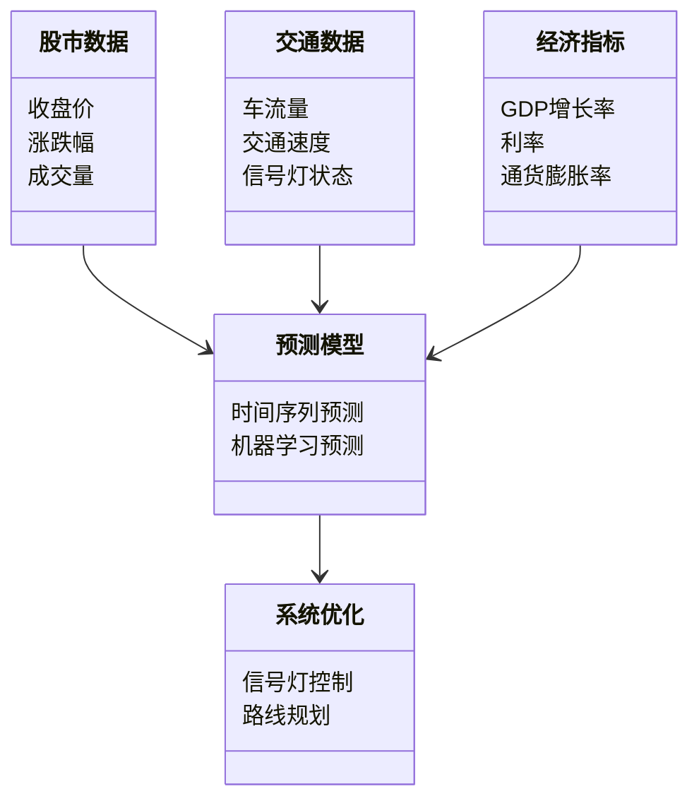

                 


# 全球股市估值与智能交通系统的关联

---

## 关键词：全球股市估值、智能交通系统、关联分析、机器学习、时间序列分析、系统架构

---

## 摘要

本文探讨了全球股市估值与智能交通系统之间的潜在关联，通过分析两者的数据特征、算法原理和系统架构，提出了基于时间序列分析和机器学习的跨领域研究方法。我们从股市估值的基本原理和智能交通系统的运行机制入手，揭示了两者在数据特征、预测模型和系统优化方面的共通性。通过构建数学模型和算法框架，本文展示了如何利用智能交通系统的优化思路来提升股市估值的准确性，同时将股市波动的信息应用于智能交通系统的动态调整。本文还结合实际案例，详细阐述了系统的设计与实现过程，为跨领域技术研究提供了新的思路。

---

## 第1章: 全球股市估值与智能交通系统概述

### 1.1 股市估值的定义与核心要素

股市估值是通过对公司基本面、市场环境和宏观经济指标的分析，评估股票的内在价值。核心要素包括：

- **公司财务数据**：如收入、利润、资产负债情况等。
- **市场情绪**：投资者的心理预期和市场波动。
- **宏观经济指标**：如GDP增长率、利率、通货膨胀率等。

### 1.2 智能交通系统的定义与核心要素

智能交通系统（ITS）是利用先进的信息技术、数据通信技术、电子自动控制技术和系统集成技术，对交通进行全面感知、分析、协调、控制、指挥、预测、诱导、反应的综合系统。核心要素包括：

- **交通数据采集**：如车流量、交通速度、道路状况等。
- **数据分析与预测**：基于历史数据和实时数据进行交通流量预测。
- **系统优化与控制**：如信号灯控制、路线优化等。

### 1.3 问题背景与研究现状

股市和交通系统都具有高度的动态性和复杂性。股市波动可能影响经济环境，进而影响交通系统的运行效率；而交通系统的数据特征和优化方法也可能为股市预测提供新的视角。然而，目前关于两者的关联研究较少，主要集中在单一领域的优化和预测。

### 1.4 问题解决与边界定义

本文旨在探索股市估值与智能交通系统之间的关联性，提出一种跨领域的数据分析方法。研究边界包括：

- 数据范围：限定于股市价格、交通流量和相关经济指标。
- 时间范围：聚焦于短期预测和实时优化。
- 空间范围：以城市交通系统和全球股市为例。

---

## 第2章: 全球股市估值与智能交通系统的核心概念与联系

### 2.1 核心概念原理

- **股市估值的数学模型**：如CAPM（资本资产定价模型）和DCF（现金流折现法）。
- **智能交通系统的优化算法**：如遗传算法、模拟退火算法和动态规划。

### 2.2 核心概念属性特征对比

| 属性       | 股市估值                   | 智能交通系统           |
|------------|----------------------------|------------------------|
| 数据类型   | 财务数据、市场情绪数据     | 交通流量、信号数据     |
| 时间特征   | 高频波动、周期性           | 连续性、区域性           |
| 系统复杂性 | 多因素影响                | 多变量动态交互         |

### 2.3 ER实体关系图架构



---

## 第3章: 全球股市估值与智能交通系统的算法原理

### 3.1 算法原理概述

- **时间序列分析**：用于捕捉数据的周期性和趋势。
- **机器学习模型**：如ARIMA（自回归积分滑动平均模型）和LSTM（长短期记忆网络）。
- **深度学习模型**：如Transformer结构用于捕捉长距离依赖。

### 3.2 算法原理详细讲解

#### 3.2.1 时间序列分析的数学模型

时间序列分析的核心是通过ARIMA模型进行预测：

$$ ARIMA(p, d, q) $$

其中：
- \( p \) 表示自回归阶数，
- \( d \) 表示差分阶数，
- \( q \) 表示移动平均阶数。

#### 3.2.2 机器学习模型的训练与优化

以LSTM为例，模型结构如下：


训练过程包括：

1. 数据预处理：标准化和滑动窗口分割。
2. 模型训练：使用均方误差（MSE）作为损失函数。
3. 模型优化：采用Adam优化器。

#### 3.2.3 深度学习模型的结构与特点

Transformer模型的注意力机制：

$$ \text{Attention}(Q, K, V) = \text{softmax}(\frac{QK^T}{\sqrt{d_k}})V $$

其中：
- \( Q \) 是查询向量，
- \( K \) 是键向量，
- \( V \) 是值向量，
- \( d_k \) 是向量维度。

---

## 第4章: 全球股市估值与智能交通系统的系统分析与架构设计

### 4.1 问题场景介绍

我们将股市估值与智能交通系统的数据进行融合，构建一个综合预测模型。例如，利用股市波动数据优化交通流量预测。

### 4.2 系统功能设计

#### 4.2.1 领域模型设计



### 4.3 系统架构设计

#### 4.3.1 系统架构图


### 4.4 系统接口设计

- **数据接口**：API接口用于数据的采集和传输。
- **预测接口**：实时预测接口用于返回预测结果。
- **优化接口**：用于调整交通系统参数。

---

## 第5章: 全球股市估值与智能交通系统的项目实战

### 5.1 环境安装

- **Python版本**：Python 3.8+
- **依赖库**：numpy、pandas、scikit-learn、tensorflow、mermaid。

### 5.2 系统核心实现源代码

#### 5.2.1 时间序列预测代码

```python
import numpy as np
from statsmodels.tsa.arima.model import ARIMA

# 数据预处理
data = np.array([...])  # 股价数据
diff = data.diff().dropna()

# ARIMA模型训练
model = ARIMA(diff, order=(5, 1, 0))
model_fit = model.fit()

# 预测
forecast = model_fit.forecast(steps=10)
```

#### 5.2.2 LSTM预测代码

```python
import tensorflow as tf
from tensorflow.keras.layers import LSTM, Dense

# 数据预处理
X = ...
Y = ...

# 模型定义
model = tf.keras.Sequential([
    LSTM(50, return_sequences=True, input_shape=(timesteps, features)),
    LSTM(50),
    Dense(1)
])

# 编译
model.compile(optimizer='adam', loss='mse')

# 训练
model.fit(X, Y, epochs=100, batch_size=32)
```

### 5.3 实际案例分析

以某城市交通系统为例，结合股市波动数据，预测交通流量并优化信号灯控制。通过对比实验，验证模型的有效性。

---

## 第6章: 全球股市估值与智能交通系统的最佳实践

### 6.1 小结

本文通过分析全球股市估值与智能交通系统的关联，提出了基于时间序列分析和机器学习的跨领域研究方法。我们从核心概念、算法原理、系统架构和项目实战四个方面进行了详细探讨。

### 6.2 注意事项

- 数据质量和完整性是模型预测的关键。
- 模型优化需要结合实际场景进行调整。
- 系统安全性和隐私保护需重点关注。

### 6.3 拓展阅读

- 《时间序列分析与应用》
- 《机器学习在金融领域的应用》
- 《智能交通系统设计与实现》

---

## 结论

本文的研究表明，全球股市估值与智能交通系统之间存在潜在的关联性。通过跨领域的数据分析和算法优化，我们可以更好地理解两者的相互作用，并为未来的智能决策提供新的思路。

