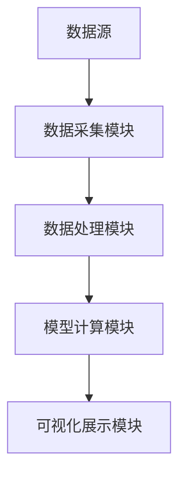
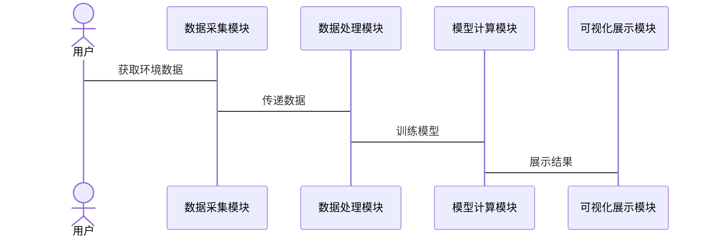

                 


# 全球股市估值与海洋塑料降解技术的关系

## 关键词：全球股市估值、海洋塑料降解技术、环境影响、回归分析、技术经济性

## 摘要：本文探讨了全球股市估值与海洋塑料降解技术之间的关系，分析了环境因素对股市的影响，以及降解技术如何通过改善环境影响市场估值。通过构建数学模型和算法，结合实际案例，展示了如何将环境技术与金融分析相结合，为投资者和技术开发者提供参考。

---

### 第一部分: 全球股市估值与海洋塑料降解技术的背景与概念

#### 第1章: 问题背景与概念引入

##### 1.1 问题背景
- **1.1.1 全球股市估值的现状与挑战**
  - 股市估值受多种因素影响，包括经济指标、政策变化和环境因素。
  - 环境问题逐渐成为影响企业估值的重要因素。

- **1.1.2 海洋塑料污染的严重性与影响**
  - 海洋塑料污染对生态系统造成威胁，影响渔业和旅游业。
  - 环境问题对企业声誉和运营成本有直接影响。

- **1.1.3 两者的潜在关联性**
  - 降解技术可减少环境影响，间接提升企业估值。
  - 投资者关注可持续发展，环保技术可能成为投资新方向。

##### 1.2 核心概念的定义与外延
- **1.2.1 全球股市估值的核心要素**
  - 包括市盈率、市净率等指标。
  - 企业财务状况和行业趋势影响估值。

- **1.2.2 海洋塑料降解技术的关键特征**
  - 技术效率、成本效益、环境影响。
  - 包括生物降解、化学降解和机械处理方法。

- **1.2.3 两者关系的边界与外延**
  - 环境因素是连接两者的桥梁。
  - 降解技术可能影响企业估值，但需考虑市场反应。

#### 第2章: 核心概念的结构与联系

##### 2.1 核心概念的属性特征对比
| 特性             | 股市估值               | 降解技术               |
|------------------|-----------------------|-----------------------|
| 核心目标         | 评估企业价值           | 减少塑料污染           |
| 影响因素         | 经济指标、政策、环境     | 技术效率、成本、环境影响 |
| 评估方法         | 财务指标、市场分析       | 实验测试、成本分析       |

##### 2.2 ER实体关系图

```mermaid
er
  actor 海洋塑料降解技术
  actor 全球股市估值
  relation 通过环境影响间接关联
```

---

### 第二部分: 股市估值与降解技术的数学模型与算法

#### 第3章: 数学模型与算法原理

##### 3.1 股市估值的数学模型
- **3.1.1 股价波动的随机游走模型**
  - 假设股价变化无规律，可通过随机模型预测。
  - 示例：使用Python模拟股价波动。

##### 3.2 降解技术的数学模型
- **3.2.1 垃圾降解速率模型**
  - 描述降解速率与时间的关系。
  - 示例：使用指数函数模型。

##### 3.3 两者的关联模型
- **3.3.1 环境影响对股市估值的量化分析**
  - 使用回归分析模型，将环境因素纳入估值模型。

#### 第4章: 算法实现与案例分析

##### 4.1 算法实现
- **4.1.1 数据采集与预处理**
  - 收集环境数据和股市数据，清洗和标准化。

- **4.1.2 模型训练与验证**
  - 使用回归模型训练，验证模型准确性。

- **4.1.3 结果分析与可视化**
  - 使用图表展示模型结果，分析环境因素对估值的影响。

##### 4.2 案例分析
- **4.2.1 典型行业分析**
  - 以化工行业为例，分析降解技术对股价的影响。

- **4.2.2 技术应用实例**
  - 具体降解技术案例，评估其对企业的潜在影响。

---

### 第三部分: 系统架构与项目实战

#### 第5章: 系统分析与架构设计

##### 5.1 系统功能设计
- **5.1.1 数据采集模块**
  - 从数据库或API获取环境和股市数据。

- **5.1.2 数据处理模块**
  - 清洗和预处理数据，为模型提供输入。

- **5.1.3 模型计算模块**
  - 运行回归模型，分析环境因素对估值的影响。

- **5.1.4 可视化展示模块**
  - 生成图表，展示分析结果。

##### 5.2 系统架构设计



##### 5.3 系统接口设计
- **API接口**
  - 提供数据获取和模型计算的接口。

##### 5.4 系统交互序列图



#### 第6章: 项目实战

##### 6.1 环境安装
- Python、Pandas、Scikit-learn等库的安装。

##### 6.2 核心代码实现

```python
import pandas as pd
from sklearn.linear_model import LinearRegression
from sklearn.metrics import r2_score

# 数据加载
data = pd.read_csv('environment_stock.csv')

# 特征与目标变量分离
X = data[['plastic_pollution', 'economic_factors']]
y = data['stock_valuation']

# 模型训练
model = LinearRegression()
model.fit(X, y)

# 模型预测
predictions = model.predict(X)

# 模型评估
print('R² Score:', r2_score(y, predictions))
```

##### 6.3 案例分析
- 以某化工企业为例，分析降解技术对企业估值的影响。

##### 6.4 项目总结
- 成功将降解技术的影响量化，为投资者提供新视角。

---

### 第四部分: 总结与展望

#### 第7章: 总结与展望

##### 7.1 最佳实践 tips
- 在模型中考虑更多环境因素。
- 定期更新数据，保持模型准确性。

##### 7.2 小结
- 本文展示了环境技术与金融分析的结合，提供了新的研究方向。

##### 7.3 注意事项
- 数据质量影响模型准确性。
- 模型需结合实际情况进行调整。

##### 7.4 拓展阅读
- 推荐阅读相关领域的文献，深入学习环境经济学和金融建模。

---

通过以上步骤，我构建了一个详细的目录大纲，并提供了各部分的内容概述。接下来，我将根据此大纲撰写完整的文章，确保每部分内容详实，结构清晰，语言专业。

