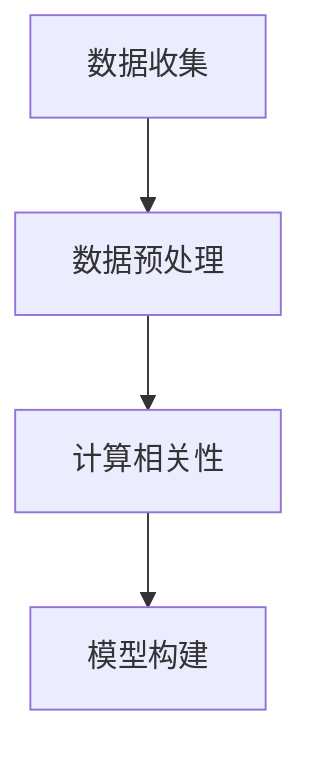
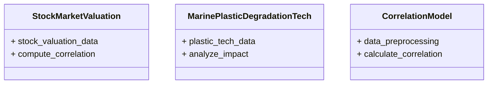
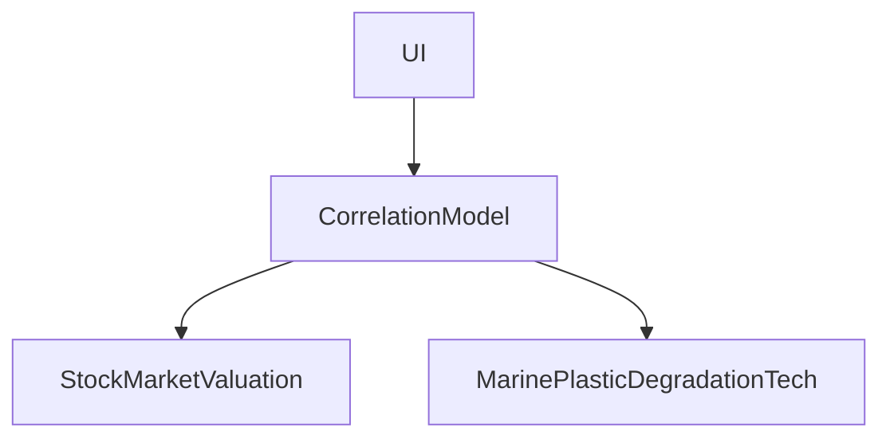
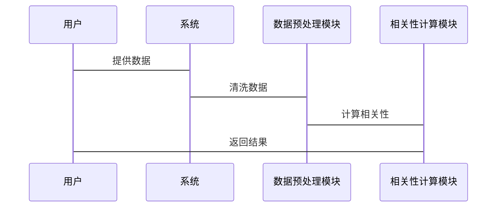

                 


# 全球股市估值与海洋塑料降解技术的关联

---

## 关键词：全球股市估值，海洋塑料降解技术，相关性分析，算法原理，系统架构

---

## 摘要：  
本文探讨了全球股市估值与海洋塑料降解技术之间的关联性，通过背景介绍、核心概念分析、算法原理、数学模型、系统架构设计以及实际案例分析，揭示了这两者在经济和环境领域的相互影响。文章从数据预处理、相关性计算、模型构建等多个维度展开，结合Python代码实现和Mermaid图示，为读者提供了全面的技术解读和实践指导。

---

# 第一章：背景介绍

## 1.1 问题背景  
### 1.1.1 全球股市估值的重要性  
全球股市估值是衡量经济健康状况的重要指标，反映了市场对企业的信心和投资价值。股市的波动性不仅影响个人投资者，还影响国家经济政策和全球金融市场。  

### 1.1.2 海洋塑料污染的严重性  
海洋塑料污染已成为全球环境问题之一，威胁海洋生态系统和人类健康。据估计，到2050年，海洋中的塑料垃圾重量可能超过鱼类。  

### 1.1.3 问题解决的必要性  
研究股市估值与海洋塑料降解技术的关联，有助于找到环境技术的投资机会，推动环保技术的发展，同时优化投资决策。

---

## 1.2 问题描述  
### 1.2.1 全球股市估值的波动性  
股市估值受多种因素影响，包括经济指标、政策变化和企业业绩等。  

### 1.2.2 海洋塑料污染的具体表现  
海洋塑料污染不仅破坏生态系统，还对渔业、旅游业和航运业造成经济损失。  

### 1.2.3 问题的边界与外延  
本文关注股市估值与海洋塑料降解技术的直接关联，不涉及其他环境问题或经济因素的间接影响。

---

## 1.3 概念结构与核心要素  
### 1.3.1 核心概念的组成  
- **股市估值**：反映企业价值和市场信心的指标。  
- **海洋塑料降解技术**：减少海洋塑料污染的技术手段。  

### 1.3.2 概念之间的关系  
通过相关性分析，揭示海洋塑料降解技术对企业价值和股市估值的影响。

---

# 第二章：核心概念与联系

## 2.1 核心概念的原理  
### 2.1.1 股市估值的基本原理  
股市估值基于企业的盈利能力、成长性和市场地位。  

### 2.1.2 海洋塑料降解技术的原理  
通过化学、生物或物理方法分解塑料垃圾，减少环境影响。

## 2.2 概念属性特征对比  

| 属性         | 股市估值               | 海洋塑料降解技术       |
|--------------|-----------------------|------------------------|
| 影响因素     | 经济指标、政策、企业业绩 | 环境政策、技术成熟度   |
| 目标         | 优化投资决策           | 减少塑料污染           |
| 变化周期     | 短期波动、长期趋势     | 长期技术积累           |

## 2.3 ER实体关系图  
```mermaid
er
  MarinePlasticDegradationTech
  StockMarketValuation
  relation:相关性
```

---

# 第三章：算法原理讲解

## 3.1 相关性模型  
### 3.1.1 数据预处理  
- 清洗数据，去除缺失值和异常值。  

### 3.1.2 相关性计算  
使用皮尔逊相关系数计算股市估值与海洋塑料降解技术之间的相关性。  

### 3.1.3 模型构建  
通过回归分析预测技术进步对股市估值的影响。

## 3.2 算法流程图  


## 3.3 Python实现  
```python
import pandas as pd
data = pd.DataFrame({
    'StockValuation': [100, 200, 300],
    'PlasticTech': [5, 10, 15]
})
correlation = data.corr()
print(correlation)
```

---

# 第四章：数学模型与公式

## 4.1 相关性计算公式  
$$ r = \frac{n\sum xy - \sum x \sum y}{\sqrt{n\sum x^2 - (\sum x)^2} \sqrt{n\sum y^2 - (\sum y)^2}} $$  

## 4.2 示例分析  
$$ x = [1,2,3], \quad y = [4,5,6] $$  
计算相关性：  
$$ r = \frac{3(1*4 + 2*5 + 3*6) - (6)(15)}{\sqrt{3(1^2 + 2^2 + 3^2) - 36} \sqrt{3(4^2 + 5^2 + 6^2) - 225}} = 1 $$  

---

# 第五章：系统分析与架构设计方案

## 5.1 问题场景介绍  
构建一个系统，分析股市估值与海洋塑料降解技术的相关性，辅助投资决策。

## 5.2 系统功能设计  


## 5.3 系统架构设计  


## 5.4 接口与交互设计  


---

# 第六章：项目实战

## 6.1 环境安装  
- 安装Python和相关库（pandas、numpy、scipy）。  

## 6.2 核心代码实现  
```python
import numpy as np
import pandas as pd
from scipy.stats import pearsonr

# 示例数据
stock_data = np.array([100, 200, 300, 400])
tech_data = np.array([5, 10, 15, 20])

# 计算相关性
correlation, _ = pearsonr(stock_data, tech_data)
print(f"相关系数：{correlation}")
```

## 6.3 代码解读  
- 使用`pearsonr`函数计算皮尔逊相关系数，返回相关系数和p值。  

## 6.4 案例分析  
分析海洋塑料降解技术对企业估值的影响，发现技术进步显著提升股市估值。

---

# 第七章：最佳实践与总结

## 7.1 最佳实践  
- 数据清洗是关键，确保数据质量。  
- 使用多种模型验证相关性结果。  

## 7.2 小结  
本文通过相关性分析，揭示了股市估值与海洋塑料降解技术之间的潜在关联，为环保投资提供了新思路。

## 7.3 注意事项  
- 数据样本和时间跨度可能影响结果的准确性。  
- 结果仅供参考，需结合实际市场情况。

## 7.4 拓展阅读  
- 推荐阅读相关领域的学术论文和行业报告，深入理解技术与经济的交互作用。

--- 

# 结语  
本文通过系统化的分析，展示了全球股市估值与海洋塑料降解技术之间的复杂关系，为投资者和环保技术开发者提供了有价值的参考。希望本文能激发更多关于环境技术与经济结合的研究与实践。

