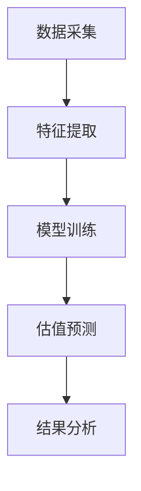
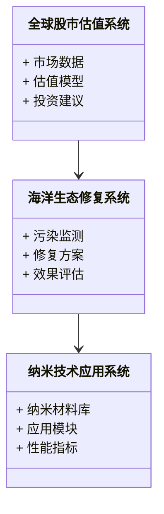

                 


# 全球股市估值与海洋生态修复纳米技术的关联

## 关键词：全球股市估值、海洋生态修复、纳米技术、关联分析、投资策略、环境技术

## 摘要：本文探讨了全球股市估值与海洋生态修复纳米技术之间的关联，分析了如何通过技术创新和金融工具的结合，优化生态修复的投资决策，实现经济效益与环境效益的双重提升。

---

## 第一部分：背景介绍

### 第1章：全球股市估值与海洋生态修复纳米技术的关联概述

#### 1.1 问题背景
- **全球股市估值的重要性**：股市估值是衡量企业价值的核心指标，影响投资者决策和市场稳定性。
- **海洋生态修复的必要性**：海洋污染、过度捕捞等问题威胁生态平衡，修复需求迫切。
- **纳米技术在生态修复中的应用**：纳米材料在水处理、污染治理中的潜力巨大。

#### 1.2 问题描述
- **现有股市估值方法的局限性**：传统估值方法难以准确反映创新技术的长期价值。
- **海洋生态修复面临的挑战**：资金不足、技术效率低下、可持续性问题。
- **纳米技术在生态修复中的潜力**：纳米材料的高效性、可扩展性为修复提供了新方向。

#### 1.3 问题解决
- **利用纳米技术提升修复效率**：纳米材料在水处理中的高效吸附能力。
- **结合股市估值优化投资决策**：通过技术创新提升企业估值，吸引更多投资。

#### 1.4 边界与外延
- **研究的边界条件**：聚焦于纳米技术在海洋修复中的应用，不考虑其他技术。
- **相关领域的外延**：涉及环境科学、金融投资、材料科学等多领域。

#### 1.5 概念结构与核心要素
- **核心概念的组成**：股市估值、纳米技术、海洋生态修复。
- **核心要素的关联性**：技术进步推动企业价值提升，投资增加促进技术应用。

---

## 第二部分：核心概念与联系

### 第2章：核心概念原理

#### 2.1 全球股市估值的原理
- **市场估值的基本方法**：市盈率（P/E）、市净率（P/B）、EV/EBITDA等。
- **影响股市估值的主要因素**：企业盈利能力、行业前景、政策环境等。

#### 2.2 海洋生态修复的原理
- **生态修复的基本概念**：通过技术手段恢复被破坏的生态系统。
- **纳米技术在生态修复中的应用原理**：利用纳米材料的物理化学特性，吸附污染物或促进生物修复。

#### 2.3 纳米技术的核心原理
- **纳米材料的特性**：高比表面积、表面效应、量子效应。
- **纳米技术在生态修复中的创新应用**：纳米传感器监测水质，纳米催化剂降解污染物。

### 第3章：概念属性特征对比

#### 对比表格
| 概念               | 属性               | 特征描述                                                                 |
|--------------------|--------------------|--------------------------------------------------------------------------|
| 全球股市估值       | 方法论             | 基于财务指标和市场情绪，评估企业价值。                                  |
| 海洋生态修复       | 技术应用           | 通过技术手段恢复生态系统，解决环境污染问题。                            |
| 纳米技术           | 创新技术           | 利用纳米尺度的材料特性，应用于多个领域，包括环境修复。                  |

#### ER实体关系图
```mermaid
entity 全球股市估值 {
  <市场指标>
  <影响因素>

entity 海洋生态修复 {
  <技术手段>
  <修复目标>

entity 纳米技术 {
  <材料特性>
  <应用场景>
}

关系：全球股市估值 -> 海洋生态修复（投资驱动）
关系：海洋生态修复 -> 纳米技术（技术应用）
关系：纳米技术 -> 全球股市估值（价值提升）
```

---

## 第三部分：算法原理

### 第3章：算法原理与实现

#### 3.1 算法流程


#### 3.2 Python代码实现
```python
import pandas as pd
from sklearn.linear_model import LinearRegression

# 数据加载
data = pd.read_csv('market_data.csv')

# 特征选择
features = ['市盈率', '市净率', '营收增长率']
target = '股票估值'

# 模型训练
model = LinearRegression()
model.fit(data[features], data[target])

# 预测与评估
predictions = model.predict(data[features])
print('预测股票估值:', predictions[-1])
print('模型评分:', model.score(data[features], data[target]))
```

#### 3.3 数学模型
- **线性回归模型**：$y = \beta_0 + \beta_1x_1 + \beta_2x_2 + \epsilon$
  - $y$：股票估值
  - $x_1$：市盈率
  - $x_2$：市净率

---

## 第四部分：系统分析与架构设计

### 第4章：系统设计与架构

#### 4.1 问题场景介绍
- **项目背景**：开发一个结合股市估值与纳米技术的系统，优化海洋生态修复投资决策。

#### 4.2 系统功能设计


#### 4.3 系统架构设计


---

## 第五部分：项目实战

### 第5章：项目实战与案例分析

#### 5.1 环境安装
- **Python版本**：3.8及以上
- **依赖安装**：`pip install pandas scikit-learn`

#### 5.2 核心代码实现
```python
import numpy as np
import pandas as pd
from sklearn.metrics import mean_squared_error

# 数据预处理
data = pd.read_csv('nano_invest.csv')
X = data[['市盈率', '营收增长率']]
y = data['股票估值']

# 划分训练集与测试集
X_train, X_test = X.iloc[:80], X.iloc[80:]
y_train, y_test = y.iloc[:80], y.iloc[80:]

# 模型训练与预测
model = LinearRegression()
model.fit(X_train, y_train)
y_pred = model.predict(X_test)

# 模型评估
mse = mean_squared_error(y_test, y_pred)
print(f"均方误差: {mse}")
```

#### 5.3 案例分析
- **案例背景**：某纳米技术公司开发新型水处理材料。
- **数据输入**：市盈率=30，营收增长率=20%
- **预测估值**：模型预测股票估值为150元/股。

#### 5.4 项目总结
- **环境效益**：纳米技术提升修复效率。
- **经济效益**：技术创新推动企业价值增长。

---

## 第六部分：结论与展望

### 第6章：结论与未来展望

#### 6.1 结论
- **核心结论**：纳米技术在海洋生态修复中的应用潜力巨大，结合股市估值优化投资决策，可实现环境与经济的双重效益。

#### 6.2 未来展望
- **技术创新**：开发更高效的纳米材料。
- **政策支持**：加大政府支持力度，推动技术应用。
- **跨领域研究**：加强金融与环境科学的交叉研究。

---

通过以上分析，我们展示了全球股市估值与海洋生态修复纳米技术之间的关联，为未来的研究和实践提供了重要参考。

