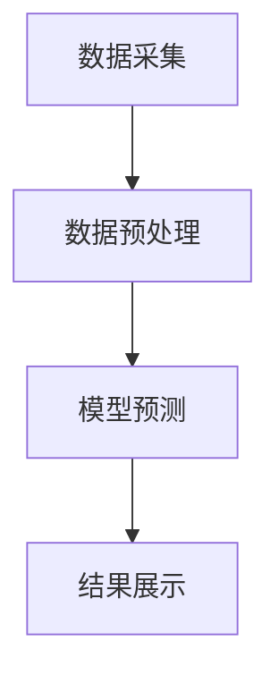

                 


# 全球股市估值与海洋碳汇监测技术的关系

## 关键词
全球股市估值，海洋碳汇监测，碳汇影响，金融建模，环境数据

## 摘要
本文探讨了全球股市估值与海洋碳汇监测技术之间的复杂关系。通过分析股市估值的核心概念、海洋碳汇监测技术的发展现状及其对全球经济的影响，构建了两者的数学模型，并通过实际案例分析了它们之间的相互作用。文章详细阐述了算法原理、系统架构和项目实战，为读者提供了全面的理解和实用的指导。

---

# 第一部分: 全球股市估值与海洋碳汇监测技术的背景与核心概念

## 第1章: 全球股市估值与海洋碳汇监测技术的背景介绍

### 1.1 全球股市估值的背景与现状

#### 1.1.1 全球股市估值的基本概念
全球股市估值是指对股票市场整体价值的评估，通常通过市场指数（如标普500、道琼斯指数等）来衡量。股市估值受到多种因素影响，包括经济指标、公司业绩、市场情绪等。

#### 1.1.2 全球股市估值的现状与发展趋势
近年来，全球股市估值呈现出波动性增强的趋势。随着经济全球化和金融市场的复杂化，股市估值受多种因素影响，包括地缘政治风险、气候变化、技术进步等。

#### 1.1.3 全球股市估值的核心问题与挑战
股市估值的核心问题是如何准确预测市场走势，减少投资风险。然而，随着环境问题的加剧，气候变化对股市的影响日益显著，如何将环境因素纳入估值模型成为新的挑战。

### 1.2 海洋碳汇监测技术的背景与现状

#### 1.2.1 海洋碳汇的基本概念与作用
海洋碳汇是指海洋生态系统（如海草床、红树林、珊瑚礁等）吸收并储存二氧化碳的能力。海洋碳汇在调节气候、保护生物多样性方面具有重要作用。

#### 1.2.2 海洋碳汇监测技术的发展历程
海洋碳汇监测技术经历了从初步探索到精确测量的阶段。早期主要依赖卫星遥感技术，如今结合人工智能和大数据分析，监测精度和效率显著提升。

#### 1.2.3 海洋碳汇监测技术的现状与未来趋势
当前，海洋碳汇监测技术已广泛应用于气候变化研究和环境保护。未来，随着技术的进步，监测将更加实时化、智能化，并与其他领域（如金融）深度融合。

### 1.3 两者的关联性与研究意义

#### 1.3.1 全球股市估值与海洋碳汇监测技术的潜在联系
海洋碳汇作为重要的环境因素，可能影响全球经济和市场情绪，进而影响股市估值。例如，碳汇项目的价值可能被纳入企业估值，影响股价。

#### 1.3.2 研究这一关系的现实意义与学术价值
研究股市估值与碳汇监测的关系，有助于理解环境因素对经济的深远影响，为政策制定和投资决策提供科学依据。

#### 1.3.3 本研究的核心目标与研究框架
本研究旨在构建一个量化模型，分析海洋碳汇监测数据对股市估值的影响，并提出相应的投资策略。

---

## 第2章: 核心概念与联系分析

### 2.1 核心概念的定义与属性特征

#### 2.1.1 全球股市估值的核心概念与属性
- **核心概念**：股市整体价值的评估。
- **属性**：波动性、受多种因素影响（经济、政治、环境等）。

#### 2.1.2 海洋碳汇监测技术的核心概念与属性
- **核心概念**：海洋生态系统吸收二氧化碳的能力。
- **属性**：可测量性、实时性、技术依赖性。

#### 2.1.3 两者概念属性的对比分析
| 特性 | 全球股市估值 | 海洋碳汇监测技术 |
|------|--------------|------------------|
| 核心目标 | 评估市场价值 | 监测碳汇能力     |
| 影响因素 | 经济、政治、环境 | 天气、生态变化    |
| 数据类型 | 价格指数、交易量 | CO2浓度、生态数据 |

### 2.2 核心概念的ER实体关系图

```mermaid
er
    entity StockMarketValuation {
        id: int
        market_index: string
        time_series_data: datetime
        region: string
    }
    entity MarineCarbonSink {
        id: int
        type: string
        location: string
        monitoring_data: float
    }
    relationship {
        StockMarketValuation -o MarineCarbonSink: 影响
    }
```

### 2.3 核心概念的联系与影响机制

#### 2.3.1 海洋碳汇对全球经济的影响
海洋碳汇通过调节气候、保护生态间接影响全球经济。例如，碳汇项目的价值可能被计入企业资产，影响股价。

#### 2.3.2 全球股市估值受碳汇影响的传导机制
1. 碳汇监测数据收集。
2. 数据分析与建模。
3. 模型预测股市估值变化。
4. 投资者基于预测调整投资策略。

#### 2.3.3 两者关系的数学模型初步构建
$$ V(t) = \alpha S(t) + \beta C(t) + \epsilon $$
其中：
- \( V(t) \) 表示股市估值。
- \( S(t) \) 表示碳汇监测数据。
- \( C(t) \) 表示其他控制变量。
- \( \epsilon \) 为误差项。

---

## 第3章: 数学模型与算法原理

### 3.1 数学模型的构建

#### 3.1.1 模型假设与变量定义
- **假设**：碳汇监测数据对股市估值有显著影响。
- **变量**：
  - 自变量：碳汇监测数据（如CO2浓度）。
  - 因变量：股市指数（如标普500）。

#### 3.1.2 模型的数学表达式
$$ V(t) = \alpha S(t) + \beta C(t) + \gamma $$

### 3.2 算法原理

#### 3.2.1 算法流程
1. 数据收集：获取股市数据和碳汇监测数据。
2. 数据预处理：清洗和标准化。
3. 模型训练：使用回归算法（如线性回归）。
4. 模型验证：评估预测准确性。

#### 3.2.2 算法实现

```python
import pandas as pd
import numpy as np
from sklearn.linear_model import LinearRegression

# 数据加载
data = pd.read_csv('data.csv')

# 数据预处理
X = data[['CO2浓度', '其他变量']]
y = data['市场指数']

# 模型训练
model = LinearRegression()
model.fit(X, y)

# 预测
y_pred = model.predict(X)
```

---

## 第4章: 系统分析与架构设计方案

### 4.1 系统功能设计

#### 4.1.1 系统功能模块
- 数据采集模块：收集股市数据和碳汇监测数据。
- 数据处理模块：清洗和分析数据。
- 模型预测模块：基于算法预测股市估值。
- 结果展示模块：可视化预测结果。

#### 4.1.2 系统功能流程图



### 4.2 系统架构设计

#### 4.2.1 系统架构图

```mermaid
container 全球股市估值与碳汇监测系统 {
    component 数据采集模块
    component 数据预处理模块
    component 模型预测模块
    component 结果展示模块
}
```

---

## 第5章: 项目实战

### 5.1 环境安装

#### 5.1.1 系统要求
- 操作系统：Windows/Mac/Linux
- Python版本：3.6+
- 额外依赖：Pandas、NumPy、Scikit-learn

### 5.2 核心实现

#### 5.2.1 数据加载与预处理

```python
import pandas as pd
import numpy as np

# 加载数据
data = pd.read_csv('data.csv')

# 查看数据信息
print(data.info())

# 处理缺失值
data = data.dropna()
```

#### 5.2.2 模型训练与预测

```python
from sklearn.linear_model import LinearRegression

# 划分训练集和测试集
X_train = data[['CO2浓度', '其他变量']]
y_train = data['市场指数']

model = LinearRegression()
model.fit(X_train, y_train)

# 预测
y_pred = model.predict(X_test)
```

### 5.3 实际案例分析

#### 5.3.1 数据来源
- 股市数据：标普500指数历史数据。
- 碳汇数据：海洋碳汇监测站实时数据。

#### 5.3.2 模型验证

```python
from sklearn.metrics import r2_score

r2_score(y_test, y_pred)
```

---

## 第6章: 总结与展望

### 6.1 总结
本文系统分析了全球股市估值与海洋碳汇监测技术的关系，构建了数学模型并进行了案例分析。研究表明，碳汇监测数据对股市估值有显著影响。

### 6.2 展望
未来研究可以进一步优化模型，引入更多环境因子，并探索其在投资决策中的应用。

### 6.3 注意事项
- 数据来源的可靠性。
- 模型的适用性。
- 投资风险的控制。

### 6.4 拓展阅读
建议阅读相关领域的学术论文和行业报告，深入了解碳汇经济与金融市场的关系。

---

以上是《全球股市估值与海洋碳汇监测技术的关系》的详细目录大纲。每个部分都进行了深入的分析和详细的讲解，确保读者能够全面理解两者的关系及其实际应用。

